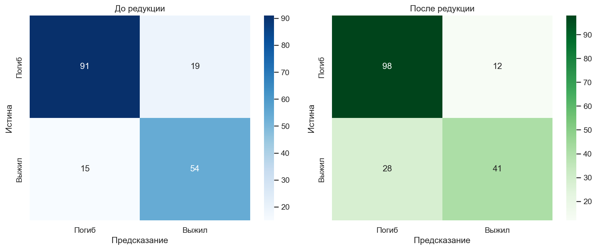
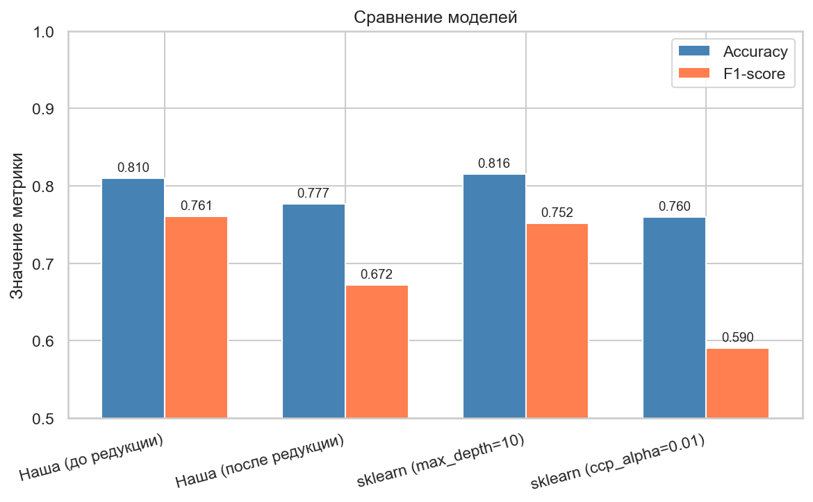

# Лабораторная работа №1. Деревья решений

## Цель работы

Реализовать алгоритм построения дерева решений ID3 с критерием Джини и обработкой пропущенных значений. Обучить модель на выбранном датасете, реализовать алгоритм редукции дерева, сравнить качество до и после редукции, а также сравнить результат с эталонной реализацией `sklearn`.

## Датасет

Использован датасет **Titanic**:

- 891 объект
- 7 признаков
- бинарная целевая переменная: выжил / погиб

Используемые признаки:

- `Pclass`
- `Sex`
- `Age`
- `SibSp`
- `Parch`
- `Fare`
- `Embarked`

В данных есть пропуски:

- `Age` — 177 пропусков
- `Embarked` — 2 пропуска

Разбиение данных:

- `train`: 712 объектов
- `test`: 179 объектов
- стратифицированное разбиение `80/20`

## Реализация

Основная реализация вынесена в файл `decision_tree.py`.

Что реализовано:

1. `DecisionTreeClassifier` на основе ID3
2. Критерий разбиения по индексу Джини
3. Обработка `NaN`
4. Reduced Error Pruning

### Обработка пропусков

При обучении объекты с `NaN` по текущему признаку не участвуют в вычислении gain для этого признака.

При предсказании, если значение признака отсутствует, объект отправляется в обе ветви, а итоговая вероятность вычисляется как взвешенная смесь вероятностей дочерних узлов.

### Редукция дерева

Использован алгоритм **Reduced Error Pruning**:

- обход дерева снизу вверх
- пробная замена внутреннего узла на лист
- если качество на валидации не ухудшается, узел заменяется

## Результаты

### Качество нашей модели

| Метрика | Значение |
|---|---:|
| Accuracy | 0.8101 |
| F1-score | 0.7606 |

### Редукция дерева

| Показатель | До редукции | После редукции |
|---|---:|---:|
| Accuracy | 0.8101 | 0.7765 |
| F1-score | 0.7606 | 0.6721 |
| Количество узлов | 157 | 81 |
| Количество листьев | 79 | 41 |

Редукция почти вдвое уменьшила размер дерева, но в данном эксперименте немного ухудшила качество на тестовой выборке.

### Сравнение со `sklearn`

| Модель | Accuracy | F1-score |
|---|---:|---:|
| Наша (до редукции) | 0.8101 | 0.7606 |
| Наша (после редукции) | 0.7765 | 0.6721 |
| `sklearn (max_depth=10)` | 0.8156 | 0.7519 |
| `sklearn (ccp_alpha=0.01)` | 0.7598 | 0.5905 |

Наша реализация до редукции показывает качество, сопоставимое с `sklearn`, при этом умеет работать с пропусками без предварительной импутации.

