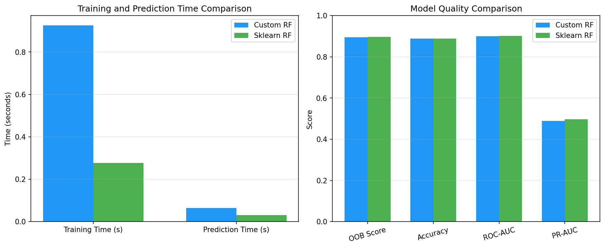
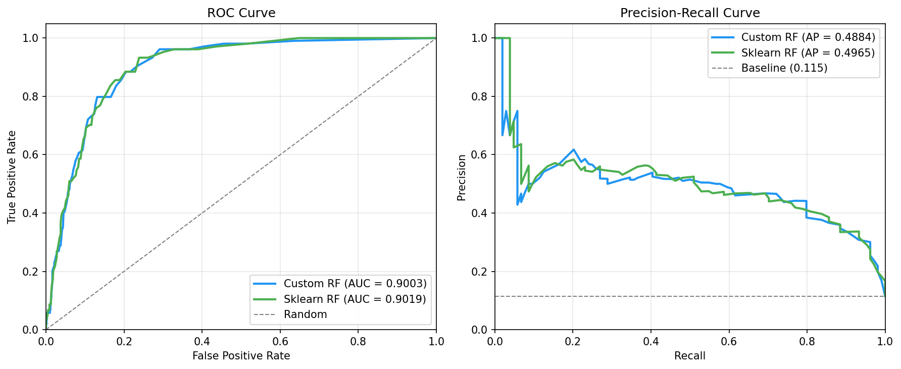
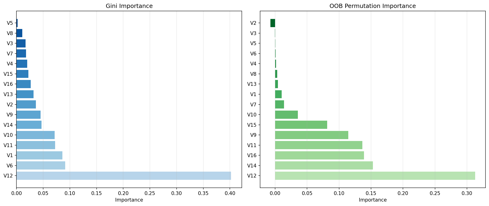
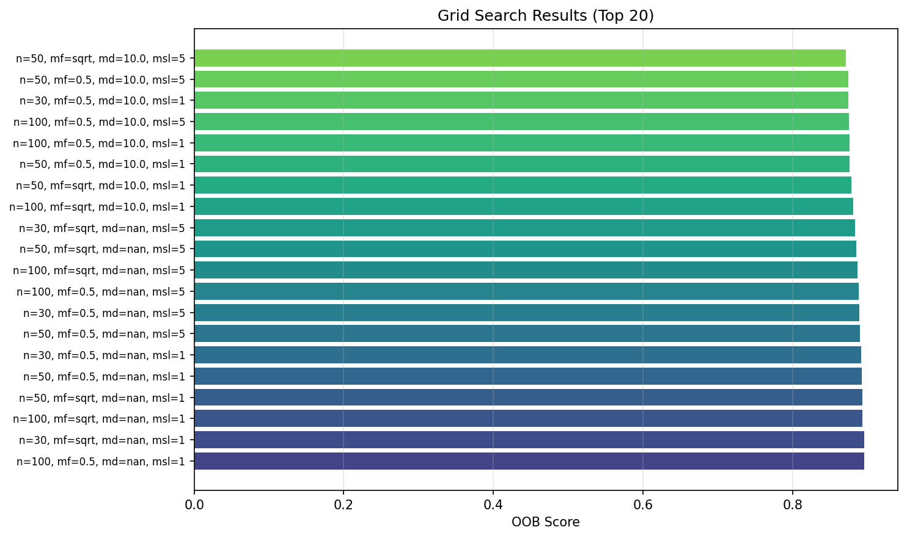
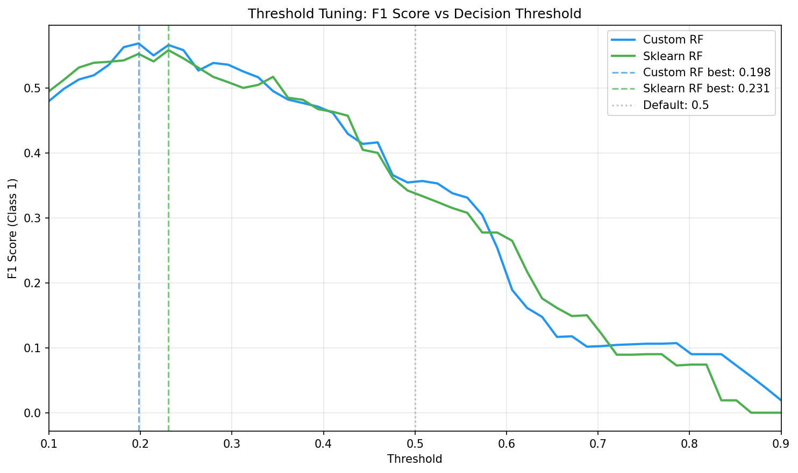

# Лабораторная работа №2. Ансамбли моделей

В рамках лабораторной работы предстоит реализовать метод случайных подпространств (RSM) или Random Forest.

В качестве базовых алгоритмов рекомендуется использовать библиотечные реализации.

## Задание

- [x] Выбрать датасет для анализа;
- [x] Реализовать метод случайных подпространств (RSM) или Random Forest;
- [x] Обучить ансамбль, подобрать оптимальные гипер-параметры. Для подбора оптимальных параметров использовать grid search из sklearn; Оптимальные параметры подбирать по OOB;
- [x] Получить оценку важности признаков через OOB^j
- [x] Сравнить результаты с эталонными реализациями из библиотеки [scikit-learn](https://scikit-learn.org/stable/):
    * точность модели;
    * время обучения;
- [x] Подготовить отчет, включающий:
    * описание выбранного метода;
    * описание датасета;
    * результаты экспериментов;
    * сравнение с эталонными реализациями;
    * выводы.

___
# Отчет

## 1. Описание выбранного метода

### 1.1. Ансамблирование и общая формулировка

Ансамбль методов — это подход в машинном обучении, при котором несколько базовых моделей (алгоритмов) объединяются для решения одной задачи. Общая формула ансамбля имеет вид:

a(x) = C(F(b₁(x), b₂(x), ..., bₜ(x)))

где:
- bₜ(x) — базовый алгоритм (базовый классификатор), t = 1, ... , T;
- F — агрегирующая функция (голосование, усреднение);
- C — корректирующая функция (для классификации: arg max).

### 1.2. Random Forest (Случайный лес)

**Random Forest** — это ансамблевый метод, основанный на построении множества решающих деревьев. Алгоритм был предложен Лео Брейманом в 2001 году и сочетает два ключевых идеи: **бэггинг** (bagging) и **метод случайных подпространств** (Random Subspaces Method).

#### Алгоритм обучения

Для построения ансамбля из T деревьев выполняются следующие шаги:

**Для каждого t = 1, ... , T:**

1. **Бутстреп-выборка**: сформировать обучающую выборку Uₜ путём равномерного выбора с возвращением из исходной выборки Xˡ размера ℓ.

2. **Обучение дерева**: построить решающее дерево bₜ на выборке Uₜ.

3. **Случайные признаки в каждой вершине**: при каждом разбиении вершины выбирать случайное подмножество из k признаков и искать оптимальное разбиение только среди них
   - k = ⌊n/3⌋ для регрессии
   - k = ⌊√n⌋ для классификации

#### Агрегация предсказаний

Для классификации используется **простое голосование** (majority vote):

a(x) = argmax_k Σₜ₌₁ᵀ [bₜ(x) = k]

Для оценки уверенности используется **усреднение вероятностей** (soft voting):

P(y = k | x) = (1/T) Σₜ₌₁ᵀ Pₜ(y = k | x)

### 1.3. Out-of-Bag (OOB) оценка

При бутстрепе каждый объект исходной выборки попадает в обучающую подвыборку с вероятностью примерно 1-1/e ≈ 0.632. 
Следовательно, около 36.8% объектов не попадают в обучение каждого конкретного дерева.

Для объекта xᵢ множество деревьев, для которых он не попал в обучающую выборку, обозначается:

Tᵢ = {t : xᵢ ∉ Uₜ}

**OOB-предсказание** для объекта xᵢ вычисляется усреднением по деревьям из Tᵢ:

OOB(xᵢ) = (1/|Tᵢ|) Σₜ∈Tᵢ bₜ(xᵢ)

**OOB Score** — это точность предсказаний на out-of-bag объектах:

OOB(Xˡ) = (1/ℓ) Σᵢ₌₁ˡ L(OOB(xᵢ), yᵢ)

где L — функция потерь (для классификации: индикатор ошибки).

### 1.4. Важность признаков

#### Gini Importance (Mean Decrease Impurity)

Для каждого признака вычисляется суммарное уменьшение impurity (примеси) по всем вершинам всех деревьев, где этот признак использовался для разбиения:

Importance_j = (1/T) Σₜ₌₁ᵀ Σᵥ∈Vₜ⁽ʲ⁾ ΔI(v)

где Vₜ⁽ʲ⁾ — вершины дерева t, где признак j использовался для разбиения, ΔI(v) — уменьшение impurity в вершине v.

#### OOB Permutation Importance

Более надёжная оценка важности признаков:

1. Для каждого признака j и каждого дерева t:
   - Вычислить baseline точность на OOB-объектах
   - Перемешать значения признака j и вычислить точность после перемешивания
   - Важность признака = разница между baseline и перемешанной точностью

Importanceⱼ = (1/T) ∑ₜ₌₁ᵀ (OOBₜ − OOBₜ⁽ʲ⁾)

---
## 2. Датасет

Я выбрала датасет **Bank Marketing** из репозитория OpenML. Это данные маркетинговых кампаний португальского банка. 
Задача — предсказать, подпишется ли клиент на срочный депозит после телефонного звонка.

### Статистика

| Параметр | Значение |
|----------|----------|
| Объектов | 4 521 |
| Признаков | 16 |
| Задача | Бинарная классификация |

### Распределение классов

| Класс | Количество | Доля |
|-------|------------|------|
| 0 (клиент отказался) | 3 199 | 88.5% |
| 1 (клиент согласился) | 417 | 11.5% |

Датасет сильно несбалансирован. Положительный класс (клиенты, которые согласились) составляет всего 11.5%. 
Это значит, что если модель будет всегда предсказывать «нет», она получит accuracy 88.5%. 
Поэтому смотреть только на accuracy нельзя, нужны и другие метрики.

### Признаки

Датасет содержит информацию о клиентах (возраст, образование, семейный статус), их финансовом положении 
(баланс, наличие кредитов) и детали последнего контакта (продолжительность звонка, месяц, день недели).

---

## 3. Моя реализация Random Forest

Я реализовала класс `MyRandomForestClassifier`, совместимый с API scikit-learn (методы `fit`, `predict`, `predict_proba`).

**Бутстреп-выборка**: для каждого дерева формирую случайную подвыборку с возвращением и запоминаю, какие объекты не попали в обучение (out-of-bag).

**Обучение деревьев**: использую `DecisionTreeClassifier` из sklearn как базовый алгоритм. При каждом сплите дерево рассматривает только `max_features` случайных признаков.

**OOB-оценка**: накапливаю предсказания всех деревьев на их out-of-bag объектах и усредняю. В конце вычисляю accuracy на OOB, это и есть OOB Score.

**Голосование**: для предсказания собираю ответы всех деревьев и выбираю наиболее частый класс. 
Использую векторизацию через `scipy.stats.mode` (это намного быстрее, чем считать голоса в цикле).

**Обработка дисбаланса**: добавила параметр `class_weight='balanced'`, чтобы модель придавала больший вес редкому классу.

---

## 4. Результаты экспериментов

### Подбор гиперпараметров

Я использовал Grid Search с перебором по OOB Score, применяя `ParameterGrid` из sklearn для генерации всех комбинаций гиперпараметров.
Пространство поиска:

| Параметр | Значения |
|----------|----------|
| n_estimators | 30, 50, 100 |
| max_features | 'sqrt', 0.5 |
| max_depth | 5, 10, None |
| min_samples_leaf | 1, 5 |

Всего 36 комбинаций. Лучший результат:

```
n_estimators = 100
max_features = 0.5
max_depth = None
min_samples_leaf = 1

OOB Score = 0.8960
```

### Сравнение моей реализации со sklearn

| Метрика | Моя реализация | Sklearn | Разница |
|---------|----------------|---------|---------|
| Время обучения | 0.97 сек | 0.33 сек | sklearn в 3 раза быстрее |
| Время предсказания | 0.056 сек | 0.036 сек | sklearn в 1.5 раза быстрее |
| OOB Score | 0.8960 | 0.8968 | разница 0.0008 |
| Accuracy | 0.8884 | 0.8895 | разница 0.0011 |
| ROC-AUC | 0.9003 | 0.9019 | разница 0.0016 |
| PR-AUC | 0.4884 | 0.4965 | разница 0.008 |

Моя реализация даёт практически те же результаты, что и эталонная реализация sklearn. 
Разница в тысячных долях — это отличный результат. Sklearn быстрее за счёт оптимизаций на C++ и параллелизации.

### Проблема дисбаланса классов

Если посмотреть на детальные метрики, становится видно, где проблема:

| Класс | Precision | Recall | F1-Score |
|-------|-----------|--------|----------|
| 0 (большинства) | 0.91 | 0.97 | 0.94 |
| 1 (меньшинства) | 0.53 | **0.27** | 0.36 |

Recall для класса 1 всего 27%. Это значит, что модель находит только каждого четвёртого клиента, который реально 
согласится на депозит. В бизнесе это означает потерю потенциальных клиентов.

ROC-AUC высокий (0.90), а Recall низкий (0.27). 
ROC-AUC измеряет способность модели **ранжировать** объекты (ставить «да» выше «нет»), 
а Recall — способность **классифицировать** с конкретным порогом. 
Модель хорошо понимает, кто более склонен согласиться, но дефолтный порог 0.5 для наших данных слишком высок.

### Решение: Threshold Tuning

Я подобрала оптимальный порог принятия решения по F1-Score:

| Модель | Оптимальный порог | F1 до | F1 после | Улучшение |
|--------|-------------------|-------|----------|-----------|
| Моя реализация | 0.198 | 0.36 | **0.57** | +59% |
| Sklearn | 0.231 | 0.33 | **0.56** | +67% |

После снижения порога с 0.5 до ~0.2:

| Класс | Precision | Recall | F1-Score |
|-------|-----------|--------|----------|
| 0 | 0.97 | 0.87 | 0.92 |
| 1 | 0.44 | **0.80** | 0.57 |

Recall вырос с 27% до 80%. 
Теперь модель находит 80% клиентов, которые согласятся. 
Precision упал (больше ложных срабатываний), но для маркетинга это часто приемлемо — лучше перезвонить лишним клиентам, чем упустить потенциальных.

### Важность признаков

**Gini Importance:**

| Признак | Важность |
|---------|----------|
| V12 (duration) | 0.40 |
| V6 (balance) | 0.09 |
| V1 (age) | 0.09 |
| V11 (month) | 0.07 |
| V10 (day) | 0.07 |

**OOB Permutation Importance:**

| Признак | Важность |
|---------|----------|
| V12 (duration) | 0.31 |
| V14 (pdays) | 0.15 |
| V16 (poutcome) | 0.14 |
| V11 (month) | 0.14 |
| V9 (contact) | 0.11 |

Оба метода выделяют V12 (продолжительность звонка) как ключевой признак. Однако OOB Permutation Importance также 
показывает важность V14 (дней после предыдущего контакта) и V16 (результат предыдущей кампании), которые не попали 
в топ-5 по Gini. Это объясняется тем, что Gini Importance измеряет вклад признака в разделение вершин дерева, 
а OOB Permutation — реальное влияние на качество предсказаний.

---

## 5. Посмотрим на графики

### График 1. Сравнение времени и качества



**Левый график (время)**: Sklearn обучается в 3 раза быстрее (0.33 сек против 0.97 сек). 
Это ожидаемо — sklearn написан на оптимизированном C-коде и использует параллелизацию. 
Моя реализация на чистом Python медленнее, но разница не критична для задач небольшого масштаба.

**Правый график (качество)**: Все метрики очень близки. PR-AUC заметно ниже других (~0.49 против ~0.90). 
Это наглядно показывает, что для несбалансированных данных PR-AUC — более честная метрика, чем ROC-AUC или accuracy.

---

### График 2. ROC и PR кривые



**ROC-кривая (слева)**: Площадь под кривой (AUC) = 0.90 — это отличный результат. Кривая идёт близко к верхнему левому углу, 
значит модель хорошо различает классы. Но ROC-кривая может быть оптимистичной для несбалансированных данных.

**PR-кривая (справа)**: Average Precision = 0.49 — хуже. Серая пунктирная линия — это baseline (случайный классификатор), 
который для наших данных даёт precision = 0.115 (доля положительного класса). 
Модель значительно лучше случайного угадывания, но до идеала далеко. Кривая проваливается в правой части 
(при высоком recall падает precision) — это типично для несбалансированных данных.

---

### График 3. Важность признаков



**Левый график (Gini Importance):** V12 (продолжительность звонка) доминирует с важностью 0.40. Следующий признак (V6 — баланс) имеет только 0.09.

**Правый график (OOB Permutation Importance):** V12 по-прежнему лидирует (0.31), но распределение важности более равномерное. 
Заметную роль играют V14 (pdays) и V16 (poutcome) — параметры предыдущих контактов с клиентом.

Gini Importance завышает важность признаков с большим количеством уникальных значений (как duration). 
OOB Permutation Importance даёт более надёжную оценку реального вклада каждого признака в качество модели.

---

### График 4. Результаты Grid Search



На графике показаны топ-20 комбинаций гиперпараметров по OOB Score. Видно, что лучшие результаты дают конфигурации 
с большим количеством деревьев (n_estimators=100) и без ограничения глубины (max_depth=None).

Интересно, что разница между лучшей и худшей конфигурацией из топ-20 небольшая — примерно 0.01 по OOB Score. 
Это говорит о том, что Random Forest — достаточно устойчивый алгоритм, который хорошо работает в широком диапазоне гиперпараметров.

---

### График 5. Threshold Tuning



**Кривые показывают F1-Score для класса 1 при разных порогах принятия решения.** 
Синяя линия — моя реализация, зелёная — sklearn. Они очень похожи, что подтверждает корректность моей реализации.

**Вертикальные линии**:
- Пунктирная серая — дефолтный порог 0.5
- Пунктирные синяя и зелёная — оптимальные пороги (~0.2)

Видно, что максимум F1 достигается при пороге около 0.2, а не 0.5. При пороге 0.5 F1 составляет примерно 0.35, а при оптимальном пороге — около 0.57. Разница огромная.

**Вывод**: для несбалансированных данных имеет смысл подбирать порог принятия решения, а не использовать дефолтный.

---

## 6. Общие выводы

Собственная реализация Random Forest показала результаты, практически идентичные sklearn. Разница по OOB Score, 
Accuracy и ROC-AUC не превышает 0.01. Единственное отличие — производительность. Sklearn обучается в три раза быстрее 
за счёт оптимизаций на C++ и параллелизации. Это подтверждает корректность реализации бутстреп-выборки, голосования и OOB-оценки.

Главный результат работы — выявление и решение проблемы дисбаланса классов. Высокий ROC-AUC (0.90) в сочетании с 
низким Recall (0.27) означает, что модель хорошо ранжирует, но плохо классифицирует с дефолтным порогом 0.5. 
Подбор оптимального порога (0.2 вместо 0.5) увеличил Recall с 27% до 80% и F1-Score на 60%, что делает модель пригодной для практического применения.

Анализ важности признаков выделил продолжительность контакта (V12) как ключевой фактор с важностью 0.40 — длительные 
разговоры коррелируют с успешным оформлением депозита. Для задач с дисбалансом классов рекомендуется использовать PR-AUC 
и F1-Score вместо Accuracy, применять class_weight='balanced' и подбирать порог принятия решения. 
OOB-оценка позволяет валидировать модель без выделения тестовой выборки.
