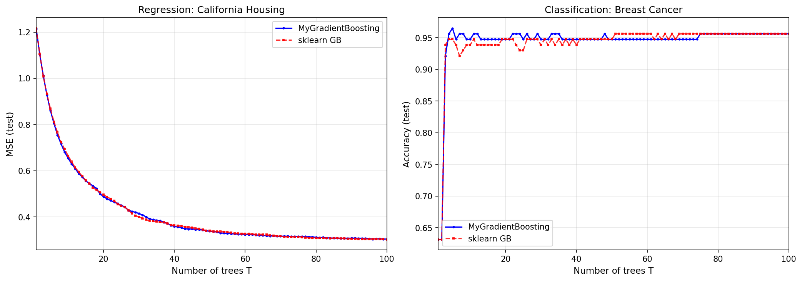
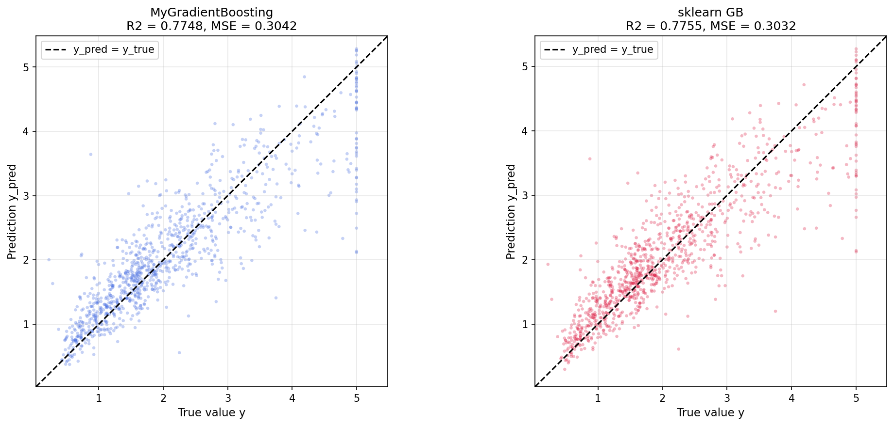
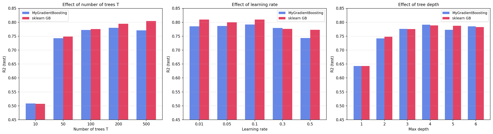
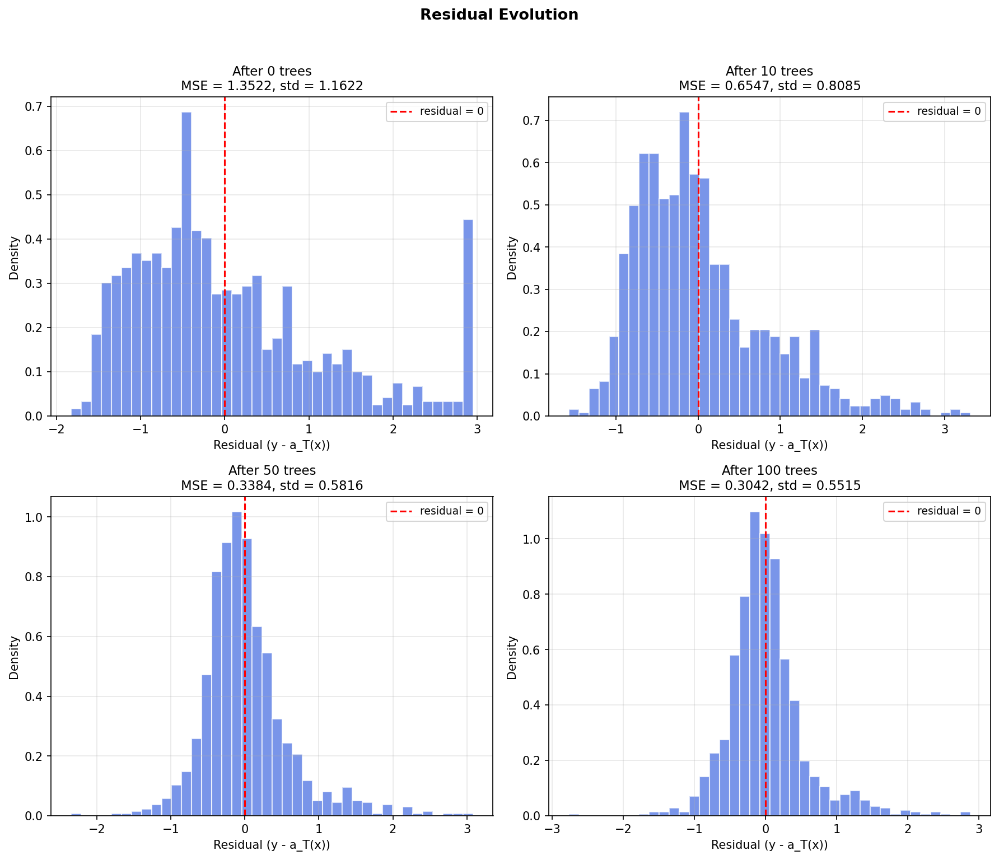
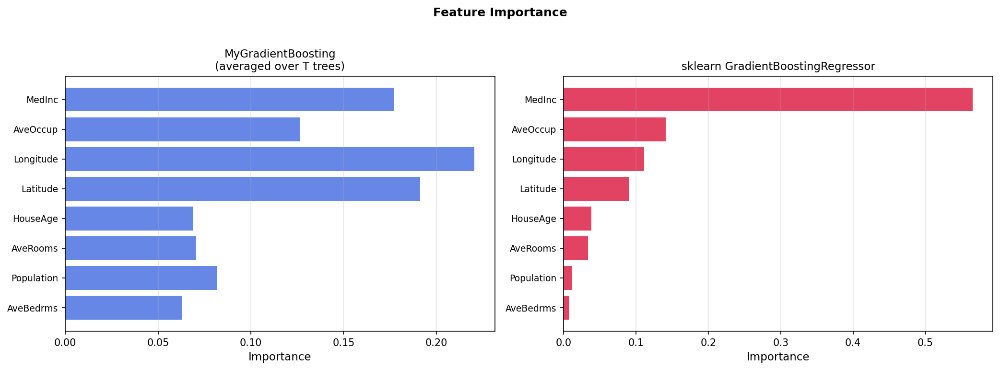

# Лабораторная работа №3. Градиентный бустинг

В рамках данной лабораторной работы предстоит реализовать алгоритм градиентного бустинга и сравнить его с эталонной реализацией из библиотеки `scikit-learn`.

## Задание

- [x] Выбрать датасет для анализа, например, на [kaggle](https://www.kaggle.com/datasets).
- [x] Реализовать алгоритм градиентного бустинга.
- [x] Обучить модель на выбранном датасете.
- [x] Оценить качество модели с использованием кросс-валидации.
- [x] Замерить время обучения модели.
- [x] Сравнить результаты с эталонной реализацией из библиотеки [scikit-learn](https://scikit-learn.org/stable/):
   * точность модели;
   * время обучения.
- [x] Подготовить отчет, включающий:
   * описание алгоритма градиентного бустинга;
   * описание датасета;
   * результаты экспериментов;
   * сравнение с эталонной реализацией;
   * выводы.

---

# Отчет

## Описание алгоритма

Градиентный бустинг — это метод ансамблирования, в котором базовые алгоритмы (деревья решений) обучаются последовательно, 
и каждый следующий пытается исправить ошибки предыдущих. Основная идея — строить линейную комбинацию базовых алгоритмов:

a_T(x) = sum(t=1..T) alpha_t * b_t(x)

где b_t — базовый алгоритм (дерево регрессии), alpha_t — вес, T — число деревьев.

Алгоритм работает так:

1. **Инициализация.** a_0 = 0 для всех объектов (в моей реализации вместо нуля используется среднее значение для регрессии и log-odds для классификации — это даёт лучшую стартовую точку).
2. **Антиградиент.** На каждой итерации вычисляется вектор антиградиента функции потерь. Для регрессии это просто остатки (y_i - a_i), а для классификации — y / (1 + exp(y * a)).
3. **Обучение дерева.** Дерево регрессии обучается аппроксимировать антиградиент, то есть минимизировать сумму квадратов отклонений от антиградиента.
4. **Поиск оптимального шага.** Для каждого нового дерева ищется оптимальный коэффициент alpha_t. Для регрессии это аналитическая формула, для классификации — метод Ньютона-Рафсона с гессианом в текущей точке.
5. **Обновление.** a_i = a_i + eta * alpha_t * b_t(x_i), где eta — learning rate.

Также в реализации используется стохастический градиентный бустинг — на каждом шаге берётся не вся выборка, а случайная подвыборка (по умолчанию 80%).

## Датасеты

Для экспериментов выбраны два встроенных датасета из sklearn:

**California Housing** (регрессия):
- 5000 объектов (взята подвыборка из оригинальных 20640), 8 признаков
- Целевая переменная: медианная стоимость дома (× $100,000)
- Признаки: доход населения, возраст дома, среднее число комнат, широта/долгота и др.

**Breast Cancer Wisconsin** (классификация):
- 569 объектов, 30 признаков
- Два класса: злокачественная / доброкачественная (212 / 357)
- Признаки: размеры клеточных ядер, текстура, периметр и др.

Оба датасета разбиты на обучающую (80%) и тестовую (20%) выборки.

## Реализация

Реализация выполнена в виде единственного класса `MyGradientBoosting` в файле `gradient_boosting.py`. 
В качестве базового алгоритма используется `DecisionTreeRegressor` из sklearn. 

Класс поддерживает как регрессию, так и бинарную классификацию, переключение между которыми происходит через параметр `loss`.

### Структура класса

Класс содержит следующие ключевые методы:

- **`_init_prediction(y)`** — вычисляет начальное предсказание $a_0$. Вместо тривиальной инициализации нулём 
(как в базовом алгоритме из лекции), для регрессии используется среднее значение целевой переменной `mean(y)`, 
а для классификации — log-odds априорной вероятности `log(p / (1-p))`. Это даёт лучшую стартовую точку и ускоряет сходимость на первых итерациях.

- **`_negative_gradient(y, y_pred)`** — вычисляет антиградиент функции потерь. Для MSE это просто остатки `y - y_pred`. 
Для логистической потери (классификация) используется формула `y / (1 + exp(y * y_pred))`, где метки классов 
предварительно перекодируются из {0, 1} в {-1, +1}.

- **`_line_search_alpha(X, y, y_pred, tree)`** — ищет оптимальный вес alpha_t для нового дерева. Для регрессии 
используется аналитическое решение: alpha = sum(r_i * b(x_i)) / sum(b(x_i)^2). Для классификации применяется метод 
Ньютона-Рафсона с гессианом, вычисляемым в текущей точке. Для стабильности в знаменатель добавляется регуляризатор 
(по аналогии с XGBoost), а само значение alpha ограничивается отрезком `[0.001, 10.0]`.

- **`fit(X, y)`** — основной цикл обучения. На каждой из T итераций: вычисляется антиградиент, случайным образом выбирается 
подвыборка (если subsample < 1), дерево обучается аппроксимировать антиградиент, находится оптимальный alpha_t, 
и предсказание обновляется с учётом learning rate: `y_pred += learning_rate * \alpha * tree.predict(X)`. 
Если включена ранняя остановка (`early_stopping_rounds`), от обучающей выборки отделяется валидационная часть, 
и обучение прерывается, когда loss на валидации не улучшается заданное число раундов.

- **`predict(X)`** — инкрементально суммирует предсказания всех деревьев с их весами, начиная от `initial_prediction`. 
Для классификации к сырому результату применяется порог: `sign(raw)`, причём перед этим значения ограничиваются отрезком `[-500, 500]`
для защиты от переполнения в `exp()`.

### Основные параметры

| Параметр | Значение по умолчанию | Описание |
|----------|----------------------|----------|
| `n_estimators` | 100 | Число деревьев T |
| `learning_rate` | 0.1 | Шаг обучения \u03b7 |
| `max_depth` | 3 | Глубина деревьев |
| `subsample` | 0.8 | Доля выборки на каждом шаге |
| `min_samples_leaf` | 5 | Минимум объектов в листе (регуляризация) |
| `early_stopping_rounds` | None | Ранняя остановка |

## Результаты экспериментов

Чтобы оценить, насколько хорошо работает реализация, я провела серию экспериментов. Сначала обе модели (кастомная и sklearn) 
обучились на двух датасетах с одинаковыми гиперпараметрами, затем были измерены метрики качества и время обучения. 
После этого я варьировала отдельные гиперпараметры, чтобы посмотреть, как ведут себя обе реализации и соответствуют 
ли результаты теоретическим утверждениям из лекции.

### Регрессия (California Housing)

| Метрика | MyGradientBoosting | sklearn GB | Разница |
|---------|-------------------|------------|---------|
| MSE (тест) | 0.3042 | 0.3032 | +0.0011 |
| R² (тест) | 0.7748 | 0.7755 | −0.0008 |
| CV MSE (2-fold) | 0.3249 ± 0.0134 | 0.3195 ± 0.0097 | +0.0054 |
| Время обучения (с) | 1.494 | 0.753 | +0.742 |

Разрыв по MSE составляет всего 0.0011 — это меньше 0.4% от значения метрики. По R² разница вообще в четвёртом знаке после запятой. 
По качеству реализация практически не уступает sklearn.

Время обучения у кастомной реализации примерно в 2 раза больше, что ожидаемо — sklearn использует оптимизации на Cython, 
кэширование предсказаний и более продвинутые алгоритмы построения деревьев.

### Классификация (Breast Cancer Wisconsin)

| Метрика | MyGradientBoosting | sklearn GB | Разница |
|---------|-------------------|------------|---------|
| Accuracy (тест) | 0.9561 | 0.9561 | **0.0000** |
| F1 weighted (тест) | 0.9560 | 0.9558 | +0.0003 |
| CV Accuracy (2-fold) | 0.9473 ± 0.0106 | 0.9525 ± 0.0089 | −0.0053 |
| Время обучения (с) | 0.424 | 0.402 | +0.022 |

Accuracy полностью совпадает со sklearn — 0.9561. F1-score даже чуть выше (0.9560 vs 0.9558). Это хороший результат для реализации с нуля.

### Эксперимент 1. Влияние числа деревьев T

Помимо базового сравнения, интересно посмотреть, как ведёт себя модель при разном числе деревьев. 
Согласно лекции, одно из важных свойств бустинга — его обобщающая способность не ухудшается с ростом T. 
Проверим это на практике, обучив модели с T = 10, 50, 100 и 200:

| T | R² (My GB) | R² (sklearn) | MSE (My GB) |
|---|-----------|-------------|-------------|
| 10 | 0.5134 | 0.5074 | 0.6572 |
| 50 | 0.7495 | 0.7483 | 0.3383 |
| 100 | 0.7803 | 0.7755 | 0.2967 |
| 200 | 0.7863 | 0.7945 | 0.2887 |

Результаты подтверждают известное свойство бустинга: обобщающая способность не ухудшается с ростом T. 
При увеличении числа деревьев с 10 до 200 R² стабильно растёт (0.51 → 0.79), а MSE падает (0.66 → 0.29). 
Начиная со 100 деревьев прирост замедляется — модель почти сходится.

### Эксперимент 2. Влияние subsample

Стохастический градиентный бустинг предлагает на каждом шаге использовать не всю обучающую выборку, а лишь её случайную часть. 
По утверждению из лекции, оптимальный размер подвыборки — 60–80%. Я проверила значения 0.5, 0.7, 0.8 и 1.0:

| Subsample | R² (My GB) | R² (sklearn) |
|-----------|-----------|-------------|
| 0.5 | 0.7678 | 0.7695 |
| 0.7 | 0.7733 | 0.7761 |
| 0.8 | 0.7763 | 0.7755 |
| 1.0 | 0.7750 | 0.7727 |

Лучшая точность достигается при subsample = 0.7–0.8. Использование всей выборки (1.0) даёт даже чуть худший результат — 
стохастичность помогает бороться с переобучением. При слишком малом subsample = 0.5 качество тоже падает, 
т.к. деревья обучаются на недостаточном объёме данных.

### Эксперимент 3. Влияние learning rate

Наконец, я оценила влияние шага обучения на качество модели при фиксированном числе деревьев (T = 100). 
Learning rate определяет, насколько сильно каждое новое дерево влияет на ансамбль:

| LR | R² (My GB) | R² (sklearn) |
|----|-----------|-------------|
| 0.05 | 0.7472 | 0.7480 |
| 0.1 | 0.7749 | 0.7755 |
| 0.3 | 0.7860 | 0.7841 |
| 0.5 | 0.7723 | 0.7718 |

Оптимальный learning rate для 100 деревьев оказался 0.3 — при этом шаге бустинг успевает хорошо сойтись за отведённое число итераций. 
При LR = 0.05 сходимость слишком медленная (100 деревьев не хватает), а при LR = 0.5 шаг становится слишком большим и качество немного проседает. 

## Визуализация

Для наглядности я построила пять графиков, которые помогают понять поведение модели 

### Кривая обучения

На левом графике показано, как MSE на тестовой выборке меняется с ростом числа деревьев для задачи регрессии. 
Обе кривые (кастомная и sklearn) быстро убывают в первые 20–30 итераций, затем замедляются и практически сходятся. 
После ~60 деревьев MSE почти перестаёт меняться — дальнейшие деревья вносят минимальный вклад. 
Кривые идут почти параллельно, что говорит о похожей динамике обучения.

На правом графике — аналогично для Accuracy в задаче классификации. Модель быстро выходит на плато около 0.94–0.96 уже 
после 20–30 деревьев. 

### Scatter plot (регрессия)

Графики показывают предсказанные значения относительно истинных для обоих вариантов. В идеале все точки должны лежать 
на диагонали y_pred = y_true. В обоих случаях облако точек достаточно плотно прилегает к диагонали, хотя на краях
(очень дешёвые и очень дорогие дома) разброс увеличивается.

Визуально различия между кастомной и sklearn реализациями практически незаметны, что подтверждает численные результаты.

### Сравнение гиперпараметров

Три группы столбцов показывают влияние основных гиперпараметров на R² (кастомная и sklearn реализации рядом):

- **Число деревьев T**: оба варианта показывают монотонный рост R². При T=10 качество ещё низкое (~0.50), а при T=200–500 
разница между реализациями минимальна. Это хорошо демонстрирует, что бустинг не переобучается с ростом T.
- **Learning rate**: лучшее значение — 0.1–0.3. При LR=0.01 модель недообучается (мало деревьев для такого маленького шага), 
при LR=0.5 качество немного падает из-за слишком агрессивных шагов.
- **Глубина деревьев**: наблюдается рост качества с увеличением глубины от 1 до 4–5, после чего рост замедляется. 
Глубокие деревья могут начать переобучаться, но learning rate и subsample смягчают этот эффект.

### Эволюция остатков

Четыре гистограммы показывают распределение остатков (y - ŷ) после 0, 10, 50 и 100 деревьев. Это наглядно демонстрирует, как работает бустинг:

- **После 0 деревьев** (только начальное предсказание = среднее): остатки распределены широко, std ≈ 1.15. Модель предсказывает одно и то же для всех объектов.
- **После 10 деревьев**: распределение заметно уже, пик ближе к нулю. MSE упал примерно вдвое.
- **После 50 деревьев**: остатки сконцентрированы вокруг нуля, MSE ≈ 0.33.
- **После 100 деревьев**: распределение стало компактным, MSE ≈ 0.30. Форма приблизилась к нормальной, что говорит о том, 
что модель хорошо уловила основную структуру данных, а оставшиеся ошибки в основном случайные.

### Важность признаков

Для sklearn-реализации самым важным признаком оказался MedInc (медианный доход), что логично. 
Однако в моей реализации на первом месте оказался Longitude (долгота) — вероятно, это связано с тем, что деревья в 
кастомной реализации по-другому распределяют сплиты между признаками с похожей предсказательной силой. 
Тем не менее общий порядок признаков у обеих реализаций похож, что подтверждает корректность работы.

## Выводы

1. Градиентный бустинг реализован с нуля и показал качество, сопоставимое с sklearn: разрыв по Accuracy составил 0.0000 для классификации и всего 0.0011 по MSE для регрессии.

2. Эксперименты с гиперпараметрами подтвердили теоретические утверждения:
   - Качество не ухудшается с ростом числа деревьев (при правильно выбранном learning rate).
   - Оптимальный размер подвыборки — 60–80%, стохастичность действительно помогает.
   - Learning rate 0.1–0.3 даёт хороший баланс между скоростью сходимости и качеством.

3. Кастомная реализация работает медленнее sklearn примерно в 2 раза, что ожидаемо — sklearn использует оптимизации на Cython.

4. Визуализации показали, что кастомная и sklearn реализации ведут себя практически идентично: совпадают кривые обучения, похожие распределения остатков, одинаковый порядок важности признаков.