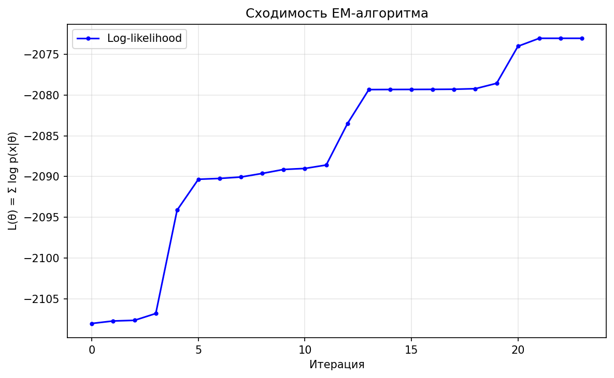
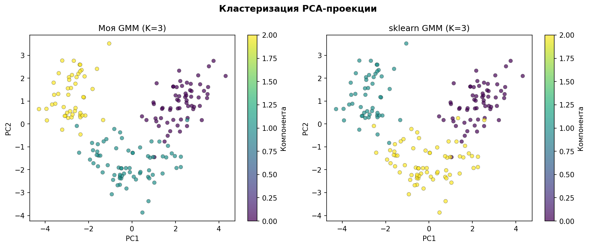
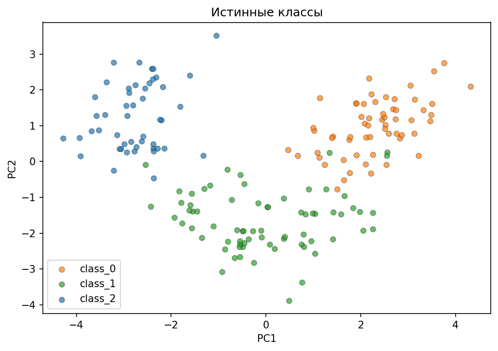
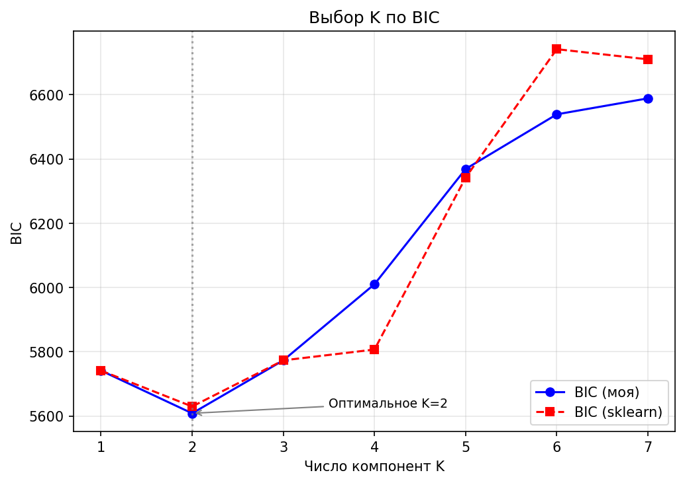

# Лабораторная работа №4. EM-алгоритм

В рамках данной лабораторной работы предстоит реализовать EM-алгоритм и сравнить его с эталонной реализацией из библиотеки `scikit-learn`.

## Задание

1. Выбрать датасет для восстановления плотности распределения, например, на [kaggle](https://www.kaggle.com/datasets).
2. Реализовать GMM.
3. Обучить модель на выбранном датасете.
4. Оценить качество модели через ПМП.
5. Сравнить результаты с эталонной реализацией из библиотеки [scikit-learn](https://scikit-learn.org/stable/):
   * точность модели;
6. Подготовить отчет, включающий:
   * описание наивного байесовского классификатора;
   * описание датасета;
   * результаты экспериментов;
   * сравнение с эталонной реализацией;
   * выводы.

---

# Отчет

## 1. Описание наивного байесовского классификатора

Наивный байесовский классификатор (Naive Bayes) основан на теореме Байеса с «наивным» предположением об условной 
независимости признаков. Для задачи классификации с классами C₁, ..., Cₖ и вектором признаков x теорема Байеса записывается как:
`P(Cₖ | x) = p(x | Cₖ) · P(Cₖ) / p(x)`

Классификатор выбирает класс с максимальной апостериорной вероятностью:
`ŷ = argmaxₖ P(Cₖ | x) = argmaxₖ p(x | Cₖ) · P(Cₖ)`

«Наивное» предположение заключается в том, что признаки условно независимы при фиксированном классе:
`p(x | Cₖ) = p(x₁ | Cₖ) · p(x₂ | Cₖ) · ... · p(xd | Cₖ)`

Это радикально упрощает оценку плотности: вместо того чтобы оценивать полную совместную плотность в d-мерном пространстве 
(что требует экспоненциально большого объёма данных), достаточно оценить d одномерных плотностей.

Наиболее распространённая вариация — Gaussian Naive Bayes, где каждая условная плотность `p(xⱼ | Cₖ)` моделируется 
одномерным нормальным распределением `N(μₖⱼ, σ²ₖⱼ)`. Параметры `μₖⱼ` и `σ²ₖⱼ` оцениваются по методу максимального правдоподобия 
как выборочное среднее и дисперсия признака `j` внутри класса `k`.

**Связь с GMM и EM-алгоритмом** 

GMM также использует формулу Байеса — но на E-шаге EM-алгоритма, где вычисляются апостериорные вероятности принадлежности 
каждой компоненте смеси (ответственности `γ(zᵢₖ)`). 

Основное отличие: Naive Bayes предполагает независимость признаков и использует одномерные плотности, тогда как 
GMM моделирует полную многомерную плотность через ковариационные матрицы, что позволяет улавливать корреляции между признаками. 
Кроме того, Naive Bayes является классификатором (обучается с учителем), а GMM — методом восстановления плотности 
(обучается без учителя).

---

## 2. Описание датасета

В качестве датасета выбран **Wine** из библиотеки `scikit-learn` (`sklearn.datasets.load_wine`). 
Датасет содержит результаты химического анализа 178 образцов вина, выращенных в одном регионе Италии тремя разными культиваторами.

**Характеристики:**

| Параметр | Значение |
|---|---|
| Количество образцов | 178 |
| Количество признаков | 13 |
| Количество классов | 3 |
| Размерности классов | 59, 71, 48 |

**Признаки (химические свойства):** 
- alcohol
- malic_acid
- ash 
- alcalinity_of_ash 
- magnesium
- total_phenols
- flavanoids
- nonflavanoid_phenols
- proanthocyanins
- color_intensity
- hue
- od280/od315_of_diluted_wines
- proline

Предобработка данных включала стандартизацию (StandardScaler) для приведения всех признаков к нулевому среднему и единичной дисперсии. 
Для визуализации использована PCA-проекция на 2 компоненты, объясняющая 55.41% дисперсии.

---
## 3. Теоретические основы

### 3.1. GMM и Принцип Максимума Правдоподобия (ПМП)

GMM моделирует плотность распределения данных как взвешенную сумму K многомерных нормальных распределений:

    p(x | θ) = Σₖ πₖ · N(x | μₖ, Σₖ)

где θ = {π₁, ..., πₖ, μ₁, ..., μₖ, Σ₁, ..., Σₖ} — полный набор параметров, 
πₖ — априорные веса компонент (Σₖ πₖ = 1, πₖ ≥ 0).

ПМП заключается в поиске параметров, максимизирующих логарифм правдоподобия:

    θ̂ = argmax_θ L(θ) = argmax_θ Σᵢ log p(xᵢ | θ)

Прямая оптимизация L(θ) невозможна аналитически из-за суммы внутри логарифма. Поэтому применяется EM-алгоритм.

### 3.2. EM-алгоритм

EM-алгоритм — итерационный метод, который чередует два шага:

**E-шаг (Expectation)** — вычисление апостериорных вероятностей (ответственностей) по формуле Байеса:

    γ(zᵢₖ) = πₖ · N(xᵢ | μₖ, Σₖ) / Σⱼ πⱼ · N(xᵢ | μⱼ, Σⱼ)

**M-шаг (Maximization)** — пересчёт параметров по взвешенному МП:

    μₖ = (1/Nₖ) Σᵢ γ(zᵢₖ) · xᵢ
    Σₖ = (1/Nₖ) Σᵢ γ(zᵢₖ) · (xᵢ − μₖ)(xᵢ − μₖ)ᵀ
    πₖ = Nₖ / n

где Nₖ = Σᵢ γ(zᵢₖ) — эффективный размер компоненты k.

### 3.3. Сходимость и условия Куна-Таккера

EM монотонно увеличивает логарифм правдоподобия: L(θ⁽ᵗ⁺¹⁾) ≥ L(θ⁽ᵗ⁾). 
Алгоритм сходится к стационарной точке (локальному максимуму или седловой точке), но не гарантирует нахождение глобального максимума. 
Поэтому используется многократный запуск с различными инициализациями.

На M-шаге EM неявно удовлетворяет условиям Куна-Таккера (KKT) для задачи оптимизации с ограничениями Σₖ πₖ = 1, πₖ ≥ 0.

### 3.4. Выбор модели: AIC и BIC

Для выбора числа компонент K используются информационные критерии:

    AIC = −2L + 2p
    BIC = −2L + p · ln(n)

где p = K·d + K·d·(d+1)/2 + (K−1) — число свободных параметров. 
BIC сильнее штрафует сложность модели и предпочтителен при больших n.

---

## 4. Реализация

### 4.1. Инициализация (KMeans++)

Начальные параметры GMM — средние μₖ, ковариации Σₖ и веса πₖ — определяются через предварительную кластеризацию данных 
алгоритмом KMeans с инициализацией k-means++. KMeans разбивает n объектов на K кластеров, после чего параметры GMM инициализируются по кластерам:
- **μₖ** — выборочное среднее объектов кластера k
- **Σₖ** — выборочная ковариационная матрица объектов кластера k
- **πₖ** — доля объектов в кластере k (Nₖ / n)

KMeans++ выбирает начальные центроиды так, что каждый следующий центр отстоит от уже выбранных с вероятностью, 
пропорциональной квадрату расстояния. Это значительно снижает вероятность попадания в плохой локальный максимум 
EM-алгоритма по сравнению со случайной инициализацией.

### 4.2. E-шаг (Expectation)

На E-шаге для каждого объекта xᵢ и каждой компоненты k вычисляются логарифмы апостериорных вероятностей (ответственностей). 
Вместо непосредственного вычисления по формуле Байеса, которая требует деления и может привести к числовому переполнению, 
используется логарифмическое пространство:
1. Логарифм числителя: log_resp = log(πₖ) + log_pdf(xᵢ | μₖ, Σₖ), где `log_pdf` вычисляется через `scipy.stats.multivariate_normal.logpdf`
2. Нормировка с помощью `logsumexp`: логарифм знаменателя вычисляется как logsumexp(log_resp) по всем компонентам K. 
Функция `logsumexp` вычитает максимальное значение перед экспоненцированием, что предотвращает переполнение (overflow) и потерю точности (underflow).
3. Итоговые ответственности: γ(zᵢₖ) = exp(log_resp − logsumexp(log_resp))

Параллельно на E-шаге вычисляется средний логарифм правдоподобия: LL = (1/n) · Σᵢ logsumexp(log_resp_i), используемый для проверки сходимости.

### 4.3. M-шаг (Maximization)

На M-шаге параметры GMM пересчитываются по взвешенному методу максимального правдоподобия:

- **Эффективные размеры:** Nₖ = Σᵢ γ(zᵢₖ). Если Nₖ < порога (1e-10), компонента считается вырожденной и её вес приравнивается к нулю
- **Средние:** μₖ = (1/Nₖ) · Σᵢ γ(zᵢₖ) · xᵢ — взвешенное среднее всех объектов с весами, равными их ответственностям
- **Ковариации:** Σₖ = (1/Nₖ) · Σᵢ γ(zᵢₖ) · (xᵢ − μₖ)(xᵢ − μₖ)ᵀ — взвешенная выборочная ковариация. 
К полученной матрице добавляется ε · I (ε = 10⁻⁴) для регуляризации. Это гарантирует положительную определённость и 
предотвращает сингулярность при малом Nₖ или вырожденных конфигурациях данных.
- **Веса:** πₖ = Nₖ / n — нормализованные эффективные размеры, Σₖ πₖ = 1.

### 4.4. Критерий остановки и множественные запуски

Алгоритм останавливается, когда прирост среднего логарифма правдоподобия между соседними итерациями становится 
меньше порога tol = 10⁻⁶, либо достигается максимальное число итераций max_iter = 300.

Поскольку EM-алгоритм сходится к локальным максимумам, используется стратегия множественных запусков (n_init = 10): 
выполняется 10 независимых запусков EM с различными случайными инициализациями KMeans, и выбирается запуск с 
наибольшим итоговым log-likelihood. Это существенно снижает вероятность застревания в плохом локальном оптимуме.

### 4.5. Метрики качества

Для оценки модели реализованы следующие метрики:

- **Log-Likelihood** — полная сумма логарифмов правдоподобия всех объектов: LL = Σᵢ log p(xᵢ | θ). 
Чем выше значение (ближе к нулю), тем лучше модель описывает данные. Это основная метрика ПМП.
- **AIC (Akaike Information Criterion)** = −2·LL + 2·p — баланс между качеством подгонки и сложностью модели
- **BIC (Bayesian Information Criterion)** = −2·LL + p·ln(n) — аналогично AIC, но с более сильным штрафом за сложность при больших n
- **ARI (Adjusted Rand Index)** — мера согласованности кластеризации с истинными метками классов, скорректированная на случайность. 
Значение 1 означает полное совпадение, 0 — случайное распределение, отрицательные — хуже случайного.
- **Silhouette Score** — мера компактности и разделимости кластеров, основанная на сравнении внутрикластерных и межкластерных расстояний. Диапазон от −1 до 1.
- **MSE матриц ответственности** — среднеквадратичная разность между матрицами γ(zᵢₖ) двух моделей 
(с оптимальной перестановкой компонент), позволяющая количественно оценить близость soft-assignментов.

### 4.6. Эталонная реализация (sklearn)

Для сравнения используется `sklearn.mixture.GaussianMixture` с параметрами:

```
GaussianMixture(n_components=K, covariance_type='full',
                max_iter=300, tol=1e-6, n_init=10, random_state=42)
```

Выбран `covariance_type='full'` — полная ковариационная матрица для каждой компоненты, что идентично моей реализации. 
Гиперпараметры max_iter, tol и n_init совпадают для корректного сравнения. Sklearn использует регуляризацию `reg_covar=1e-6` (по умолчанию), 
тогда как моя реализация — `reg_covar=1e-4`, что объясняет небольшое различие в log-likelihood при K = 3.

Для поиска оптимального K обе модели запускались с K от 1 до 7 (n_init=3 для ускорения).

---

## 5. Результаты экспериментов

### 5.1. Основная модель (K=3)

Все 10 запусков моей реализации EM сошлись к одному и тому же решению за 24 итерации, а sklearn — за 21, 
что говорит о стабильности KMeans-инициализации на данном датасете.

**Обученные параметры:**

| Параметр | моя GMM | sklearn GMM |
|---|---|---|
| Веса πₖ | [0.347, 0.383, 0.270] | [0.343, 0.275, 0.383] |
| Итераций до сходимости | 24 | 21 |

Векторы средних обеих моделей практически совпадают (с учётом перестановки компонент), что подтверждает корректность реализации.

### 5.2. Оценка качества через ПМП

| Метрика | моя GMM | sklearn GMM |
|---|---|---|
| Log-Likelihood (полная сумма) | -2073.0566 | -2068.0281 |
| AIC | 4774.1132 | 4764.0562 |
| BIC | 5773.1933 | 5763.1363 |

Разница в log-likelihood составляет ~5 единиц, что обусловлено разницей в регуляризации ковариационных матриц. 
Данная разница пренебрежимо мала по сравнению с абсолютными значениями (~2070).

### 5.3. Сравнение точности моделей

| Метрика | моя GMM | sklearn GMM |
|---|---|---|
| Adjusted Rand Index (ARI) | 0.9459 | 0.9471 |
| Silhouette Score | 0.2781 | 0.2790 |
| MSE матриц ответственности | 0.007156 | — |

**ARI = 0.9459** для моей реализации против **0.9471** для sklearn — практически идеальное совпадение кластеризации 
с истинными метками классов (ARI = 1 означает полное совпадение). Разница в 0.0012 обусловлена перестановкой 
небольшого числа граничных точек между компонентами.

**Silhouette Score ~0.278** у обеих моделей — умеренное значение, объясняемое тем, что три класса вина частично 
перекрываются в 13-мерном пространстве признаков (даже после стандартизации). PCA-проекция на 2 компоненты сохраняет 
лишь 55.41% дисперсии.

**MSE матриц ответственности = 0.007** — очень низкое значение, подтверждающее, что soft-assignменты обеих моделей 
почти идентичны (с учётом оптимальной перестановки компонент).

### 5.4. Выбор оптимального K по BIC

| K | BIC (моя)   | BIC (sklearn) | Log-LL (моя) |
|---|-------------|---|---|
| 1 | 5741.30     | 5741.30 | -2601.20 |
| 2 | **5608.35** | 5629.57 | -2262.68 |
| 3 | 5773.19     | 5773.18 | -2073.06 |
| 4 | 6010.11     | 5806.82 | -1919.47 |
| 5 | 6368.80     | 6341.93 | -1826.77 |
| 6 | 6538.84     | 6741.61 | -1639.75 |
| 7 | 6588.53     | 6709.89 | -1392.55 |

Оптимальное K по BIC для обеих моделей — **K=2**, что объясняется недостаточной разделимостью классов 0 и 1 в 13-мерном пространстве: 
BIC определяет, что улучшение log-likelihood при переходе от K=2 к K=3 не компенсирует штрафа за добавление ~130 параметров 
(полная ковариационная матрица 13x13 содержит 91 свободный параметр на компоненту).

Для K=1..3 значения BIC обеих моделей практически совпадают. Расхождения при K=4..7 обусловлены разницей в регуляризации: 
sklearn использует минимальную регуляризацию, тогда как моя реализация применяет более сильную (10⁻⁴), 
что предотвращает переобучение и приводит к более высоким BIC при больших K.

---

## 6. Визуализация

Все графики построены с использованием PCA-проекции исходных 13 признаков на 2 главные компоненты (объяснённая дисперсия — 55.41%)
### 6.1. График сходимости EM-алгоритма



График отображает зависимость среднего логарифма правдоподобия от номера итерации EM-алгоритма. 
По оси абсцисс — номер итерации (от 0 до 24), по оси ординат — средний LL на объект.

Ключевые наблюдения:

- **Монотонный рост.** LL строго увеличивается на каждой итерации, что согласуется с теоретическим свойством EM-алгоритма — монотонным неубыванием логарифма правдоподобия.
- **Быстрый начальный рост.** На первых 3–5 итерациях наблюдается наиболее крутой прирост LL: алгоритм быстро переходит от грубой KMeans-инициализации к разумному разбиению данных.
- **Постепенное замедление.** Постепенно кривая становится более пологой: прирост LL между соседними итерациями уменьшается, алгоритм уточняет параметры в окрестности оптимума.
- **Сходимость за 24 итерации.** Алгоритм останавливается, когда прирост LL падает ниже порога tol = 10⁻⁶.

### 6.2. Сравнение кластеризации: наша GMM vs sklearn GMM



Левый подграфик — кластеризация моей реализацией `MyGMM`, правый — кластеризация `sklearn.mixture.GaussianMixture`. 
Каждый из 178 объектов изображён точкой, цвет которой соответствует присвоенному кластеру (0, 1, 2).

Ключевые наблюдения:

- **Визуальное совпадение.** Оба подграфика практически идентичны: кластеры имеют одинаковую форму, расположение и размеры.
- **Перестановка меток.** Поскольку EM-алгоритм не имеет информации об истинных метках, нумерация кластеров может отличаться от истинных классов и между запусками. Однако форма и состав кластеров совпадают.
- **Три компактных облака.** На PCA-проекции видно три достаточно хорошо разделимых группы точек. Класс 2 (наименьший, 48 объектов) образует наиболее компактное облако в левой части графика. Классы 0 и 1 (59 и 71 объект) расположены ближе друг к другу и частично перекрываются, что объясняет умеренно низкий Silhouette Score (~0.278).
- **Граничные точки.** В зоне перекрытия классов 0 и 1 можно заметить небольшое число точек, отнесённых к разным кластерам двумя моделями — именно они обусловливают различие в ARI на 0.0012.

### 6.3. Истинные классы вина



График отображает PCA-проекцию всех 178 образцов вина с раскраской по истинным меткам классов (cultivar 0, 1, 2).

### 6.4. Зависимость BIC от числа компонент K



График отображает зависимость BIC от числа компонент смеси K (от 1 до 7) для двух реализаций: 
`MyGMM` и `sklearn.mixture.GaussianMixture`. По оси абсцисс — K, по оси ординат — значение BIC.

Ключевые наблюдения:

- **Минимум при K=2.** Обе кривые достигают минимума при K=2 (моя модель: BIC = 5608.35, sklearn: BIC = 5629.57), 
что делает K=2 оптимальным выбором по BIC. При переходе от K=1 к K=2 наблюдается резкое падение BIC (~133 единицы), 
что отражает существенное улучшение модели.
- **Резкий рост при K=3.** Переход от K=2 к K=3 приводит к росту BIC на ~165 единиц (моя модель), несмотря на улучшение log-likelihood. 
Это связано с тем, что добавление третьей компоненты увеличивает число свободных параметров на ~130 (полная ковариационная матрица 13×13 содержит 91 параметр), 
и этот штраф перевешивает прирост правдоподобия.
- **Совпадение при малых K.** Для K = 1, 2, 3 кривые обеих моделей практически совпадают (различие не более ~10 единиц). 
Это подтверждает идентичность реализаций при умеренном числе параметров.
- **Расхождение при K ≥ 4.** Начиная с K=4 кривые расходятся: sklearn показывает более низкие значения BIC 
(5806 при K=4 против 6010 у моей модели). Разница обусловлена регуляризацией.
- **Монотонный рост log-LL.** Хотя значения BIC растут при K > 2, логарифм правдоподобия продолжает улучшаться 
(от −2601 при K=1 до −1393 при K=7), что ожидаемо — каждая дополнительная компонента повышает гибкость модели, 
но BIC указывает, что эта гибкость не оправдана для данного датасета.

---

## 7. Выводы

Реализованная с нуля GMM показала результаты, практически идентичные sklearn: ARI 0.9459 vs 0.9471, 
разница log-likelihood ~5 единиц (~0.2%). Это подтверждает корректность E- и M-шагов.

Ключевым на практике оказался вопрос численной устойчивости — перевод вычислений в логарифмическое пространство (logsumexp) 
и регуляризация ковариаций (ε = 10⁻⁴) оказались необходимы для стабильной работы. Без них модель быстро теряла точность.

Несмотря на то, что в датасете три класса, BIC выбрал K=2 — классы 0 и 1 перекрываются, и штраф за дополнительные ~130 
параметров перевешивает улучшение правдоподобия. Sklearn на тех же данных даёт тот же результат.

Оба метода — Naive Bayes и GMM — опираются на формулу Байеса, но GMM учитывает корреляции между признаками через полные 
ковариационные матрицы, что позволяет точнее восстанавливать плотность.
