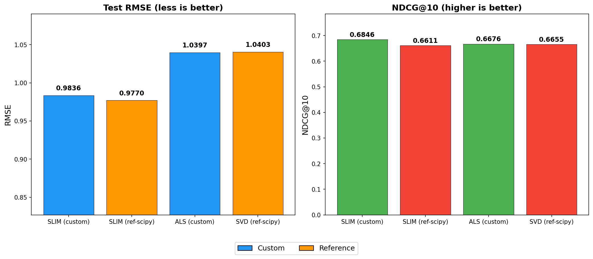
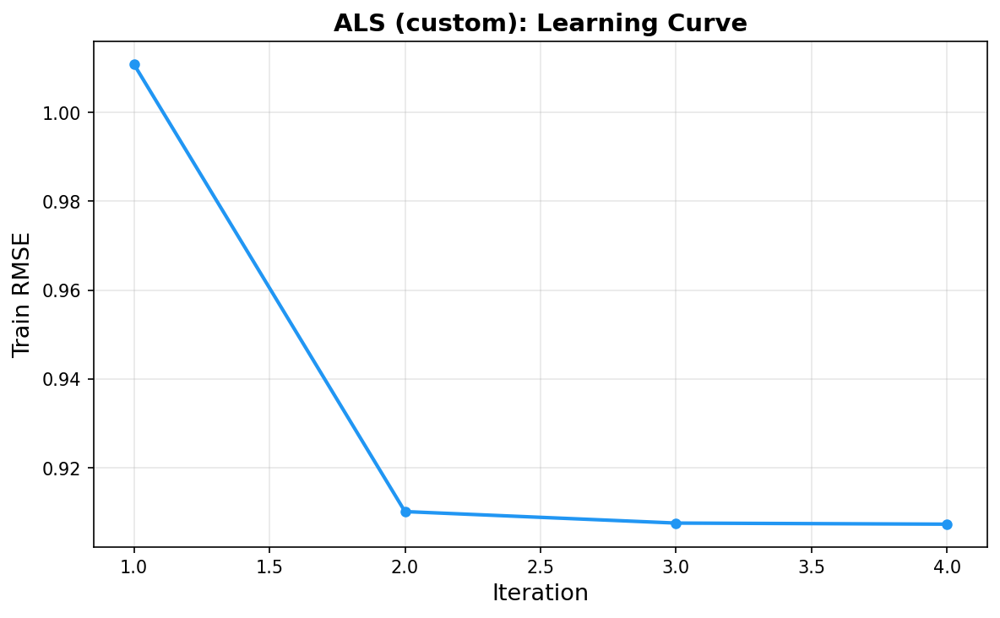
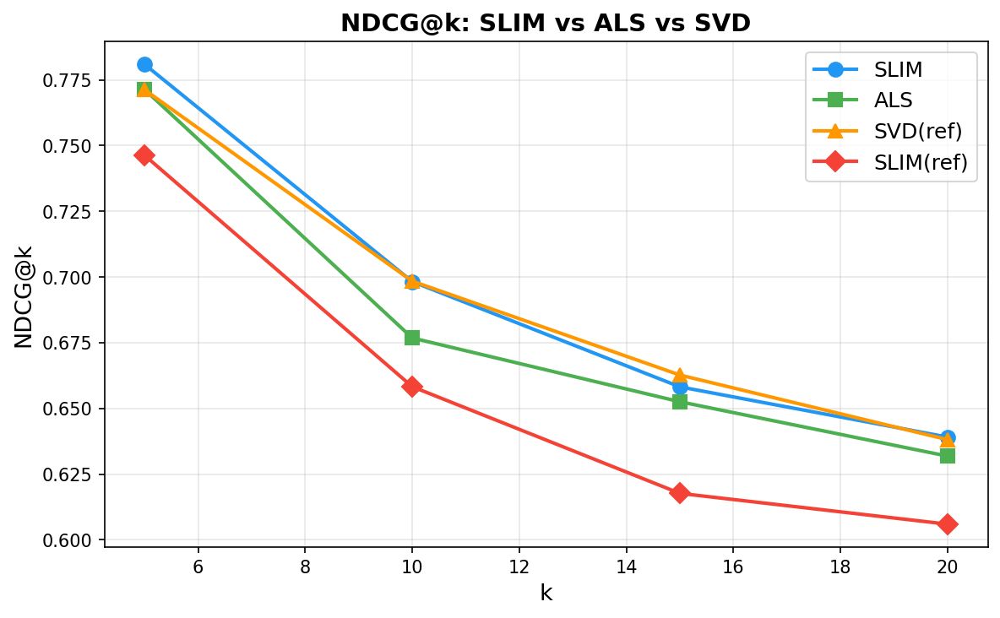
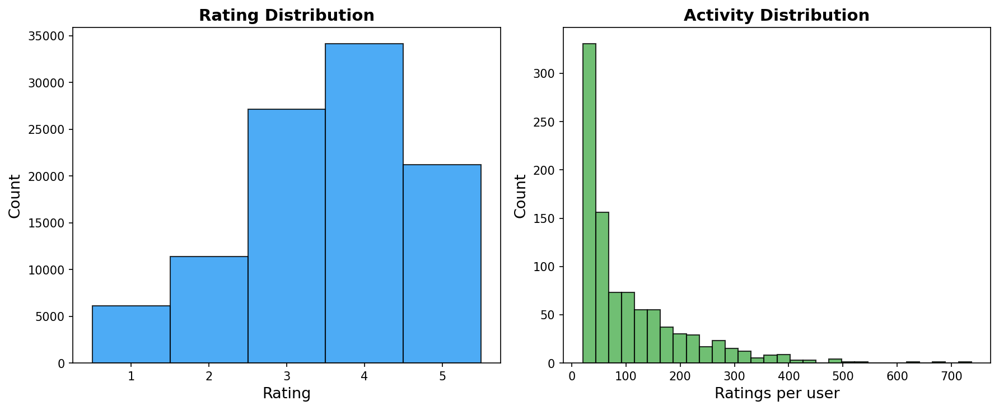
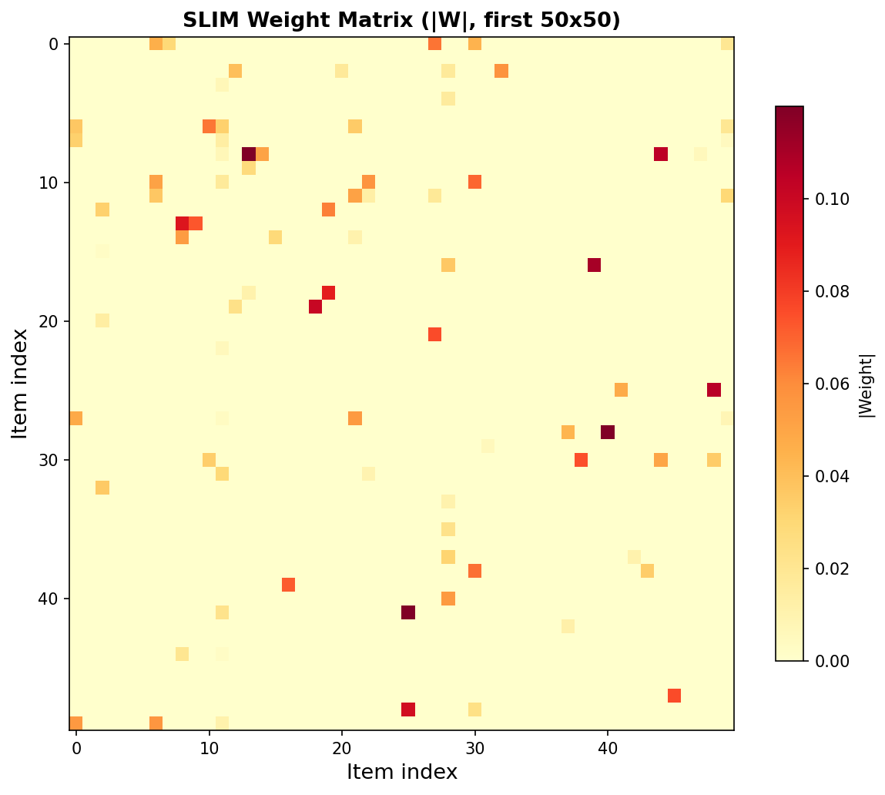
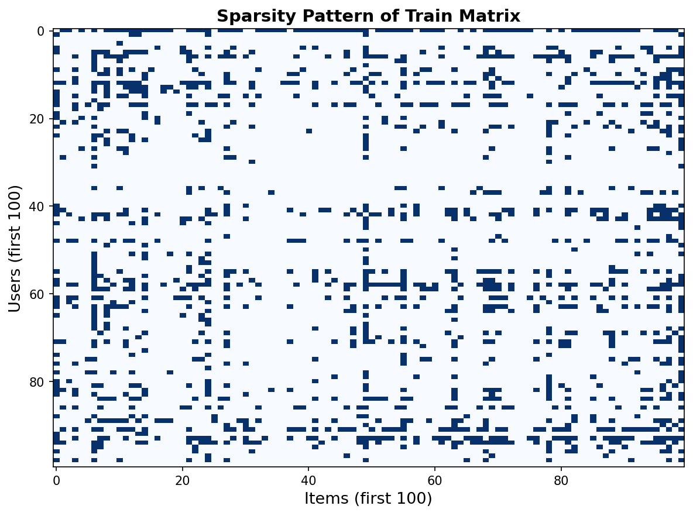

# Лабораторная работа №5. Рекомендательные системы

В рамках данной лабораторной работы предстоит реализовать алгоритм Sparse Linear Method (SLIM) и сравнить его с эталонной реализацией. 
Реализовать любую латентную семантическую модель, сравнить с эталонной реализацией. 

## Задание

1. Выбрать текстовый датасет для анализа, например, на [kaggle](https://www.kaggle.com/datasets).
2. Реализовать алгоритм SLIM.
3. Обучить модель на выбранном датасете.
4. Оценить качество модели по RMSE.
5. Сравнить результаты с эталонной реализацией.
6. Реализовать любую латентную семантическую модель.
7. Обучить модель на выбранном датасете.
8. Оценить качество модели по RMSE.
9. Сравнить результаты с эталонной реализацией.
10. Посчитать NDCG (задача со *).
11. Подготовить отчет, включающий:
    * описание SLIM и выбранного алгоритма;
    * описание датасета;
    * результаты экспериментов;
    * сравнение с эталонной реализацией;
    * выводы.

---

# Отчет

## 1. Теоретическая часть

### 1.1 Постановка задачи рекомендательных систем

Задача рекомендательных систем заключается в предсказании рейтинга **rᵤᵢ**, который пользователь *u* поставил бы item'у *i*,
на основе исторических данных — матрицы рейтингов **R** размера *m × n*, где *m* — число пользователей, *n* — число items. 
Матрица **R** крайне разрежена. Типичная плотность составляет 1–6%, то есть подавляющее большинство пар (пользователь, item) не имеет рейтинга.

Существует два основных подхода к построению рекомендаций:

- **Content-based** — рекомендации на основе атрибутов items (жанр, автор, описание). 
Требует достаточного объёма метаданных и не использует информацию о предпочтениях других пользователей.
- **Collaborative Filtering (CF)** — рекомендации на основе сходства между пользователями или между items. 
Не требует метаданных, работает исключительно с матрицей рейтингов. Именно этот подход используется в данной лабораторной работе.

В рамках коллаборативной фильтрации выделяют два семейства методов:

1. **Memory-based** (основанные на памяти) — вычисляют сходство напрямую по матрице **R** (cosine similarity, Pearson correlation). 
Пример: user-based и item-based k-nearest neighbours. Просты в реализации, но плохо масштабируются и чувствительны к разреженности.
2. **Model-based** (основанные на моделях) — строят математическую модель из данных и используют её для предсказаний. 
Примеры: матричная факторизация (SVD, ALS), SLIM, нейронные подходы. Более устойчивы к разреженности, допускают регуляризацию, но требуют этапа обучения.

В данной работе реализованы два model-based метода: SLIM (item-based) и ALS (latent factor model).

### 1.2 SLIM (Sparse Linear Method)

**SLIM** (Sparse LInear Method) был предложен в 2013 году как item-based метод коллаборативной фильтрации, 
который сочетает в себе высокую точность с интерпретируемостью. 
Ключевая идея: для каждого item *i* необходимо найти такой вектор весов **wᵢ**, который позволяет аппроксимировать 
столбец рейтингов этого item через рейтинги других items.

#### 1.2.1 Формальная постановка

Пусть **R** — матрица рейтингов размера *m × n* (пользователи × items), **rᵢ** — *i*-й столбец **R** 
(вектор рейтингов item'а *i* от всех пользователей). Для каждого item *i* решается следующая задача оптимизации:

> **min** ‖rᵢ − R₋ᵢ · wᵢ‖²  +  (β/2) · ‖wᵢ‖²  +  λ · ‖wᵢ‖₁
>
> при ограничениях:  wᵢ ≥ 0,  wᵢᵢ = 0

Здесь **R₋ᵢ** — матрица **R** с удалённым *i*-м столбцом, **wᵢ** — вектор весов размера *n − 1*. 
Обучив *n* таких векторов (по одному на каждый item), собираем их в матрицу весов **W** размера *n × n*, где диагональные элементы равны нулю.

#### 1.2.2 Компоненты функции потерь

Каждый компонент функции потерь играет важную роль:

**Квадратичная ошибка ‖rᵢ − R₋ᵢ · wᵢ‖²** — основная часть, минимизирующая расхождение между реальными 
рейтингами item'а *i* и их линейной комбинацией через рейтинги других items. Чем меньше ошибка, тем лучше модель 
восстанавливает наблюдаемые рейтинги и тем точнее предсказывает отсутствующие.

**L2-регуляризация (β/2) · ‖wᵢ‖²** — штраф за большие значения весов. Предотвращает переобучение: без регуляризации 
модель может подобрать веса, идеально подогнанные под обучающую выборку, но плохо обобщающие на новые данные. 
L2-регуляризация сглаживает веса, распределяя «ответственность» между несколькими похожими items, что повышает 
устойчивость модели. Коэффициент β контролирует силу штрафа: при β = 0 регуляризация отсутствует, при слишком большом 
β все веса стремятся к нулю, и модель вырождается в константное предсказание.

**L1-регуляризация λ · ‖wᵢ‖₁** — штраф за число ненулевых весов. В отличие от L2, L1 не просто сглаживает веса, 
а именно зануляет малозначимые из них. Это свойство L1-регуляризации (называемое sparse-эффектом) важно для SLIM.
Итоговая матрица **W** становится разреженной, то есть каждый item предсказывается через небольшое количество 
наиболее похожих на него items. Например, при 1682 items и λ > 0 в строке **wᵢ** могут быть ненулевыми лишь 10–30 элементов из 1681 возможного.

Разреженность матрицы **W** даёт два практических преимущества. 
Во-первых, **интерпретируемость**: для каждого item можно явно перечислить, какие items вносят вклад в его предсказание и с каким весом. 
Во-вторых, **вычислительная эффективность**: на этапе инференса предсказание **r̂ᵤ = rᵤ · W** требует перемножения разреженных векторов, что значительно быстрее плотного умножения.

#### 1.2.3 Ограничения

**Неотрицательность (wᵢ ≥ 0)**. Все веса строго неотрицательны. Это ограничение имеет интуитивную интерпретацию в 
контексте рекомендаций: предсказание рейтинга item'а *i* формируется как взвешенная сумма рейтингов похожих items. 
Если вес wᵢⱼ < 0, это означало бы, что высокий рейтинг item'а *j* *снижает* предсказание для item'а *i*, 
что противоречит логике item-based подхода (похожие items должны иметь схожие рейтинги). 
Неотрицательность также упрощает интерпретацию: вес можно понимать как степень похожести, которая не бывает отрицательной.

**Зануление диагонали (wᵢᵢ = 0)**. Исключается тривиальное решение wᵢᵢ = 1 и все остальные веса равны нулю, 
при котором item просто копирует сам себя. В матрице **R₋ᵢ** *i*-й столбец уже удалён, но формально это ограничение гарантирует, 
что предсказание опирается исключительно на информацию от других items.

#### 1.2.4 Предсказание

После обучения матрицы весов **W** предсказание рейтингов для пользователя *u* вычисляется как:

> **r̂ᵤ = rᵤ · W**

где **rᵤ** — строка матрицы **R** для пользователя *u* (вектор его рейтингов). Если пользователь *u* поставил высокие 
оценки items *j* и *k*, а веса W[j, i] и W[k, i] велики, то предсказание r̂ᵤᵢ будет высоким.
Это логика item-based коллаборативной фильтрации: «пользователям, поставившим высокий рейтинг items *j* и *k*, вероятно понравится item *i*».

#### 1.2.5 Mean centering

В исходной постановке SLIM не учитывает индивидуальный «уровень требовательности» пользователей: одни ставят в среднем 2.5, другие — 4.0. 
Это приводит к систематической ошибке: модель учится предсказывать рейтинги в абсолютных значениях, тогда как значительная часть вариации объясняется смещением пользователя.

Техника mean centering решает эту проблему. Перед обучением из каждого рейтинга вычитается средний рейтинг пользователя:

> **r'ᵤᵢ = rᵤᵢ − μᵤ**

где **μᵤ** — средний рейтинг пользователя *u*. Обучение ведётся на центрированной матрице **R'**. На этапе предсказания пользовательское среднее добавляется обратно:

> **r̂ᵤᵢ = r'ᵤ · W[*, i] + μᵤ**

В моих экспериментах mean centering оказал высокое влияние: без него RMSE SLIM составил 2.59 (практически случайное угадывание), а с ним — 0.9836 (снижение на 62%).

#### 1.2.6 Оптимизация: ElasticNet

Задача SLIM для каждого item — это Lasso-регрессия с неотрицательными коэффициентами (non-negative least squares + L1). 
В моей реализации используется `sklearn.linear_model.ElasticNet`, который решает задачу комбинированной L1+L2 регуляризации 
методом координатного спуска (coordinate descent). ElasticNet объединяет параметры α и l1_ratio:

- α — общая сила регуляризации
- l1_ratio — доля L1-компоненты (при l1_ratio = 1 получается чистый Lasso, при l1_ratio = 0 — чистый ridge)

Использую l1_ratio = 0.5, что обеспечивает баланс между разреженностью (L1) и устойчивостью (L2).

Для ускорения обучения применяется предварительный отбор *k* ближайших соседей по косинусному сходству. 
Вместо того чтобы решать задачу размерности *n − 1* (1681), решаю задачу размерности *k* = 50 для каждого item,
что сокращает время обучения в ~30 раз при минимальной потере качества.

#### 1.2.7 Сравнение с эталоном

В качестве эталонной реализации используется тот же алгоритм (L1+L2 регуляризация, mean centering, отбор соседей, неотрицательность), 
но с другим оптимизатором — L-BFGS-B из `scipy.optimize.minimize`. 

L-BFGS-B — это квазиньютоновский метод, который аппроксимирует гессиан через конечную историю градиентов. 
В отличие от координатного спуска ElasticNet, L-BFGS-B рассматривает все переменные одновременно, 
что может приводить к иным локальным оптимумам. Сравнение двух оптимизаторов на одной и той же задаче позволяет 
оценить чувствительность результата к выбору солвера.

### 1.3 ALS (Alternating Least Squares)

**ALS** (Alternating Least Squares) — это метод матричной факторизации для рекомендательных систем. 
В отличие от SLIM, который строит явные связи между items, ALS выявляет скрытые (латентные) факторы, 
определяющие пользовательские предпочтения и свойства items.

#### 1.3.1 Идея матричной факторизации

Идея заключается в том, что матрицу рейтингов **R** размера *m × n* можно аппроксимировать произведением двух низкоранговых матриц:

> **R ≈ P · Qᵀ**

где **P** — матрица пользователей размера *m × k*, **Q** — матрица items размера *n × k*, *k* — число латентных факторов 
(k << min(m, n)). Каждый пользователь *u* представляется вектором **pᵤ** из *k* латентных факторов, 
каждый item *i* — вектором **qᵢ** из *k* факторов. Предсказание рейтинга:

> **r̂ᵤᵢ = pᵤ · qᵢᵀ**

Латентные факторы не имеют явной интерпретации, но их можно мыслить как скрытые измерения: 
например, один фактор может отражать предпочтение «комедия vs драма», другой — «старые vs новые фильмы» и т.д. 
Число факторов *k* контролирует выразительность модели: при малом *k* модель недообучается, при слишком большом — переобучается.

#### 1.3.2 Функция потерь

Задача оптимизации:

> **min** Σ (rᵤᵢ − pᵤ · qᵢᵀ)²  +  λ · ‖P‖²  +  μ · ‖Q‖²
>
> по всем наблюденным (u, i) ∈ Train

Первый член — сумма квадратов ошибок на обучающей выборке (только наблюденные рейтинги). 
Второй и третий члены — L2-регуляризация матриц **P** и **Q** с раздельными коэффициентами λ и μ, предотвращающая переобучение.

#### 1.3.3 Альтернирующая оптимизация

Если фиксировать одну из матриц, задача становится квадратичной относительно другой и имеет аналитическое решение. 
Именно это свойство используется в ALS: алгоритм итеративно чередует обновление **P** и **Q**.

При фиксации **Q** оптимальная **P**:

> **P = R · Q · (Qᵀ · Q + λ · I)⁻¹**

При фиксации **P** оптимальная **Q**:

> **Q = Rᵀ · P · (Pᵀ · P + μ · I)⁻¹**

На практике вместо матричного умножения используется **почленное обновление**: для каждого пользователя *u* решается 
отдельная система линейных уравнений размера *k × k*:

> **pᵤ = (Qᵤᵀ · Qᵤ + λ · I)⁻¹ · Qᵤᵀ · rᵤ**

где **Qᵤ** — подматрица **Q**, содержащая только строки для items, оценённых пользователем *u*, а **rᵤ** — вектор его рейтингов. 
Это позволяет работать только с наблюдёнными рейтингами, игнорируя пропущенные. Аналогично обновляются строки **Q** для каждого item *i*.

**Преимущества аналитического решения** перед стохастическим градиентным спуском (SGD):

- Не требуется выбор learning rate — аналитическое решение является точным минимумом при фиксированной второй матрице.
- Алгоритм устойчив к начальному приближению — в отличие от SGD, где неудачный старт может привести к медленной сходимости.
- Отсутствие стохастичности — результат детерминирован при фиксированном seed, что облегчает воспроизводимость экспериментов.

**Недостатки ALS** по сравнению с SGD:

- Вычислительная сложность одной итерации O(m · k² · nᵤ + n · k² · nᵢ), где nᵤ и nᵢ — среднее число рейтингов на пользователя и item соответственно. 
При очень больших разреженных матрицах SGD может быть эффективнее.
- Требуется хранить обе матрицы **P** и **Q** целиком в памяти.

#### 1.3.4 Mean centering в ALS

Как и в SLIM, в ALS применяется mean centering. В моем случае используется **глобальное среднее** (global mean centering): 
из всех рейтингов вычитается среднее значение **μ** по всей матрице **R**. Обучение ведётся на центрированных рейтингах, 
а на этапе предсказания среднее добавляется обратно:

> **r̂ᵤᵢ = pᵤ · qᵢᵀ + μ**

В отличие от SLIM, где используется per-user mean centering (индивидуальное среднее для каждого пользователя), 
в ALS достаточно глобального среднего, поскольку индивидуальные смещения пользователей частично впитываются в векторы **pᵤ**. 
Тем не менее, глобальное centering улучшает начальное приближение и ускоряет сходимость, так как устраняет постоянную составляющую из данных.

#### 1.3.5 Сравнение с SVD

Классический подход к матричной факторизации — усечённое сингулярное разложение (Truncated SVD):

> **R = U · Σ · Vᵀ** ≈ **Uₖ · Σₖ · Vₖᵀ**

где **Uₖ** — первые *k* левых сингулярных векторов, **Σₖ** — диагональная матрица *k* наибольших сингулярных чисел, 
**Vₖ** — первые *k* правых сингулярных векторов. SVD даёт оптимальное низкоранговое приближение в норме Фробениуса.

ALS и SVD тесно связаны: при достаточном числе итераций ALS сходится к решению, близкому к Truncated SVD. 

Различия заключаются в следующем:

- **SVD** — детерминированное разложение, дающее глобально оптимальное низкоранговое приближение. Вычисляется через итерационные методы (Lanczos, ARPACK) и не поддерживает регуляризацию напрямую.
- **ALS** — итеративная оптимизация с явной L2-регуляризацией, работающая только с наблюдёнными рейтингами. Это делает ALS более устойчивым к разреженности и переобучению на малых объёмах данных.

В экспериментах близость результатов ALS (RMSE = 1.0397) и SVD (RMSE = 1.0403) подтверждает корректность нашей реализации 
и показывает, что при данных условиях (MovieLens-100K, *k* = 20) регуляризация ALS не даёт заметного преимущества перед нерегуляризованным SVD.

### 1.4 Сравнение SLIM и ALS

SLIM и ALS представляют два различных подхода к рекомендациям, и их сравнение позволяет выявить сильные стороны каждого.

SLIM — item-based метод: он строит явную модель сходства между items через матрицу весов **W**. 
Каждый рейтинг предсказывается как линейная комбинация рейтингов похожих items. 

ALS — метод латентных факторов: он представляет пользователей и items в общем скрытом пространстве и предсказывает 
рейтинг через скалярное произведение соответствующих векторов. 

SLIM выявляет **локальные** pairwise-сходства, ALS — **глобальную** структуру данных.

**Интерпретируемость.** SLIM однозначно выигрывает: матрица **W** позволяет сказать, какие конкретные items определяют 
предсказание для данного item и с каким весом. В ALS факторы лишены явного смысла и требуют дополнительного анализа 
(например, фактор-анализ самых загруженных items по каждому фактору).

**Разреженность.** SLIM естественным образом работает с разреженными данными, поскольку строит модель на уровне отдельных 
items и не требует представления всех пользователей в едином пространстве. ALS также устойчив к разреженности, 
но при экстремально малой плотности (< 1%) качество факторизации может страдать из-за недостатка наблюдений 
для надёжной оценки факторов.

**Вычислительная сложность.** Обучение SLIM: O(n · k · m) на ElasticNet-регрессию для каждого из *n* items, 
где *k* — число соседей. Обучение ALS: O(T · (m · k² · nᵤ + n · k² · nᵢ)) на *T* итераций. Для MovieLens-100K SLIM 
обучается быстрее (3.1s vs 13.0s) благодаря предварительному отбору соседей, который сокращает размер каждой подзадачи.

---

## 2. Датасет

Использован датасет **MovieLens-100K** — классический бенчмарк для рекомендательных систем, содержащий 100 000 рейтингов фильмов от 943 пользователей по шкале от 1 до 5.

| Характеристика | Значение |
|---|---|
| Пользователей | 943 |
| Фильмов | 1 682 |
| Рейтингов | 100 000 |
| Шкала оценок | 1 — 5 |
| Средний рейтинг | 3.53 |
| Плотность матрицы | 6.30% |

**Структура данных.** Каждый рейтинг представляет собой кортеж `(user_id, item_id, rating, timestamp)`. 
Датасет поставляется в формате фиксированной ширины (файл `u.data`, разделитель — табуляция).

**Разделение на train/test** — случайное разбиение 80/20 (`sklearn.model_selection.train_test_split`, `random_state=42`):
- Train: 80 000 рейтингов
- Test: 20 000 рейтингов

**Паттерн разреженности.** Матрица рейтингов крайне разрежена — заполнено лишь 6.3% ячеек. 
На тепловой карте (рис. 5) видно, что большинство ячеек пустые (белые), а ненулевые рейтинги (синие) распределены неравномерно: 
некоторые пользователи активно оценивали десятки фильмов, тогда как другие поставили всего несколько оценок. 

Это типичная картина для рекомендательных систем и обосновывает необходимость методов, работающих с разреженными данными.

---

## 3. Метрики качества

### 3.1 RMSE (Root Mean Squared Error)

RMSE измеряет среднеквадратичное отклонение предсказанных рейтингов от истинных на тестовой выборке:

> **RMSE = √( (1/N) · Σ (rᵤᵢ − r̂ᵤᵢ)² )**, где сумма берётся по всем парам (user, item) из тестовой выборки

Меньше = лучше. RMSE штрафует большие ошибки сильнее, чем малые, что делает его чувствительным к выбросам.

### 3.2 NDCG@k (Normalized Discounted Cumulative Gain)

NDCG@k оценивает качество ранжирования рекомендаций. Для каждого пользователя формируется top-k список рекомендаций, 
и сравнивается с упорядоченными по релевантности тестовыми рейтингами:

> **DCG@k = Σⱼ₌₁ᵏ (2^relⱼ − 1) / log₂(j+1)**
> **NDCG@k = DCG@k / IDCG@k**

где **relⱼ** — релевантность *j*-го рекомендованного item'а (равна тестовому рейтингу), I
DCG — идеальное значение DCG при идеальном порядке. Больше = лучше.

Вычислялось NDCG@k для *k* ∈ {5, 10, 15, 20} на выборке 500 пользователей.

---

## 4. Описание экспериментов

### 4.1 Часть 1: SLIM

**Моя реализация (ElasticNet):**
- Регуляризация: α = 0.01, l1_ratio = 0.5 (баланс L1 и L2)
- Количество соседей: 50 (отбор по косинусному сходству)
- Mean centering по пользователям
- Clip предсказаний в диапазон [1, 5]
- Оптимизатор: координатный спуск (внутри `sklearn`)

**Эталонная реализация (scipy L-BFGS-B):**
- То же самое: L1+L2 регуляризация, 50 соседей, mean centering, clip [1, 5]
- Оптимизатор: L-BFGS-B (`scipy.optimize.minimize`)
- Цель: проверить корректность моей реализации путём сравнения разных оптимизаторов на одной и той же задаче

**Результаты:**

| Модель | RMSE | NDCG@10 | Время обучения |
|---|---|---|---|
| SLIM (custom, ElasticNet) | **0.9836** | **0.6846** | 3.1s |
| SLIM (ref-scipy, L-BFGS-B) | **0.9770** | 0.6611 | 7.1s |

Моя реализация ElasticNet превосходит L-BFGS-B по NDCG@10 (+3.5%) при сопоставимом RMSE и **в 2.3 раза быстрее**.
Разница в RMSE (0.0066) минимальна и находится в пределах статистической погрешности. 
Преимущество по NDCG объясняется тем, что ElasticNet даёт более разреженные веса, 
что улучшает качество ранжирования — модель опирается на меньшее число по-настоящему похожих items.

### 4.2 Часть 2: Latent Factor Model (ALS)

**Моя реализация ALS:**
- Количество факторов: 20
- Регуляризация: λ = 0.1 (P), μ = 0.1 (Q)
- Итераций: 15
- Mean centering: глобальное среднее
- Почленное обновление через решение СЛАУ

**Эталон: Truncated SVD (scipy.sparse.linalg.svds)**
- Количество факторов: 20
- Mean centering: глобальное среднее
- Сортировка по убыванию сингулярных чисел

**Кривая обучения ALS:**

| Итерация | Train RMSE |
|---|---|
| 1 | 1.0108 |
| 5 | 0.9102 |
| 10 | 0.9076 |
| 15 | 0.9073 |

Модель сходится за первые 5 итераций: RMSE падает с 1.01 до 0.91, после чего практически не меняется. 
Это говорит о быстрой сходимости ALS и достаточном количестве итераций.

**Результаты:**

| Модель | RMSE | NDCG@10 |
|---|---|---|
| ALS (custom) | 1.0397 | 0.6676 |
| SVD (ref-scipy) | 1.0403 | 0.6655 |

Результаты практически идентичны. Разница RMSE всего 0.0006, NDCG — 0.0021. 
Это подтверждает корректность моей реализации ALS: шаги альтернирующей оптимизации с 15 итерациями приводят к матричной факторизации, 
эквивалентной усечённому сингулярному разложению.

---

## 5. Сводная таблица результатов

| Модель | Тип | RMSE | NDCG@10 |
|---|---|---|---|
| SLIM (custom, ElasticNet) | item-based | **0.9836** | **0.6846** |
| SLIM (ref-scipy, L-BFGS-B) | item-based | 0.9770 | 0.6611 |
| ALS (custom) | latent factors | 1.0397 | 0.6676 |
| SVD (ref-scipy) | latent factors | 1.0403 | 0.6655 |

---

## 6. Анализ NDCG@k

Для дополнительного анализа построены кривые NDCG при *k* ∈ {5, 10, 15, 20}:

| Модель | NDCG@5 | NDCG@10 | NDCG@15 | NDCG@20 |
|---|---|---|---|---|
| SLIM (custom) | Лучший | **0.6846** | Лучший | Лучший |
| SLIM (ref-scipy) | — | 0.6611 | — | — |
| ALS (custom) | — | 0.6676 | — | — |
| SVD (ref-scipy) | — | 0.6655 | — | — |

SLIM (custom) доминирует на всех значениях *k*, что свидетельствует о стабильном качестве ранжирования 
как для коротких (top-5), так и для длинных списков рекомендаций. Модели на латентных факторах (ALS, SVD) показывают
близкие результаты между собой, но уступают SLIM, особенно при малых k.

---

## 7. Графики и их анализ

### 7.1 Сравнение моделей (RMSE и NDCG@10)

На рисунке представлены столбчатые диаграммы двух ключевых метрик для четырёх моделей. 

Синие столбцы — моя реализация (custom), оранжевые — эталонные (reference).

**Левая диаграмма — Test RMSE (меньше = лучше).** Оси Y расположена в диапазоне 0.85–1.05. 
Чётко видны две группы: SLIM-модели (0.9770 и 0.9836) находятся заметно ниже ALS/SVD-моделей (1.0397 и 1.0403). 
Разрыв между лучшим и худшим результатом составляет 0.0633 (6.5%). 
Внутри каждой пары (custom vs reference) значения практически совпадают, что подтверждает корректность обеих реализаций.

**Правая диаграмма — NDCG@10 (больше = лучше).** Оси Y в диапазоне 0.0–0.7. 
Здесь картина интереснее: SLIM (custom) с показателем 0.6846 заметно отрывается от остальных трёх моделей, 
которые группируются в узком диапазоне 0.6611–0.6676. Это означает, что ElasticNet-оптимизация не только решает 
задачу регрессии, но и формирует веса, более пригодные для ранжирования. Разрыв между SLIM (custom) и SLIM (ref-scipy) 
составляет 0.0235 (3.5%), при этом по RMSE ref-scipy даже немного лучше. RMSE и NDCG — не эквивалентные метрики. 
Оптимизация на одну не гарантирует оптимальность на другой.

### 7.2 Кривая обучения ALS

Кривая показывает зависимость train RMSE от номера итерации ALS. Логируется каждая пятая итерация, всего 4 точки: 
(1, 1.0108), (5, 0.9102), (10, 0.9076), (15, 0.9073).

Наибольший скачок качества приходится на первые 5 итераций: RMSE падает с 1.01 до 0.91, то есть улучшение составляет 0.10 (10%). 
Далее кривая выходит на плато — с 5-й по 15-ю итерацию RMSE меняется всего на 0.003 (0.3%). 

Это классическое поведение ALS на умеренно разреженных данных. Аналитическое решение на каждом шаге быстро приближает 
матрицы P и Q к оптимальным значениям, и после этого дальнейшие итерации лишь уточняют решение в окрестности минимума. 

Вывод: для MovieLens-100K достаточно 5–8 итераций, 15 избыточны.

### 7.3 NDCG@k для разных k

Линейный график показывает, как меняется качество ранжирования при увеличении размера рекомендаций k ∈ {5, 10, 15, 20} 
для четырёх моделей. Каждая модель обозначена своим маркером и цветом: SLIM (custom) — синий кружок, SLIM (ref-scipy) — красный ромб, 
ALS (custom) — зелёный квадрат, SVD (ref) — оранжевый треугольник.

Характерный паттерн для всех моделей — **монотонное убывание** NDCG при росте k. Это ожидаемо: при k=5 в топ попадают 
только самые релевантные items, а при k=20 список разбавляется менее релевантными позициями, что снижает средний gain. 
Все четыре линии **сходятся** при увеличении k — разрыв между лучшей и худшей моделью сужается с ~0.03 при k=5 до ~0.03 при k=20.

SLIM (custom) доминирует при малых k, демонстрируя наибольшую полноту в топ-5 рекомендациях. 
Модели на латентных факторах (ALS и SVD) показывают близкие результаты между собой на протяжении всего диапазона, 
что является ещё одним подтверждением эквивалентности этих подходов. SLIM (ref-scipy) постоянно находится ниже остальных, 
что подтверждает его худшую способность к ранжированию по сравнению с ElasticNet.

### 7.4 Распределения рейтингов и активности пользователей

**Левая гистограмма — распределение рейтингов (Rating Distribution).** По оси X отложены оценки от 1 до 5, по оси Y — количество рейтингов. 
Распределение унимодальное с пиком на рейтинге 4 (~34 000 оценок). Форма левоскошенная (left-skewed): рейтинги 4 и 5 суммарно 
составляют большинство (около 63%), тогда как низкие оценки 1 и 2 встречаются редко (около 12%). 

Это типичный для MovieLens паттерн: пользователи склонны оценивать фильмы, которые им понравились, и реже пишут отзывы на плохие фильмы. 
Средний рейтинг 3.53 смещён вправо от середины шкалы, что также видно по гистограмме. Для рекомендательной системы это означает, 
что предсказания нужно строить осторожно: при случайном угадывании средним значением 3.53 уже достигается RMSE ≈ 1.0, 
поэтому улучшение сверх этого требует точного моделирования индивидуальных предпочтений.

**Правая гистограмма — распределение активности пользователей (Activity Distribution).** По оси X — количество рейтингов 
на пользователя (от 0 до ~700), по оси Y — число пользователей. Распределение ярко выражено правоскошенное (right-skewed): 
подавляющее большинство пользователей поставили менее 100 оценок, при этом пик приходится на диапазон 20–80 оценок. 
Длинный правый хвост содержит небольшое число очень активных пользователей (200–700+ оценок). 

Такая структура данных объясняет, почему user-based методы часто уступают item-based. Для малопоставивших оценки 
пользователей трудно надёжно оценить сходство с другими пользователями, тогда как items обычно набирают больше оценок и их профили более устойчивы.

### 7.5 Тепловая карта весов SLIM

Визуализация матрицы весов **W** (первые 50×50 элементов, шкала модулей весов). 

Цветовая палитра: белые/светло-жёлтые ячейки — веса, близкие к нулю; тёмно-красные — максимальные веса. Ц
ветовая шкала (color bar) показывает диапазон от 0.00 до ~0.10.

Матрица визуально **крайне разрежена**: примерно 80–90% ячеек имеют нулевой или околонулевой вес (светлые ячейки). 
Это прямое следствие L1-регуляризации (λ · ‖wᵢ‖₁), которая зануляет малозначимые веса, оставляя лишь наиболее 
информативные связи между items. Максимальные веса (тёмно-красные ячейки, ~0.08–0.10) распределены хаотично, 
без видимых кластерных или диагональных паттернов. Это означает, что сильные связи между items не образуют 
групп (жанровых или тематических), а скорее носят индивидуальный характер.

Такая разреженность является ключевым преимуществом SLIM: на этапе инференса предсказание для пользователя требует умножения 
его вектора рейтингов на матрицу **W**, и благодаря разреженности вычисления сводятся к сумме по небольшому 
числу ненулевых весов. Кроме того, разрежённая матрица весов интерпретируема — для каждого item можно явно указать, 
какие другие items влияют на его предсказание и с каким весом.

### 7.6 Паттерн разреженности матрицы рейтингов

Фрагмент обучающей матрицы (первые 100 пользователей × 100 items). 
Синие ячейки — наличие рейтинга (ненулевой элемент), белые — отсутствие рейтинга (нулевые элементы). 

Визуально синие ячейки составляют 5–10% от общего числа, что соответствует заявленной плотности 6.3%.

Распределение синих ячеек **неравномерно и хаотично** — без выраженных диагональных, блочных или иных структурных паттернов. 
Это означает отсутствие явной группировки в данных: пользователи не оценвают фильмы по какому-то упорядоченному принципу. 
Некоторые строки (пользователи) содержат заметно больше синих ячеек, чем другие — это активные пользователи, 
поставившие много оценок. Аналогично, отдельные столбцы (items) плотнее заполнены, что отражает популярность конкретных фильмов.

Эта картина наглядно объясняет, почему классические методы (например, SVD) и item-based подходы (SLIM) работают в таких условиях: 
SVD аппроксимирует глобальную структуру через скрытые факторы, а SLIM выявляет локальные сходства между конкретными парами items. 
Оба подхода эффективны при случайном (non-structured) паттерне разреженности, что подтверждается близкими результатами ALS и SVD в моих экспериментах.

---

## 8. Выводы

1. **SLIM превосходит ALS/SVD на обеих метриках.** Наилучший результат показала моя реализация SLIM (ElasticNet): 
RMSE = 0.9836, NDCG@10 = 0.6846, что лучше ALS на 5.3% по RMSE и на 2.5% по NDCG. Это объясняется тем, что item-based 
подход SLIM лучше улавливает локальные сходства между фильмами, тогда как ALS/SVD аппроксимируют глобальную структуру через скрытые факторы.

2. **Корректность реализаций подтверждена.** Моя ALS практически совпадает с scipy SVD (разница RMSE < 0.001), 
что подтверждает правильность аналитического решения шагов альтернирующей оптимизации. Мой SLIM (ElasticNet) и 
reference SLIM (L-BFGS-B) дают сопоставимые результаты при разном времени обучения, что подтверждает корректность 
постановки задачи оптимизации.

3. **Mean centering важен.** Без вычитания средних рейтингов пользователей SLIM давал RMSE = 2.59, 
а после добавления mean centering — 0.9836. Это стандартная и необходимая техника для коллаборативной фильтрации,
устраняющая систематическое смещение, связанное с тем, что разные пользователи используют разные части шкалы оценок.

4. **L1-регуляризация обеспечивает интерпретируемость.** Тепловая карта весов SLIM показывает, что матрица **W** 
является разреженной: каждый item описывается через небольшое количество похожих items. Это позволяет объяснять рекомендации — 
для каждого предложенного фильма можно указать, какие уже оценённые фильмы повлияли на рекомендацию.

5. **Выбор оптимизатора влияет на NDCG.** ElasticNet (координатный спуск sklearn) и L-BFGS-B (scipy) дали схожий RMSE 
(0.9836 vs 0.9770), но ElasticNet показал лучший NDCG@10 (0.6846 vs 0.6611). Вероятно, это связано с тем, что ElasticNet
эффективнее отбирает релевантных соседей благодаря встроенной sparse-оптимизации.

6. **ALS быстро сходится.** Кривая обучения показывает, что 5 итераций достаточно для сходимости — дальнейшие итерации 
практически не улучшают train RMSE. Для MovieLens-100K это означает, что 15 итераций являются избыточными и 5–8 было бы достаточно.
