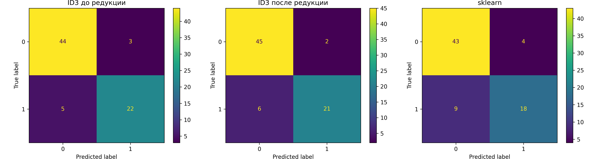

# Лабораторная работа №1

Работу выполнил студент группы Р4155 Чебыкин Артём

## 1. Предобработка данных

В качестве датасета для решения задачи бинарной классификации я выбрал **Horse Colic dataset** (OpenML id=25). Датасет содержит медицинские данные о лошадях с коликами и уже включает реальные пропущенные значения (~20%), поэтому вводить их искусственно не требуется.

Целевой признак: **выжила ли лошадь** — бинаризован из трёх исходных значений:
- `1` (выжила) → класс `0`
- `2` (погибла) / `3` (усыплена) → класс `1`

Датасет содержит смесь категориальных и числовых признаков. Типы определяются автоматически по `dtype` из `fetch_openml`:

- **19 категориальных**: surgery, age, temp_of_extremities, peripheral_pulse, mucous_membranes, capillary_refill_time, pain, peristalsis, abdominal_distension, nasogastric_tube, nasogastric_reflux, rectal_examination, abdomen, abdominocentesis_appearance, surgical_lesion и др.
- **7 числовых**: rectal_temp, pulse, respiratory_rate, nasogastric_reflux_ph, packed_cell_volume, total_protein, abdominocentesis_total_protein

Идентификатор `hospital_number` удалён из признаков.

## 2. Первоначальный анализ данных

Распределение по классам:

```
Классы : survived=0 (232),  died/euthanized=1 (136)
```

Разбивка выборки:

```
Train : 235 samples  (64%)
Val   :  59 samples  (16%)
Test  :  74 samples  (20%)
```

Пропущенные значения: **1927 из 9568 ячеек (20.1%)** — реальные пропуски из датасета.

## 3. Реализация ID3Tree

**ID3Tree** — собственная реализация дерева решений с критерием Джини, поддержкой категориальных признаков и обработкой пропущенных значений. Класс реализует методы `fit`, `predict` и `prune`.

Основные шаги реализации:

**1. Взвешенный подсчёт классов:**

```python
def _class_counts(self, y: np.ndarray, weights: np.ndarray) -> np.ndarray:
    return np.array([weights[y == c].sum() for c in self.classes_])
```

**2. Индекс Джини:**

```python
def _gini(self, counts: np.ndarray) -> float:
    total = counts.sum()
    if total == 0:
        return 0.0
    p = counts / total
    return 1.0 - float(np.dot(p, p))
```

**3. Обработка пропущенных значений (C4.5-стиль):**

Объект с `NaN` распределяется по всем ветвям с весом, пропорциональным доле non-missing объектов в каждой ветви:

```python
def _add_missing_to_splits(self, splits, y_miss, w_miss):
    branch_weights = np.array([s[1] for s in splits])
    total_w = branch_weights.sum()
    for i, s in enumerate(splits):
        frac = branch_weights[i] / total_w if total_w > 0 else 1.0 / len(splits)
        s[0] = s[0] + self._class_counts(y_miss, w_miss * frac)
        s[1] += (w_miss * frac).sum()
```

**4. Обучение дерева:**

```python
def fit(self, X: np.ndarray, y: np.ndarray, is_categorical: list[bool]) -> None:
    self.is_categorical = list(is_categorical)
    self.classes_ = np.unique(y)
    self.n_classes = len(self.classes_)
    weights = np.ones(len(y), dtype=float)
    self.root = self._build(X, y, weights, depth=0)
```

**5. Предсказание при NaN на инференсе:**

```python
# Взвешенное среднее по всем дочерним узлам
total_w = node.n_samples
result = np.zeros(self.n_classes)
for child in node.children.values():
    w = child.n_samples / total_w if total_w > 0 else 1.0 / len(node.children)
    result += w * self._proba(x, child)
return result
```

**6. Reduced Error Pruning:**

Обход снизу вверх. Узел сворачивается в лист, если ошибка листа не превышает ошибку поддерева на валидационной выборке:

```python
if leaf_errors <= subtree_errors:
    node.children = {}
```

---

## 4. Сравнение результатов

### 4.1 Метрики качества на тестовой выборке

<div align="center">

| Модель                      | Accuracy | Precision | Recall | F1 Score |
| --------------------------- | -------- | --------- | ------ | -------- |
| ID3 до редукции             | 0.8919   | 0.8914    | 0.8919 | 0.8909   |
| ID3 после редукции          | 0.8919   | 0.8936    | 0.8919 | 0.8898   |
| sklearn DecisionTree (Gini) | 0.8243   | 0.8237    | 0.8243 | 0.8198   |

</div>

### 4.2 Размер дерева до и после редукции

<div align="center">

| | Глубина | Узлов |
|---|---|---|
| До редукции  | 4  | 103 |
| После редукции | 2 | 63  |

</div>

### 4.3 Confusion Matrix



---

## 5. Выводы

- До редукции дерево полностью запомнило обучающую выборку (Train Accuracy = 1.0), что указывает на переобучение.
- Reduced Error Pruning сократил дерево с 103 до 63 узлов и с глубины 4 до 2, при этом Test Accuracy не изменилась — редукция убрала шум без потери качества.
- ID3 с обработкой пропусков через вероятностное взвешивание (C4.5-стиль) заметно превзошёл sklearn DecisionTree с mean imputation: **0.8919 vs 0.8243** — что демонстрирует преимущество принципиальной обработки пропусков перед заполнением средним.
