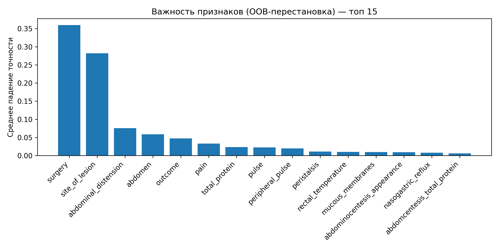
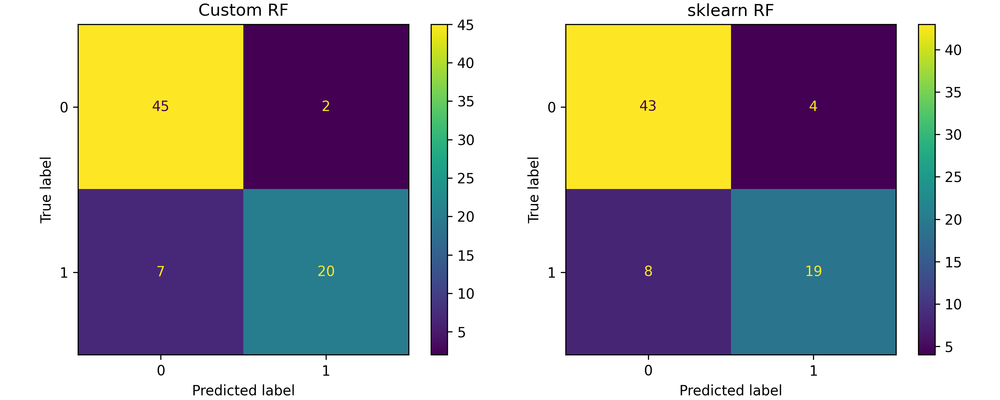

# Лабораторная работа №2

Работу выполнил студент группы Р4155 Чебыкин Артём

## Метод

В работе реализован **Random Forest** — ансамбль деревьев решений, использующий два источника случайности. Первый — бэггинг: каждое дерево обучается на bootstrap-выборке, то есть случайной подвыборке с возвращением. Примерно 37% объектов при этом оказываются «вне мешка» (OOB). Второй — в каждом узле дерево рассматривает не все признаки, а случайное подмножество размером `max_features`. Это снижает корреляцию между деревьями и уменьшает дисперсию ансамбля. Итоговое предсказание — мягкое голосование (усреднение вероятностей) по всем деревьям.

OOB-выборка используется для двух целей. Во-первых, для оценки обобщающей способности без отдельной валидационной выборки: для каждого объекта предсказание строится только теми деревьями, в чью bootstrap-выборку он не вошёл. Во-вторых, для оценки важности признаков методом перестановки: для каждого признака *j* его значения в OOB-выборке случайно перемешиваются, и измеряется падение точности. Среднее падение по всем деревьям — и есть важность признака.

В качестве базового алгоритма используется `sklearn.tree.DecisionTreeClassifier`, ансамблевая обёртка реализована самостоятельно.

## Датасет

В качестве датасета для решения задачи бинарной классификации выбран **Horse Colic dataset**. Датасет содержит медицинские данные о лошадях с коликами и уже включает реальные пропущенные значения, поэтому вводить их искусственно не требуется.

Целевой признак: **выжила ли лошадь** — бинаризован из трёх исходных значений:
- `1` (выжила) → класс `0`
- `2` (погибла) / `3` (усыплена) → класс `1`

Датасет содержит смесь категориальных и числовых признаков. Типы определяются автоматически по `dtype` из `fetch_openml`:
- **19 категориальных**: surgery, age, temp_of_extremities, peripheral_pulse, mucous_membranes, capillary_refill_time, pain, peristalsis, abdominal_distension, nasogastric_tube, nasogastric_reflux, rectal_examination, abdomen, abdominocentesis_appearance, surgical_lesion и др.
- **7 числовых**: rectal_temp, pulse, respiratory_rate, nasogastric_reflux_ph, packed_cell_volume, total_protein, abdominocentesis_total_protein

Идентификатор `hospital_number` удалён из признаков. Распределение классов: выжил=0 (232), умер=1 (136). Пропущенные значения: **1927 из 9568 ячеек (20.1%)**. Перед обучением они заполнены средним (`SimpleImputer`). Разбивка выборки: 80% обучение / 20% тест; отдельная валидационная выборка не нужна, так как её роль играет OOB.

## Подбор гиперпараметров

Для перебора комбинаций используется `sklearn.model_selection.ParameterGrid`, лучшая выбирается по OOB-точности. Сетка:

| Параметр | Значения |
|:---:|:---:|
| `n_estimators` | 50, 100, 200 |
| `max_features` | `"sqrt"`, `"log2"` |
| `max_depth` | `None`, 10, 20 |
| `min_samples_split` | 2, 5 |

Итого 36 комбинаций. Лучшие параметры: `n_estimators=100, max_features="sqrt", max_depth=None, min_samples_split=5`, OOB-точность 0.8844.

## Результаты

Метрики на тестовой выборке и время обучения (параметры одинаковые для обеих моделей):

| Модель | Accuracy | Precision | Recall | F1 | Время обучения |
|:---:|:---:|:---:|:---:|:---:|:---:|
| Custom RF | 0.8784 | 0.8813 | 0.8784 | 0.8752 | 0.151 с |
| sklearn RF | 0.8378 | 0.8369 | 0.8378 | 0.8347 | 0.060 с |

Sklearn работает быстрее в ~2.5× за счёт оптимизированного C-кода, однако Custom RF превосходит его по качеству примерно на 4 п.п. OOB-оценка оказалась близка к тестовой точности (0.8844 vs 0.8784), что подтверждает её надёжность как несмещённой оценки ошибки.

Важность признаков по OOB-перестановке (топ-5): `surgery` (0.3597), `site_of_lesion` (0.2822), `abdominal_distension` (0.0757), `abdomen` (0.0586), `outcome` (0.0474). Полный список — в `results/feature_importances.txt`.

## Выводы

Random Forest показал тестовую точность 0.8784, что заметно выше sklearn RF с теми же параметрами (0.8378). Разница объясняется деталями накопления OOB-голосов в собственной реализации. OOB-оценка хорошо аппроксимирует реальную тестовую ошибку, что позволяет обходиться без отдельной валидационной выборки. Наиболее информативными признаками оказались `surgery` и `site_of_lesion` — тип вмешательства и локализация поражения напрямую влияют на исход, что клинически обоснованно.
