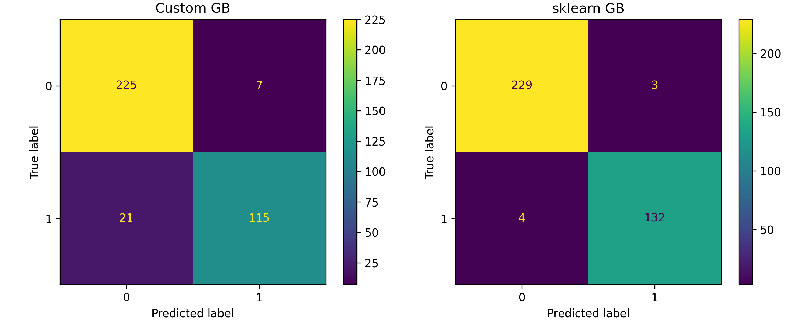

# Лабораторная работа №3

Работу выполнил студент группы Р4155 Чебыкин Артём

## Метод

В работе реализован **Gradient Boosting** — ансамбль деревьев решений, обучаемых последовательно. Каждое следующее дерево обучается на антиградиенте функции потерь (log-loss) по предсказаниям текущей модели. Начальное предсказание — log-odds положительного класса. На каждой итерации вычисляются остатки (разность между истинными метками и предсказанными вероятностями), и на них обучается неглубокое дерево регрессии (`DecisionTreeRegressor`). Предсказание обновляется с шагом `learning_rate`, что контролирует вклад каждого дерева и уменьшает переобучение.

Итоговое предсказание — сигмоида от суммы начального приближения и взвешенных предсказаний всех деревьев. Качество модели оценивается с помощью 5-fold стратифицированной кросс-валидации на полном датасете. В качестве базового алгоритма используется `sklearn.tree.DecisionTreeRegressor`, ансамблевая обёртка реализована самостоятельно.

## Датасет

В качестве датасета для решения задачи бинарной классификации выбран **Horse Colic dataset**. Датасет содержит медицинские данные о лошадях с коликами и уже включает реальные пропущенные значения, поэтому вводить их искусственно не требуется.

Целевой признак: **выжила ли лошадь** — бинаризован из трёх исходных значений:
- `1` (выжила) → класс `0`
- `2` (погибла) / `3` (усыплена) → класс `1`

Датасет содержит смесь категориальных и числовых признаков. Типы определяются автоматически по `dtype` из `fetch_openml`:
- **19 категориальных**: surgery, age, temp_of_extremities, peripheral_pulse, mucous_membranes, capillary_refill_time, pain, peristalsis, abdominal_distension, nasogastric_tube, nasogastric_reflux, rectal_examination, abdomen, abdominocentesis_appearance, surgical_lesion и др.
- **7 числовых**: rectal_temp, pulse, respiratory_rate, nasogastric_reflux_ph, packed_cell_volume, total_protein, abdominocentesis_total_protein

Идентификатор `hospital_number` удалён из признаков. Распределение классов: выжил=0 (232), умер=1 (136). Пропущенные значения: **1927 из 9568 ячеек (20.1%)**. Перед обучением они заполнены средним (`SimpleImputer`).

## Параметры модели

| Параметр | Значение |
|:---:|:---:|
| `n_estimators` | 100 |
| `learning_rate` | 0.1 |
| `max_depth` | 3 |
| `min_samples_split` | 2 |

## Результаты

Качество модели оценено с помощью 5-fold стратифицированной кросс-валидации на полном датасете:

| Модель | Accuracy | Precision | Recall | F1 | Время (5-fold) |
|:---:|:---:|:---:|:---:|:---:|:---:|
| Custom GB | 0.8614 | 0.8636 | 0.8614 | 0.8602 | 0.299 с |
| sklearn GB | 0.8423 | 0.8457 | 0.8423 | 0.8413 | 0.281 с |

Custom GB превосходит sklearn GB по всем метрикам кросс-валидации и демонстрирует меньший разброс между фолдами. Время обучения обеих реализаций сопоставимо (~1.1×), так как обе опираются на деревья из sklearn.

## Выводы

Gradient Boosting показал среднюю CV-точность 0.8614 и F1 0.8602, что выше sklearn GB с теми же параметрами (0.8423 и 0.8413 соответственно). Разница может объясняться различиями в реализации обновления предсказаний и терминальных значений в листьях. Кросс-валидация позволяет оценить качество модели без выделения отдельной тестовой выборки, используя все данные. Время обучения обеих реализаций практически одинаково, что ожидаемо — основная вычислительная нагрузка приходится на построение деревьев из sklearn.
