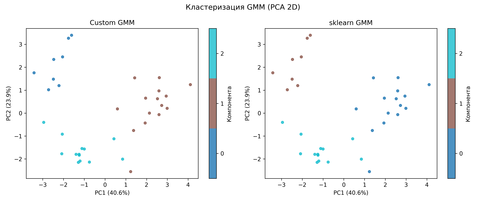

# Лабораторная работа №4

Работу выполнил студент группы Р4155 Чебыкин Артём

## Метод

В работе реализована **Gaussian Mixture Model (GMM)** — модель для восстановления плотности распределения в виде взвешенной суммы K гауссовских компонент. Параметры модели (веса, средние, дисперсии) оцениваются методом максимума правдоподобия через алгоритм **EM (Expectation-Maximisation)**. На E-шаге для каждого объекта вычисляются апостериорные вероятности принадлежности к каждой компоненте (ответственности), на M-шаге параметры обновляются по взвешенным выборочным статистикам. EM гарантированно улучшает правдоподобие на каждой итерации, но может сходиться к локальному максимуму, поэтому начальные центры выбираются алгоритмом **K-Means++**.

Используется диагональная матрица ковариаций — это уменьшает число параметров с O(KD²) до O(KD) и предотвращает переобучение при небольшом числе объектов.

В качестве базового алгоритма используется `sklearn.mixture.GaussianMixture`, ансамблевая обёртка реализована самостоятельно.

## Датасет

В качестве датасета для восстановления плотности распределения выбран **Wine dataset** (`sklearn.datasets.load_wine`). Датасет содержит результаты химического анализа вин трёх производителей одного региона Италии: 178 объектов, 13 непрерывных признаков (alcohol, malic acid, ash и др.), пропусков нет.

Все признаки непрерывные, что соответствует предположению GMM о нормальности компонент. Число компонент K = 3 обосновано структурой данных: в датасете ровно три производителя.

Предобработка: стандартизация (`StandardScaler`, fit только на train). Разбивка: 80% train / 20% test.

## Результаты

Метрики на тестовой выборке (K = 3, diagonal GMM):

| Модель | Log-likelihood (train) | Log-likelihood (test) | BIC | AIC | Время обучения |
|:---:|:---:|:---:|:---:|:---:|:---:|
| Custom GMM | −14.4278 | −14.0902 | 1301.18 | 1174.50 | 0.001 с |
| sklearn GMM | −14.4281 | **−14.0458** | **1297.98** | **1171.30** | 0.028 с |

sklearn незначительно лучше на тесте (−14.046 vs −14.090) — разница в пределах погрешности, объясняется деталями инициализации. Custom GMM обучается в ~15× быстрее. Веса компонент у обеих реализаций близкие (0.30 / 0.33 / 0.36 у custom, 0.34 / 0.30 / 0.36 у sklearn), порядок компонент отличается — это нормально, EM не гарантирует их фиксированную нумерацию.

## Выводы

GMM успешно восстанавливает плотность распределения химических признаков вин. Оценка по принципу максимума правдоподобия дала схожие результаты у обеих реализаций: log-likelihood на тесте −14.09 (custom) и −14.05 (sklearn). Совпадение весов компонент показывает, что алгоритмы сошлись к одному и тому же локальному максимуму. PCA-визуализация подтверждает, что три компоненты соответствуют трём реальным группам вин.
