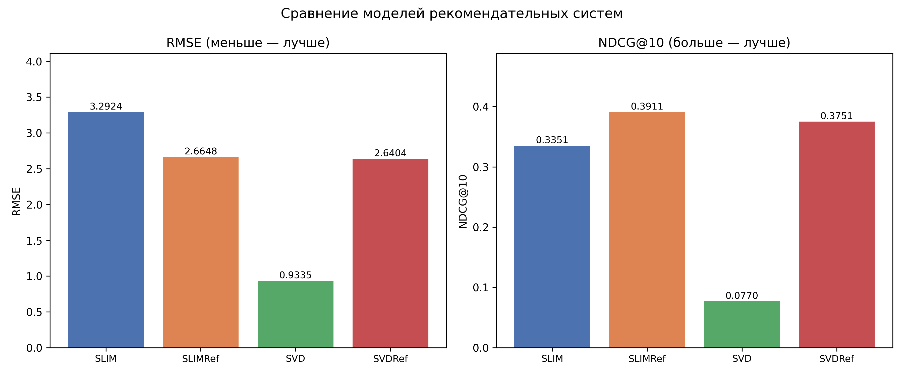

# Лабораторная работа №5

Работу выполнил студент группы Р4155 Чебыкин Артём

## Алгоритмы

**SLIM** (custom) — реализован через EASE (Steck, 2019). Идея: найти item-item матрицу весов W так, чтобы R · W восстанавливала исходную матрицу рейтингов, при этом предмет не ссылается на себя (диагональ нулевая). В отличие от классического SLIM, решение ищется в закрытой форме через инверсию матрицы, а не итеративно.

**SLIMRef** (эталон) — классический SLIM (Ning & Karypis, 2011), реализован через sklearn ElasticNet. Для каждого предмета отдельно решается задача регрессии рейтингов на остальные предметы с ограничением на неотрицательность весов и нулевой диагональю. Алгоритмически совпадает с [KarypisLab/SLIM](https://github.com/KarypisLab/SLIM).

**SVD** (custom) — матричная факторизация (Funk SVD). Матрица рейтингов раскладывается на латентные факторы пользователей и предметов, которые обучаются стохастическим градиентным спуском только по наблюдаемым рейтингам.

**SVDRef** (эталон) — усечённое SVD из sklearn. Разлагает всю матрицу рейтингов (включая нули) аналитически.

## Датасет

MovieLens 100K: 100 000 рейтингов (1–5) от 943 пользователей на 1 682 фильма. Разбивка: 80% train / 20% test, random_state=42.

## Метрики

**RMSE** — среднеквадратичная ошибка предсказания рейтинга на тестовых оценках.

**NDCG@10** — качество ранжирования топ-10 рекомендаций. Модель предлагает каждому пользователю 10 фильмов (уже оценённые в train исключаются). Чем выше в списке оказываются фильмы с высоким реальным рейтингом, тем лучше. Фильм на первом месте важнее фильма на десятом — вклад позиции логарифмически убывает.

## Результаты

| Модель | RMSE | NDCG@10 | Время |
|:---:|:---:|:---:|:---:|
| **SLIM** | 3.2924 | 0.3351 | 1.17 с |
| SLIMRef | 2.6648 | 0.3911 | 27.55 с |
| **SVD** | 0.9335 | 0.0770 | 8.00 с |
| SVDRef | 2.6404 | 0.3751 | 0.50 с |

## Сравнение с эталонами

**SLIM vs SLIMRef:** SLIM уступает по RMSE (3.29 vs 2.66) и NDCG@10 (0.335 vs 0.391), но работает в 24× быстрее (1.17 с vs 27.55 с). SLIMRef с L1-штрафом даёт разреженную матрицу весов и неотрицательные коэффициенты, что лучше подходит для ранжирования. SLIM с плотной матрицей весов точнее не восстанавливает рейтинги.

**SVD vs SVDRef:** SVD лучше по RMSE (0.93 vs 2.64), поскольку SGD обучается только на наблюдаемых рейтингах и не смещается к нулю. SVDRef разлагает всю матрицу включая нули, из-за чего RMSE выше, зато NDCG@10 лучше (0.375 vs 0.077): глобальная структура разложения точнее отражает предпочтения пользователей.

## Выводы

По RMSE лидирует SVD (0.93). По NDCG@10 — SLIMRef (0.391), SLIM сопоставим (0.335) при в 24× меньшем времени обучения. Это типичный trade-off: SVD точнее предсказывает конкретные рейтинги, item-item методы лучше ранжируют предметы для рекомендации.
