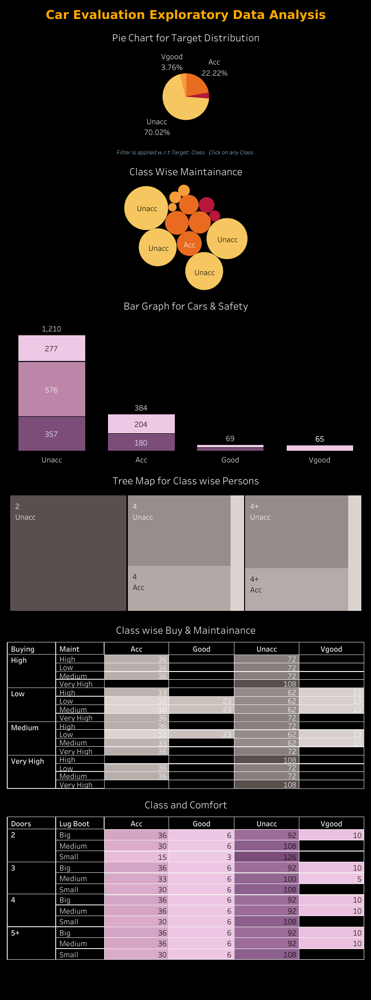

# Лабораторная работа №2. Ансамбли моделей

В рамках лабораторной работы предстоит реализовать метод случайных подпространств (`RSM`) или `Random Forest`.

В качестве базовых алгоритмов рекомендуется использовать библиотечные реализации.

## Задание

1. Выбрать датасет для анализа.
2. Реализовать метод случайных подпространств (`RSM`) или `Random Forest`.
3. Обучить ансамбль, подобрать оптимальные гипер-параметры. Для подбора оптимальных параметров использовать `grid search` из `sklearn`; Оптимальные параметры подбирать по `OOB`.
4. Получить оценку важности признаков через `OOB^j`.
5. Сравнить результаты с эталонными реализациями из библиотеки [scikit-learn](https://scikit-learn.org/stable/):
    - точность модели,
    - время обучения.
6. Подготовить отчет, включающий:
    - описание выбранного метода,
    - описание датасета,
    - результаты экспериментов,
    - сравнение с эталонными реализациями,
    - выводы.

## Решение

1. Описание выбранного метода

**Random Forest** (случайный лес) - это ансамблевый метод машинного обучения, который строит множество деревьев решений на случайных подвыборках данных и случайных наборах признаков, а затем объединяет их предсказания: для классификации используется голосование большинства, а для регрессии - усреднение результатов. Такой подход снижает вероятность переобучения, повышает устойчивость модели к шуму и обычно обеспечивает более высокую точность по сравнению с одним деревом решений.

Когда строится каждое дерево, данные выбираются случайно с возвращением, поэтому часть объектов (примерно 38%) остаётся вне выборки. Эти объекты и называются `OOB`. Их можно использовать как встроенную «тестовую» выборку без отдельного `validation set`.

Чтобы получить оценку важности признаков через `OOB^j` выполняем следующие шаги:
- считаем обычную `OOB-ошибку`,
- затем случайно перемешиваем значения признака `j` у `OOB-объектов`,
- снова считаем `OOB-ошибку`,
- если ошибка сильно выросла - признак важный,
- если почти не изменилась - признак мало влияет на модель

Формально важность признака - это увеличение ошибки после перемешивания признака. Чем больше разница, тем важнее признак для предсказаний `Random Forest`.

2. Описание датасета [Car Evaluation Data Set](https://www.kaggle.com/datasets/elikplim/car-evaluation-data-set)



3. Результаты экспериментов

- Результаты без подбора оптимальных гипер-параметров:

| Metric        | Value |
|---------------|------:|
| Accuracy      | 0.83  |

| Class    | Precision | Recall | F1-score | Support |
|----------|----------:|-------:|---------:|--------:|
| Class 0  | 0.61      | 0.71   | 0.66     | 77      |
| Class 1  | 0.00      | 0.00   | 0.00     | 14      |
| Class 2  | 0.91      | 0.96   | 0.93     | 242     |
| Class 3  | 0.00      | 0.00   | 0.00     | 13      |

- Результаты с подбором оптимальных гипер-параметров:

| Metric        | Value |
|---------------|------:|
| Accuracy      | 0.97  |

| Class    | Precision | Recall | F1-score | Support |
|----------|----------:|-------:|---------:|--------:|
| Class 0  | 0.91      | 0.97   | 0.94     | 77      |
| Class 1  | 0.83      | 0.71   | 0.77     | 14      |
| Class 2  | 1.00      | 0.99   | 0.99     | 242     |
| Class 3  | 1.00      | 1.00   | 1.00     | 13      |

4. Сравнение с эталонными реализациями

- Custom model

**Training time**: 0.0781 sec

| Metric        | Value |
|---------------|------:|
| Accuracy      | 0.82  |

| Class    | Precision | Recall | F1-score | Support |
|----------|----------:|-------:|---------:|--------:|
| Class 0  | 0.59      | 0.57   | 0.58     | 77      |
| Class 1  | 0.00      | 0.00   | 0.00     | 14      |
| Class 2  | 0.86      | 0.96   | 0.91     | 242     |
| Class 3  | 0.00      | 0.00   | 0.00     | 13      |

- Sklearn model

**Training time**: 0.0856 sec

| Metric        | Value |
|---------------|------:|
| Accuracy      | 0.87  |

| Class    | Precision | Recall | F1-score | Support |
|----------|----------:|-------:|---------:|--------:|
| Class 0  | 0.68      | 0.77   | 0.72     | 77      |
| Class 1  | 0.00      | 0.00   | 0.00     | 14      |
| Class 2  | 0.93      | 0.99   | 0.96     | 242     |
| Class 3  | 1.00      | 0.08   | 0.14     | 13      |

5. Выводы

В ходе работы был реализован ансамблевый метод `Random Forest` и проведено его сравнение с эталонной реализацией из `sklearn`. Эксперименты показали, что качество модели существенно зависит от подбора гиперпараметров: без оптимизации модель демонстрирует заметно более низкую точность (`accuracy` ≈ 0.83), а также слабое качество на редких классах, тогда как после подбора параметров по `OOB-оценке` качество значительно возрастает (`accuracy` ≈ 0.97), а метрики `precision` и `recall` становятся более сбалансированными для всех классов.

Сравнение с реализацией `sklearn` показало, что библиотечная версия обладает более высокой стабильностью и обобщающей способностью при сопоставимых гиперпараметрах, что выражается в более высоком `accuracy` (≈ 0.87 против ≈ 0.82 у кастомной модели без тюнинга). При этом время обучения кастомной реализации и `sklearn` сопоставимо, однако `sklearn` остаётся более оптимизированным за счёт низкоуровневой реализации и внутренней оптимизации вычислений.

## Команды

```bash
python ./source/data_loader.py  # Загрузка данных
python ./source/main.py \       # Запуск обучения:
    --use-grid-search yes \     # с подбором гипер-параметров
    --use-custom-model yes \    # с custom/sklearn моделью
    --set-timer yes             # с замером времени
```
