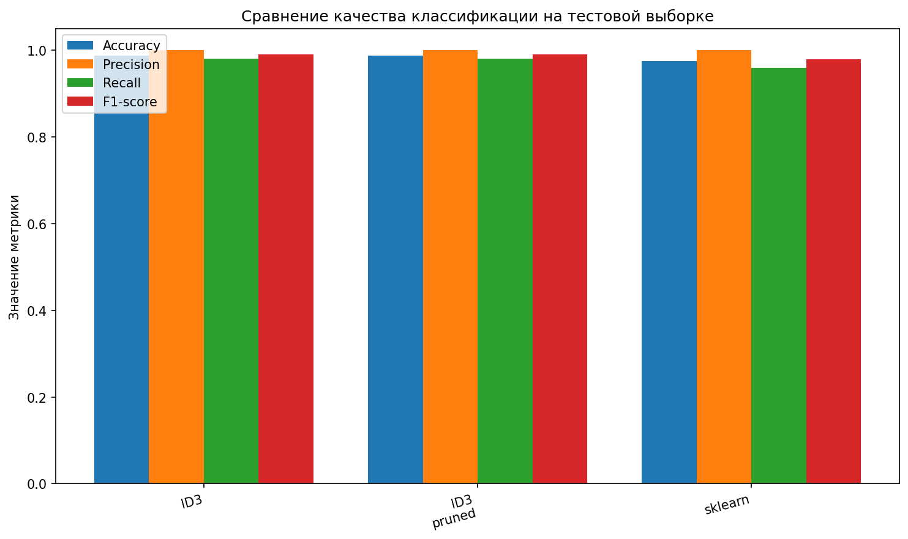
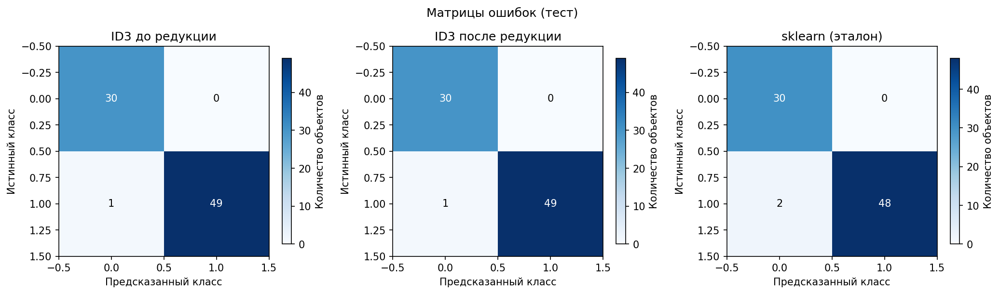
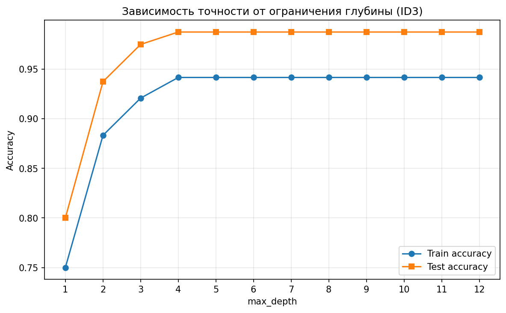
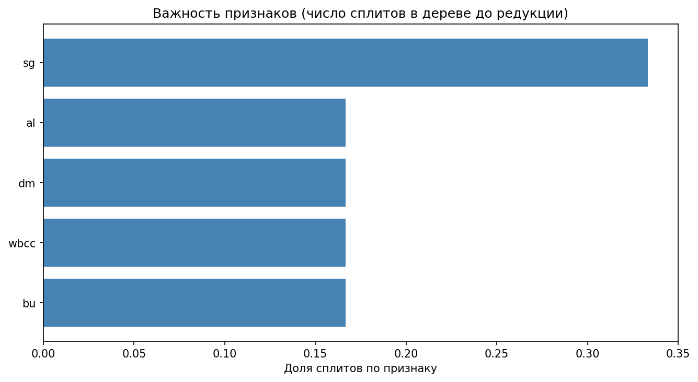

# Лабораторная работа №1. Логическая классификация

## Задание

1. выбрать датасет для классификации, например на kaggle;
    - датасет должен содержать пропуски;
    - датасет должен содержать категориальные и количественные признаки;
2. реализовать алгоритм построения дерева ID3 с критерием Джини;
3. реализовать обработку пропущенных значений через оценку вероятности;
4. обучить дерево на выбранном датасете;
5. оценить качество классификации;
6. реализовать алгоритм редукции дерева;
7. сравнить качество классификации и регрессии до и после редукции дерева;
8. сравнить с эталонной реализацией бинарного решающего дерева;
    - сравнить качество работы;
9. подготовить небольшой отчет о проделанной работе.

## Датасет

Chronic Kidney Disease ([UCI ML Repository, id 336](https://archive.ics.uci.edu/dataset/336/chronic+kidney+disease)): прогноз наличия хронической болезни почек (`ckd`) против `notckd`.

- Объём: 400 объектов (после фильтрации некорректной метки класса); разбиение: train 240, val 80, test 80 (`random_state=42`, стратификация).
- Числовые признаки (14): `age`, `bp`, `sg`, `al`, `su`, `bgr`, `bu`, `sc`, `sod`, `pot`, `hemo`, `pcv`, `wbcc`, `rbcc`.
- Категориальные (10): `rbc`, `pc`, `pcc`, `ba`, `htn`, `dm`, `cad`, `appet`, `pe`, `ane`.
- Целевой признак: `1` = CKD, `0` = not CKD.
- Пропуски: присутствуют во многих полях.

## Структура проекта

```
lab1/
├── README.md
├── requirements.txt
├── artifacts/               # после запуска main.py
│   ├── metrics_comparison.png
│   ├── confusion_matrices.png
│   ├── accuracy_vs_depth.png
│   ├── feature_importance.png
│   └── tree_rules.txt
└── source/
    ├── main.py
    ├── data.py
    ├── sklearn_baseline.py
    ├── plots.py
    ├── tree_rules.py
    └── tree/                 # узел, построение, REP, метрики структуры
        ├── __init__.py
        ├── node.py
        ├── decision_tree.py
        ├── pruning.py
        └── stats.py
```

## Реализация

### ID3 и критерий Джини

Классический ID3 опирается на прирост информации (энтропию) и часто задаёт мультифакторное ветвление по всем значениям категориального признака. В данной работе используется критерий Джини и на каждом шаге выбирается одно бинарное разбиение с максимальным уменьшением неопределённости Джини в родителе:

- числовые признаки — пороги посередине между соседними отсортированными значениями (бинаризация непрерывных через пороги)
- категориальные — ветви «значение равно $v$» / «не равно $v$».

### Пропуски и вероятность

Обучение: при расчёте прироста для признака объекты с `NaN` в этом признаке не участвуют; в дочерние узлы попадают только объекты с известным значением признака сплита.
Предсказание: если в узле значение признака сплита отсутствует, рекурсивно получают классы $c_L$ и $c_R$ в левом и правом поддереве.

Доли объектов обучения в узле с известным значением признака сплита, ушедшие влево и вправо ($n$ — число объектов в узле, $n_L$, $n_R$ — среди них с непропущенным признаком):

$$
w_L = \frac{n_L}{n}, \qquad w_R = \frac{n_R}{n}
$$

Нормировка весов ветвей (чтобы $q_L + q_R = 1$):

$$
q_L = \frac{w_L}{w_L + w_R}, \qquad q_R = \frac{w_R}{w_L + w_R}
$$

Если $w_L + w_R = 0$, полагают $q_L = q_R = \frac{1}{2}$.

Вектор счётов по классам: к индексу класса $c_L$ добавляют $q_L$, к $c_R$ — $q_R$; итоговый класс — $\mathrm{argmax}$ по этому вектору. Так трактуется смешивание предсказаний дочерних ветвей по условным вероятностям направления при неизвестном значении признака в узле.

### Редукция (REP)

Для каждого узла ошибка поддерева и ошибка замены на лист считаются только на подвыборке валидации, попавшей в узел по маске `reach_mask`: объект попадает в левого или правого потомка, только если значение признака сплита известно. При пропуске на этом сплите объект не передаётся в маски потомков. Так REP согласован с идеей «ошибка в узле — только на релевантных объектах».

### Эталон sklearn

`SimpleImputer(median)` для числовых столбцов, `OneHotEncoder` для категориальных, затем `DecisionTreeClassifier(criterion='gini', random_state=42)`.

## Результаты

### Валидация (связь с REP)

| Модель | Accuracy | Precision | Recall | F1 |
|--------|----------|-----------|--------|-----|
| ID3 до редукции | 0.975 | 1.000 | 0.960 | 0.980 |
| ID3 после редукции | 0.975 | 1.000 | 0.960 | 0.980 |
| sklearn | 0.975 | 1.000 | 0.960 | 0.980 |

### Тест

| Модель | Accuracy | Precision | Recall | F1 |
|--------|----------|-----------|--------|-----|
| ID3 до редукции | 0.988 | 1.000 | 0.980 | 0.990 |
| ID3 после редукции | 0.988 | 1.000 | 0.980 | 0.990 |
| sklearn | 0.975 | 1.000 | 0.960 | 0.980 |

### Структура дерева (узлы / листья / макс. глубина)

| Этап | Узлы | Листья | Глубина |
|------|------|--------|---------|
| До редукции | 13 | 7 | 6 |
| После редукции | 9 | 5 | 4 |

Редукция упростила дерево без изменения метрик на этом разбиении val/test.

### Матрица ошибок: TN, FP, FN, TP (положительный класс CKD = 1)

Строка матрицы — истинный класс, столбец — предсказанный (`0`, `1`).

| Модель | TN | FP | FN | TP |
|--------|----|----|----|-----|
| ID3 до редукции | 30 | 0 | 1 | 49 |
| ID3 после редукции | 30 | 0 | 1 | 49 |
| sklearn | 30 | 0 | 2 | 48 |



*Рис. 1. Столбчатая диаграмма метрик accuracy, precision, recall и F1 для ID3 до/после редукции и эталона sklearn на тестовой выборке.*



*Рис. 2. Матрицы ошибок на тесте: собственное дерево до редукции, после редукции и `sklearn` (строка — истинный класс, столбец — предсказанный).*



*Рис. 3. Train- и test-accuracy при ограничении `max_depth` для собственного дерева (`random_state` данных без изменений).*



*Рис. 4. Относительная частота использования признаков в сплитах дерева **до** редукции (нормированные доли).*

### Примеры правил после редукции

(полный список — в `artifacts/tree_rules.txt`)

1. ЕСЛИ `al == 0.0` И `dm == 'no'` И `sg == 1.01` → класс 1 (CKD).
2. ЕСЛИ `al == 0.0` И `dm == 'no'` И `sg != 1.01` И `sg == 1.015` → класс 1.
3. ЕСЛИ `al == 0.0` И `dm == 'no'` И `sg != 1.01` И `sg != 1.015` → класс 0.
4. ЕСЛИ `al == 0.0` И `dm != 'no'` → класс 1.
5. ЕСЛИ `al != 0.0` → класс 1.

## Анализ результатов

1. Собственное дерево vs sklearn: эталон заполняет пропуски медианой и кодирует категории до обучения; своё дерево работает в смешанном представлении и по-другому обрабатывает пропуски при предсказании. На текущем сплите ID3 чуть выше по accuracy/recall на тесте; у sklearn на тесте на один объект больше FN.
2. Роль pruning: REP уменьшил число узлов и глубину при тех же метриках на val и test — упрощение структуры без потери качества на этих данных.
3. Глубина: график `accuracy_vs_depth` показывает влияние ограничения глубины на переобучение и обобщение.

## Выводы

1. Реализованы жадное построение дерева с критерием Джини и бинарными сплитами, вероятностная обработка пропусков при предсказании (нормированные веса ветвей) и REP с маской валидационных объектов в узле.
2. Качество сопоставимо с эталоном sklearn; на тесте при данном `random_state` собственная модель даёт меньше ошибок второго рода (FN). Интерпретируемость усилена за счёт явных правил IF-THEN и текстового дерева.
