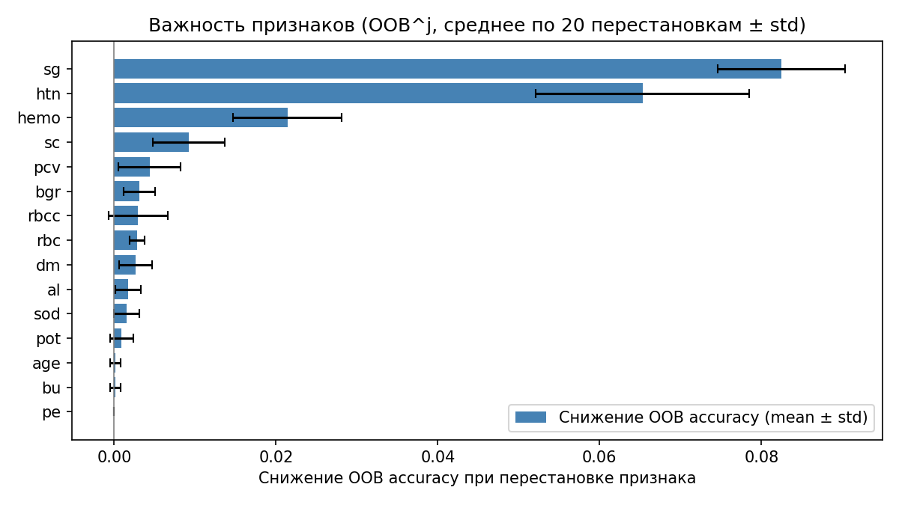
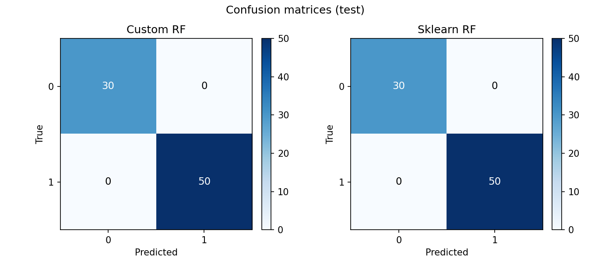
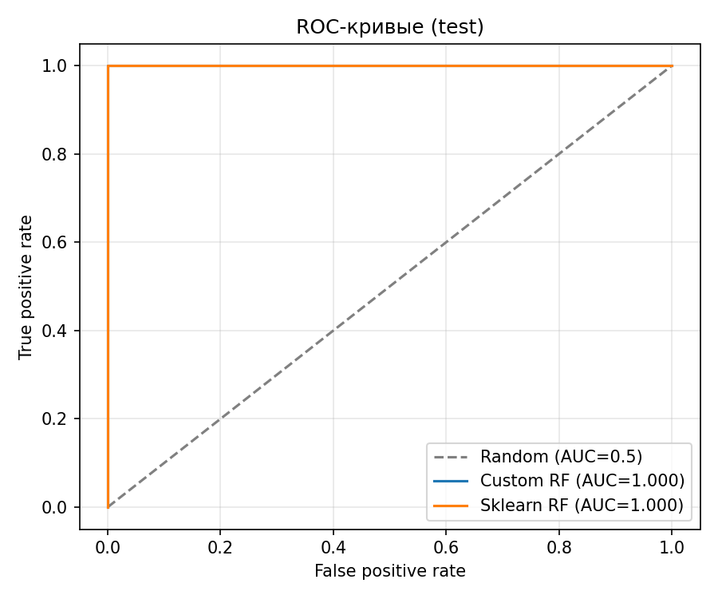
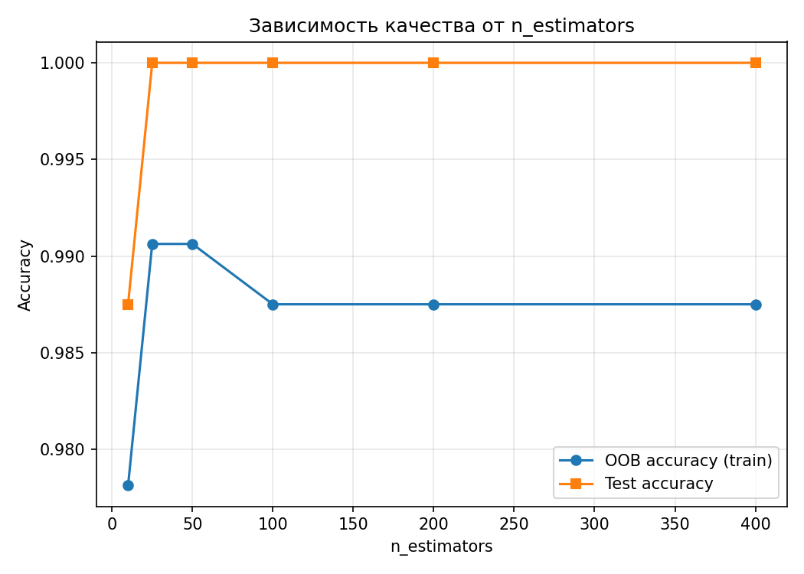

# Лабораторная работа №2. Ансамбли моделей

## Задание

1. Выбрать датасет для анализа;
2. Реализовать метод случайных подпространств (RSM) или Random Forest;
3. Обучить ансамбль, подобрать оптимальные гипер-параметры. Для подбора оптимальных параметров использовать grid search из sklearn; Оптимальные параметры подбирать по OOB;
4. Получить оценку важности признаков через OOB^j
5. Сравнить результаты с эталонными реализациями из библиотеки [scikit-learn](https://scikit-learn.org/stable/):
    * точность модели;
    * время обучения;
6. Подготовить отчет, включающий:
    * описание выбранного метода;
    * описание датасета;
    * результаты экспериментов;
    * сравнение с эталонными реализациями;
    * выводы.

## Метод

Random Forest - ансамбль деревьев с двумя источниками случайности: бутстрап-выборка для каждого дерева и случайное подмножество признаков при расщеплениях (`max_features`). Итоговое предсказание — усреднение вероятностей по деревьям (`predict_proba` -> argmax).

OOB (out-of-bag): для каждого объекта учитываются только те деревья, в бутстрапе которых этот объект ни разу не попал. По их `predict_proba` суммируются вероятности классов, нормируются по строке, затем выбирается класс с максимальной суммой. OOB accuracy - это доля верных меток среди объектов, для которых есть хотя бы одно OOB-голосование.

OOB^j: для каждого признака `j` значения столбца `j` случайно переставляются по объектам, OOB accuracy пересчитывается тем же лесом. Важность = `baseline_OOB - mean(OOB_after_permutation_j)` по повторам (чем больше, тем сильнее признак влияет на OOB-качество).

## Датасет

Chronic Kidney Disease — [UCI Machine Learning Repository, id=336](https://archive.ics.uci.edu/dataset/336/chronic+kidney+disease). Загрузка через `ucimlrepo.fetch_ucirepo(id=336)`.

- 400 объектов, 24 признака после кодирования: 14 числовых (`age`, `bp`, `sg`, `al`, `su`, `bgr`, `bu`, `sc`, `sod`, `pot`, `hemo`, `pcv`, `wbcc`, `rbcc`) и 10 бинарных (`rbc`, `pc`, `pcc`, `ba`, `htn`, `dm`, `cad`, `appet`, `pe`, `ane`).
- Целевая переменная `class`: ckd -> 1, notckd -> 0 (метки `ckd\t` в исходнике нормализуются). Распределение: 248/152 (CKD/не CKD).
- Пропусков много (до ~38% в отдельных столбцах). После `train_test_split` применяется `SimpleImputer(strategy="median")`, обученный только на train.
- Разбиение: 80% train / 20% test, стратификация по классу, по умолчанию `random_state=42`.

## Реализация и эксперименты

### Сетка гиперпараметров (OOB на train)

| Параметр            | Значения                |
| ------------------- | ----------------------- |
| `n_estimators`      | 50, 100, 200            |
| `max_features`      | `"sqrt"`, `"log2"`, 0.5 |
| `max_depth`         | `None`, 8, 12           |
| `min_samples_split` | 2, 5                    |

Всего 54 комбинации, лучшая — по OOB accuracy кастомного леса на train. Все строки сетки — в [artifacts/grid_results.csv](artifacts/grid_results.csv).

### Лучшая конфигурация по OOB

| Параметр            | Значение |
| ------------------- | -------- |
| `n_estimators`      | 50       |
| `max_features`      | `sqrt`   |
| `max_depth`         | `None`   |
| `min_samples_split` | 2        |

- Лучший OOB на сетке (custom, train): **0.9906**
- OOB после финального fit (custom, train): **0.9906**
- OOB sklearn (train) с теми же параметрами: **0.9906**

### Сравнение с эталоном sklearn (тестовая выборка, 80 объектов)

| Модель | Accuracy | Precision | Recall | F1 | ROC-AUC | Время обучения (5×, mean ± std), с |
| ------ | -------- | --------- | ------ | -- | ------- | ------------------------------------ |
| Custom RF | 1.0000 | 1.0000 | 1.0000 | 1.0000 | 1.0000 | 0.0535 ± 0.0024 |
| Sklearn RF | 1.0000 | 1.0000 | 1.0000 | 1.0000 | 1.0000 | 0.0769 ± 0.0011 |
| Dummy (most_frequent) | 0.6250 | 0.6250 | 1.0000 | 0.7692 | 0.5000 | 0.0002 ± 0.0000 |

На этом датасете и при данном разбиении обе модели дают идеальную тестовую точность. При другом `random_state` возможны небольшие ошибки (задача сильно разделима, тест мал). Baseline по accuracy 0.625 — доля мажоритарного класса CKD.

### Важность признаков (OOB^j, mean ± std по 20 перестановкам)

Топ-5 (тот же запуск):

1. `sg` — 0.0825 ± 0.0079
2. `htn` — 0.0653 ± 0.0132
3. `hemo` — 0.0214 ± 0.0067
4. `sc` — 0.0092 ± 0.0045
5. `pcv` — 0.0044 ± 0.0039

### Графики









## Структура проекта

```
lab2/
├── README.md
├── requirements.txt
├── artifacts/
│   ├── best_params.json
│   ├── grid_results.csv
│   ├── run_summary.md
│   ├── oob_permutation_importance.png
│   ├── confusion_matrices.png
│   ├── roc_curves.png
│   └── learning_curve.png
└── source/
    ├── main.py
    ├── data.py
    ├── random_forest.py
    └── plots.py
```

## Выводы

1. Реализован Random Forest на базе `DecisionTreeClassifier` с OOB для каждого дерева и `predict_proba` для согласования со sklearn.
2. Подбор через `ParameterGrid` по OOB не требует отдельной валидационной выборки. Полная сетка сохраняется в CSV.
3. OOB^j с усреднением по перестановкам даёт устойчивый ранг признаков. Для CKD наиболее информативны `sg` (удельный вес мочи), `htn` (гипертония) и `hemo` (гемоглобин).
4. Качество и время обучения кастомной реализации сопоставимы с `sklearn.ensemble.RandomForestClassifier` при `n_jobs=1`, sklearn обычно немного медленнее из-за большей внутренней тяжести при том же числе деревьев.