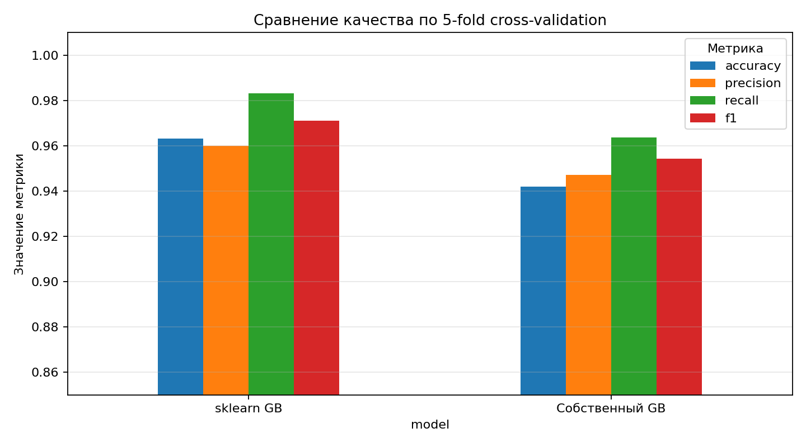
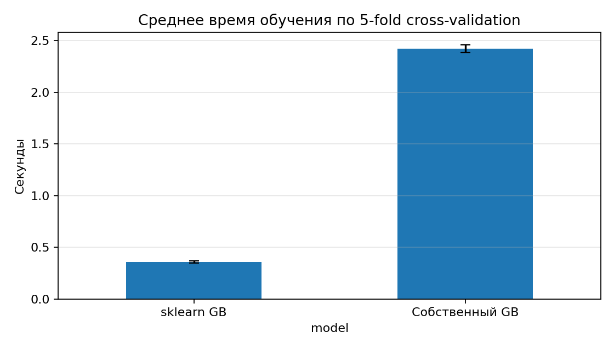
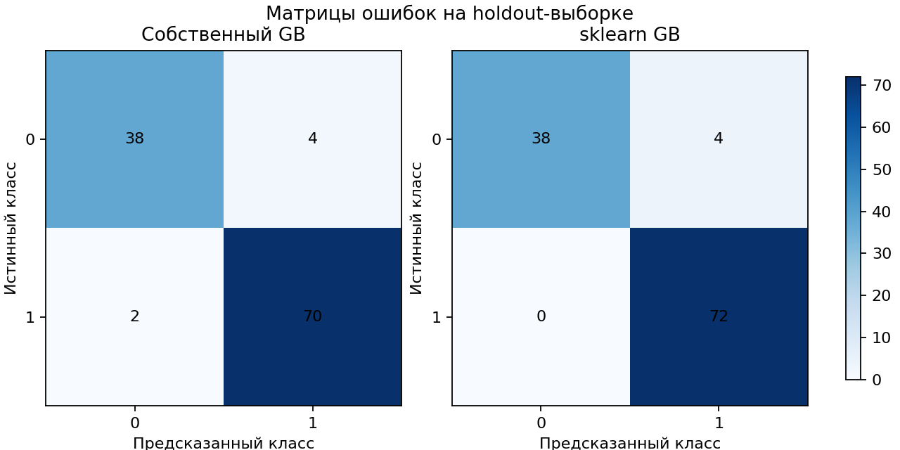
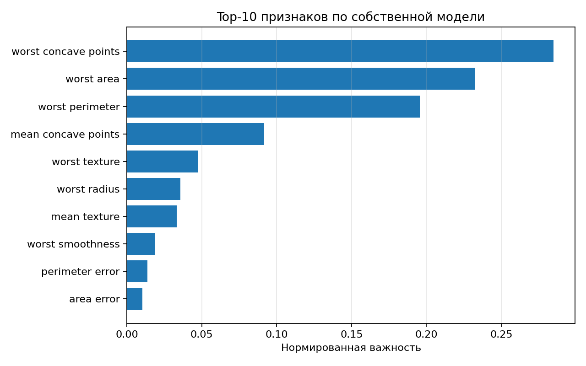

# Лабораторная работа №3. Градиентный бустинг

В рамках данной лабораторной работы предстоит реализовать алгоритм градиентного бустинга и сравнить его с эталонной реализацией из библиотеки `scikit-learn`.

## Задание

1. Выбрать датасет для анализа, например, на [kaggle](https://www.kaggle.com/datasets).
2. Реализовать алгоритм градиентного бустинга.
3. Обучить модель на выбранном датасете.
4. Оценить качество модели с использованием кросс-валидации.
5. Замерить время обучения модели.
6. Сравнить результаты с эталонной реализацией из библиотеки [scikit-learn](https://scikit-learn.org/stable/):
  - точность модели;
  - время обучения.
7. Подготовить отчет, включающий:
  - описание алгоритма градиентного бустинга;
  - описание датасета;
  - результаты экспериментов;
  - сравнение с эталонной реализацией;
  - выводы.

## Датасет

Использован Breast Cancer Wisconsin из `sklearn.datasets.load_breast_cancer`.

- Объекты: 569.
- Признаки: 30 числовых характеристик клеточных ядер.
- Целевой признак: `0` — malignant, `1` — benign.
- Баланс классов: malignant — 212, benign — 357.

## Структура проекта

```text
lab3/
├── README.md
├── artifacts/
│   ├── confusion_matrices.png
│   ├── cv_results.csv
│   ├── cv_summary.csv
│   ├── feature_importance.png
│   ├── fit_time.png
│   ├── metrics_comparison.png
│   └── run_summary.md
└── source/
    ├── __init__.py
    ├── gradient_boosting.py
    └── main.py
```

## Реализация

Собственная модель `GradientBoostingBinaryClassifier` реализует бинарный градиентный бустинг для логистической функции потерь.

Алгоритм:

1. Начальное приближение задаётся логитом доли положительного класса:

$$
F_0 = \log \frac{p}{1 - p}
$$

2. На каждой итерации считаются вероятности:

$$
\hat{p}_i = \sigma(F(x_i))
$$

3. Псевдоостатки для логистической функции потерь:

$$
r_i = y_i - \hat{p}_i
$$

4. На псевдоостатках обучается самописное CART-подобное регрессионное дерево с критерием уменьшения суммы квадратов ошибок.

5. Композиция обновляется с learning rate:

$$
F_m(x) = F_{m-1}(x) + \eta h_m(x)
$$

6. Класс выбирается по порогу `0.5` для вероятности положительного класса.

Эталонная модель — `sklearn.ensemble.GradientBoostingClassifier` с теми же основными гиперпараметрами: `n_estimators=100`, `learning_rate=0.15`, `max_depth=3`, `min_samples_split=8`, `min_samples_leaf=5`.

## Результаты

Оценка проводилась с помощью стратифицированной 5-fold cross-validation (`random_state=42`). Время — время обучения модели на одном фолде.


| Модель         | Accuracy        | Precision       | Recall          | F1              | Fit time, sec |
| -------------- | --------------- | --------------- | --------------- | --------------- | ------------- |
| Собственный GB | 0.9420 ± 0.0281 | 0.9472 ± 0.0428 | 0.9635 ± 0.0367 | 0.9543 ± 0.0218 | 2.422 ± 0.037 |
| sklearn GB     | 0.9631 ± 0.0209 | 0.9600 ± 0.0321 | 0.9832 ± 0.0182 | 0.9711 ± 0.0161 | 0.359 ± 0.009 |


На holdout-разбиении 80/20:


| Модель         | Accuracy | Precision | Recall | F1     | Fit time, sec |
| -------------- | -------- | --------- | ------ | ------ | ------------- |
| Собственный GB | 0.9474   | 0.9459    | 0.9722 | 0.9589 | 2.342         |
| sklearn GB     | 0.9649   | 0.9474    | 1.0000 | 0.9730 | 0.348         |




*Рис. 1. Средние значения accuracy, precision, recall и F1 по 5-fold cross-validation.*



*Рис. 2. Среднее время обучения на одном фолде.*



*Рис. 3. Матрицы ошибок на holdout-выборке.*



*Рис. 4. Top-10 признаков по накопленному уменьшению ошибки в собственных деревьях.*

## Анализ результатов

Собственная реализация показывает качество, близкое к эталонной. Основной разрыв ожидаем: `sklearn` использует более оптимизированную и зрелую реализацию деревьев и бустинга, а собственная модель намеренно ограничена понятной реализацией CART-деревьев над псевдоостатками.

По времени обучения собственная реализация оказалась медленнее. Узкое место — построение большого числа самописных деревьев и перебор порогов в Python/NumPy, тогда как эталонная модель использует оптимизированный код библиотеки.

## Выводы

1. Реализован градиентный бустинг для бинарной классификации с логистической функцией потерь и самописными регрессионными деревьями.
2. Модель обучена на датасете Breast Cancer Wisconsin и оценена с помощью 5-fold cross-validation.
3. Собственная реализация уступает `sklearn` по качеству и времени, но демонстрирует сопоставимое качество классификации и корректную работу алгоритма бустинга.

