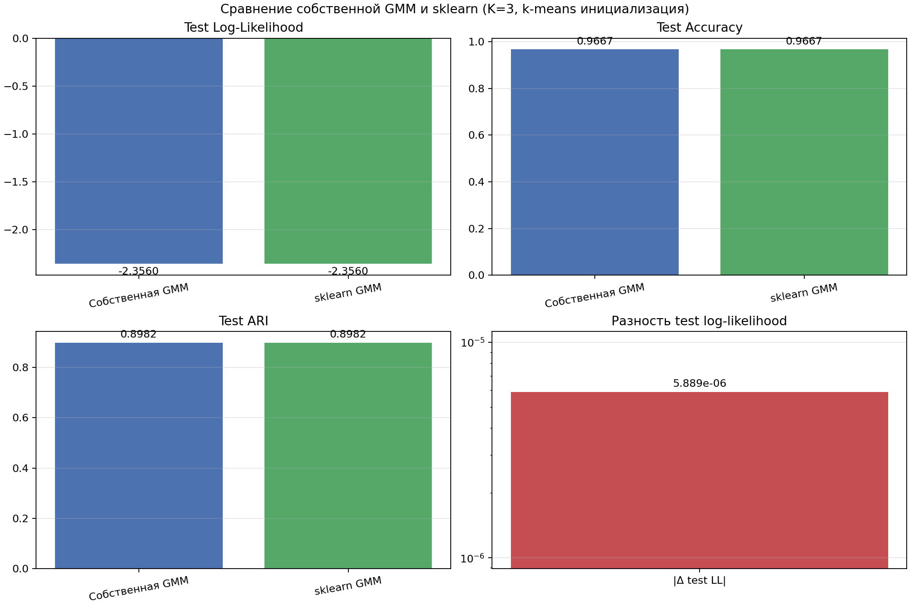
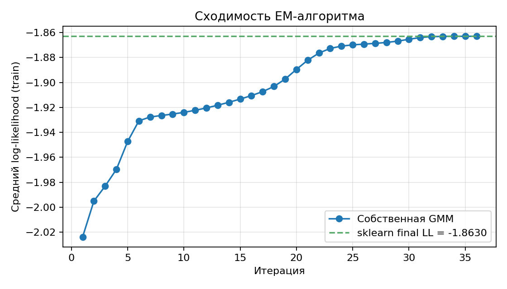
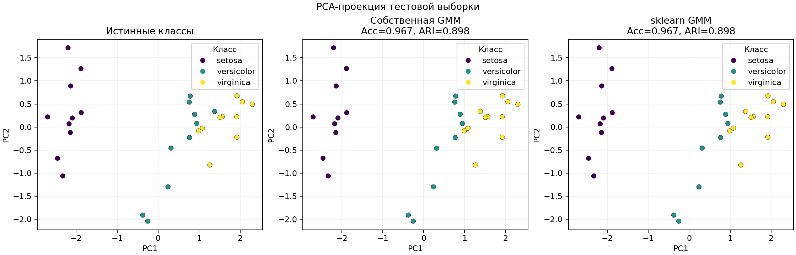
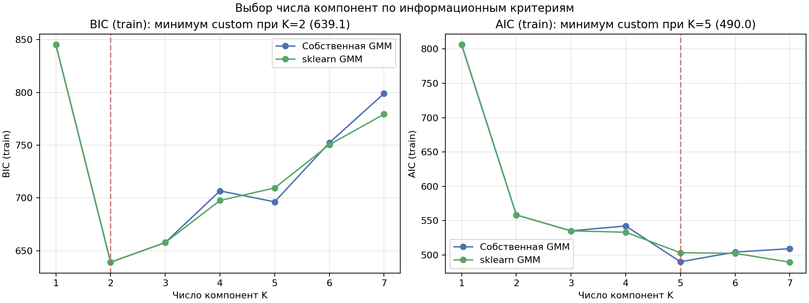
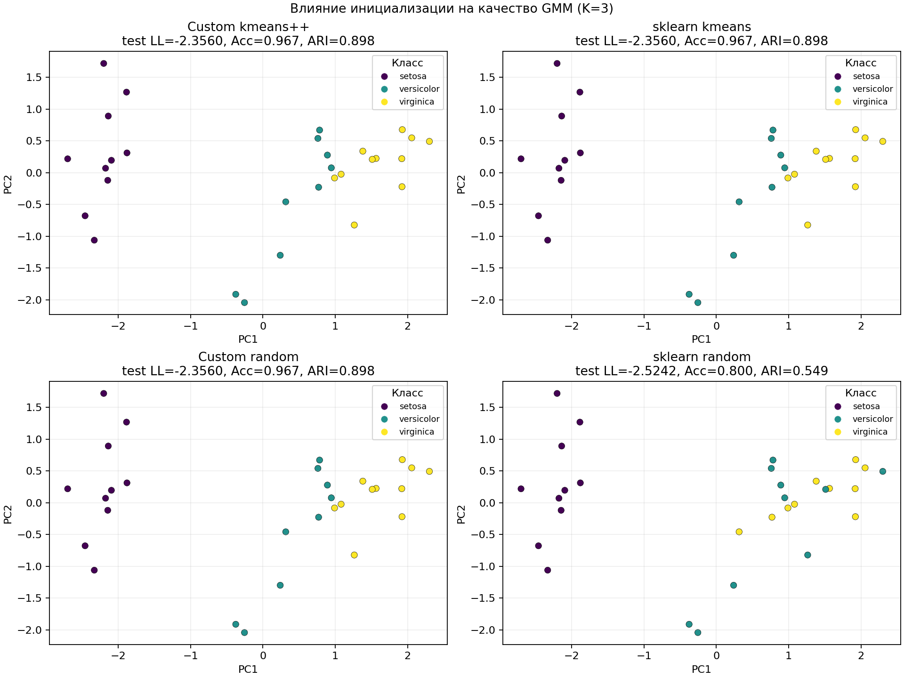

# Лабораторная работа №4. EM-алгоритм

В рамках данной лабораторной работы предстоит реализовать EM-алгоритм и сравнить его с эталонной реализацией из библиотеки `scikit-learn`.

## Задание

1. Выбрать датасет для восстановления плотности распределения, например, на [kaggle](https://www.kaggle.com/datasets).
2. Реализовать GMM.
3. Обучить модель на выбранном датасете.
4. Оценить качество модели через ПМП.
5. Сравнить результаты с эталонной реализацией из библиотеки [scikit-learn](https://scikit-learn.org/stable/):
  - точность модели;
6. Подготовить отчет, включающий:
  - описание наивного байесовского классификатора;
  - описание датасета;
  - результаты экспериментов;
  - сравнение с эталонной реализацией;
  - выводы.

## Датасет

Использован Iris из `sklearn.datasets.load_iris`.

- Объекты: 150.
- Признаки: 4 числовых измерения чашелистиков и лепестков.
- Классы: `setosa`, `versicolor`, `virginica`, по 50 объектов каждого класса.
- Пропуски отсутствуют.

## Наивный байесовский классификатор

Наивный байесовский классификатор (Naive Bayes) основан на теореме Байеса. Для классов $C_1, \ldots, C_K$ и вектора признаков $x$:

$$
P(C_k | x) = \frac{p(x | C_k) \cdot P(C_k)}{p(x)}.
$$

Классификатор выбирает класс с максимальной апостериорной вероятностью:

$$
\hat{y} = \arg\max_k P(C_k | x) = \arg\max_k p(x | C_k) \cdot P(C_k).
$$

«Наивное» предположение — условная независимость признаков при фиксированном классе:

$$
p(x | C_k) = \prod_{j=1}^{d} p(x_j | C_k).
$$

Это упрощает оценку плотности: вместо совместной $d$-мерной плотности достаточно оценить $d$ одномерных.

Наиболее распространённая вариация — Gaussian Naive Bayes: каждая условная плотность $p(x_j | C_k)$ моделируется одномерным нормальным распределением $\mathcal{N}(\mu_{kj}, \sigma_{kj}^2)$. Параметры оцениваются по принципу максимума правдоподобия как выборочное среднее и дисперсия признака $j$ внутри класса $k$.

**Связь с GMM и EM-алгоритмом.** GMM также использует формулу Байеса на E-шаге EM-алгоритма, где вычисляются апостериорные вероятности принадлежности каждой компоненте смеси (ответственности $\gamma_{ik}$). Основные отличия:

|                         | Naive Bayes                         | GMM                                               |
| ----------------------- | ----------------------------------- | ------------------------------------------------- |
| Тип обучения            | с учителем (supervised)             | без учителя (unsupervised)                        |
| Плотность $p(x \mid y)$ | произведение одномерных             | многомерная $\mathcal{N}(x \mid \mu_k, \Sigma_k)$ |
| Ковариации              | только диагональные (независимость) | полные матрицы (учитывают корреляции)             |
| Цель                    | классификация                       | восстановление плотности, кластеризация           |

## Реализация GMM и EM-алгоритма

Собственная модель `GaussianMixtureEM` реализует Gaussian Mixture Model с полными ковариационными матрицами. Плотность задаётся как смесь многомерных нормальных распределений:

$$
p(x) = \sum_{k=1}^{K} \pi_k \mathcal{N}(x | \mu_k, \Sigma_k),
$$

где $\pi_k$ — вес компоненты, $\mu_k$ — среднее, $\Sigma_k$ — ковариационная матрица.

Параметры оцениваются EM-алгоритмом, который максимизирует логарифм правдоподобия (ПМП):

$$
\mathcal{L}(\theta) = \sum_{i=1}^{N} \log \left( \sum_{k=1}^{K} \pi_k \mathcal{N}(x_i | \mu_k, \Sigma_k) \right).
$$

EM чередует два шага:

1. **E-шаг (Expectation):** вычисление ответственностей $\gamma_{ik} = P(z_i = k | x_i, \theta^{(t)})$ по формуле Байеса. Вычисления ведутся в логарифмическом пространстве через `logaddexp`.
2. **M-шаг (Maximization):** обновление параметров по взвешенному ПМП:
  - $\pi_k = N_k / N$, где $N_k = \sum_i \gamma_{ik}$;
  - $\mu_k = \frac{1}{N_k} \sum_i \gamma_{ik} x_i$;
  - $\Sigma_k = \frac{1}{N_k} \sum_i \gamma_{ik} (x_i - \mu_k)(x_i - \mu_k)^{\top} + \mathrm{regcovar} \cdot I$.

M-шаг можно интерпретировать как решение задачи максимизации Q-функции (ожидаемого полного log-likelihood) при фиксированных ответственностях — это эквивалентно взвешенной оценке параметров смеси по ПМП.

Дополнительно реализовано:

- инициализация через k-means++(`init_params="kmeans++"`) или случайный выбор точек (`init_params="random"`);
- регуляризация ковариаций для положительной определённости;
- `n_init=10` повторных запусков с выбором лучшего по log-likelihood;
- критерий остановки: $|\Delta \mathcal{L}| < \mathrm{tol}$.

Эталонная модель — `sklearn.mixture.GaussianMixture` с `covariance_type="full"`, `n_init=10`, `tol=1e-5`, `reg_covar=1e-6`.

## Результаты экспериментов

### Оценка через ПМП (K=3, k-means инициализация)

Основная метрика ПМП — средний log-likelihood на train и test. Дополнительно считаются BIC и AIC на train. Accuracy и ARI — на test после оптимального сопоставления номеров компонент с истинными классами (GMM не фиксирует порядок компонент).

| Модель          | Train LL | Test LL | BIC    | AIC    | Acc (test) | ARI (test) | Fit time, sec |
| --------------- | -------- | ------- | ------ | ------ | ---------- | ---------- | ------------- |
| Собственная GMM | -1.8630  | -2.3560 | 657.76 | 535.11 | 0.9667     | 0.8982     | 0.212         |
| sklearn GMM     | -1.8630  | -2.3560 | 657.76 | 535.11 | 0.9667     | 0.8982     | 0.282         |

*Рис. 1. Сравнение test log-likelihood, accuracy и ARI; отдельная панель с $|\Delta\text{test LL}|$.*

*Рис. 2. Рост среднего log-likelihood по итерациям EM-алгоритма (train), пунктир - финальное значение sklearn.*

*Рис. 3. PCA-проекция test-выборки: истинные классы и предсказания обеих моделей.*

### Выбор K по информационным критериям

Перебор $K = 1, \ldots, 7$ на train с оценкой BIC, AIC и test log-likelihood:

| K   | Custom BIC | sklearn BIC | Custom test LL | sklearn test LL |
| --- | ---------- | ----------- | -------------- | --------------- |
| 1   | 845.17     | 845.17      | -3.2057        | -3.2057         |
| 2   | **639.11** | **639.11**  | -2.5474        | -2.5474         |
| 3   | 657.76     | 657.76      | -2.3560        | -2.3560         |
| 4   | 706.69     | 697.58      | -2.6192        | -2.3297         |
| 5   | 696.32     | 709.49      | -2.5634        | -2.5640         |
| 6   | 752.26     | 750.50      | -2.6875        | -2.6749         |
| 7   | 799.04     | 779.35      | -2.7089        | -2.7173         |

Минимум BIC достигается при K=2: добавление третьей компоненты улучшает log-likelihood, но штраф за ~34 дополнительных параметра (полная ковариация 4×4) перевешивает прирост правдоподобия. Для эксперимента с K=3 выбор обоснован тем, что в Iris три известных класса.

*Рис. 4. Зависимость BIC и AIC от числа компонент.*

### Анализ совпадения с sklearn

При k-means инициализации метрики совпадают с точностью до 4 знаков после запятой. Точные значения:

- $|\Delta\text{test LL}| = 5.889 \times 10^{-6}$;
- BIC и AIC совпадают до сотых;
- accuracy и ARI идентичны.

Эксперимент с инициализацией подтверждает, что совпадение — следствие одинаковых условий, а не артефакта:

| Модель          | Test LL | Acc (test) | ARI (test) |
| --------------- | ------- | ---------- | ---------- |
| Custom kmeans++ | -2.3560 | 0.9667     | 0.8982     |
| sklearn kmeans  | -2.3560 | 0.9667     | 0.8982     |
| Custom random   | -2.3560 | 0.9667     | 0.8982     |
| sklearn random  | -2.5242 | 0.8000     | 0.5489     |

*Рис. 5. PCA-проекция test-выборки при разных способах инициализации (K=3).*

## Анализ результатов

Собственная реализация достигла практически тех же значений log-likelihood, BIC, AIC, accuracy и ARI, что и эталонная модель `sklearn`. EM-алгоритм сошёлся к тому же локальному максимуму правдоподобия за 36 итераций.

BIC указывает на K=2 как оптимальное число компонент с точки зрения компромисса качества и сложности, хотя в данных три известных класса. Классы `versicolor` и `virginica` плохо разделимы в пространстве признаков, поэтому двухкомпонентная модель может быть предпочтительнее с точки зрения BIC.

## Выводы

1. Реализована GMM с EM-алгоритмом, полной ковариацией, регуляризацией, k-means++ и random инициализацией, многократными запусками.
2. Модель обучена на Iris с train/test split и оценена по принципу максимума правдоподобия (log-likelihood на train и test).
3. Собственная реализация практически совпала с `sklearn.mixture.GaussianMixture` при k-means инициализации ($|\Delta\text{test LL}| = 5.889 \times 10^{-6}$); при random init sklearn даёт заметно худший результат, что подтверждает корректность и независимость реализации.
4. Перебор K показал, что BIC выбирает K=2, а K=3 даёт лучший test log-likelihood, но с более высоким штрафом за сложность.
5. GMM и Naive Bayes оба опираются на теорему Байеса, но GMM моделирует полную многомерную плотность без предположения независимости признаков.