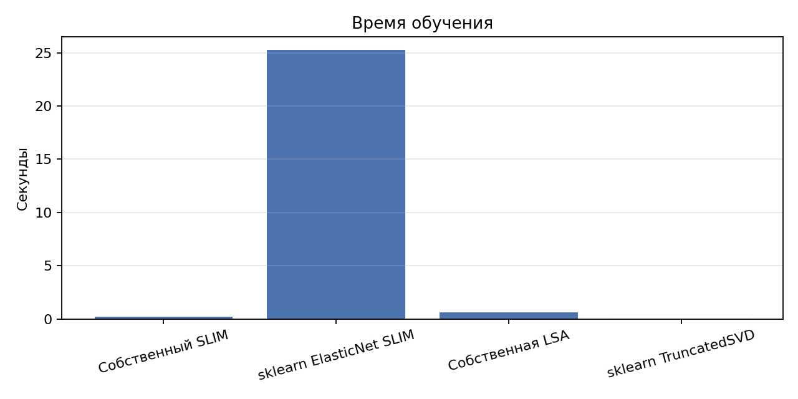
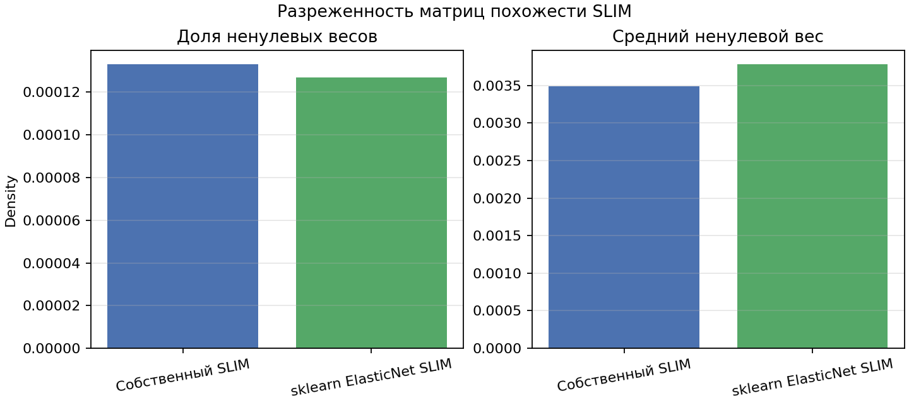
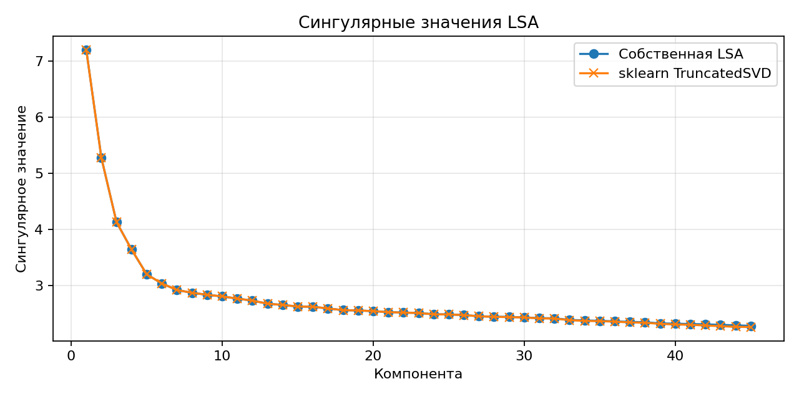
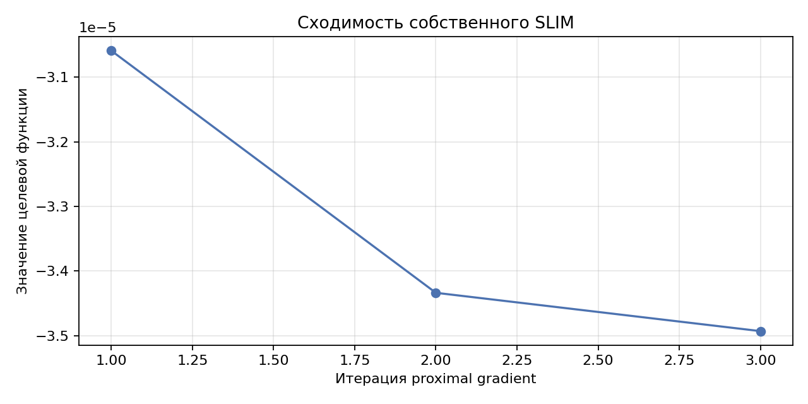

# Лабораторная работа №5. Рекомендательные системы

В рамках данной лабораторной работы предстоит реализовать алгоритм Sparse Linear Method (SLIM) и сравнить его с эталонной реализацией. Реализовать любую латентную семантическую модель, сравнить с эталонной реализацией. 

## Задание

1. Выбрать текстовый датасет для анализа, например, на [kaggle](https://www.kaggle.com/datasets).
2. Реализовать алгоритм SLIM.
3. Обучить модель на выбранном датасете.
4. Оценить качество модели по RMSE.
5. Сравнить результаты с эталонной реализацией.
6. Реализовать любую латентную семантическую модель.
7. Обучить модель на выбранном датасете.
8. Оценить качество модели по RMSE.
9. Сравнить результаты с эталонной реализацией.
10. Посчитать NDCG (задача со *).
11. Подготовить отчет, включающий:
    * описание SLIM и выбранного алгоритма;
    * описание датасета;
    * результаты экспериментов;
    * сравнение с эталонной реализацией;
    * выводы.

## Датасет

Использован текстовый датасет 20 Newsgroups из `sklearn.datasets.fetch_20newsgroups`.

- Подмножество: `train`.
- Категории: `comp.graphics`, `rec.sport.baseball`, `sci.med`, `talk.politics.misc`.
- Документы: 2240.
- Признаки: 1000 TF-IDF терминов (`MAX_FEATURES`).
- Векторизация: `stop_words='english'`, `min_df=3`, `max_df=0.85`, `sublinear_tf=True`, `norm='l2'`.
- Матрица взаимодействий: документ-термин, где значение равно TF-IDF весу термина в документе.
- Плотность матрицы: `0.0263`.

Матрица используется как аналог user-item данных: документ играет роль пользователя, термин — роль объекта рекомендации, а TF-IDF вес — роль наблюдаемого отклика. Для тестирования случайно скрывается 20% ненулевых TF-IDF значений; модели обучаются на оставшейся матрице и восстанавливают скрытые веса терминов в документах.

## Реализация

`SlimRecommender` реализует Sparse Linear Method. Модель ищет неотрицательную разреженную матрицу похожести терминов `W` с нулевой диагональю:

$$
\min_W \frac{1}{2n}\|R - RW\|_F^2 + \lambda_1\|W\|_1 + \frac{\lambda_2}{2}\|W\|_F^2,
\quad W \ge 0,\quad diag(W)=0.
$$

Оптимизация выполнена собственным projected proximal gradient descent: градиент считается через матрицу Грама `R^T R`, L1-регуляризация задается soft-thresholding с проекцией на неотрицательную область, после каждого шага диагональ зануляется.

Эталон для SLIM — `sklearn.linear_model.ElasticNet` с `positive=True`, `fit_intercept=False`. Для каждого термина решается отдельная задача восстановления его столбца по остальным столбцам. Эта постановка совпадает с [KarypisLab/SLIM](https://github.com/KarypisLab/SLIM): coordinate descent по столбцам матрицы `R` при ограничениях `w_{ii}=0`, `w_{ij}\ge 0` и elastic-net штрафе $\alpha \cdot (\mathrm{l1\_ratio}\,\|w\|_1 + \frac{1-\mathrm{l1\_ratio}}{2}\|w\|_2^2)$. В коде $(\lambda_1, \lambda_2)$ сопоставляются с `(alpha, l1_ratio)` sklearn как `alpha = λ_1 + λ_2`, `l1_ratio = λ_1 / alpha`.

Латентная семантическая модель `LatentSemanticAnalysis` реализована через усеченное SVD:

$$
R \approx U_k \Sigma_k V_k^T.
$$

Реконструкция скрытых TF-IDF весов получается через проекцию документов в латентное пространство и обратное преобразование. Эталонная модель — `sklearn.decomposition.TruncatedSVD` с тем же числом компонент `45`.

## Метрики

- `RMSE` считается на скрытых ненулевых TF-IDF значениях.
- `NDCG@10` оценивает качество ранжирования скрытых терминов для каждого документа. Термины, оставшиеся видимыми в обучающей матрице, исключаются из рекомендаций.

## Результаты

| Модель | RMSE | NDCG@10 | Fit time, sec |
|--------|------|---------|---------------|
| Собственный SLIM | 0.1894 | 0.0394 | 0.251 |
| sklearn ElasticNet SLIM | 0.1894 | 0.0396 | 25.240 |
| Собственная LSA | 0.1772 | 0.1057 | 0.619 |
| sklearn TruncatedSVD | 0.1772 | 0.1042 | 0.064 |

*Рис. 1. RMSE и NDCG@10 для собственных и эталонных моделей.*

*Рис. 2. Время обучения моделей.*

*Рис. 3. Доля ненулевых коэффициентов и средний ненулевой вес в SLIM.*

*Рис. 4. Сингулярные значения собственной LSA и `sklearn.TruncatedSVD`.*

*Рис. 5. Сходимость целевой функции собственного SLIM.*

## Анализ результатов

Собственный SLIM практически совпал с эталонным ElasticNet по RMSE и NDCG@10. Это ожидаемо, так как обе модели решают одну и ту же задачу с неотрицательными коэффициентами и elastic-net регуляризацией. Собственная реализация быстрее на выбранном размере матрицы, потому что оптимизирует всю матрицу весов через общий Gram matrix, тогда как эталонный вариант решает отдельную регрессию для каждого термина.

В `artifacts/run_summary.md` дополнительно приведено число итераций, но для SLIM-моделей оно имеет разный смысл: у собственного SLIM это число шагов proximal gradient по всей матрице `W` сразу (3 итерации при `tol=1e-6`), у ElasticNet-эталона — сумма итераций coordinate descent по 1000 независимым регрессиям (161).

LSA показала меньший RMSE и больший NDCG@10, чем SLIM: на полном поднаборе низкоранговая реконструкция и точнее восстанавливает скрытые TF-IDF веса, и лучше ранжирует скрытые термины. Собственная LSA и TruncatedSVD дают почти одинаковое качество.

## Выводы

1. Реализован SLIM для разреженной документ-терм матрицы с L1/L2-регуляризацией, неотрицательными весами и нулевой диагональю.
2. Реализована латентная семантическая модель на основе усеченного SVD.
3. Обе собственные реализации сопоставлены с эталонными моделями из sklearn.
4. На полном поднаборе (2240×1000) LSA превосходит SLIM и по RMSE, и по NDCG@10. Собственные реализации дают близкие значения метрик к эталонам sklearn.
