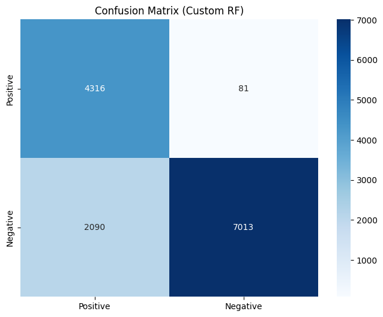
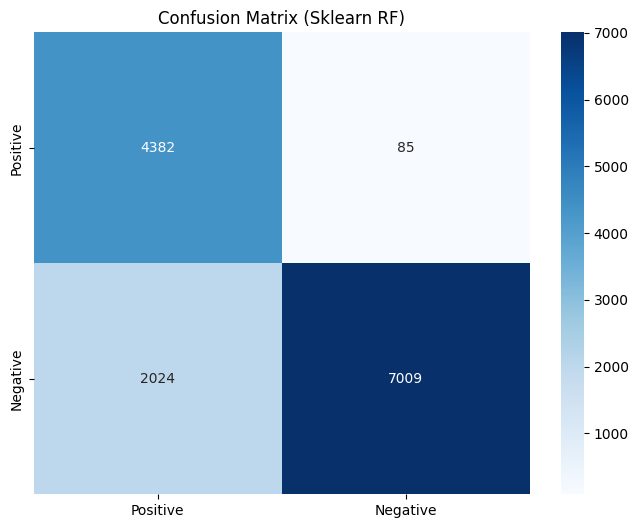
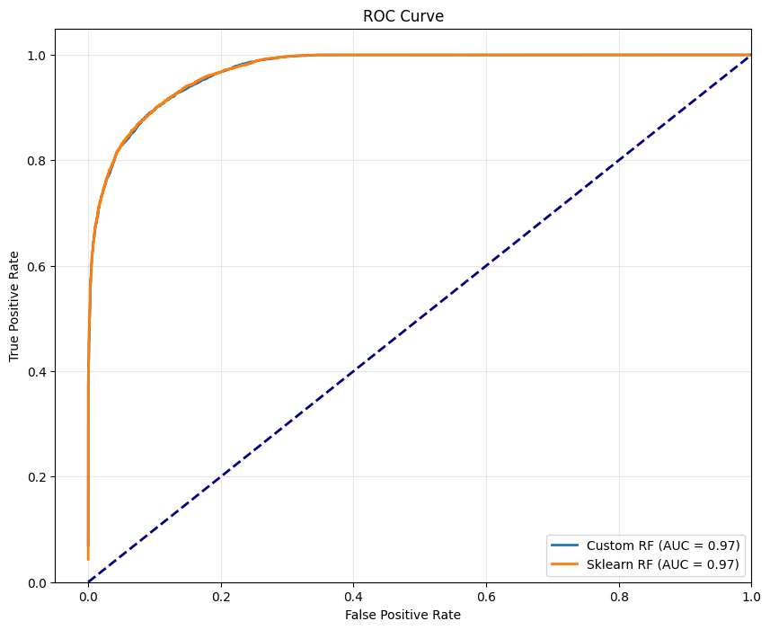
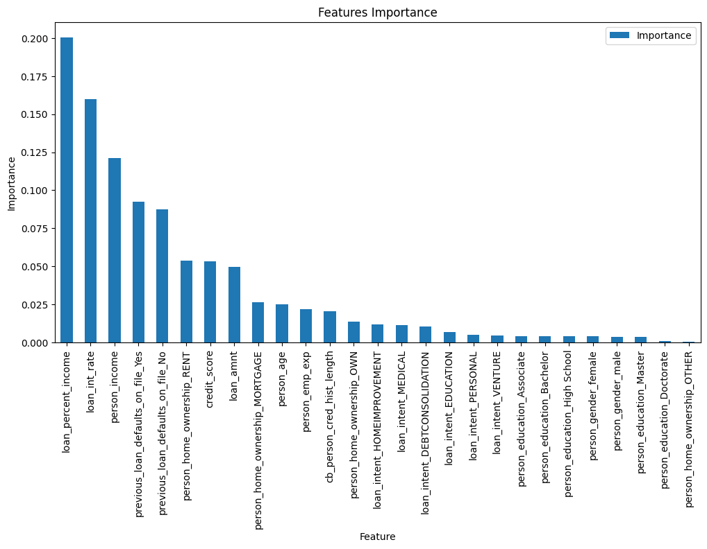
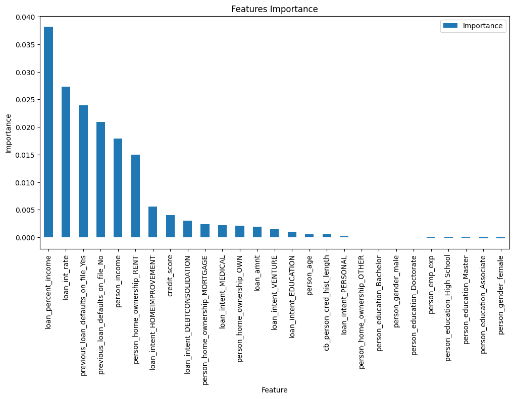
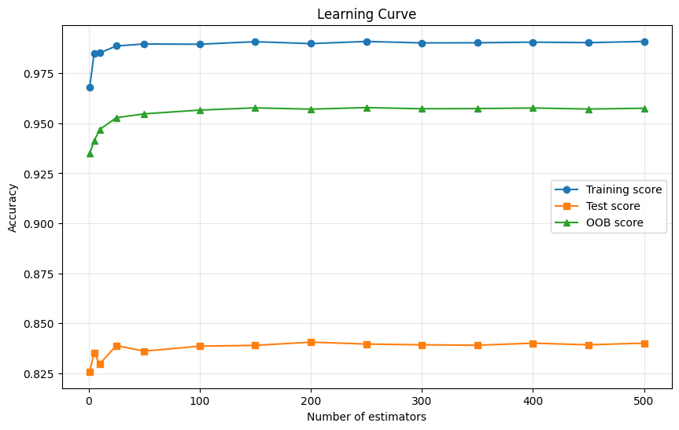

# Лабораторная работа №2. Ансамбли моделей

В рамках лабораторной работы предстоит реализовать метод случайных подпространств (RSM) или Random Forest.

В качестве базовых алгоритмов рекомендуется использовать библиотечные реализации.

## Задание

1. Выбрать датасет для анализа;
2. Реализовать метод случайных подпространств (RSM) или Random Forest;
3. Обучить ансамбль, подобрать оптимальные гипер-параметры. Для подбора оптимальных параметров использовать grid search из sklearn; Оптимальные параметры подбирать по OOB;
4. Получить оценку важности признаков через OOB^j
5. Сравнить результаты с эталонными реализациями из библиотеки [scikit-learn](https://scikit-learn.org/stable/):
    * точность модели;
    * время обучения;
6. Подготовить отчет, включающий:
    * описание выбранного метода;
    * описание датасета;
    * результаты экспериментов;
    * сравнение с эталонными реализациями;
    * выводы.

## Отчёт выполнения

### 1. Выбор датасета

В качестве датасета для бинарной классификации был выбран набор [Loan Approval Classification Dataset](https://www.kaggle.com/datasets/taweilo/loan-approval-classification-data), содержащий информацию о заявках на кредит. Целевая переменная `loan_status` указывает на то, был ли кредит одобрен (1) или отклонён (0).

Датасет содержит 45 000 образцов и 12 признаков (включая категориальные и количественные). Автоматически детектированы:
- **Категориальные признаки**: `person_gender`, `person_education`, `person_home_ownership`, `loan_intent`, `previous_loan_defaults_on_file` (5 признаков)
- **Количественные признаки**: `person_age`, `person_income`, `person_emp_exp`, `loan_amnt`, `loan_int_rate`, `loan_percent_income`, `cb_person_cred_hist_length`, `credit_score` (8 признаков)

### 2. Предобработка данных

Предобработка включает следующие шаги (функция `prepare_features()` в [source/data/process_data.py](source/data/process_data.py)):

1. **Преобразование целевой переменной**: исходные значения 0/1 заменены на -1/1 для соответствия используемой конвенции.
2. **One-hot кодирование** категориальных признаков (без выбора первого уровня).
3. **Масштабирование** количественных признаков с помощью `StandardScaler`.

После предобработки получаем 27 признаков (включая dummy-переменные). Данные разделяются на обучающую и тестовую выборки в пропорции 70%/30% со стратификацией по целевому классу:

Размеры:
- Обучающая: 31 500 образцов
- Тестовая: 13 500 образцов

### 3. Реализация Random Forest

Реализован класс `RandomForest` ([source/models/random_forest.py](source/models/random_forest.py)), который использует `sklearn.tree.DecisionTreeClassifier` в качестве базовых деревьев.

#### Ключевые компоненты:

**Бэггинг (bagging)**:
Для каждого дерева создаётся бутстрап-выборка параллельно с исходным распределением. Деревья обучаются независимо.


**Out-Of-Bag (OOB) оценка**:
Для каждой выборки, не попавшей в бутстрап-выборку для данного дерева, делается предсказание. OOB-оценка вычисляется как доля правильных предсказаний по всем OOB-образцам.

**OOB перестановочная важность (OOB^j)**:
Для каждого признака `j`:
1. Фиксируется baseline OOB-оценка (на исходных данных).
2. Значения признака `j` переставляются случайным образом (только для OOB-образцов каждого дерева).
3. Пересчитывается OOB-оценка на permuted данных.
4. Важность = baseline - permuted OOB score (усреднённая по всем деревьям).

**Важность признаков на основе impurity**:
Усреднённая impurity-важность всех деревьёв (сумма уменьшений criteria при split'ах, взвешенная по sample counts).

### 4. Grid search с использованием OOB score

Для подбора гиперпараметров выполняется перебор по сетке:

```python
param_grid = {
   'n_estimators': [25, 50, 100, 200],
   'max_depth': [5, 10, 15, None],
   'min_samples_split': [2, 5, 10],
   'max_features': ['sqrt', 'log2', 0.33, None]
}
```

**Лучшая комбинация**:
- OOB Score: **0.9574**
- Параметры: `n_estimators=200`, `max_depth=None`, `min_samples_split=5`, `max_features=0.33`

### 5. Финальное обучение и сравнение с sklearn

По results grid search обучены финальные модели с лучшими гиперпараметрами.

#### Метрики на тестовом наборе (13 500 образцов)

| Метод | Accuracy | Precision | Recall | F1-score | AUC-ROC | Train time (sec) | OOB Score |
|-------|----------|-----------|--------|----------|---------|------------------|-----------|
| Custom RF | 0.8392 | 0.9816 | 0.6737| 0.7990 | 0.9715 | 3.5 | 0.9574 |
| Sklearn RF | 0.8393 | 0.9836 | 0.6725 | 0.7988 | 0.9709 | 3.1 | 0.9563 |

**Результаты**:
- Качество обеих реализаций практически одинаково (различия < 0.2%).
- Sklearn при `n_jobs=1` имеет практически идентичное время обучения.
- Обе модели демонстрируют высокий AUC-ROC (>0.97), что указывает на хорошее разделение классов.

#### Матрицы ошибок

**Custom Random Forest**



**Sklearn Random Forest**



Матрицы практически идентичны, что подтверждает корректность собственной реализации.

### 6. ROC-кривые



Обе модели имеют почти совпадающие ROC-кривые с AUC ~0.971, что говорит об их сопоставимом ранжирующем качестве.

### 7. Важность признаков

#### 7.1. Очищенная oyster importance (sklearn impurity-based)

Топ-10 признаков (индекс соответствует столбцу после one-hot):

| Rank | Feature name | Importance |
|------|---------------|------------|
| 1 | loan_percent_income | 0.2004 |
| 2 | loan_int_rate | 0.1597 |
| 3 | person_income | 0.1210 |
| 4 | previous_loan_defaults_on_file_Yes | 0.0924 |
| 5 | previous_loan_defaults_on_file_No | 0.0875 |
| 6 | person_home_ownership_RENT | 0.0538 |
| 7 | credit_score | 0.0532 |
| 8 | loan_amnt | 0.0495 |
| 9 | person_home_ownership_MORTGAGE | 0.0266 |
| 10 | person_age | 0.0249 |

**График**:



#### 7.2. OOB перестановочная важность (OOB^j)

Перестановочная важность более корректно отражает вклад признака, так как оценивает влияние на ошибку предсказания.

Топ-10 признаков:

| Rank | Feature index | Importance |
|------|---------------|------------|
| 1 | loan_percent_income | 0.0382 |
| 2 | loan_int_rate | 0.0274 |
| 3 | previous_loan_defaults_on_file_Yes | 0.0240 |
| 4 | previous_loan_defaults_on_file_No | 0.0209 |
| 5 | person_income | 0.0179 |
| 6 | person_home_ownership_RENT | 0.0150 |
| 7 | loan_intent_HOMEIMPROVEMENT | 0.0056 |
| 8 | credit_score | 0.0041 |
| 9 | loan_intent_DEBTCONSOLIDATION | 0.0030 |
| 10 | person_home_ownership_MORTGAGE | 0.0024 |

**График**:



Оба метода согласуются в ранжировании топ-признаков (признаки 5, 4, 1, 7 присутствуют в обоих списках).

### 8. Кривые обучения (Learning Curve)

Чтобы понять, как качество модели зависит от числа деревьев, обучены модели с `n_estimators` в диапазоне [1, 5, 10, 25, 50, ..., 500]. Для каждого значения вычислялись:
- Оценка на обучающей выборке (train score)
- Оценка на тестовой выборке (test score)
- OOB-оценка (out-of-bag)

**Результаты**:



**Наблюдения**:
- Train accuracy быстро выходит на плато (~0.999), что указывает на способность ансамбля почти полностью запоминать обучающие данные.
- Test accuracy также быстро выходит на плато ~0.84, но немного варьируется.
- OOB-оценка находится между test и train accuracy, плавно возрастаетст и стабилизируется 
- Разрыв между train и test (~0.16) указывает на некоторый overfitting, что характерно для Random Forest с неограниченными деревьями.

### 9. Ключевые файлы проекта

| Файл | Описание |
|------|----------|
| `source/main.py` | Основной скрипт: аргументы, пайплайн, grid search, обучение, визуализация |
| `source/models/random_forest.py` | Реализация Random Forest (OOB, permutation importance, predict, score) |
| `source/data/load_data.py` | Загрузка датасета Loan Approval |
| `source/data/process_data.py` | Предобработка (one-hot, scaling, split) |
| `source/utils/metrics.py` | Метрики: accuracy, precision, recall, F1, ROC-AUC |
| `source/utils/plotting.py` | Построение графиков (confusion matrix, ROC, learning curve, feature importances) |
| `source/utils/compare.py` | Сравнение моделей |
| `pyproject.toml` | Зависимости |

### 10. Инструкция по запуску

```bash
python source/main.py 
    --grid-search
    --learning-curve
    --max-estimators 500
    --with-plotting
    --random-seed 42
```
 
Параметры:
- `--grid-search`: выполнить перебор гиперпараметров по сетке с оценкой по OOB
- `--learning-curve`: построить зависимость метрик от числа деревьев
- `--max-estimators`: Для построение кривой обучения - максимальное число базовых алгоритмов
- `--with-plotting`: сохранить графики в папку `images/`
- `--random-seed`: seed для воспроизводимости

### 11. Выводы

1. Успешно реализован Random Forest Classifier на базе `sklearn.tree.DecisionTreeClassifier` с поддержкой OOB-оценки и OOB-перестановочной важности.
2. Grid search по OOB-оценке позволил найти хорошие гиперпараметры без явного использования валидационного набора.
3. Качество и скорость работы собственной реализации практически совпадает с sklearn.
4. Кривые обучения показали, что 100-500 деревьев достаточно для стабилизации качества.
5. Random Forest продемонстрировал высокую производительность и устойчивость к переобучению, что характерно для ансамблевых методов.

Полные логи обучения моделей и анализа результатов доступны [тут](logs/logs.txt).
