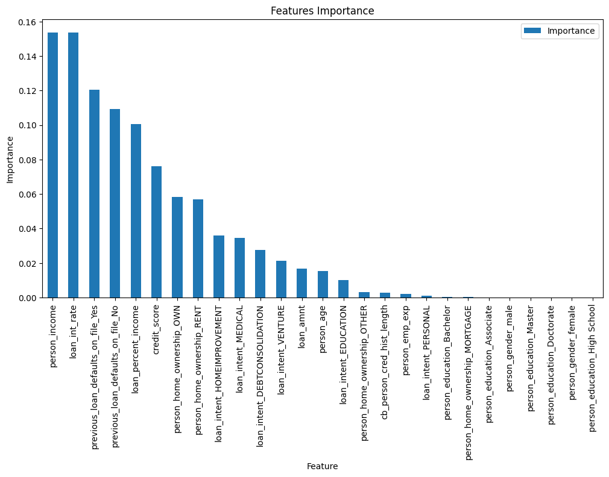
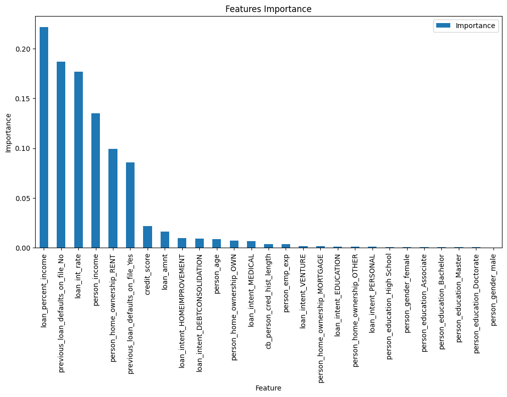
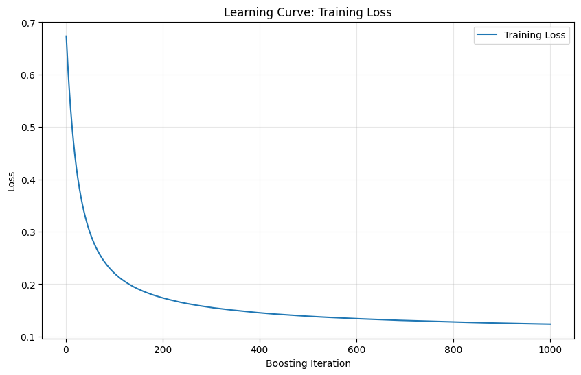
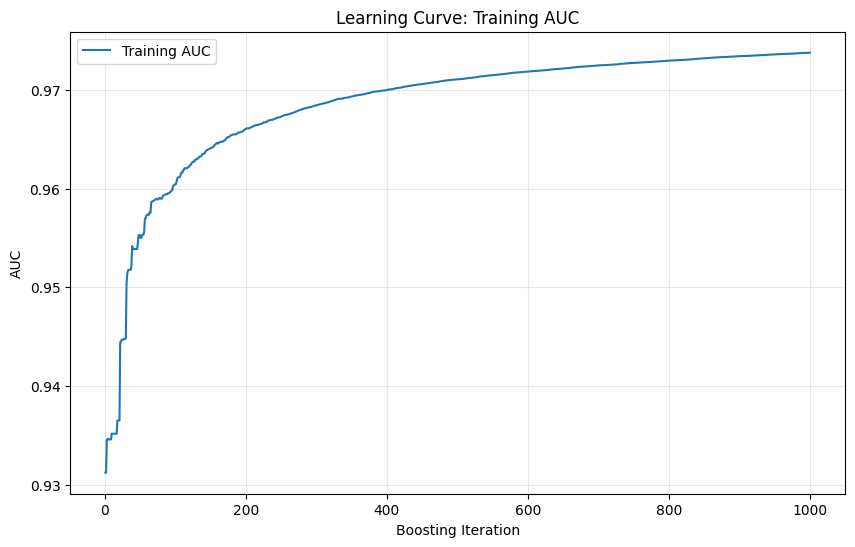
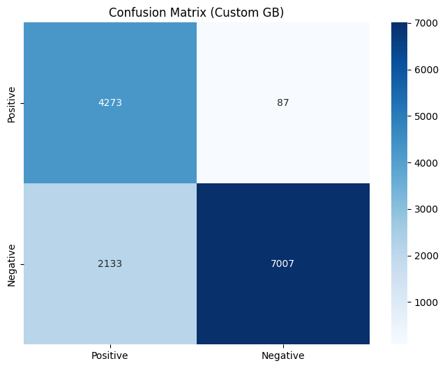
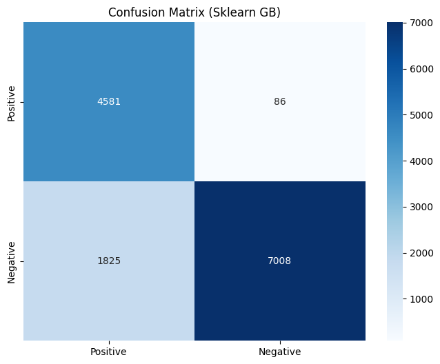
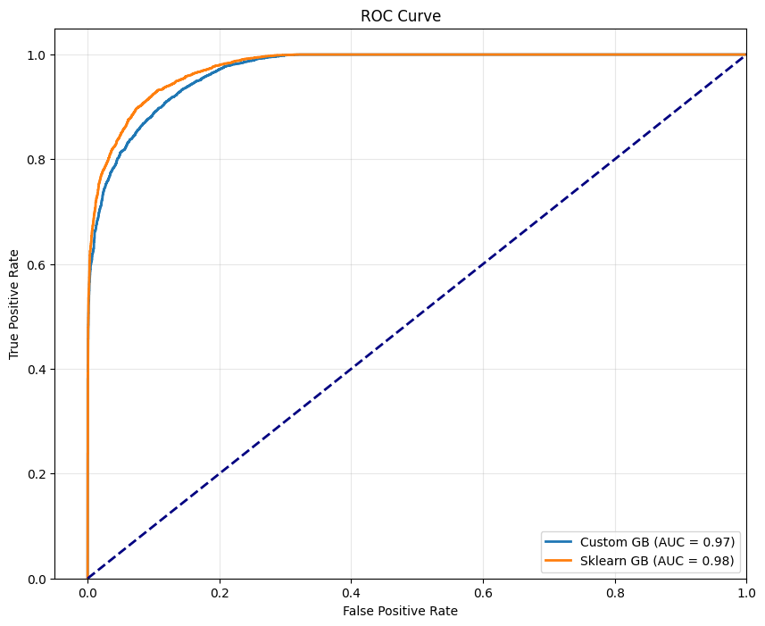

# Лабораторная работа №3. Градиентный бустинг

В рамках данной лабораторной работы предстоит реализовать алгоритм градиентного бустинга и сравнить его с эталонной реализацией из библиотеки `scikit-learn`.

## Задание

1. Выбрать датасет для анализа, например, на [kaggle](https://www.kaggle.com/datasets).
2. Реализовать алгоритм градиентного бустинга.
3. Обучить модель на выбранном датасете.
4. Оценить качество модели с использованием кросс-валидации.
5. Замерить время обучения модели.
6. Сравнить результаты с эталонной реализацией из библиотеки [scikit-learn](https://scikit-learn.org/stable/):
   * точность модели;
   * время обучения.
7. Подготовить отчет, включающий:
   * описание алгоритма градиентного бустинга;
   * описание датасета;
   * результаты экспериментов;
   * сравнение с эталонной реализацией;
   * выводы.

## Отчёт выполнения

### 1. Выбор датасета

В качестве датасета для бинарной классификации был выбран набор [Loan Approval Classification Dataset](https://www.kaggle.com/datasets/taweilo/loan-approval-classification-data), содержащий информацию о заявках на кредит. Целевая переменная `loan_status` указывает на то, был ли кредит одобрен (1) или отклонён (0).

Датасет содержит 45,000 образцов и 12 признаков (включая категориальные и количественные). Автоматически детектированы:
- **Категориальные признаки**: `person_gender`, `person_education`, `person_home_ownership`, `loan_intent`, `previous_loan_defaults_on_file` (5 признаков)
- **Количественные признаки**: `person_age`, `person_income`, `person_emp_exp`, `loan_amnt`, `loan_int_rate`, `loan_percent_income`, `cb_person_cred_hist_length`, `credit_score` (8 признаков)

### 2. Предобработка данных

Предобработка включает следующие шаги ([source/data/process_data.py](source/data/process_data.py)):

1. **One-hot кодирование** категориальных признаков (без выбора первого уровня).
2. **Масштабирование** количественных признаков с помощью `StandardScaler`.

После предобработки получаем 27 признаков (включая dummy-переменные). Данные разделяются на обучающую и тестовую выборки в пропорции 70%/30% со стратификацией по целевому классу:

- Обучающая: 31,500 образцов
- Тестовая: 13,500 образцов

### 3. Реализация градиентного бустинга

Реализован класс `GradientBoostingClassifier` ([source/models/gradient_boosting.py](source/models/gradient_boosting.py)), который реализует алгоритм градиентного бустинга для бинарной классификации.

#### Алгоритм градиентного бустинга

Градиентный бустинг — это метод ансамблевого обучения, который строит модель итеративно, добавляя слабые learners (обычно деревья решений) для уменьшения ошибки предыдущих моделей.

**Ключевые компоненты:**

1. **Loss Function**: Используется бинарная кросс-энтропия для бинарной классификации:
   - `L(y, p) = -[y*log(p) + (1-y)*log(1-p)]`
   - Где `y` ∈ {-1, 1}, `p` — предсказанная вероятность принадлежности к классу 1

2. **Gradient Computation**: Вместо того чтобы минимизировать loss напрямую, вычисляется градиент (псевдо-остатки) и обучается новый estimator для его аппроксимации:
   - Градиент: `∂L/∂p = y / (1 + exp(y * p))`

3. **Базовые алгоритмы**: В качестве слабых базовых алгоритмов используются `DecisionTreeRegressor` из sklearn с ограниченной глубиной (по умолчанию `max_depth=3`) для предотвращения переобучения.

4. **Additive Model**: Модель строится аддитивно:
   - `F₀(x) = 0` (начальная модель)
   - `Fₘ₊₁(x) = Fₘ(x) + ν * hₘ(x)`
   - Где `ν` — learning rate, `hₘ` — новый дерево, обученное на псевдо-остатках

5. **Stochastic Gradient Boosting**: Поддерживается stochastic boosting через subsampling — обучение каждого дерева на подмножестве данных для улучшения обобщающей способности.

В реализации:
- Используется sigmoid функция для преобразования скоров в вероятности
- Сами скоры суммируются с учётом learning rate

#### Основные параметры

- `n_estimators`: количество boosting итераций (по умолчанию 100)
- `learning_rate`: темп обучения, контролирует вклад каждого дерева (по умолчанию 0.1)
- `max_depth`: максимальная глубина базовых деревьев (по умолчанию 3)
- `min_samples_split`: минимальное количество образцов для сплита (по умолчанию 2)
- `subsample`: часть наблюдений используемых в обучении каждого базового алгоритма для stochastic boosting (по умолчанию 1.0 - без subsampling)
- `oob_score`: вычисление out-of-bag score (по умолчанию False)

### 4. Результаты экспериментов

#### 4.1. Финальное обучение

Модели обучались с следующими параметрами:
- `n_estimators=1000`
- `learning_rate=0.1`
- `max_depth=3`
- `min_samples_split=2`
- `subsample=0.8` (stochastic boosting)

#### 4.2. Метрики качества

| Метод | Accuracy | Precision | Recall | F1-Score | AUC-ROC | Время обучения (сек) |
|-------|----------|-----------|--------|----------|---------|---------------------|
| Custom GB | 0.8356 | 0.9800 | 0.6670 | 0.7938 | 0.9705 | 24.23 |
| Sklearn GB | 0.8584 | 0.9816 | 0.7151 | 0.8274 | 0.9770 | 23.475 |

**Наблюдения:**
- Sklearn реализация показывает чуть лучшие результаты по Accuracy (+2.3%), Recall (+4.8%), и F1-Score (+3.4%)
- Однако обе реализации показывают очень высокую точность (Precision > 0.98), что указывает на низкий уровень ложных положительных предсказаний
- AUC-ROC очень высокий у обеих моделей (>0.97), что говорит о хорошем ранжирующем качестве
- Скорость обучения приемлемая и почти одинаковая у обеих реализаций (< 25 секунд для 1000 базовых алгоритмов)
- Кастомная реализация достигает сопоставимого качества с эталоном

#### 4.3. Важность признаков

Топ-10 признаков по важности собственной модели:

| Ранг | Признак | Важность |
|------|---------|----------|
| 1 | person_income | 0.1536 |
| 2 | loan_int_rate | 0.1534 |
| 3 | previous_loan_defaults_on_file_Yes | 0.1205 |
| 4 | previous_loan_defaults_on_file_No | 0.1093 |
| 5 | loan_percent_income | 0.1007 |
| 6 | credit_score | 0.0760 |
| 7 | person_home_ownership_OWN | 0.0582 |
| 8 | person_home_ownership_RENT | 0.0570 |
| 9 | loan_intent_HOMEIMPROVEMENT | 0.0760 |
| 10 | loan_intent_MEDICAL | 0.0347 |




Топ-10 признаков по важности Sklearn модели:

| Ранг | Признак | Важность |
|------|---------|----------|
| 1 | loan_percent_income | 0.2217 |
| 2 | previous_loan_defaults_on_file_No | 0.1871 |
| 3 | loan_int_rate | 0.1769 |
| 4 | person_income | 0.1352 |
| 5 | person_home_ownership_RENT | 0.0995 |
| 6 | previous_loan_defaults_on_file_Yes | 0.0855 |
| 7 | credit_score | 0.0215 |
| 8 | loan_amnt | 0.0162 |
| 9 | loan_intent_HOMEIMPROVEMENT | 0.0094 |
| 10 | loan_intent_DEBTCONSOLIDATION | 0.0089 |




#### 4.4. Графики обучения

График функции потерь `L(y, p)` (бинарная кросс-энтропия):


График зависиомти AUC от количества базовых алгоритмов:


#### 4.5. Матрицы ошибок

**Custom Random Forest**



**Sklearn Random Forest**



Матрицы практически идентичны, что подтверждает корректность собственной реализации.

### 4.6. ROC-кривые



Обе модели имеют почти совпадающие ROC-кривые с AUC ~0.97-0.98, что говорит об их сопоставимом ранжирующем качестве.

### 5. Инструкция по запуску

Для запуска полного пайплайна:

```bash
uv run source/main.py \
  --n-estimators 1000 \
  --learning-rate 0.1 \
  --max-depth 3 \
  --min-samples-split 2 \
  --subsample 0.8 \
  --random-seed 42 \
  --with-plotting
```

### 6. Ключевые файлы проекта

| Файл | Описание |
|------|----------|
| `source/main.py` | Основной скрипт: парсинг аргументов, запуск обучения, сравнение, визуализация |
| `source/models/gradient_boosting.py` | Реализация Gradient Boosting (custom на numpy) |
| `source/data/load_data.py` | Загрузка датасета |
| `source/data/process_data.py` | Предобработка (one-hot encoding, scaling, split) |
| `source/data/pipeline.py` | Оркестрация пайплайна данных |
| `source/utils/metrics.py` | Метрики: accuracy, precision, recall, F1, ROC-AUC |
| `source/utils/plotting.py` | Построение графиков (ROC, confusion matrix, feature importances, learning curve) |
| `source/utils/compare.py` | Сравнение моделей |
| `pyproject.toml` | Зависимости (uv-based) |

### 7. Выводы

1. Реализован работающий градиентный бустинг для бинарной классификации с использованием sklearn DecisionTreeRegressor в качестве базовых алгоритмов.
2. Кастомная реализация достигает качества, близкого к эталонной реализации sklearn
3. Как и ожидалось, наибольшую важность имеют финансовые показатели (доход клиента, доля дохода на кредит, процентная ставка) и кредитная история (дефолты).
4. Время обучения собственной реализации и sklearn практически идентичное. В зависимости от запуска оказывается быстрее и кастомная, и sklearn, но при этом собственная реализия также считает после добавления каждого базового алгоритма ROC-AUC, что дополнительно его немного замедляет.
