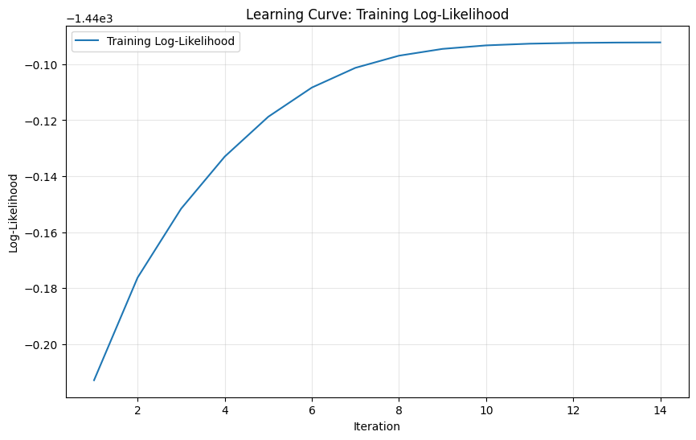
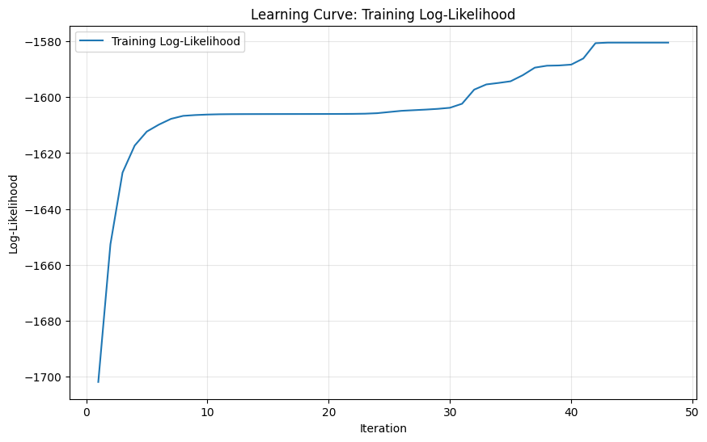
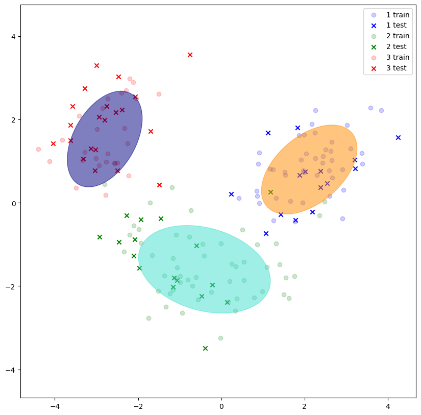
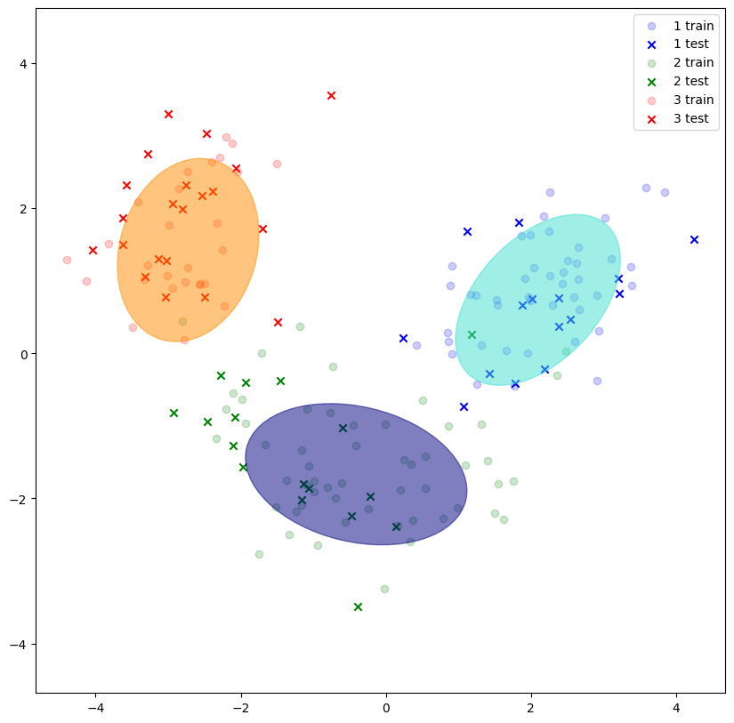
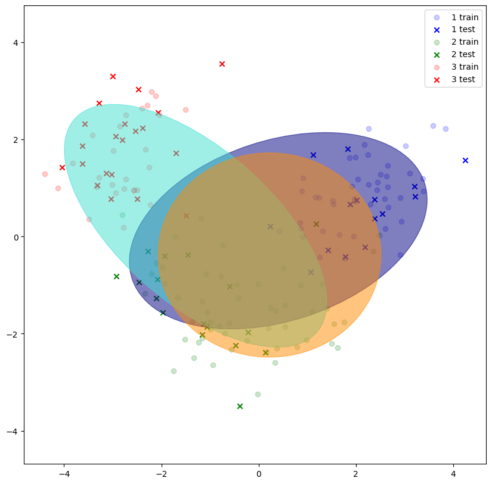
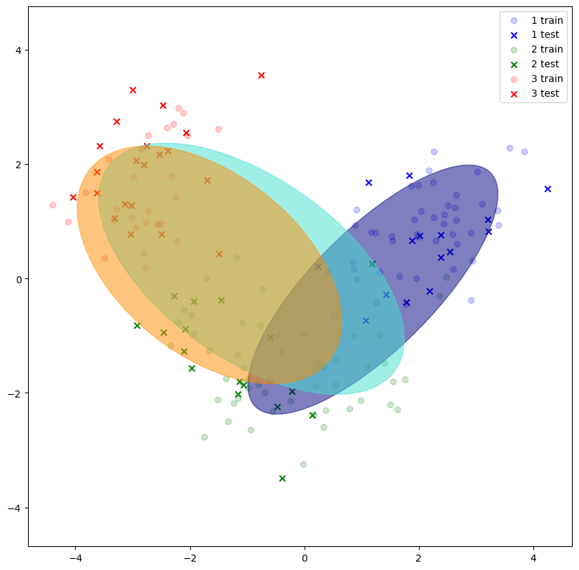

# Лабораторная работа №4. EM-алгоритм

В рамках данной лабораторной работы необходимо было реализовать EM-алгоритм и сравнить его с эталонной реализацией из библиотеки `scikit-learn`.

## Задание

1. Выбрать датасет для восстановления плотности распределения, например, на [kaggle](https://www.kaggle.com/datasets).
2. Реализовать GMM.
3. Обучить модель на выбранном датасете.
4. Оценить качество модели через ПМП.
5. Сравнить результаты с эталонной реализацией из библиотеки [scikit-learn](https://scikit-learn.org/stable/):
6. Подготовить отчет, включающий:
   * описание наивного байесовского классификатора;
   * описание датасета;
   * результаты экспериментов;
   * сравнение с эталонной реализацией;
   * выводы.

## Отчёт выполнения

### 1. Выбор датасета

В качестве датасета для восстановления плотности распределения был выбран набор [Wine Dataset](https://www.kaggle.com/datasets/tawfikelmetwally/wine-dataset), содержащий информацию о вине. Исходная целевая переменная `class` указывает на то, какому классу принадлежит вино.

Датасет содержит 178 образцов и 13 признаков (только численные)

Признаки масштабируются с помощью `StandardScaler` ([source/data/process_data.py](source/data/process_data.py))

### 2. Предобработка данных

Предобработка включает следующие шаги (функция `prepare_features()` в [source/data/process_data.py](source/data/process_data.py)):

1. **Определение целевой переменной**: колонка `class` переименована в `target`.
2. **Идентификация признаков**: выделение категориальных и числовых признаков. В данном датасете все признаки числовые, поэтому категориальные признаки отсутствуют.
3. **Масштабирование** числовых признаков с помощью собственной реализации `StandardScaler`.
4. **Разделение данных** на обучающую и тестовую выборки в пропорции 70%/30% со стратификацией по целевому классу (функция `train_test_split`).

После предобработки получаем 13 числовых признаков. Данные разделяются на обучающую и тестовую выборки:
- Обучающая: 125 образцов
- Тестовая: 53 образца

### 3. Реализация Gaussian Mixture Model

Реализован класс `GaussianMixtureModel` ([source/models/gmm.py](source/models/gmm.py)), который реализует ЕМ-алгоритм для оценки параметров смеси гауссовских распределений.

#### Алгоритм EM

Expectation-Maximization (EM) алгоритм состоит из двух шагов, которые повторяются до сходимости:

1. **E-step (Expectation)**: Вычисление posterior вероятностей (ответственности) того, что каждый объект принадлежит каждому кластеру, используя текущие параметры модели.
2. **M-step (Maximization)**: Обновление параметров модели (средние, ковариационные матрицы, веса) на основе вычисленных ответственностей.

Логарифмическое правдоподобие используется как функция оптимизации:

$$ \ln p(X|\theta) = \sum_{i=1}^{N} \ln \left( \sum_{k=1}^{K} \pi_k \mathcal{N}(x_i|\mu_k, \Sigma_k) \right),$$

где $\pi_k$ — вес $k$-го компонента, $\mathcal{N}$ — гауссовская плотность.


#### Инициализация параметров

Для иницализации параметров изначально реализовался простой `random`, где средние выбирались случайно из тренировочного набора данных. 
Но такой подход показал плохую и негарантированную сходимость к верному распределнию, так как GMM сильно зависит от инициализации.

Поэтому также была разработана модель `KMeans` ([source/models/kmeans.py](source/models/kmeans.py)), которая обучается перед обучением GMM и её параметры (центроиды и отнесение сэмплов к кластерам) используются уже для иницализации GMM параметров. 
Такой же подход используется по умолчанию в sklearn релализации GMM модели, так что было решено использовать и реализовывать именно его.

По итогу, как можно увидеть далее, `KMeans` инициализация показывает намного лучшее качество (визуально) по сравнению с `random` инициализацией.

#### Основные параметры

- `n_components`: количество компонентов в смеси (по умолчанию 3)
- `max_iter`: максимальное количество итераций EM (по умолчанию 100)
- `tol`: порог сходимости по изменению логарифмического правдоподобия (по умолчанию 1e-4)
- `init_params`: способ инициализации параметров ('kmeans' или 'random', по умолчанию 'kmeans')

### 4. Результаты экспериментов

#### 4.1. Финальное обучение

Модели обучались с следующими параметрами (по умолчанию, кроме указанных в команде запуска):
- `n_components=3`
- `max_iter=100`
- `tol=0.0001`
- `init_params='kmeans'`
- `random_seed=42`

#### 4.2. Метрики качества

Для оценки качества несупервизированной модели GMM используется логарифмическое правдоподобие (log-likelihood) на обучающей и тестовой выборках. Чем выше значение log-likelihood, тем лучше модель объясняет данные.

| Метод | Инициализация | Log-likelihood (обучение) | Время обучения (мс) |
|-------|---------|------------------|----------------------|
| Custom GMM | KMeans | -796.17 | 10 |
| Sklearn GMM | KMeans |-778.66 | 52 |
| Custom GMM | random | -982.29 | 29 |
| Sklearn GMM | random | -1004.44 | 10 |

**Наблюдения:**
- Эталонная и кастомная реализация GMM показывают сравнительно одинаковое качество по Log-likelihood
- Инициализация парамтеров с kmeans значительно улучшает качество обоих моделей
- Время обучения кастомной реализации также практически одинаковые (варьируются от запуска к запуску)

#### 4.3. Сходимость

График зависимости логарифмического правдоподобия от номера итерации EM при `KMeans` инициализации


График зависимости логарифмического правдоподобия от номера итерации EM при `random` инициализации


График демонстрирует, что кастомная модель достигает плато примерно на 10-15 итерации при `Kmeans` инициализации и на 45-50 итерации при `random` инициализации.

#### 4.4. Визуализация результатов

Для визуализации кластеризации применялся метод главных компонентов (PCA) для снижения размерности до 2D. Цвета на графиках указывают на исходные метки классов.

Для визуализации элипсов самой смеси распределений использовалась та же проекционная матрица PCA $P$, что была посчитана на train наборе данных (для средних - стандарный PCA, для ковариционных матриц - $\hat{C_i} = P^{T}C_{i}P$)

Визуализация собственной реализации GMM (инициализация `Kmeans`):


Визуализация Sklearn реализации GMM (инициализация `Kmeans`):


На графиках видно, что обе модели выделяют три кластера в данных Wine, соответствующие трем классам вина в датасете. Кластеры разделимы, хотя есть некоторое пересечение, что типично для реальных данных.

Визуализация собственной реализации GMM (инициализация `random`):


Визуализация Sklearn реализации GMM (инициализация `random`):


На этих же графиках видно, что обе модели не очень хорошо смогли разделить смесь распределений при рандомной инициализации. 

Графики показывают, что при `kmeans` инициализации алгоритмы демонстрирует значительно более лучшую сходимость к корректному разделению смесей. Также видно, что кастомный и эталонный алгоритмы в целом отрабатывают идентично.

### 5. Инструкция по запуску

Для запуска полного пайплайна:

```bash
uv run source/main.py \
  -n 3 \
  --max-iter 100 \
  --tol 0.0001 \
  --init-params kmeans \
  --random-seed 42 \
  --with-plotting
```

Параметры:
- `-n`: количество компонентов в смеси GMM
- `--max-iter`: максимальное количество итераций EM
- `--tol`: порог сходимости
- `--init-params`: способ инициализации параметров ('kmeans' или 'random')
- `--random-seed`: seed для воспроизводимости
- `--with-plotting`: сохранить графики в папку `images/`

### 6. Ключевые файлы проекта

| Файл | Описание |
|------|----------|
| `source/main.py` | Основной скрипт: парсинг аргументов, запуск обучения, сравнение, визуализация |
| `source/models/gmm.py` | Реализация Gaussian Mixture Model (custom на numpy) |
| `source/models/kmeans.py` | Реализация KMeans для инициализации |
| `source/data/load_data.py` | Загрузка датасета Wine |
| `source/data/process_data.py` | Предобработка (one-hot encoding, scaling, split) |
| `source/data/pipeline.py` | Оркестрация пайплайна данных |
| `source/utils/plotting.py` | Построение графиков (PCA, learning curve) |
| `source/utils/compare.py` | Сравнение моделей (если используется) |
| `pyproject.toml` | Зависимости (uv-based) |

### 7. Выводы

1. Успешно реализован Gaussian Mixture Model с использованием алгоритма EM на базе numpy и scipy.
2. Кастомная реализация достигает качества, близкого к эталонной реализации sklearn по метрике log-likelihood, несмотря на простоту кода.
3. Алгоритм EM корректно моделирует смесь гауссовских распределений в датасете Wine при `kmeans` инициализации, выделяя три кластера, соответствующие известным классам вина.
4. Время обучения кастомной реализации близко к sklearn реализации
5. Полученные результаты подтверждают, что EM-алгоритм является эффективным методом для параметрической оценки в смесях распределений и эффективнен в задачах кластеризации и разделнии смеси распределений.