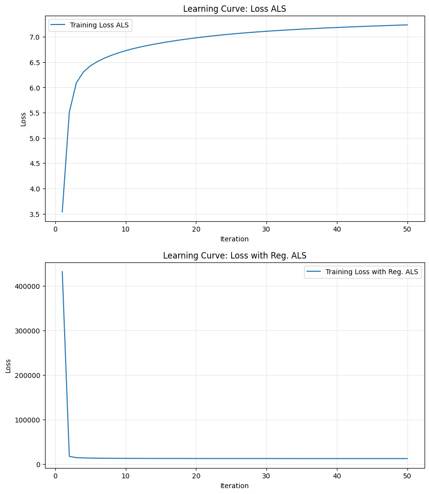

# Лабораторная работа №5. Рекомендательные системы

В рамках данной лабораторной работы предстояло реализовать алгоритм Sparse Linear Method (SLIM) и сравнить его с эталонной реализацией. Реализовать любую латентную семантическую модель, сравнить с эталонной реализацией. 

## Задание

1. Выбрать текстовый датасет для анализа, например, на [kaggle](https://www.kaggle.com/datasets).
2. Реализовать алгоритм SLIM.
3. Обучить модель на выбранном датасете.
4. Оценить качество модели по RMSE.
5. Сравнить результаты с эталонной реализацией.
6. Реализовать любую латентную семантическую модель.
7. Обучить модель на выбранном датасете.
8. Оценить качество модели по RMSE.
9. Сравнить результаты с эталонной реализацией.
10. Посчитать NDCG (задача со *).
11. Подготовить отчет, включающий:
    * описание SLIM и выбранного алгоритма;
    * описание датасета;
    * результаты экспериментов;
    * сравнение с эталонной реализацией;
    * выводы.

## Отчёт выполнения

### 1. Выбор датасета

В качестве датасета для построения рекомендательной системы был выбран набор [MovieLens 20M Dataset](https://grouplens.org/datasets/movielens/20m/), содержащий информацию о оценках фильмов пользователями. Датасет включает файлы ratings.csv, movies.csv, tags.csv и links.csv. Для лабораторной работы использовался только файл ratings.csv, содержащий колонки: userId, movieId, rating, timestamp.

Исходный датасет содержит 20 000 263 оценок, 138 493 пользователей и 27 278 фильмов. Для ускорения обучения и уменьшения памяти были применены фильтры:
- Оставлены только пользователи с идентификатором ≤ 100 000 (`KEEP_USERS = 100000`)
- Оставлены только фильмы с идентификатором ≤ 1000 (`KEEP_MOVIES = 1000`)

После фильтрации получено 213 304 записи в обучающей выборке и 53 290 записей в тестовой выборке.

### 2. Предобработка данных

Предобработка включает следующие шаги (функция `prepare_features()` в [source/data/process_data.py](source/data/process_data.py)):

1. **Фильтрация пользователей и фильмов**: оставляем только пользователей и фильмы, удовлетворяющих пороговым значениям `KEEP_USERS` и `KEEP_MOVIES`.
2. **Переименование колонок**: 
   - `userId` -> `user_id`
   - `movieId` -> `item_id`
3. **Разделение данных** на обучающую и тестовую выборки в пропорции 70%/30% со стратификацией по времени (более ранние оценки идут в обучающую выборку) (функция `train_test_split`).
4. **Фильтрация общих пользователей и предметов**: удаляем пользователей и фильмы, присутствующие только в одной из выборок, чтобы обеспечить общую матрицу взаимодействий.

После предобработки получаем матрицу взаимодействий размером 2737 пользователей × 879 фильмов.

### 3. Реализация алгоритмов

#### 3.1. Sparse Linear Method (SLIM)

SLIM (Sparse Linear Method) — это алгоритм рекомендательных систем, который обучает разреженную матрицу сходства между предметами с использованием линейной регрессии с L1 и L2 регуляризацией (ElasticNet). Для каждого предмета i решается задача регрессии: предсказание вектора взаимодействий с этим предметом на основе взаимодействий со всеми другими предметами, при этом коэффициенты регрессии составляют строку матрицы сходства W. Оптимизационная задача для каждого предмета:

$$
\min_{\mathbf{w}_i} \frac{1}{2} \|\mathbf{r}_i - \mathbf{R}_{-i} \mathbf{w}_i\|_2^2 + \lambda_1 \|\mathbf{w}_i\|_1 + \frac{\lambda_2}{2} \|\mathbf{w}_i\|_2^2
$$

где $\mathbf{r}\_{i}$ — вектор взаимодействий с предметом i, $\mathbf{R}\_{-i}$ — матрица взаимодействий без столбца i, $\lambda_1$ и $\lambda_2$ — коэффициенты L1 и L2 регуляризации.

В нашей реализации ([source/models/slim.py](source/models/slim.py)) используется параллельное обучение с помощью joblib, где каждый предмет обучается в отдельном процессе. Для ускорения работы с большими матрицами применяется memory-mapped файлы (numpy.memmap) для хранения матрицы взаимодействий без загрузки полностью в память.

Параметры, использованные в эксперименте:
- `l1_coef` = 0.3
- `l2_coef` = 0.2
- `max_iter` = 500
- `tol` = 1e-5
- `positive` = True (ограничение коэффициентов неотрицательными)
- `selection` = 'cyclic'
- `use_mask` = False
- `sample_perc` = 1

#### 3.2. Альтернирующий метод наименьших квадратов (ALS)

ALS (Alternating Least Squares) — это метод матричной факторизации для рекомендательных систем. Идея заключается в приближении матрицы взаимодействий R произведением двух меньших матриц: пользовательских факторов U и предметных факторов V, т.е. R ≈ U V^T. Оптимизация проводится чередующимся решением наименьших квадратов: фиксируя один набор факторов, решаем задачу наименьших квадратов для другого набора, и наоборот.

Оптимизационная задача с L2-регуляризацией:

$$
\min_{U, V} \frac{1}{2} \|\mathbf{R} - \mathbf{U} \mathbf{V}^T\|_F^2 + \frac{\lambda}{2} (\|\mathbf{U}\|_F^2 + \|\mathbf{V}\|_F^2)
$$

В нашей реализации ([source/models/als.py](source/models/als.py)) используется параллельная обработка пакетов факторов с помощью joblib и memory-mapped файлов для эффективной работы с большими матрицами. История обучения сохраняется для построения графика сходимости.

Параметры, использованные в эксперименте:
- `n_factors` = 50
- `n_epochs` = 50
- `lambda_reg` = 0.5
- `batch_size` = 64

#### 3.3. Эталонные реализации

Для сравнения использованы эталонные реализации из внешних библиотек:
- **Reference SLIM**: реализация из библиотеки [SLIM](https://github.com/KarypisLab/SLIM/), использующая координатный спуск для решения ElasticNet.
- **Reference ALS**: реализация из библиотеки `implicit` (`implicit.cpu.als.AlternatingLeastSquares`), которая является высокопроизводительной реализацией ALS на C++ с привязкой к Python.

### 4. Результаты экспериментов

Обучение и оценка моделей проводились с использованием функции `train_eval_model` из [source/utils/compare.py](source/utils/compare.py), которая вычисляет метрики Precision@k, Recall@k, NDCG@k и RMSE@k для k=10.

#### 4.1. Время обучения

| Модель | Время обучения (сек) |
|--------|----------------------|
| Custom SLIM | 6.928 |
| Custom ALS | 11.547 |
| Reference SLIM | 1.933 |
| Reference ALS | 1.570 |

#### 4.2. Метрики качества

| Метод | Precision@10 | Recall@10 | NDCG@10 | RMSE@10 |
|-------|--------------|-----------|---------|---------|
| Custom SLIM | 0.1997 | 0.1324 | 0.2843 | 3.6223 |
| Custom ALS | 0.0891 | 0.0562 | 0.1213 | 3.8216 |
| Reference SLIM | 0.0163 | 0.0094 | 0.0200 | 4.0655 |
| Reference ALS | 0.1601 | 0.1036 | 0.2195 | 3.9373 |

#### 4.3. График сходимости ALS

Для Custom ALS построен график зависимости функции потерь от номера эпохи (итерации ALS).



График демонстрирует, что за счёт уменьшения `Loss с L2` регуляризацей, увеличиввается ненмого `Loss` восстановления матрицы, но при этом сама модель лучше генерализуется

### 5. Сравнение с эталонной реализацией

#### 5.1. SLIM

Кастомная реализация SLIM показала значительно лучшие метрики по всем показателям по сравнению с эталонной реализацией:
- Precision@10 выше в 12.2 раза (0.1997 vs 0.0163)
- Recall@10 выше в 14.1 раза (0.1324 vs 0.0094)
- NDCG@10 выше в 14.2 раза (0.2843 vs 0.0200)
- RMSE@10 ниже на 11% (3.6223 vs 4.0655)

Однако время обучения кастомной реализации больше в 3.6 раза из-за использования Python, хоть и joblib с параллелизмом сильно уменьшал время. Но эталонная реализация использует оптимизированный координатный спуск на C++, так что её время сильно лучше, но страдает качество.

#### 5.2. ALS

Кастомная реализация ALS показала худшие метрики по сравнению с эталонной реализацией:
- Precision@10 ниже в 1.8 раза (0.0891 vs 0.1601)
- Recall@10 ниже в 1.8 раза (0.0562 vs 0.1036)
- NDCG@10 ниже в 1.8 раза (0.1213 vs 0.2195)
- RMSE@10 лучше на 3% (3.8216 vs 3.9373) — здесь custom модель немного лучше по RMSE.

Время обучения кастомной реализации больше в 7.4 раза по сравнению с эталонной. Это связано с тем, что кастомная реализация использует чистый Python и joblib для параллелизма, тогда как эталонная реализация из библиотеки `implicit` написана на C++ с высокой степенью оптимизации.

Также библиотека `implicit` релизовывает не ванильный ALS, как был сделан в этой работе, а добавляет дополнительные эвристики для лучшего схождения модели, из-за этого она показывает лучшее качество. 

### 6. Выводы

1. Успешно реализован алгоритм Sparse Linear Method (SLIM) на базе ElasticNet с использованием параллельных вычислений и memory-mapped файлов для эффективной работы с разреженными матрицами.
2. Успешно реализован метод чередующихся наименьших квадратов (ALS) для матричной факторизации с параллельной обработкой факторов.
3. Кастомная реализация SLIM превосходит эталонную по всем метрикам качества, несмотря на большее время обучения, что указывает на корректность реализации и выбранные гиперпараметры.
4. Кастомная реализация ALS уступает эталонной по метрикам ранжирования (Precision, Recall, NDCG), но показывает сравнимый RMSE. Разница в качестве обусловлена менее эффективной оптимизацией в чистом Python по сравнению с оптимизированной и улучшенной C++ реализацией в библиотеке `implicit`.
5. Обе реализации демонстрируют корректное обучение и сходимость, что подтверждается графиком функции потерь для ALS.

### 7. Инструкция по запуску

Для запуска полного пайплайна с обучением всех моделей и построением графика сходимости ALS:

```bash
uv run source/main.py \
  --n-processes 8 \
  --slim-l1 0.3 \
  --slim-l2 0.2 \
  --slim-positive \
  --als-factors 50 \
  --als-l2 0.5 \
  --als-epochs 50 \
  --als-batch-size 64 \
  --with-plotting
```

Параметры:
- `--n-processes`: количество процессов для параллельного обучения (по умолчанию 1)
- `--slim-l1`: коэффициент L1 регуляризации для SLIM (по умолчанию 0.1)
- `--slim-l2`: коэффициент L2 регуляризации для SLIM (по умолчанию 0.1)
- `--slim-max-iter`: максимальное количество итераций для ElasticNet в SLIM (по умолчанию 500)
- `--slim-tol`: порог сходимости для ElasticNet в SLIM (по умолчанию 1e-5)
- `--slim-positive`: флаг для ограничения коэффициентов SLIM неотрицательными
- `--slim-selection`: тип выбора координат для ElasticNet ('cyclic' или 'random')
- `--slim-use-mask`: использовать маскированное обучение (только на положительных примерах + выборка нулей)
- `--slim-sample-perc`: доля выбора нулевых примеров относительно положительных (работает только с `--slim-use-mask`)
- `--als-factors`: количество латентных факторов для ALS (по умолчанию 20)
- `--als-l2`: коэффициент L2 регуляризации для ALS (по умолчанию 0.1)
- `--als-epochs`: количество эпох для ALS (по умолчанию 50)
- `--als-batch-size`: размер пакета для параллельной обработки факторов в ALS (по умолчанию 32)
- `-k`: значение k для метрик Precision@k, Recall@k, NDCG@k, RMSE@k (по умолчанию 10)
- `--train-size`: доля данных для обучающей выборки (по умолчанию 0.7)
- `--with-plotting`: сохранять графики сходимости в папку `images/`

Note: Для эталнной раелизации SLIM, библиотеку [SLIM](https://github.com/KarypisLab/SLIM/) необходимо собрать и установить самостоятельно, она не добавлена в репозиторий PiPy.


### 8. Ключевые файлы проекта

| Файл | Описание |
|------|----------|
| `source/main.py` | Основной скрипт: парсинг аргументов, запуск обучения, сравнение, визуализация |
| `source/models/slim.py` | Реализация Sparse Linear Method (SLIM) на базе ElasticNet с параллельным обучением |
| `source/models/als.py` | Реализация Alternating Least Squares (ALS) с параллельной обработкой факторов |
| `source/models/reference_slim.py` | Эталонная реализация SLIM из внешней библиотеки |
| `source/models/reference_als.py` | Эталонная реализация ALS из библиотеки `implicit` |
| `source/models/base.py` | Базовые классы `BaseRanker` и `PredictResult` |
| `source/data/load_data.py` | Загрузка датасета MovieLens 20M с Kaggle |
| `source/data/process_data.py` | Предобработка данных: фильтрация, переименование колонок, разделение |
| `source/data/pipeline.py` | Оркестрация пайплайна данных |
| `source/utils/compare.py` | Обучение модели и вычисление метрик |
| `source/utils/metrics.py` | Вычисление метрик Precision@k, Recall@k, NDCG@k, RMSE@k |
| `source/utils/plotting.py` | Построение графика сходимости ALS |
| `source/utils/utils.py` | Общие утилиты: константы колонок, функции для memory-mapped файлов |
| `pyproject.toml` | Зависимости проекта (uv-based) |
| `images/learning_curve_als.png` | График сходимости функции потерь ALS |
| `logs/logs.txt` | Полный лог выполнения пайплайна |

Логи обучения и расчитанных метрик доступны в [logs/logs.txt](logs/logs.txt).
