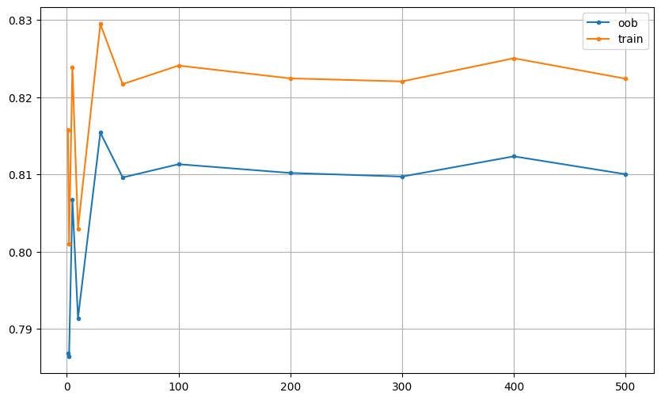
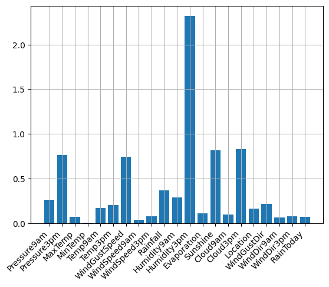
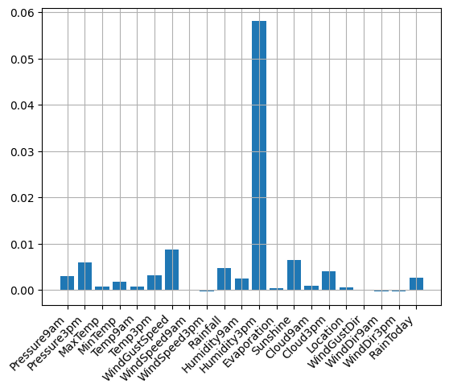

# Лабораторная работа №2

# Описание датасета
[Датасет](https://www.kaggle.com/datasets/jsphyg/weather-dataset-rattle-package) содержит метеорологические наблюдения по станциям Австралии и используется для бинарной классификации: нужно предсказать, будет ли дождь на следующий день (`RainTomorrow`).

В данных присутствуют количественные, категориальные и бинарные признаки, а также большое количество пропусков, поэтому датасет хорошо подходит для анализа ансамблевых методов.

- `Pressure9am`, `Pressure3pm` - атмосферное давление в 9:00 и 15:00.
- `MaxTemp`, `MinTemp`, `Temp9am`, `Temp3pm` - температурные признаки.
- `WindGustSpeed`, `WindSpeed9am`, `WindSpeed3pm` - характеристики скорости ветра.
- `Rainfall` - количество осадков за день.
- `Humidity9am`, `Humidity3pm` - влажность воздуха.
- `Cloud9am`, `Cloud3pm` - облачность.
- `Sunshine`, `Evaporation` - число часов солнца и испарение.
- `Location`, `WindGustDir`, `WindDir9am`, `WindDir3pm` - категориальные признаки.
- `RainToday` - бинарный признак наличия дождя в текущий день.

После удаления объектов с пропущенным целевым признаком осталось 142193 наблюдения: 110316 объектов класса `No` и 31877 объектов класса `Yes`.

По результатам EDA наибольшее число пропусков наблюдается в признаках `Sunshine`, `Evaporation`, `Cloud9am`, `Cloud3pm`, а также в показателях давления и направления ветра.

# Реализация алгоритма
В работе реализован ансамбль `Random Forest`. Лес состоит из набора деревьев решений, обучаемых на бутстрап-подвыборках объектов. Для каждого дерева случайно выбирается подмножество признаков размера `sqrt(m)`, где `m` - общее число признаков.

Предсказание ансамбля строится усреднением ответов отдельных деревьев с последующим округлением до класса `0/1`. В качестве базовой модели используется `DecisionTreeClassifier`.

Реализация включает следующие шаги:

- для каждого дерева генерируется bootstrap-выборка объектов;
- для каждого дерева случайно выбирается подмножество признаков;
- дерево обучается только на выбранных объектах и признаках;
- качество ансамбля оценивается по out-of-bag объектам;
- важность признаков считается через `OOB^j`: значение признака перемешивается, затем измеряется падение OOB-качества.

Используемая OOB-оценка:

$$
OOB = \frac{1}{|U_{oob}|} \sum_{i \in U_{oob}} [\hat y_i = y_i]
$$

Оценка важности признака через `OOB^j`:

$$
FI_j = \frac{OOB_j - OOB}{OOB} \cdot 100\%
$$

где `OOB_j` - качество после случайного перемешивания `j`-го признака на OOB-объектах. Визуализация в ноутбуке строится по модулю этого изменения.

Для подбора параметров использовался собственный `GridSearchEstimator`, который перебирает параметры через `ParameterGrid` из `sklearn` и выбирает лучшую конфигурацию по значению `compute_oob_score(...)`.

# Подбор гиперпараметров
Перебираемые параметры:

```
{
    "n_algorithms": [1, 3, 5, 10, 30, 50, 100],
    "max_depth": [3, 5, 10],
    "criterion": ["gini", "entropy"],
}
```

Лучшая конфигурация по OOB:

```
{'criterion': 'entropy', 'max_depth': 10, 'n_algorithms': 30}

OOB = 0.815
```

Зависимость качества от кол-ва деревьев в ансамбле:



# Важность признаков
Для собственной реализации важность оценивалась через permutation importance, основанном на изменении значения OOB:



Для эталонной реализации `sklearn` использовалась функция [permutation_importance](https://scikit-learn.org/stable/modules/generated/sklearn.inspection.permutation_importance.html):



Результаты важности немного отличаются, но это можно объяснить тем, что метод из sklearn для оценки [не поддерживает](https://scikit-learn.org/stable/modules/model_evaluation.html#string-name-scorers:~:text=evaluation%20for%20details.-,3.4.3.1.%20String%20name%20scorers,-%23) оценку по OOB, поэтому 
бралось значение для оценки accuracy.


Однако обе оценки показывают, что для прогноза дождя наиболее полезны признаки влажности, давления, облачности и накопленных осадков.

# Результаты экспериментов
Сравнивались кастомная реализация и `RandomForestClassifier` из `sklearn`. Для эталонной модели использовалась конфигурация:

```
RandomForestClassifier(
    n_estimators=30,
    criterion="entropy",
    max_depth=10,
    oob_score=True
)
```

Для корректной работы `sklearn` числовые признаки подавались после стандартной предобработки из `prepare_data.py`, категориальные признаки кодировались, а пропуски в числовых столбцах при нормализации заменялись медианой.

| Модель | OOB | Accuracy | F1 (weighted) | Precision | Recall | Время обучения, c |
|---|---:|---:|---:|---:|---:|---:|
| Собственная реализация Random Forest | 0.8150 | 0.8169 | 0.7693 | 0.8882 | 0.2094 | 4.17 |
| `RandomForestClassifier` (`sklearn`) | 0.8474 | 0.8497 | 0.8348 | 0.7773 | 0.4621 | 2.92 |

Матрицы ошибок из ноутбука:

- Собственная реализация: `[[21896, 168], [5040, 1335]]`
- `sklearn`: `[[21220, 844], [3429, 2946]]`

- **По качеству:** эталонная реализация `sklearn` лучше по всем основным метрикам, кроме precision. Кастомная модель пропускает существенно больше положительных объектов, поэтому recall значительно ниже. Это может быть связано с тем, что код обучения базовых алгоритмов может отличаться (генерация бутстрепа, отбор признаков и т.д.)
- **По OOB:** `sklearn` также показывает более высокую OOB-оценку, что согласуется с лучшим качеством на тестовой выборке.
- **По времени обучения:** на одинаковых параметрах эталонная реализация обучается быстрее, чем собственная реализация.
- **По важности признаков:** обе реализации выделяют схожий набор метеорологических факторов, но ранжирование отличается из-за разных способов оценки важности.

---

### Выводы

- Реализован метод `Random Forest` с bootstrap-обучением, случайным выбором подмножества признаков и агрегированием предсказаний деревьев.
- Подбор гиперпараметров выполнен через `grid search` из `sklearn`, а выбор лучшей конфигурации производился по OOB-оценке.
- Оценка важности признаков через `OOB^j` показала, что наибольший вклад в предсказание вносят давление, влажность и облачность.
- Собственная реализация работает корректно, но уступает `RandomForestClassifier` из `sklearn` как по качеству классификации, так и по скорости обучения.
- Эталонная реализация лучше обрабатывает структуру данных и дает более сбалансированный результат по precision/recall, поэтому для практического применения она предпочтительнее.

---
