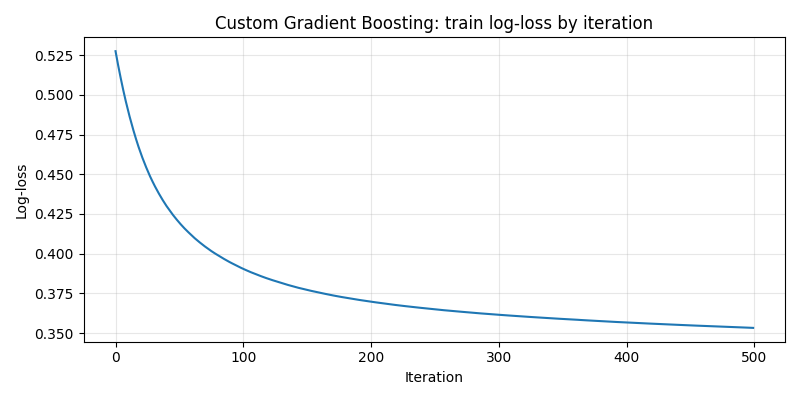

# Лабораторная работа №3

# Описание датасета
[Датасет](https://www.kaggle.com/datasets/jsphyg/weather-dataset-rattle-package) содержит метеорологические наблюдения по станциям Австралии и используется для бинарной классификации: нужно предсказать, будет ли дождь на следующий день (`RainTomorrow`).

В данных присутствуют количественные, категориальные и бинарные признаки.

- `Pressure9am`, `Pressure3pm` - атмосферное давление в 9:00 и 15:00.
- `MaxTemp`, `MinTemp`, `Temp9am`, `Temp3pm` - температурные признаки.
- `WindGustSpeed`, `WindSpeed9am`, `WindSpeed3pm` - характеристики скорости ветра.
- `Rainfall` - количество осадков за день.
- `Humidity9am`, `Humidity3pm` - влажность воздуха.
- `Cloud9am`, `Cloud3pm` - облачность.
- `Sunshine`, `Evaporation` - число часов солнца и испарение.
- `Location`, `WindGustDir`, `WindDir9am`, `WindDir3pm` - категориальные признаки.
- `RainToday` - бинарный признак наличия дождя в текущий день.

Значения Nan заполнялись медианой для количественных признаков, а также самым популярным значением для категориальных.

По результатам EDA наибольшее число пропусков наблюдается в признаках `Sunshine`, `Evaporation`, `Cloud9am`, `Cloud3pm`, а также в показателях давления и направления ветра.

# Реализация алгоритма
Реализован собственный алгоритм `GradientBoosting` для бинарной классификации с логистической функцией потерь:

1. Начальное приближение задается как логит доли положительного класса:
   $$ F_0 = \log \frac{p}{1-p} $$
2. На каждой итерации вычисляются псевдо-остатки:
   $$ r_i = y_i - \sigma(F(x_i)) $$
3. На псевдо-остатках обучается `DecisionTreeRegressor`.
4. Предсказание обновляется:
   $$F(x) \leftarrow F(x) + \eta \cdot h_m(x)$$
5. Итоговая вероятность:
   $$P(y=1|x)=\sigma(F(x))$$

Гиперпараметры кастомной модели:
```
GradientBoosting(
    n_estimators=500,
    learning_rate=0.1,
    max_depth=3,
    min_samples_leaf=5,
    subsample=0.8
)
```

График функции потерь во время обучения (зависимость от кол-ва деревьев):



# Кросс-валидация
Для оценки устойчивости качества использовалась стратифицированная кросс-валидация (`StratifiedKFold`) по 5 фолдам, метрики для оценки: `accuracy`, `f1_weighted`, `precision`, `recall`.

## Результаты кросс-валидации (усредненные по 5 фолдам)

| Модель | Accuracy | F1 (weighted) | Precision | Recall |
|---|---:|---:|---:|---:|
| Собственная `GradientBoosting` | 0.8477 | 0.8355 | 0.7436 | 0.4892 |
| `GradientBoostingClassifier` (`sklearn`) | 0.8563 | 0.8472 | 0.7506 | 0.5374 |

# Результаты экспериментов
Сравнивались кастомная реализация и `GradientBoostingClassifier` из `sklearn` на одинаковом числе итераций (`n_estimators=500`) и одинаковой скорости обучения (`learning_rate=0.1`).

Параметры эталонной модели:
```
GradientBoostingClassifier(
    n_estimators=500,
    learning_rate=0.1,
    max_depth=3,
    random_state=42
)
```

| Модель | Accuracy | F1 (weighted) | Precision | Recall | Время обучения, c |
|---|---:|---:|---:|---:|---:|
| Собственная `GradientBoosting` | 0.8470 | 0.8334 | 0.7527 | 0.4725 | 75.98 |
| `GradientBoostingClassifier` (`sklearn`) | 0.8559 | 0.8463 | 0.7540 | 0.5302 | 86.75 |

Матрицы ошибок:
- Собственная реализация: `[[8430, 396], [1345, 1205]]`
- `sklearn`: `[[8385, 441], [1198, 1352]]`

# Сравнение с эталонной реализацией
- **По качеству:** модель `sklearn` показывает более высокие `accuracy`, `f1` и особенно `recall`. Однако в целом значения сопоставимы.
- **По времени обучения:** в данном запуске кастомная реализация обучилась немного быстрее (`75.98 c` против `86.75 c`).

# Выводы
- Реализован алгоритм градиентного бустинга для бинарной классификации.
- Кастомная модель показывает сопоставимое с эталонной реализацией качество.
- Эталонная реализация `GradientBoostingClassifier` дает более высокое общее качество (accuracy, f1, recall) и более стабильные результаты по кросс-валидации.
---
