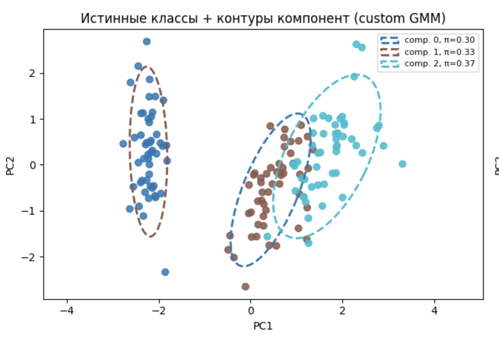
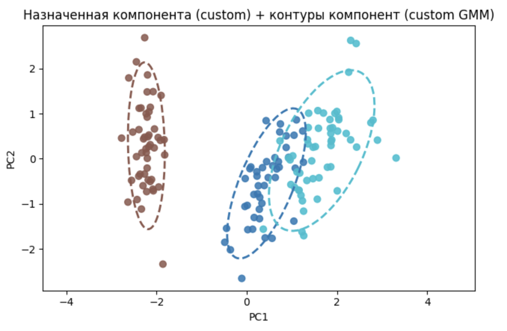
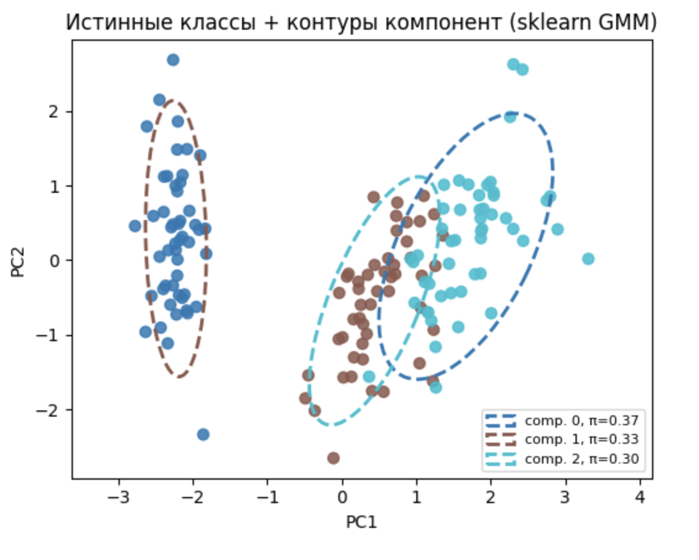

# Лабораторная работа №4

# Описание датасета

В качестве данных использован встроенный датасет **Iris** из `sklearn.datasets`. Он содержит 150 наблюдений и 4 числовых признака, описывающих чашелистик и лепесток ириса. Целевая переменная — один из трёх видов (`setosa`, `versicolor`, `virginica`).

Признаки:

- `sepal length (cm)` — длина чашелистика;
- `sepal width (cm)` — ширина чашелистика;
- `petal length (cm)` — длина лепестка;
- `petal width (cm)` — ширина лепестка.

Перед обучением GMM все признаки стандартизированы (`StandardScaler`). Модель обучалась на всей выборке (150 объектов), число компонент смеси задано равным числу классов: `n_components = 3`.

# Реализация алгоритма

Реализована **гауссовская смесь (GMM)** с полными ковариационными матрицами. Параметры каждой компоненты $k$: вес $\pi_k$, вектор среднего $\mu_k$ и ковариация $\Sigma_k$. Плотность смеси:

$$
p(x) = \sum_{k=1}^{K} \pi_k  \mathcal{N}(x \mid \mu_k, \Sigma_k).
$$

Обучение выполняется **EM-алгоритмом** (expectation–maximization):

1. **E-шаг:** для каждого объекта $x_i$ вычисляются апостериорные веса принадлежности к компонентам (ответственности)
  $$\gamma_{ik} = \frac{\pi_k  \mathcal{N}(x_i \mid \mu_k, \Sigma_k)}{\sum_{j=1}^{K} \pi_j  \mathcal{N}(x_i \mid \mu_j, \Sigma_j)}.$$
2. **M-шаг:** обновляются $\pi_k$, $\mu_k$ и $\Sigma_k$ по взвешенным оценкам максимального правдоподобия; к $\Sigma_k$ добавляется регуляризация $10^{-6} I$ для устойчивости.
3. Итерации продолжаются, пока прирост **логарифмического правдоподобия** $\mathcal{L} = \sum_i \log p(x_i)$ не станет меньше порога `tol = 1e-4`.

Инициализация — **KMeans** (`init_type='kmeans'`): центры кластеров задают $\mu_k$, выборочные ковариации внутри кластеров — $\Sigma_k$, веса компонент — равномерные $1/K$.

Код реализации: `gmm.py`. Эксперименты и визуализация: `sandbox.ipynb`.

Гиперпараметры кастомной модели:

```
GMM(n_components=3, max_iter=100)
# init_type='kmeans', tol=1e-4
```

Эталонная модель:

```
GaussianMixture(n_components=3)
```

# Оценка по принципу максимума правдоподобия (ПМП)

Качество подгонки плотности оценивалось по **суммарному логарифмическому правдоподобию** на обучающей выборке:

$$
\mathcal{L} = \sum_{i=1}^{n} \log \sum_{k=1}^{K} \pi_k  \mathcal{N}(x_i \mid \mu_k, \Sigma_k).
$$


| Модель                        | $\mathcal{L}$ (сумма) | Число итераций EM |
| ----------------------------- | --------------------- | ------------------------- |
| Собственная `GMM`             | −290.531              | 26                |
| `GaussianMixture` (`sklearn`) | −290.543              | 19                |


Веса компонент после обучения:


| Компонента | Собственная GMM | sklearn |
| ---------- | --------------- | ------- |
| 0          | 0.299           | 0.333   |
| 1          | 0.333           | 0.301   |
| 2          | 0.367           | 0.366   |


# Результаты экспериментов

Поскольку GMM — модель **без учителя**, для сравнения с разметкой Iris кластерные метки сопоставлялись с истинными классами перебором перестановок (максимум совпадений на матрице сопряжённости).


| Модель                        | Accuracy (сопоставление меток) |
| ----------------------------- | ------------------------------ |
| custom GMM          | 0.9667                         | 0.904 |
| sklearn GMM | 0.9667                         | 0.904 |


# Визуализация гауссовских компонент

На графиках ниже данные спроецированы на первые две главные компоненты (PCA). Пунктирные эллипсы — сечения ковариаций компонент смеси (уровень $\approx 2\sigma$ в 2D).

Истинные классы и контуры компонент (собственная GMM)


Назначенные классы и те же контуры:



Истинные классы и контуры компонент (`sklearn`):



# Выводы

- Реализован EM-алгоритм для GMM с полными ковариациями и инициализацией через KMeans.
- На датасете Iris восстановлена смесь из трёх гауссовых компонент; логарифмическое правдоподобие сопоставимо с `GaussianMixture` из `sklearn`.
- Кластеризация отражает структуру данных: setosa отделён почти безошибочно, versicolor и virginica частично перекрываются, что видно и на эллипсах в пространстве PCA.
- Собственная реализация подтверждает корректность EM-шага, но для практики предпочтительнее эталонная библиотечная модель из-за скорости и численной устойчивости.

---

