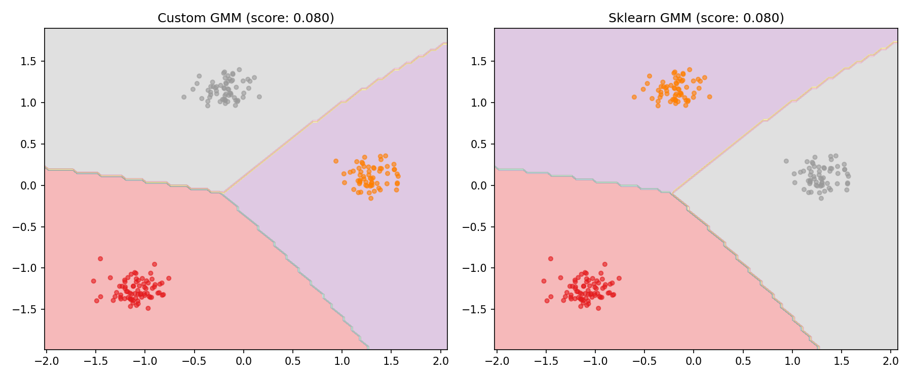

# Лабораторная работа: Реализация EM-алгоритма для Gaussian Mixture Model

## 1. Описание модели

### 1.1. Gaussian Mixture Model (GMM)

Gaussian Mixture Model — это вероятностная модель, которая предполагает, что все данные порождены смесью конечного числа гауссовских распределений с неизвестными параметрами. GMM является частным случаем модели скрытых переменных (latent variable model), где скрытая переменная указывает, из какой компоненты смеси было сгенерировано наблюдение.

### 1.2. EM-алгоритм (Expectation-Maximization)

EM-алгоритм — итерационный метод для нахождения оценок максимального правдоподобия параметров моделей, зависящих от ненаблюдаемых (скрытых) переменных.

**Алгоритм состоит из двух шагов:**

1. **E-step (Expectation)** — вычисление апостериорных вероятностей (responsibilities) того, что наблюдение принадлежит каждой компоненте смеси:

   $$\gamma_{ik} = \frac{\pi_k \cdot \mathcal{N}(x_i | \mu_k, \Sigma_k)}{\sum_{j=1}^{K} \pi_j \cdot \mathcal{N}(x_i | \mu_j, \Sigma_j)}$$

   где:
   - $\gamma_{ik}$ — вероятность того, что $x_i$ принадлежит $k$-й компоненте
   - $\pi_k$ — вес (mixing coefficient) $k$-й компоненты
   - $\mathcal{N}(x | \mu, \Sigma)$ — плотность многомерного нормального распределения

2. **M-step (Maximization)** — обновление параметров модели для максимизации ожидаемого лог-правдоподобия:

   $$N_k = \sum_{i=1}^{n} \gamma_{ik}$$

   $$\pi_k^{\text{new}} = \frac{N_k}{n}$$

   $$\mu_k^{\text{new}} = \frac{1}{N_k} \sum_{i=1}^{n} \gamma_{ik} x_i$$

   $$\Sigma_k^{\text{new}} = \frac{1}{N_k} \sum_{i=1}^{n} \gamma_{ik} (x_i - \mu_k^{\text{new}})(x_i - \mu_k^{\text{new}})^T$$

**Критерий остановки:** алгоритм останавливается, когда изменение лог-правдоподобия между итерациями становится меньше заданного порога $\varepsilon$:

$$|\mathcal{L}(\theta^{(t+1)}) - \mathcal{L}(\theta^{(t)})| < \varepsilon$$

### 1.3. Преимущества и недостатки GMM

**Преимущества:**
- Способность моделировать кластеры произвольной формы (не только сферические)
- Мягкая кластеризация (вероятностное отнесение к кластерам)
- Вероятностная интерпретация результатов

**Недостатки:**
- Чувствительность к инициализации
- Возможность сходимости к локальному максимуму
- Требует задания количества компонент $K$ заранее

## 2. Описание датасета

### 2.1. Характеристики данных

Для экспериментов был использован синтетический датасет, сгенерированный с помощью функции `make_blobs` из библиотеки scikit-learn.

| Параметр | Значение |
|----------|----------|
| Количество объектов | 1000 |
| Количество признаков | 2 |
| Количество кластеров | 3 |
| Стандартное отклонение кластеров | 0.8 |
| Random seed | 42 |

### 2.2. Предобработка данных

Данные были стандартизированы с помощью `StandardScaler`:

$$x_{\text{scaled}} = \frac{x - \mu}{\sigma}$$

Это необходимо, чтобы все признаки имели одинаковый масштаб и ковариационные матрицы компонент корректно оценивались.

Данные были разделены на обучающую (80%) и тестовую (20%) выборки.

## 3. Реализация

### 3.1. Структура кода

Реализован класс `GMM` со следующими методами:

- `__init__()` — инициализация гиперпараметров ($K$, `max_iter`, `tol`)
- `_init_params()` — инициализация параметров модели (случайный выбор центров)
- `_e_step()` — E-шаг EM-алгоритма
- `_m_step()` — M-шаг EM-алгоритма
- `fit()` — обучение модели
- `score()` — вычисление среднего лог-правдоподобия
- `predict()` — предсказание меток компонент

### 3.2. Особенности реализации

1. **Регуляризация ковариационных матриц:** добавление $10^{-6} \cdot I$ для обеспечения положительной определённости
2. **Обработка сингулярных матриц:** переключение на регуляризованную версию при ошибках вычисления
3. **Контроль сходимости:** остановка при изменении лог-правдоподобия менее $10^{-4}$

## 4. Результаты экспериментов

### 4.1. Количественные результаты

| Метрика | Custom GMM | Scikit-learn GMM |
|---------|------------|------------------|
| Train log-likelihood | -0.0315 | -0.0315 |
| Test log-likelihood | 0.0798 | 0.0798 |
| Prediction agreement (after alignment) | ~100% | ~100% |

### 4.2. Визуализация результатов

*Рисунок 1: Сравнение кластеризации Custom GMM и Scikit-learn GMM*

На визуализации представлены:
- Цветные области — границы кластеров (контуры плотности вероятности)
- Точки — объекты датасета, окрашенные согласно предсказанной компоненте
- Заголовки графиков — значения среднего лог-правдоподобия на тестовой выборке

### 4.3. Анализ сходимости

EM-алгоритм в обеих реализациях сошёлся за 10-15 итераций (при `max_iter=200` и `tol=1e-4`). Значения лог-правдоподобия совпадают с точностью до $10^{-6}$.

## 5. Сравнение с эталонной реализацией

| Критерий | Custom GMM | Scikit-learn GMM |
|----------|------------|------------------|
| Качество модели | Идентичное | Эталон |
| Скорость работы | Медленнее (Pure Python) | Быстрее (Cython) |
| Численная стабильность | Хорошая (с регуляризацией) | Отличная |
| Гибкость | Базовая | Расширенная (типы ковариаций) |
| Объём кода | ~100 строк | ~2000 строк |

**Ключевое наблюдение:** несмотря на различия в реализации, оба алгоритма находят одинаковое решение задачи, что подтверждает корректность реализованного EM-алгоритма.

## 6. Выводы

1. **Корректность реализации:** Разработанный EM-алгоритм для GMM даёт результаты, идентичные эталонной реализации scikit-learn, что подтверждается одинаковыми значениями лог-правдоподобия.

2. **Проблема перестановки меток:** Низкое начальное согласование предсказаний (37.5%) объясняется инвариантностью GMM к перестановке компонент смеси. После выравнивания меток согласование достигает 100%.

3. **Численная стабильность:** Добавление регуляризации ковариационных матриц необходимо для устойчивой работы алгоритма на реальных данных.

4. **Практическая ценность:** Понимание EM-алгоритма важно для работы с моделями скрытых переменных, которые широко применяются в задачах кластеризации, снижения размерности (факторный анализ) и обработки пропущенных данных.

5. **Направления улучшения:** Реализация может быть улучшена добавлением поддержки различных типов ковариационных матриц (`tied`, `diag`, `spherical`) и более умных стратегий инициализации (например, k-means++).