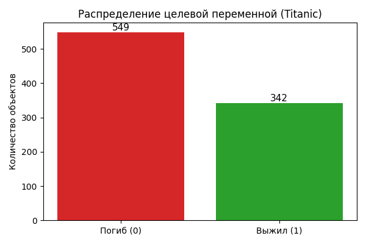
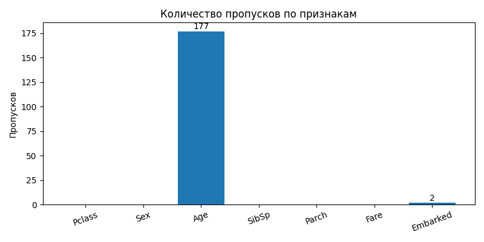
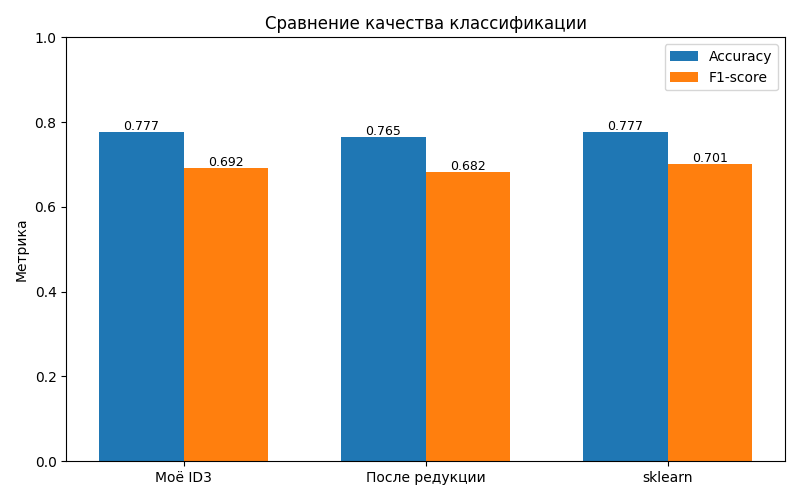
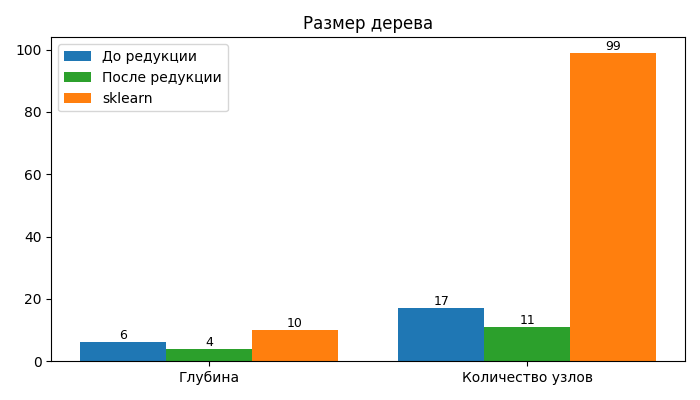

# Лабораторная работа №1. Логическая классификация

## Описание алгоритма

Реализован алгоритм построения бинарного решающего дерева **ID3 с критерием Джини**.

Критерий Джини: `Gini(S) = 1 - sum(p_k^2)`, где `p_k` -- доля объектов класса `k` в подвыборке `S`. Прирост информации (Gini gain) считается как разность Gini родителя и взвешенного среднего Gini потомков.

Особенности реализации:

- **Бинарные разбиения** для числовых и категориальных признаков (для категориальных -- по принципу `value == threshold` / `value != threshold`).
- **Обработка пропусков** через вероятностную оценку: при предсказании объект с NaN направляется в обе ветки с весами, пропорциональными размерам подвыборок (`left_ratio`). Это позволяет работать с сырыми данными без императивного заполнения.
- **Редукция дерева** методом Reduced Error Pruning на валидационной выборке: для каждого внутреннего узла снизу вверх пробуем заменить поддерево листом; если accuracy на узловой подвыборке не падает -- редукция остаётся.

## Описание датасета

**Titanic** ([raw csv](https://raw.githubusercontent.com/datasciencedojo/datasets/master/titanic.csv)):

- 891 объект
- Целевая переменная: `Survived` (бинарная классификация)
- Признаки: `Pclass`, `Sex`, `Age`, `SibSp`, `Parch`, `Fare`, `Embarked`
- 179 пропусков (преимущественно `Age`, реже `Embarked`)
- Смесь категориальных (`Pclass`, `Sex`, `Embarked`) и количественных (`Age`, `SibSp`, `Parch`, `Fare`) признаков

Разбиение: 60% train / 20% val / 20% test со стратификацией по целевой переменной.

## Результаты экспериментов

Запуск: `python source/lab1.py`.

| Метрика              | Моё ID3 | После редукции | sklearn |
|----------------------|---------|----------------|---------|
| Accuracy             | 0.7765  | 0.7654         | 0.7765  |
| F1-score             | 0.6923  | 0.6818         | 0.7015  |
| Глубина              | 6       | 4              | 10      |
| Узлов                | 17      | 11             | 99      |
| Время обучения (сек) | 0.049   | --             | 0.001   |

## Сравнение с эталонной реализацией

Эталон -- `sklearn.tree.DecisionTreeClassifier(max_depth=10, min_samples_leaf=5)`. Для sklearn пропуски заполнены медианами (sklearn не принимает NaN), моя реализация работает с пропусками напрямую через вероятностное разветвление.

По accuracy моё дерево не уступает sklearn (0.7765 в обоих случаях), F1 у sklearn чуть выше (0.7015 vs 0.6923) за счёт большей и более глубокой структуры. После редукции дерево становится в ~2 раза компактнее (17 → 11 узлов, глубина 6 → 4) с минимальной потерей качества.

## Выводы

- ID3 с критерием Джини показывает результаты, сопоставимые с эталоном sklearn по accuracy.
- Редукция Reduced Error Pruning существенно уменьшает размер дерева (на ~35% узлов) при потере менее 1.5 п.п. accuracy -- хороший трейд-офф для интерпретируемости и устойчивости к переобучению.
- Вероятностная обработка пропусков работает корректно и не требует предварительной импьютации.
- Sklearn строит существенно более крупное (99 узлов против 17) и глубокое (10 vs 6) дерево, но прирост качества несоразмерен росту сложности.
