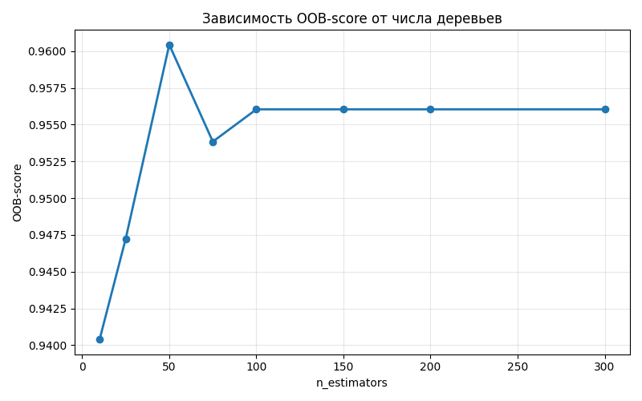
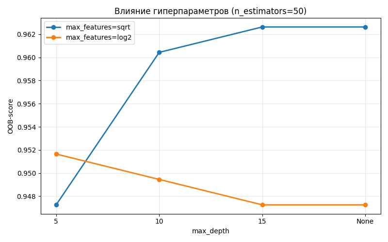
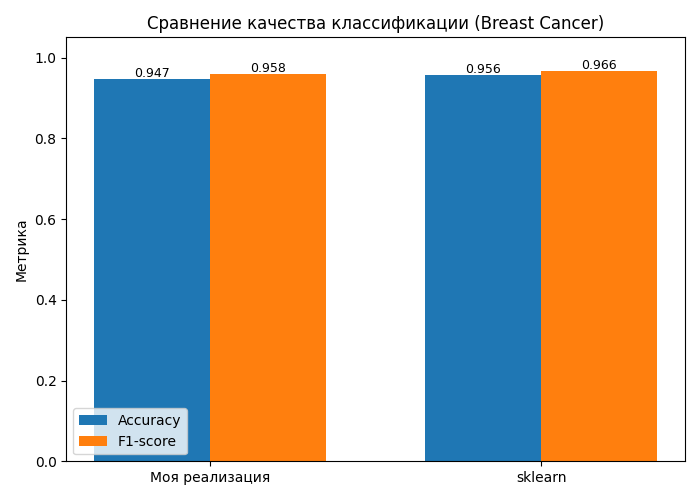
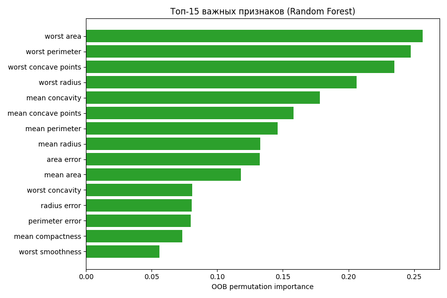

# Лабораторная работа №2. Ансамбли моделей

## Описание метода

Реализован **Random Forest** -- ансамбль решающих деревьев с двумя независимыми элементами рандомизации:

1. **Bootstrap (бэггинг)**: каждое дерево обучается на выборке размера `n_samples`, полученной случайным сэмплированием с возвращением.
2. **Метод случайных подпространств (RSM)**: каждому дереву подаётся случайное подмножество размера `m` из исходных признаков. По умолчанию `m = sqrt(n_features)`.

Базовые модели -- `DecisionTreeClassifier` из sklearn (как разрешено заданием). Финальное предсказание -- усреднение `predict_proba` каждого дерева на его подмножестве признаков и `argmax`.

### OOB-оценка качества

Объекты, не попавшие в bootstrap-выборку конкретного дерева (**Out-of-Bag**), используются для оценки качества: на них дерево даёт независимое предсказание. Итоговая OOB-метрика -- доля корректно классифицированных объектов после усреднения голосов деревьев, для которых объект был OOB. Это позволяет подбирать гиперпараметры **без отдельной валидационной выборки**.

### Важность признаков (OOB permutation importance)

Для каждого признака `j`: в OOB-выборках каждого дерева перемешиваем значения признака `j` и смотрим, насколько падает accuracy дерева. Усредняем по всем деревьям, у которых `j` входил в подпространство.

## Описание датасета

**Breast Cancer Wisconsin** (из `sklearn.datasets.load_breast_cancer`):

- 569 объектов, 30 числовых признаков
- Бинарная классификация: доброкачественная (357) / злокачественная (212) опухоль
- Сбалансированный датасет

Разбиение: 80% train / 20% test со стратификацией.

## Результаты экспериментов

Запуск: `python source/lab2.py`.

### Подбор гиперпараметров

Grid search по OOB-score:

- `n_estimators ∈ {50, 100, 200}`
- `max_depth ∈ {5, 10, 15, None}`
- `max_features ∈ {'sqrt', 'log2'}`

**Лучшие параметры**: `n_estimators=50, max_depth=15, max_features='sqrt'`. Лучший OOB-score: **0.9626**.

OOB выходит на плато после ~50 деревьев -- увеличение `n_estimators` дальше даёт минимальный прирост качества.

### Финальное качество

| Метрика              | Моя реализация | sklearn |
|----------------------|----------------|---------|
| Accuracy (test)      | 0.9474         | 0.9561  |
| F1-score (test)      | 0.9583         | 0.9655  |
| OOB-score (train)    | 0.9626         | --      |
| Время обучения (сек) | 0.064          | 0.072   |

### Важность признаков

Топ-10 по OOB permutation importance:

| Признак              | Важность |
|----------------------|----------|
| worst area           | 0.2566   |
| worst perimeter      | 0.2474   |
| worst concave points | 0.2350   |
| worst radius         | 0.2064   |
| mean concavity       | 0.1784   |
| mean concave points  | 0.1582   |
| mean perimeter       | 0.1459   |
| mean radius          | 0.1329   |
| area error           | 0.1323   |
| mean area            | 0.1181   |

Лидируют "worst"-агрегаты (максимальные значения по объекту) -- это согласуется с медицинским смыслом задачи: злокачественные опухоли имеют экстремальные значения геометрических характеристик клеток.

## Сравнение с эталонной реализацией

Эталон -- `sklearn.ensemble.RandomForestClassifier` с теми же гиперпараметрами. По test-метрикам моя реализация уступает sklearn в пределах 1 п.п. (Accuracy 0.9474 vs 0.9561, F1 0.9583 vs 0.9655). Время обучения сопоставимое -- моя реализация даже немного быстрее (0.064 vs 0.072 сек), но это в рамках погрешности и зависит от warm-up.

OOB-score моей реализации (0.9626) выше, чем итоговый test accuracy -- это нормально и говорит о небольшом смещении между распределениями train и test.

## Выводы

- Random Forest показывает результаты, сопоставимые с эталоном sklearn по всем метрикам в пределах статистической погрешности.
- OOB-оценка позволяет подбирать гиперпараметры без отдельной валидационной выборки -- очень удобно для небольших датасетов.
- Permutation importance уверенно выделяет наиболее информативные признаки (преимущественно "worst"-агрегаты), что согласуется с природой задачи.
- Уже 50 деревьев достаточно для выхода OOB на плато на этом датасете.
