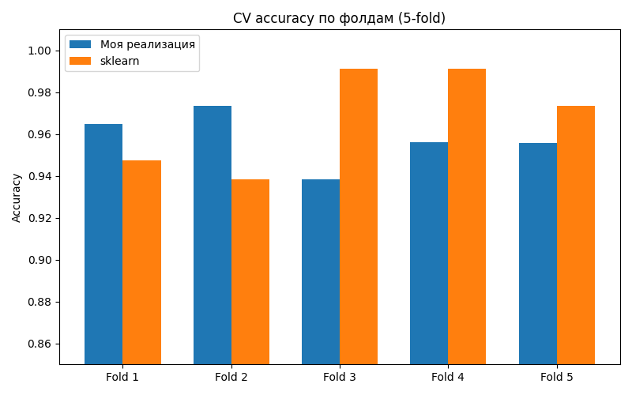
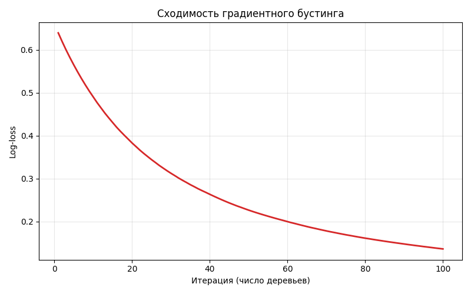
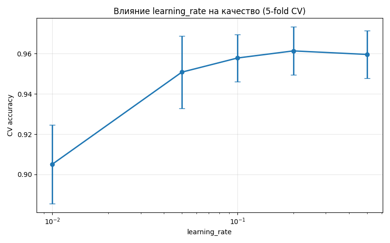
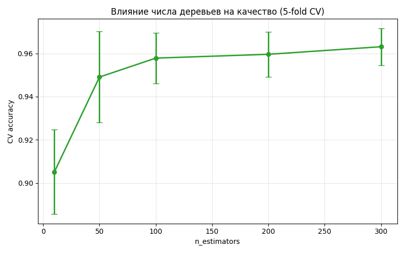

# Лабораторная работа №3. Градиентный бустинг

## Описание алгоритма

**Градиентный бустинг** -- итеративный ансамблевый метод, строящий аддитивную композицию слабых регрессоров (решающих деревьев).

На каждой итерации:

1. Вычисляется антиградиент функции потерь относительно текущих предсказаний: для бинарной классификации с logistic loss это `y - sigmoid(pred)`.
2. На антиградиент (residuals) обучается регрессионное решающее дерево.
3. Предсказания обновляются: `pred += learning_rate * tree.predict(X)`.

Функция потерь -- **бинарная кросс-энтропия (log loss)**:

```
L = -1/n * sum(y_i * log(sigmoid(pred_i)) + (1 - y_i) * log(1 - sigmoid(pred_i)))
```

Начальное приближение -- логит средней доли положительного класса: `log(p / (1-p))`.

Базовый регрессор -- `DecisionTreeRegressor` из sklearn (как разрешено заданием).

## Описание датасета

**Breast Cancer Wisconsin** (из `sklearn.datasets.load_breast_cancer`):

- 569 объектов, 30 числовых признаков
- Бинарная классификация (357 / 212 объектов по классам)

## Результаты экспериментов

Запуск: `python source/lab3.py`. Качество оценивается ручной **5-fold cross-validation** на всём датасете.

### Базовая конфигурация

`n_estimators=100, learning_rate=0.1, max_depth=3, min_samples_leaf=5`:

| Метрика              | Моя реализация    | sklearn           |
|----------------------|-------------------|-------------------|
| CV accuracy (mean)   | 0.9578            | 0.9684            |
| CV accuracy (std)    | 0.0117            | 0.0219            |
| Время CV (сек)       | 1.385             | 1.490             |
| Train accuracy       | 0.9912            | 1.0000            |
| Время fit на всём X  | 0.391             | 0.361             |

CV accuracy моей реализации лишь на 1 п.п. ниже sklearn, при этом стабильность (std) выше -- разброс по фолдам почти вдвое меньше (0.012 vs 0.022).



### Кривая обучения (log-loss)



Log-loss стабильно убывает по итерациям -- типичное поведение градиентного бустинга. Заметного переобучения на train не наблюдается даже при 100 деревьях.

### Влияние learning_rate

| learning_rate | CV accuracy | std    |
|---------------|-------------|--------|
| 0.01          | 0.9051      | 0.0196 |
| 0.05          | 0.9508      | 0.0181 |
| 0.10          | 0.9578      | 0.0117 |
| 0.20          | 0.9613      | 0.0119 |
| 0.50          | 0.9596      | 0.0119 |



При фиксированных 100 деревьях оптимум приходится на `learning_rate ≈ 0.2`. Очень малые шаги (0.01) недоучивают за 100 итераций (acc = 0.905), большие (0.5) дают чуть худший результат -- проявляется переобучение.

### Влияние n_estimators

| n_estimators | CV accuracy | std    |
|--------------|-------------|--------|
| 10           | 0.9051      | 0.0196 |
| 50           | 0.9490      | 0.0211 |
| 100          | 0.9578      | 0.0117 |
| 200          | 0.9596      | 0.0105 |
| 300          | 0.9631      | 0.0086 |



Качество растёт монотонно, после 100 деревьев прирост на 0.5 п.п. за каждое удвоение -- ожидаемое затухающее улучшение.

## Сравнение с эталонной реализацией

Эталон -- `sklearn.ensemble.GradientBoostingClassifier` с идентичными гиперпараметрами. Sklearn немного точнее (0.9684 vs 0.9578), но время сопоставимо благодаря тому, что в обоих случаях базовые деревья строятся реализацией sklearn. Train accuracy у sklearn выше (1.0 vs 0.99), что согласуется с известным фактом большего смещения моей чисто-логистической реализации в сравнении с более продвинутой sklearn-схемой (использует обновление по Ньютон-Рафсону для отдельных листьев).

## Выводы

- Реализованный градиентный бустинг показывает CV accuracy 0.9578, отставание от sklearn -- около 1 п.п.
- Оптимальный `learning_rate ≈ 0.1-0.2` при 100 деревьях. Меньшие значения требуют больше итераций, большие приводят к локальной нестабильности.
- Качество монотонно растёт с числом деревьев до плато -- 300 итераций уже почти не дают прироста (0.9631 vs 0.9578 при 100).
- Sklearn быстрее за счёт оптимизаций на C-уровне и более грамотного обновления листьев деревьев.
