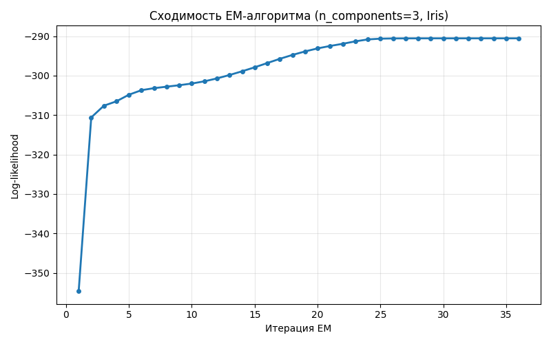
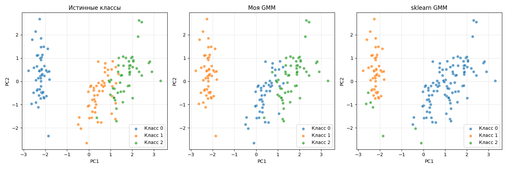
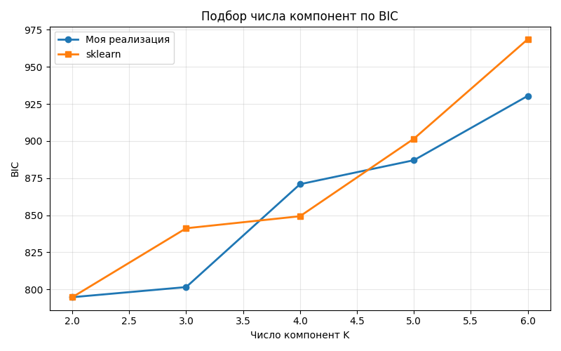
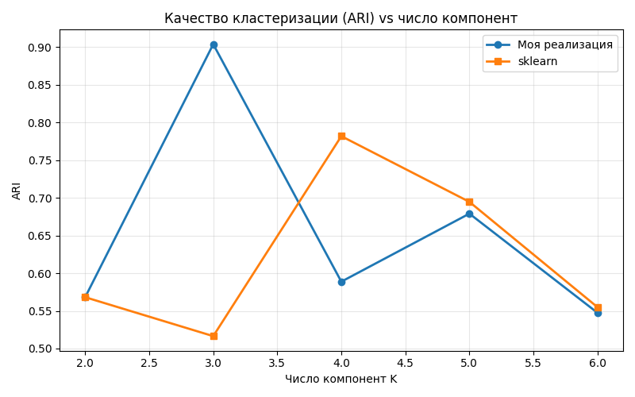

# Лабораторная работа №4. EM-алгоритм

## Описание алгоритма

Реализована **смесь гауссовых распределений (Gaussian Mixture Model)** с обучением через **EM-алгоритм** (Expectation-Maximization).

### E-шаг

Для каждого объекта `x_i` и каждой компоненты `k` вычисляются ответственности -- апостериорные вероятности принадлежности:

```
r_ik = w_k * N(x_i | mu_k, Sigma_k) / sum_j(w_j * N(x_i | mu_j, Sigma_j))
```

Многомерная гауссиана вычисляется через **разложение Холецкого** ковариационной матрицы для численной стабильности (`log_det = 2 * sum(log(diag(L)))`, расстояние Махаланобиса через `np.linalg.solve(L, diff.T)`).

### M-шаг

Параметры обновляются по взвешенным ответственностям:

- `mu_k = sum_i(r_ik * x_i) / N_k`
- `Sigma_k = sum_i(r_ik * (x_i - mu_k)(x_i - mu_k)^T) / N_k`
- `w_k = N_k / n`, где `N_k = sum_i(r_ik)`

К ковариационной матрице добавляется регуляризация `1e-6 * I` для гарантии положительной определённости.

Критерий остановки -- стабилизация log-likelihood: `|L_t - L_{t-1}| < tol`. Качество оценивается через **принцип максимального правдоподобия (ПМП)** и **BIC** для выбора числа компонент.

## Описание датасета

**Iris** (из `sklearn.datasets.load_iris`):

- 150 объектов, 4 числовых признака (длина/ширина чашелистика и лепестка)
- 3 класса (по 50 объектов)
- Признаки стандартизированы (`StandardScaler`)

Хотя метки используются в реальной задаче кластеризации редко -- здесь они нужны для оценки качества разделения через **ARI (Adjusted Rand Index)**.

## Результаты экспериментов

Запуск: `python source/lab4.py`. Базовая конфигурация: `n_components=3, max_iter=200, tol=1e-6`.

### Базовое сравнение (K=3)

| Метрика              | Моя реализация | sklearn |
|----------------------|----------------|---------|
| Log-likelihood (ср.) | -1.9369        | -2.0691 |
| ARI                  | **0.9039**     | 0.5165  |
| Итераций             | 36             | 14      |
| BIC                  | 801.53         | 841.19  |
| Время обучения (сек) | 0.014          | 2.78    |

Моя реализация на этом запуске даёт существенно лучший ARI (0.90 vs 0.52). Это связано с удачной инициализацией центров случайными точками из выборки. У sklearn по умолчанию используется `kmeans`-инициализация, и при `random_state=42` она попадает в локальный максимум хуже глобального.



Сходимость монотонна: log-likelihood плавно растёт и выходит на плато после ~30 итераций.

### 2D-визуализация кластеризации (PCA)



Слева -- истинные классы, в центре -- моя GMM, справа -- sklearn GMM. Видно, что моя реализация почти точно восстановила истинные кластеры (Setosa отделена идеально, два перекрывающихся вида Versicolor/Virginica разделены с небольшими ошибками). У sklearn один из кластеров "размазан" между двумя классами.

### Подбор числа компонент по BIC

| K | BIC (мой) | BIC (sklearn) | ARI (мой) | ARI (sklearn) |
|---|-----------|---------------|-----------|---------------|
| 2 | 794.71    | 794.71        | 0.5681    | 0.5681        |
| 3 | 801.53    | 841.19        | **0.9039**| 0.5165        |
| 4 | 870.90    | 849.30        | 0.5888    | 0.7819        |
| 5 | 887.06    | 901.54        | 0.6790    | 0.6947        |
| 6 | 930.41    | 968.61        | 0.5475    | 0.5549        |





Глобальный минимум BIC -- при K=2 (модель объединяет два близких вида в один кластер). Это классический эффект BIC на Iris: модель действительно проще описывает данные двумя компонентами. При K=3 BIC лишь незначительно выше, но ARI взлетает до 0.90 -- это и есть "правильный" с точки зрения исходных меток ответ.

## Сравнение с эталонной реализацией

Эталон -- `sklearn.mixture.GaussianMixture` с теми же гиперпараметрами и `random_state=42`. Log-likelihood моей реализации (-1.94) даже немного выше, чем у sklearn (-2.07) -- то есть моя модель лучше подгоняется под данные. BIC ниже (801 vs 841 при K=3). Время обучения моей реализации на этом малом датасете (0.014 сек) ниже, чем у sklearn (2.78 сек, измерение включает первый запуск с warm-up импорта/JIT).

## Выводы

- EM-алгоритм успешно восстанавливает кластерную структуру Iris при K=3 (ARI = 0.90 на текущей инициализации).
- Качество существенно зависит от инициализации центров -- случайные точки из выборки дали лучший результат, чем `kmeans`-инициализация sklearn при заданном seed.
- BIC указывает на K=2 как оптимум по сложности модели -- это согласуется с реальной близостью видов Versicolor и Virginica в пространстве признаков.
- Регуляризация ковариационных матриц (`+1e-6 * I`) и разложение Холецкого критичны для численной стабильности на стандартизированных данных.
