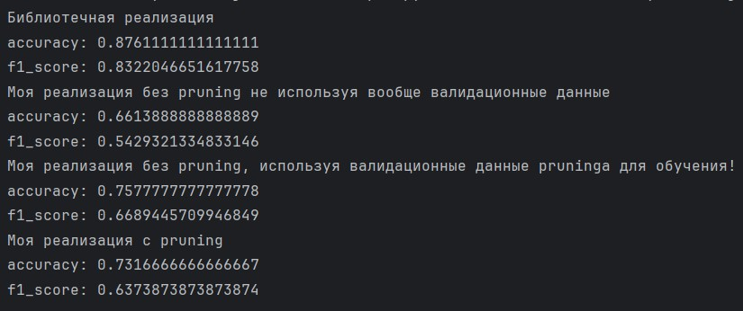
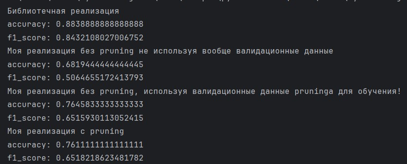

Лабораторная работа №1. Логическая классификация.
1)	Был выбран синтетический data set с Kaggle об успеваемости студентов. Таргет завершит ли студент онлайн курс. 9000 строк данных!
https://www.kaggle.com/datasets/rabieelkharoua/predict-online-course-engagement-dataset?resource=download
Категориальный признак, какой курс будет завершен здесь есть.
Остальные числовые.
Для нашего алгоритма, мы так же переведем Device Type в категориальный отдельно, т.к у него всего 2 значения и его можно считать категориальным. Не стоит применять к нему наш специальный алгоритм по превращению числовые признаков в категориальные.
Пропуски создаются искусственно! Изначально в дата сете их нет.

2)	Построено ID3 дерево с критерием Джинни.
То есть, по сути, оно представляет из себя небинарное дерево, которое работает только с категориальными признаками и на шаге ветвления выделяет по вершине для каждого значения категории у признака.
Числовые признаки предварительно превращены в категориальные, у которых по 3 значения. Алгоритм таков, что примерно треть самых маленьких значений получают категорию A, треть самых больших категорию C, средняя треть B. Nan значения обрабатываются отдельно.

3)	Пропущенные значения обработаны так, что, когда мы в вершине делим данные на несколько веток, то примеры, у которых по категории деления стоят None значения отправляются во все ветки с весовыми коэффициентами равными вероятностям случайно провалиться в каждую из веток. Далее при предсказании конечных значений и при pruning мы так же учитываем все элементы по их весам
   
4)	Алгоритм редукции – pruning. Тренировочные данные, не в полном объеме используются в построении дерева. Они делятся на тренировочные и валидационные. На тренировочных строиться дерево, а на валидационных обрезается. Мы начинаем от нижних вершин. И проверяем, как лучше оставлять все как есть или же взять и заменить внутреннюю вершину на лист.
Сначала я так же рассматривал еще доп вариант с возможностью замены родительской вершины на одну из детских, но тогда программа выполнялась крайне долго из-за необходимости выполнения огромного количества предсказаний, начиная с каждой из вершин. И от этой идее я в итоговом варианте дерева отказался.

5) Decision Tree из sklearn оказался неспособным работать с категориальными признаками и пропусками. Поэтому выбор пал на библиотеку catboost. Чтобы получить 1 дерево, а не ансамбль бустинга, была поставлена настройка с 1 итерацией.
Решающее дерево, которое строят catboost и sklearn отличается от нашего, оно бинарное и гибче может разбивать на пороги числовые признаки.
Ожидаемо, результат catboost дерева оказался лучше.
Также у него другой алгоритм обработки None и заранее выбранная глубина  (была подобрана наилучшая для нашего дата сета опытным путем)

6)	Результаты, если использовать 50% не тестовых данных, как тренировочные и 50% не тестовых, как валидационные, для pruning

Результаты, если использовать 80% не тестовых данных, как тренировочные и 20% не тестовых, как валидационные, для pruning

 

Так как pruning требует использования части тренировочных данных на обрезку дерева, то это не обязательно улучшает метрики. Эксперимент показал, что если взять слишком много данных для редукции, то результат вообще может оказаться хуже. Если взять 20% данных для pruning, с моим набором данных это оказывается лучше.
