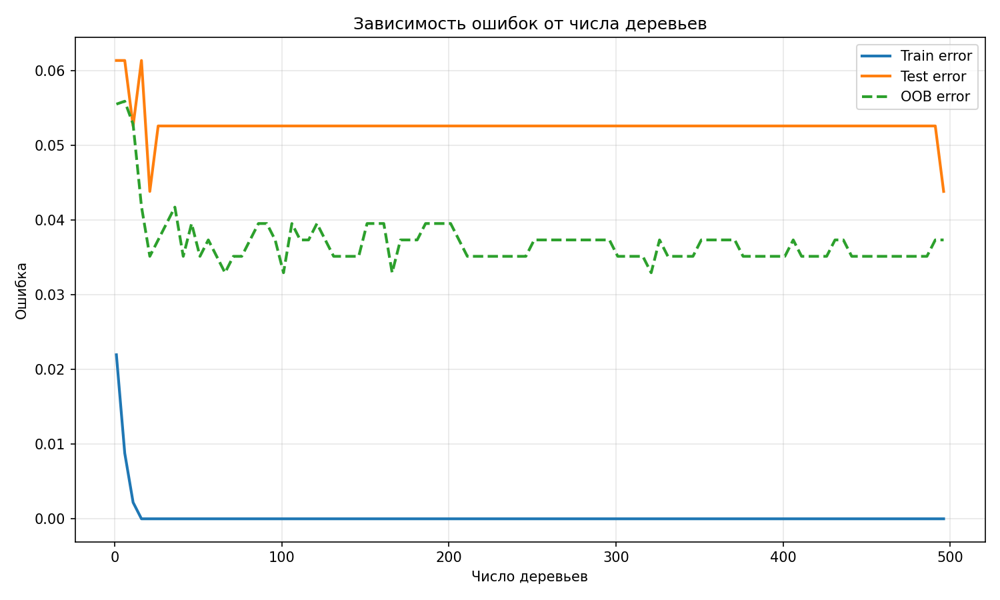
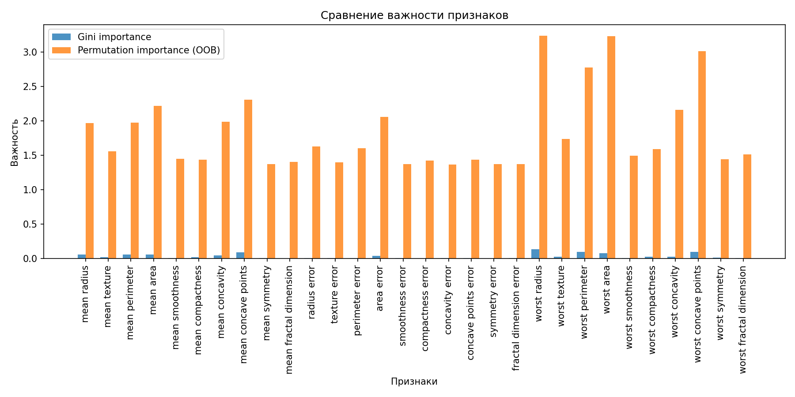

# Лабораторная работа №2. Ансамбли моделей: Random Forest

## Цель работы
Реализация алгоритма Random Forest с подбором гиперпараметров по Out-of-Bag (OOB) ошибке, оценка важности признаков с помощью OOB-перестановок и сравнение с эталонной реализацией из библиотеки scikit-learn.

---

## Используемые данные

**Датасет:** Breast Cancer Wisconsin (Diagnostic)  

**Источник:** sklearn.datasets.load_breast_cancer  

**Характеристики:**  
- 569 объектов  
- 30 признаков  
- 2 класса  
  - 0 – злокачественная  
  - 1 – доброкачественная  

**Разделение:**  
- 80% обучение (455 объектов)  
- 20% тестирование (114 объектов)  
- стратификация по классам  

**Предобработка:**  
не требуется (данные уже числовые)

---

## Реализованные алгоритмы

### 1. Собственная реализация Random Forest (RandomForestCustom)

**Базовый алгоритм:**  
решающее дерево (DecisionTreeClassifier из sklearn)

**Ансамблирование:**

- бутстреп-выборка для каждого дерева (с повторениями)
- случайное подпространство признаков (max_features)
- голосование большинством для предсказания

**Out-of-Bag оценка:**

Для каждого объекта вычисляется предсказание по деревьям, в которых он не попал в бутстреп-выборку.

OOB ошибка = доля неверных предсказаний среди таких объектов.

**Важность признаков:**

- **Gini importance** — усреднённое уменьшение неопределённости (impurity) по всем деревьям  
- **Permutation importance (OOB)** — для каждого признака значения в OOB-выборках перемешиваются, измеряется прирост ошибки относительно базовой OOB ошибки

---

### 2. Подбор гиперпараметров

**Метод:** Grid search по сетке параметров  

**Критерий:** минимизация OOB ошибки

**Параметры:**

- n_estimators: `[10, 50, 100, 200]`
- max_features: `['sqrt', 'log2', 0.3, 0.5]`
- max_depth: `[5, 10, None]`

**Фиксация:**

- bootstrap = True  
- oob_score = True  
- random_state = 42  

---

### 3. Сравнение с эталоном

**Реализация:** sklearn.ensemble.RandomForestClassifier

**Сравниваемые метрики:**

- точность (accuracy) на тестовой выборке
- время обучения

---

# Результаты и визуализация

## 1. Подбор гиперпараметров по OOB

**Лучшие параметры:**

- max_depth: **10**
- max_features: **'log2'**
- n_estimators: **100**

**OOB ошибка:** `0.0330`

### Топ-10 комбинаций (по убыванию качества)

| max_depth | max_features | n_estimators | oob_error | time (с) |
|-----------|--------------|-------------|-----------|----------|
| 10.0 | log2 | 100 | 0.032967 | 0.100180 |
| NaN | log2 | 100 | 0.032967 | 0.101565 |
| 10.0 | sqrt | 200 | 0.035165 | 0.226335 |
| 5.0 | sqrt | 200 | 0.035165 | 0.222760 |
| NaN | sqrt | 200 | 0.035165 | 0.227012 |
| NaN | 0.3 | 100 | 0.035165 | 0.156978 |
| 10.0 | 0.3 | 100 | 0.035165 | 0.156775 |
| 10.0 | 0.3 | 50 | 0.037363 | 0.078042 |
| NaN | 0.3 | 50 | 0.037363 | 0.078659 |
| 10.0 | sqrt | 100 | 0.039560 | 0.117703 |

---

## 2. Зависимость ошибок от числа деревьев

**Наблюдения:**

- Train error быстро падает до нуля (переобучение отсутствует благодаря рандомизации)
- Test error стабилизируется после ~30 деревьев на уровне около 0.05
- OOB error хорошо аппроксимирует тестовую ошибку, что подтверждает пригодность OOB для подбора параметров без отдельной валидационной выборки

---

## 3. Важность признаков

**Анализ:**

- **Gini importance** (синие столбцы) почти равномерно распределена (~0.01–0.1) и не позволяет выделить ключевые признаки
- **Permutation importance на OOB** (оранжевые столбцы) выявляет наиболее значимые признаки:

  - worst radius
  - worst area
  - worst concave points 
  - worst perimeter  
  - mean concave points  

Это демонстрирует, что стандартная **Gini importance** может быть смещена в сторону признаков с большим количеством категорий или высокой дисперсией, в то время как перестановочная важность более надежна.

---

## 4. Сравнение с эталонной реализацией scikit-learn

| Реализация | Accuracy | Время обучения (с) |
|------------|----------|--------------------|
| Custom RF | 0.9474 | 0.13 |
| sklearn RF | 0.9561 | 0.12 |

**Вывод:**

- Sklearn даёт немного более высокую точность (разница ~0.009), что может объясняться дополнительными оптимизациями (например, учёт весов, эффективная реализация бутстрепа)
- Время обучения практически одинаково, несмотря на то, что моя реализация написана на чистом Python без векторизации (но деревья используют быстрый код sklearn)

---

# Заключение

Реализован алгоритм **Random Forest** с бутстрепом, случайным подпространством признаков, OOB-оценкой и вычислением важности признаков двумя способами.

Подобраны оптимальные гиперпараметры по OOB ошибке:

- `max_depth = 10`
- `max_features = 'log2'`
- `n_estimators = 100`

Показано, что **OOB ошибка хорошо коррелирует с тестовой**, что позволяет использовать её для валидации без отдельной выборки.

Продемонстрировано преимущество **permutation importance** над **Gini importance** для интерпретации модели.

Сравнение с sklearn показало близкую точность и скорость, что подтверждает корректность реализации.
