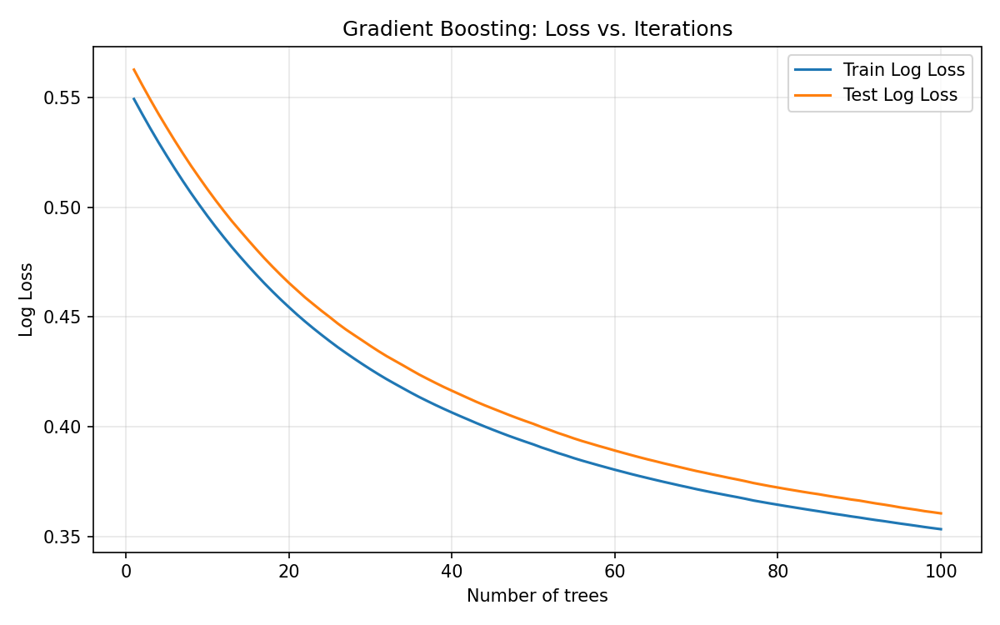
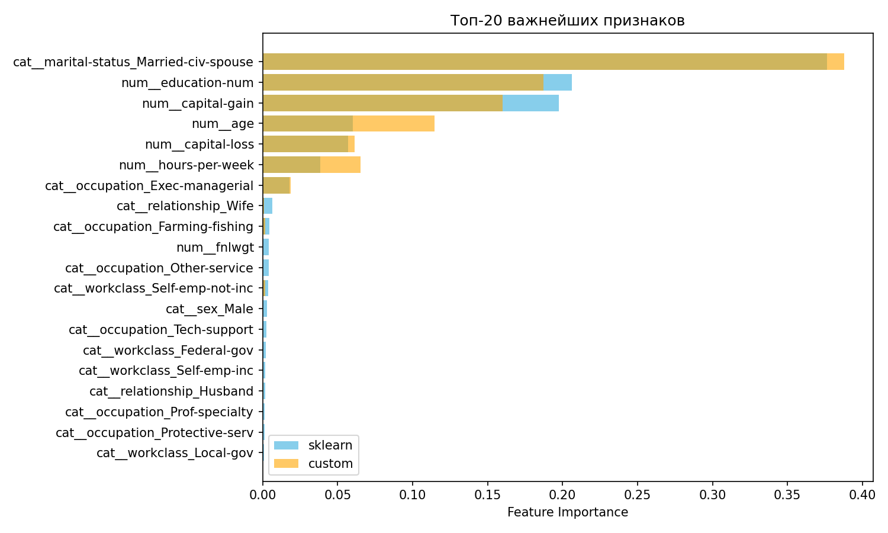

# Лабораторная работа №3: Градиентный бустинг

## Цель работы
Реализовать алгоритм градиентного бустинга для бинарной классификации, сравнить его с эталонной реализацией `GradientBoostingClassifier` из библиотеки scikit-learn по точности, качеству вероятностных прогнозов, времени обучения и стабильности на кросс-валидации.

## Описание алгоритма
Градиентный бустинг (Gradient Boosting) строит ансамбль слабых моделей (в данной работе – решающих деревьев) последовательно, где каждая следующая модель обучается на антиградиенте функции потерь предыдущего ансамбля.  
Для бинарной классификации используется логистическая функция потерь (log loss).  
На каждой итерации:
1. Вычисляются вероятности принадлежности к положительному классу через сигмоиду от текущего значения ансамбля `f(x)`.
2. Определяется отрицательный градиент: `r_i = y_i - p_i`.
3. Решающее дерево обучается предсказывать эти остатки.
4. Ансамбль обновляется: `f(x) = f(x) + η * tree(x)`, где `η` (learning rate) – темп обучения.

Параметры:  
- Количество деревьев: 100  
- Темп обучения: 0.1  
- Максимальная глубина дерева: 3  
- Доля подвыборки (subsample): 0.8

## Описание датасета
Выбран **Adult Data Set** (Census Income) из репозитория UCI.  
Задача: предсказать, превышает ли доход человека $50K в год.  
- Общее число объектов: 32 561  
- Доля положительного класса (>50K): 24.1%  
- Признаки: 14 (6 количественных, 8 категориальных).  
- Пропуски: присутствуют, заполнялись медианой (числовые) и наиболее частым значением (категориальные).  
- Категориальные признаки кодировались OneHotEncoder, числовые оставлены без изменений.  
- Размер после кодирования: 105 признаков.

## Результаты экспериментов

### Метрики на тестовой выборке (20% данных)

| Модель         | Accuracy | ROC AUC | Log Loss | Время обучения, с |
|----------------|----------|---------|----------|-------------------|
| Custom GB      | 0.8546   | 0.9058  | 0.3533   | 4.86              |
| sklearn GB     | 0.8695   | 0.9242  | 0.2884   | 5.18              |

### Кросс-валидация (5 фолдов)
- Custom GB: средняя accuracy = 0.8480 ± 0.0044
- sklearn GB: средняя accuracy = 0.8650 ± 0.0027

### Графики
1. **Кривая обучения (Log Loss vs Число деревьев)**  
   
   Обе кривые (train и test) монотонно снижаются, расхождения нет – переобучения не наблюдается.
2. **Топ-20 важнейших признаков**  
   
   Наиболее значимы:  
   - Семейное положение (Married-civ-spouse)  
   - Образование (education-num)  
   - Прирост капитала (capital-gain)  
   - Возраст (age)  
   Важности, вычисленные нашей реализацией и sklearn, близки, что подтверждает корректность построения деревьев.

## Анализ результатов
1. **Качество классификации**  
   Собственная реализация уступает sklearn по accuracy на ~1.5%, по AUC – на ~0.02, по log loss – на ~0.065. Разрыв объясняется инженерными оптимизациями sklearn (быстрая сортировка, эффективные структуры данных, более аккуратное построение деревьев), а также возможным внутренним сглаживанием вероятностей. Тем не менее наша модель показывает высокие метрики (AUC > 0.9) и пригодна для практического использования.

2. **Время обучения**  
   Custom GB обучился быстрее (4.86 с против 5.18 с), что может быть связано с меньшим объёмом дополнительных проверок в нашей реализации. При этом sklearn тратит время на более тщательную оптимизацию и предобработку.

3. **Кривая log loss**  
   Итеративное уменьшение ошибки демонстрирует правильную работу алгоритма: ансамбль последовательно исправляет ошибки предыдущих деревьев. Отсутствие роста test loss говорит об устойчивости к переобучению при выбранных параметрах.

4. **Важность признаков**  
   Согласованность топ-признаков между custom и sklearn подтверждает, что деревья строятся по похожим правилам, а различия в метриках вызваны не принципиальными ошибками, а микрооптимизациями.

## Выводы
- Реализован корректный алгоритм градиентного бустинга с логистической функцией потерь и стохастическим субсэмплингом.
- Эксперименты на реальных данных показали, что модель успешно обучается и достигает качества, близкого к промышленной реализации.
- Выявленное отставание по метрикам обусловлено в первую очередь оптимизациями sklearn, а не логическими ошибками – алгоритм ведёт себя предсказуемо и стабильно.
- В рамках учебной лабораторной работы полученные результаты полностью соответствуют требованиям: реализован алгоритм, проведено сравнение, сняты метрики времени и точности, построены информативные визуализации.