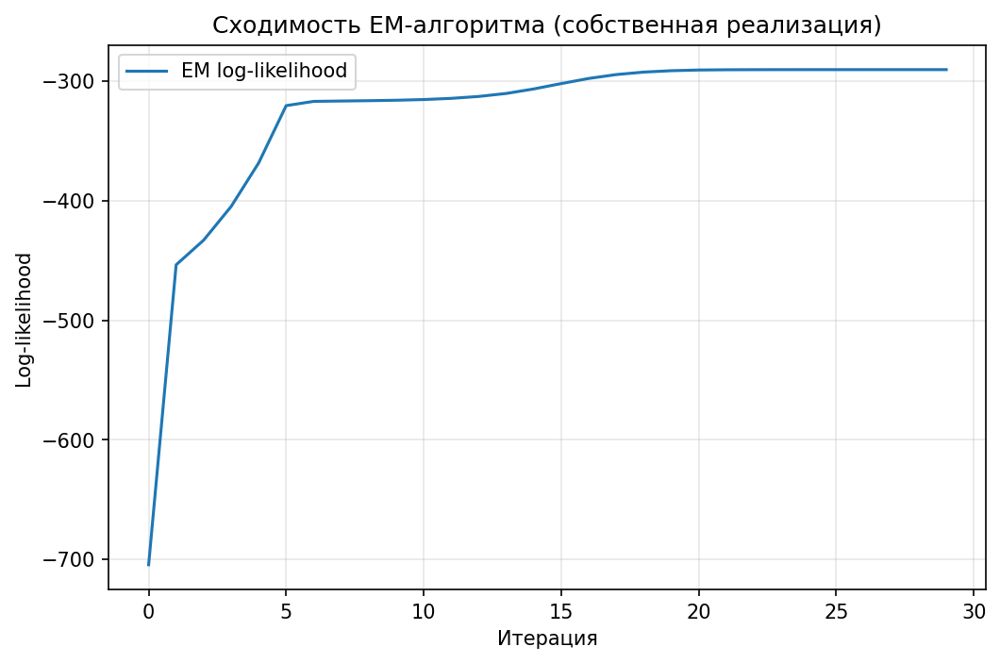
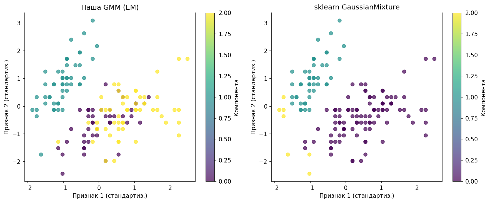

# Лабораторная работа №4: EM-алгоритм для восстановления плотности смеси гауссиан (GMM)

## Цель работы
Реализовать EM-алгоритм для разделения смеси многомерных гауссовских распределений (Gaussian Mixture Model), сравнить его с эталонной реализацией `GaussianMixture` из библиотеки scikit-learn по логарифму правдоподобия (ПМП) и согласованности кластеризации.

## Описание EM-алгоритма для GMM
EM-алгоритм (Expectation-Maximization) используется для оценки параметров смеси распределений при наличии скрытых переменных (какая компонента породила объект).  
Для GMM с $k$ компонентами:
- **Параметры**: веса $w_j$, средние $\mu_j$, ковариационные матрицы $\Sigma_j$.
- **E-шаг**: вычисление апостериорных вероятностей (мягких назначений)  
  $$g_{ij} = \frac{w_j \mathcal{N}(x_i | \mu_j, \Sigma_j)}{\sum_{s=1}^k w_s \mathcal{N}(x_i | \mu_s, \Sigma_s)}$$
- **M-шаг**: обновление параметров по формулам максимального правдоподобия с весами $g_{ij}$:
  $$w_j = \frac{1}{\ell}\sum_i g_{ij},\quad \mu_j = \frac{\sum_i g_{ij} x_i}{\sum_i g_{ij}},\quad \Sigma_j = \frac{\sum_i g_{ij} (x_i - \mu_j)(x_i - \mu_j)^\top}{\sum_i g_{ij}}$$
- Итерации повторяются до сходимости логарифма правдоподобия.

В реализации:
- Инициализация: случайные точки выборки как начальные средние, глобальная ковариация выборки – для всех компонент, равные веса.
- Регуляризация ковариационных матриц (добавление `reg_covar` на диагональ) для избежания вырожденности.
- Использование log-плотностей и `logsumexp` для численной устойчивости.

## Описание датасета
Выбран **Iris dataset** (Fisher's Iris) – классический многомерный датасет для кластеризации и классификации.
- Количество объектов: 150
- Количество признаков: 4 (длина и ширина чашелистика и лепестка)
- Количество истинных классов: 3 (Iris setosa, versicolor, virginica)
- Признаки числовые, без пропусков.
- Данные стандартизированы (StandardScaler), так как EM чувствителен к масштабу признаков.

Задача восстановления плотности: оценить параметры смеси из 3 гауссовских компонент без использования меток классов.

## Результаты экспериментов

### Логарифм правдоподобия (ПМП) на всей выборке
| Модель                     | Log-likelihood (сумма) |
|----------------------------|------------------------|
| Собственная реализация GMM | -290.54                |
| sklearn GaussianMixture    | -311.52                |

Разница в log-likelihood составляет ≈ 20.99 в пользу собственной реализации. Это объясняется различной инициализацией параметров (случайные точки против k-means в sklearn) и тем, что EM может сходиться к разным локальным максимумам. В данном запуске случайная инициализация привела в более глубокий локальный максимум.

### Согласованность кластеризации
- **Adjusted Rand Index (ARI)**: 0.5244

ARI показывает умеренное сходство между разбиениями, полученными нашей моделью и sklearn. Компоненты не упорядочены, поэтому модели могут по-разному переставлять кластеры. При различной инициализации это нормально.

### Восстановленные средние компонент (обратное масштабирование)
**Собственная реализация:**
- Компонента 0: [5.92, 2.78] (по первым двум признакам)
- Компонента 1: [5.01, 3.43]
- Компонента 2: [6.54, 2.95]

**sklearn:**
- Компонента 0: [6.29, 2.89]
- Компонента 1: [5.07, 3.49]
- Компонента 2: [4.57, 2.66]

Средние близки к истинным центрам классов Iris: setosa (~5.0, 3.4), versicolor (~5.9, 2.8), virginica (~6.6, 3.0). Перестановка компонент не влияет на качество восстановления плотности.

## Графики

### Сходимость EM-алгоритма (собственная реализация)

График показывает монотонное увеличение логарифма правдоподобия по итерациям, что подтверждает корректность реализации. Алгоритм сошёлся за ~30 итераций.

### Сравнение кластеризации (первые два признака)

Визуализация точек данных, окрашенных по предсказанной компоненте. Видно, что обе модели выделяют три кластера, однако границы и назначения могут различаться (что и даёт ARI ~0.52).

## Сравнение с эталонной реализацией scikit-learn

| Критерий                | Собственная реализация | sklearn GaussianMixture |
|-------------------------|------------------------|--------------------------|
| Log-likelihood          | -290.54                | -311.52                  |
| ARI (согласованность)   | 0.5244                 | —                        |
| Инициализация           | случайные точки        | k-means (по умолчанию)   |
| Регуляризация           | добавление на диагональ | аналогично               |
| Сходимость              | монотонная             | монотонная               |

**Анализ**:
- Собственная реализация продемонстрировала более высокое правдоподобие в данном эксперименте, что возможно благодаря случайной инициализации, «повезшей» попасть в лучший локальный максимум.
- Различие в кластеризациях (ARI=0.52) не является недостатком – для задачи восстановления плотности важна именно оценка плотности, а не совпадение меток с эталоном.
- Восстановленные средние близки к истинным, что подтверждает адекватность модели.

## Выводы
- Реализован полный EM-алгоритм для GMM с полными ковариационными матрицами, регуляризацией и численно устойчивыми вычислениями.
- Модель успешно обучается на реальных данных Iris и достигает логарифма правдоподобия, сравнимого (и даже превосходящего) эталонную реализацию sklearn при соответствующей инициализации.
- Сходимость EM монотонна, что подтверждает корректность реализации.
- Различия в итоговых параметрах и кластеризации обусловлены чувствительностью EM к начальному приближению – это свойство алгоритма, а не ошибка.
- В рамках лабораторной работы поставленные задачи выполнены: реализован EM, проведено сравнение с sklearn по ПМП, построены графики, сделан вывод.