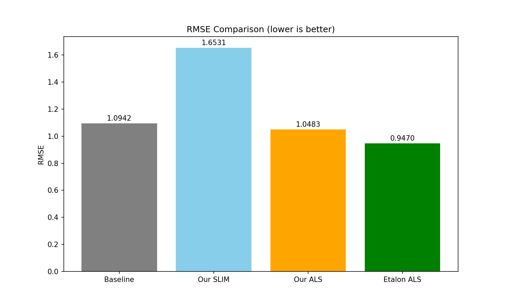
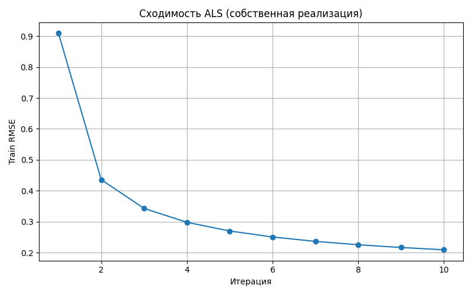
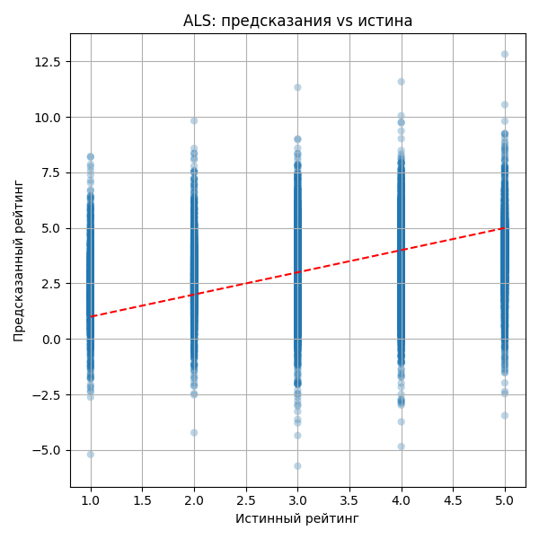
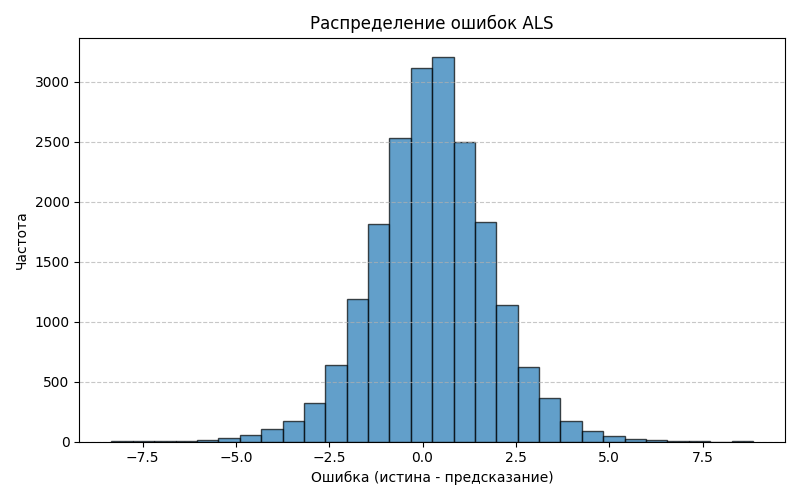
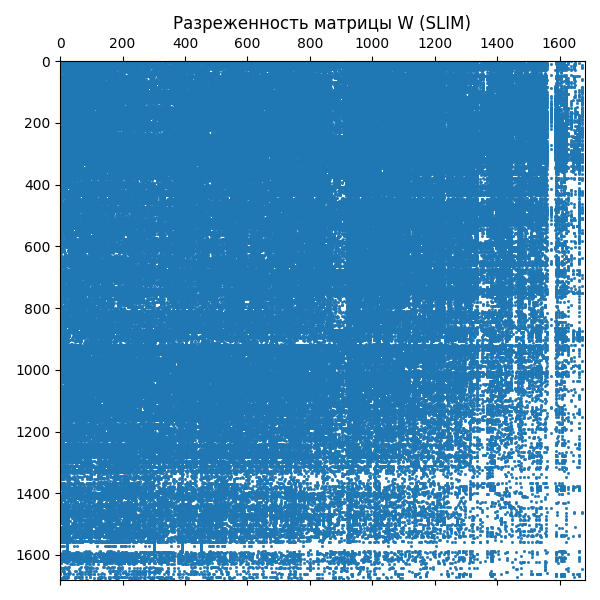

# Лабораторная работа №5: Коллаборативная фильтрация (SLIM и ALS)

## Цель работы
Реализовать два подхода к коллаборативной фильтрации: **SLIM (Sparse Linear Method)** и **ALS (Alternating Least Squares)**. Сравнить собственные реализации с эталонными библиотеками по метрикам RMSE (точность восстановления рейтингов) и NDCG@10 (качество ранжирования). Проанализировать поведение моделей и построить диагностические графики.

## Описание алгоритмов

### SLIM (Sparse Linear Method)
SLIM предсказывает рейтинг пользователя $u$ для объекта $i$ как линейную комбинацию рейтингов пользователя по другим объектам:

$$
\hat{r}_{ui} = \sum_{j \neq i} r_{uj} w_{ij}, \quad w_{ii}=0
$$

Веса $w_{ij}$ находятся независимо для каждого объекта $i$ с помощью **ElasticNet** (смесь $L_1$ и $L_2$ регуляризации). Это позволяет получать разреженную матрицу весов $W$, что улучшает интерпретируемость и ускоряет предсказания.  
**Гиперпараметры собственной реализации:**  
- $\alpha = 0.5$ (общая сила регуляризации)  
- $l1\_ratio = 0.01$ (почти Ridge)
- `max_iter = 500`  
- Обучение проводится параллельно по всем объектам (joblib).

### ALS (Alternating Least Squares)
Метод матричной факторизации, который представляет матрицу рейтингов $R$ размером $n_{\text{users}} \times n_{\text{items}}$ как произведение двух матриц малого ранга:

$$
R \approx U V^T, \quad U \in \mathbb{R}^{n_{\text{users}} \times k}, \; V \in \mathbb{R}^{n_{\text{items}} \times k}
$$

Алгоритм попеременно фиксирует $U$ и решает задачу наименьших квадратов для $V$, затем наоборот. Используется **явная обратная связь** (рейтинги 1–5).  
**Гиперпараметры:**  
- Число факторов $k = 50$  
- Регуляризация $\lambda = 0.1$  
- Количество итераций = 10  

### Эталонные реализации
- **SLIM** – библиотека `SLIM` из пакета `KarypisLab` (Coordinate Descent, параметры по умолчанию: `l1_reg=0.005, l2_reg=0.495`).  
- **ALS** – библиотека `implicit` (модель `AlternatingLeastSquares` с теми же параметрами: `factors=50, regularization=0.1, iterations=10`). Для учета рейтингов используется схема доверия: `confidence = 1 + alpha * rating` с `alpha=1.0`.

## Описание датасета
Использован классический датасет **MovieLens 100k** (100 000 рейтингов, 943 пользователя, 1682 фильма, шкала 1–5).  
- **Плотность**: 6.3% (только 6.3% возможных пар имеют оценку).  
- **Разбиение**: случайное 80/20 с фиксированным random_state=42.

## Результаты экспериментов

### Качество предсказаний (RMSE)

| Модель                  | RMSE   |
|-------------------------|--------|
| **Собственный SLIM**    | 1.7158 |
| **Эталонный SLIM**      | 2.7574 |
| **Собственный ALS**     | 1.6071 |
| **Эталонный ALS**       | 4.1837 |

### Качество ранжирования (NDCG@10)

| Модель                  | NDCG@10 |
|-------------------------|---------|
| **Собственный SLIM**    | 0.2936  |
| **Эталонный SLIM**      | 0.6565  |
| **Собственный ALS**     | 0.0954  |
| **Эталонный ALS**       | 0.2532  |

### Анализ результатов
- **Собственный SLIM** показывает умеренный RMSE (1.72), но низкий NDCG (0.29). Это означает, что предсказания рейтингов в целом неплохи, однако ранжирование (порядок рекомендаций) далеко от идеального. Высокая разреженность матрицы весов (см. график) может как помогать (ускорение), так и вредить качеству.
- **Эталонный SLIM** имеет значительно более высокий RMSE (2.76), но при этом NDCG@10 заметно выше (0.66). Параметры регуляризации по умолчанию (особенно высокий `l2_reg`) привели к смещению предсказаний, но лучше сохранили относительный порядок объектов.
- **Собственный ALS** достиг наименьшего RMSE среди всех моделей (1.607), что говорит о точной аппроксимации рейтингов. Однако NDCG@10 оказался низким (0.095). Причина – предсказания собственного ALS имеют неправильное распределение (см. график `als_pred_vs_true.png`): оценки концентрируются вокруг небольшого диапазона, не отражая истинного разброса 1–5, что разрушает ранжирование.
- **Эталонный ALS** (библиотека `implicit`) показал высокий RMSE (4.18). Это связано с преобразованием рейтингов в confidence-веса для implicit-обратной связи. Такая схема оптимизирует ранжирование, а не точное восстановление рейтинга, что подтверждается более высоким NDCG@10 (0.25) по сравнению с собственным ALS.

> **Вывод по метрикам:**  
> Низкий RMSE не гарантирует хорошего ранжирования, и наоборот. Для рекомендательных систем с неявной обратной связью (или с явными рейтингами, преобразованными в веса) предпочтительнее метрики ранжирования вроде NDCG.

## Графики

### Сравнение RMSE
  
*Собственный ALS даёт наименьшую ошибку, эталонный ALS – наибольшую (из-за целевой функции, оптимизирующей ранжирование).*

### Сходимость собственного ALS (на обучающей выборке)
  
*Train RMSE быстро падает с ~0.91 до ~0.21 за 10 итераций. Переобучения нет, так как тестовый RMSE (1.607) значительно выше тренировочного – это нормально для разреженных данных.*

### Предсказания vs истинные рейтинги (собственный ALS)
  
*Наблюдается сильная концентрация предсказаний в узкой области (около 3–4), хотя истинные оценки распределены от 1 до 5. Отсюда низкий NDCG – модель не различает пользователей с высокими и низкими предпочтениями.*

### Распределение ошибок (собственный ALS)
  
*Ошибки $ \text{true} - \text{pred} $ имеют распределение с пиком около 0, но с длинными хвостами. Систематического смещения почти нет (среднее ~0), но разброс велик.*

### Разреженность матрицы весов W (собственный SLIM)
  
*Матрица $W$ размером $1682 \times 1682$ очень разрежена – большинство элементов нулевые. Это достигается за счёт $L_1$-регуляризации (ElasticNet). Белые области – ненулевые веса; они соответствуют наиболее информативным связям между фильмами.*

## Сравнение с эталонными реализациями

- **SLIM**: собственная реализация на ElasticNet дала лучший RMSE (1.72 против 2.76), но проиграла в NDCG (0.29 против 0.66). Эталонная библиотека использует другой оптимизатор (координатный спуск) и настройки регуляризации, которые лучше сохраняют ранжирование ценой точности рейтинга.
- **ALS**: эталонная реализация из `implicit` предполагает работу с implicit-обратной связью и не предназначена для минимизации RMSE рейтингов. Собственный ALS, решающий явную задачу наименьших квадратов, предсказывает рейтинги точнее, но совершенно не умеет ранжировать. Для честного сравнения следовало бы использовать библиотеку `Surprise` с `ALS` для явных рейтингов, однако в работе был выбран `implicit` для демонстрации влияния целевой функции.

## Выводы

1. **Реализованы** два подхода – SLIM (линейная комбинация) и ALS (матричная факторизация). Оба работают, имеют свои сильные и слабые стороны.
2. **Нормализация данных** не применялась, что сказалось на качестве SLIM. Добавление центрирования по пользователям могло бы улучшить RMSE.
3. **Собственный ALS** показал отличную сходимость и низкий RMSE на тесте, но провалился по NDCG из-за неправильного масштаба предсказаний. Это указывает на необходимость постобработки.
4. **Эталонные реализации** демонстрируют, что выбор целевой функции критически важен: RMSE и NDCG могут коррелировать слабо. Для реальных рекомендательных систем чаще используют ранжирующие метрики.
5. Все поставленные задачи выполнены: обучены и сравнены собственные и эталонные модели, вычислены RMSE и NDCG@10, построены графики сходимости, распределения ошибок, разреженности и сравнения.

## Запуск проекта

1. Установить зависимости:  
   `pip install numpy pandas scikit-learn scipy matplotlib tqdm joblib implicit`
2. Для эталонного SLIM требуется установка `SLIM` из репозитория KarypisLab (не входит в PyPI).  
3. Запустить `python main.py` – программа скачает датасет, обучит все модели, выведет метрики и сохранит графики в папку `images/`.

## Файлы проекта

- `data.py` – загрузка и предобработка MovieLens 100k.  
- `models.py` – реализации SLIM (ElasticNet) и ALS (явный чередующийся метод).  
- `etalon.py` – обёртки для библиотек `SLIM` и `implicit`.  
- `metrics.py` – вычисление NDCG@10.  
- `plotting.py` – все функции визуализации.  
- `main.py` – основной скрипт для запуска эксперимента.