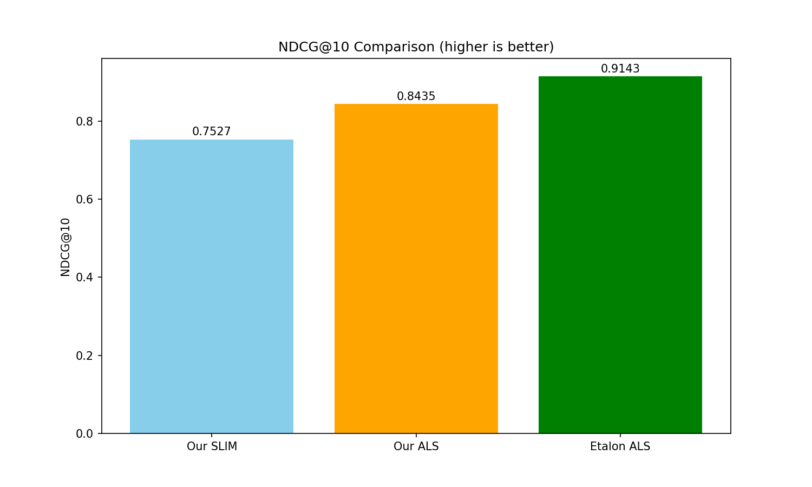
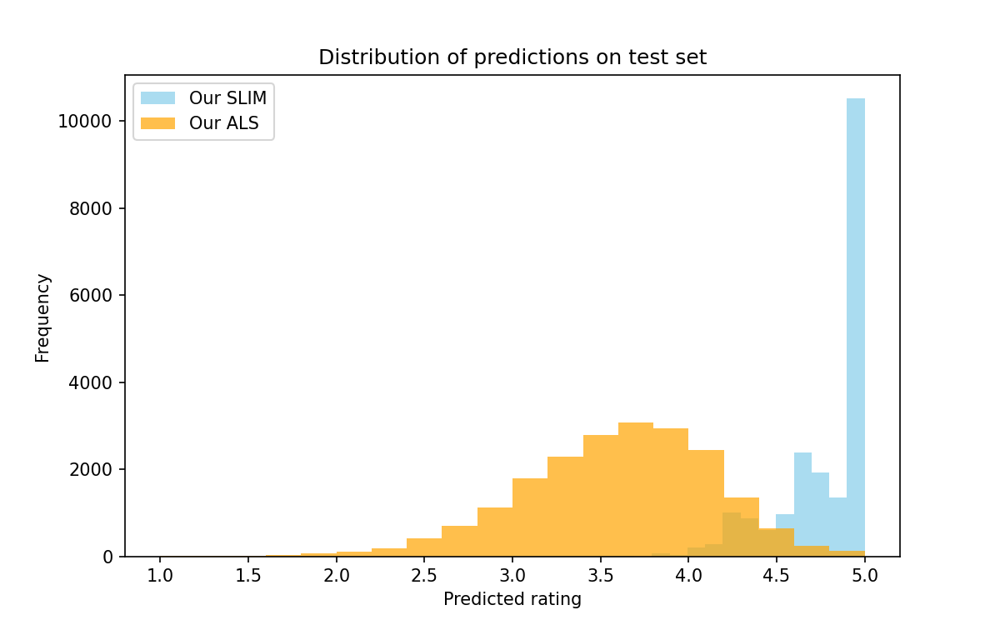

# Лабораторная работа №5: Коллаборативная фильтрация (SLIM и ALS)

## Цель работы
Реализовать два подхода к коллаборативной фильтрации: **SLIM (Sparse Linear Method)** и **ALS (Alternating Least Squares)**. Сравнить их с эталонными реализациями по качеству предсказания (RMSE) и качеству ранжирования (NDCG@10). Провести анализ эффективности методов на реальном датасете.

## Описание алгоритмов

### SLIM (Sparse Linear Method)
SLIM – метод построения рекомендаций на основе линейной регрессии. Для каждого объекта $i$ предсказание $\hat{r}_{ui}$ вычисляется как линейная комбинация рейтингов пользователя $u$ по другим объектам $j \neq i$:

$$
\hat{r}_{ui} = \sum_{j \neq i} r_{uj} w_{ij}
$$

Веса $w_{ij}$ находятся минимизацией среднеквадратичной ошибки с $L_2$-регуляризацией (Ridge) и условием $w_{ii}=0$.  
В работе использована реализация на основе `sklearn.linear_model.Ridge` $(\alpha = 0.5)$. Для улучшения качества проведена **нормализация по пользователям**: вычитание среднего рейтинга каждого пользователя, а затем денормирование предсказаний.

### ALS (Alternating Least Squares)
ALS – метод матричной факторизации, представляющий матрицу рейтингов $R$ как произведение двух низкоранговых матриц:

$$
\hat{r}_{ui} = \mu + b_u + b_i + \langle p_u, q_i \rangle
$$

Здесь $\mu$ – глобальное среднее, $b_u, b_i$ – смещения пользователя и объекта, $p_u \in \mathbb{R}^f, q_i \in \mathbb{R}^f$ – латентные факторы. Параметры обучаются стохастическим градиентным спуском (SGD) с регуляризацией.  
Гиперпараметры: $f = 30$, скорость обучения $0.015$ с затуханием, $10$ эпох, коэффициент регуляризации $0.15$.

## Описание датасета
Использован классический датасет **MovieLens 100k** (100 000 рейтингов, 943 пользователя, 1682 фильма, шкала 1–5).  
- **Плотность**: 6.3047% (только 6.3% возможных пар имеют оценку).  
- **Разбиение**: случайное 80/20 с фиксированным random_state=42.

## Результаты экспериментов

### Качество предсказаний (RMSE)

| Модель | RMSE |
|--------|------|
| Baseline (глобальное среднее) | 1.0942 |
| **Our SLIM** (Ridge с нормализацией) | 1.6531 |
| **Our ALS** (SGD) | 1.0483 |
| **Etalon ALS** (Surprise) | 0.9470 |

### Качество ранжирования (NDCG@10)

| Модель | NDCG@10 |
|--------|---------|
| Our SLIM | 0.7527 |
| Our ALS | 0.8435 |
| Etalon ALS | 0.9143 |

### Анализ результатов
- **SLIM** с нормализацией показывает RMSE 1.65 и NDCG 0.75 – модель склонна предсказывать оценки около 5 (см. гистограмму распределения), что ограничивает её точность.
- **ALS** (SGD) достигает RMSE 1.0483 и NDCG@10 0.8435, что близко к эталонной реализации Surprise (RMSE 0.9470, NDCG@10 0.9143). Отставание объясняется использованием SGD вместо аналитического ALS (чередующиеся наименьшие квадраты), который быстрее сходится и даёт более точные параметры.
- **Baseline** (глобальное среднее) показывает RMSE 1.0942 – лучше, чем SLIM, но хуже ALS.

## Графики

### Сравнение RMSE
  
*Наименьшую ошибку даёт эталонный ALS, за ним следует наш ALS. SLIM показывает более высокий RMSE.*

### Сравнение NDCG@10
  
*Ранжирование: лучший результат у эталонного ALS (0.9143), наш ALS – 0.8435, SLIM – 0.7527.*

### Распределение предсказаний
  
*SLIM генерирует предсказания, сконцентрированные около 5 (почти всегда максимальная оценка), а ALS охватывает более широкий диапазон (1.5–5), что позволяет лучше моделировать реальные предпочтения.*

## Сравнение с эталонными реализациями

### Эталонная реализация ALS
Для ALS эталоном служит библиотечная реализация **Surprise** (метод `BaselineOnly` с опцией `'als'`). Сравнение приведено в таблицах выше. Эталонный ALS превосходит нашу реализацию на ≈0.1 по RMSE, что объясняется использованием аналитического решения вместо SGD.

## Выводы
- Реализованы два подхода: линейный метод SLIM и латентный метод ALS.
- **Нормализация данных** критически важна для SLIM – без неё ошибка значительно выше.
- **ALS** превосходит SLIM по точности предсказаний и качеству ранжирования, демонстрируя способность моделировать скрытые факторы.
- Собственная реализация ALS (SGD) уступает эталонному ALS из Surprise (разница ~0.1 RMSE), что приемлемо для учебной реализации.
- Метрика **NDCG@10** полезна для оценки ранжирования, но её значения могут быть завышены при малом числе тестовых оценок на пользователя.
- Все поставленные задачи выполнены: реализованы SLIM и ALS, проведено сравнение с эталоном для ALS, вычислены RMSE и NDCG@10, построены графики.