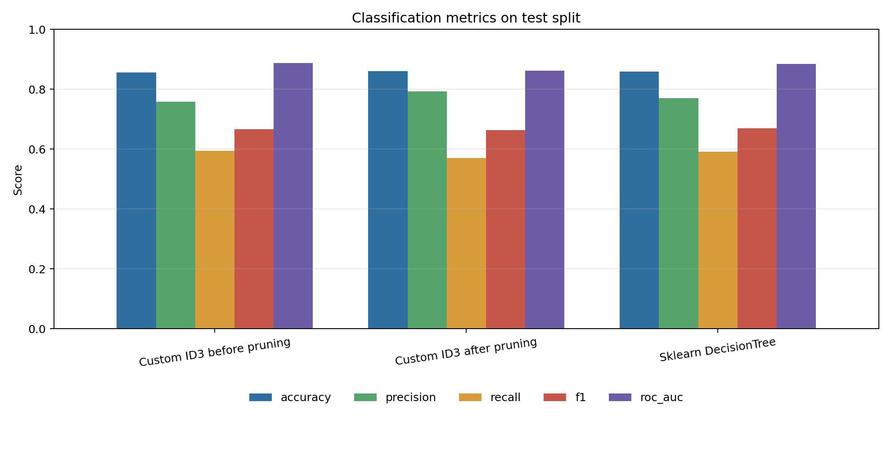
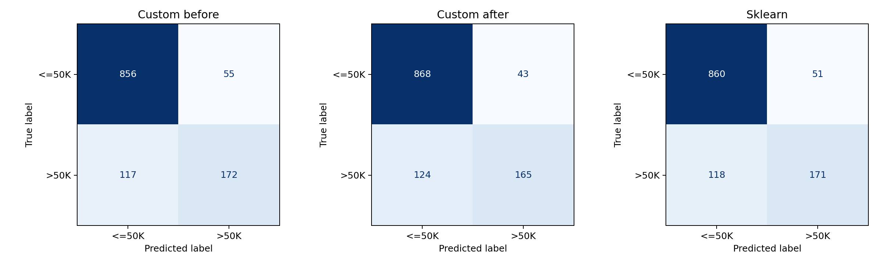
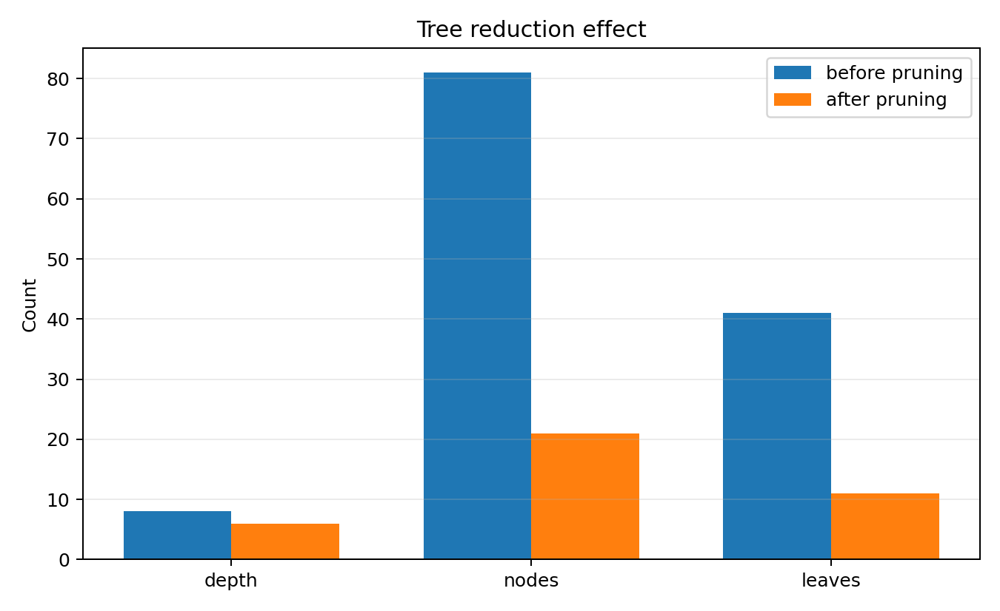
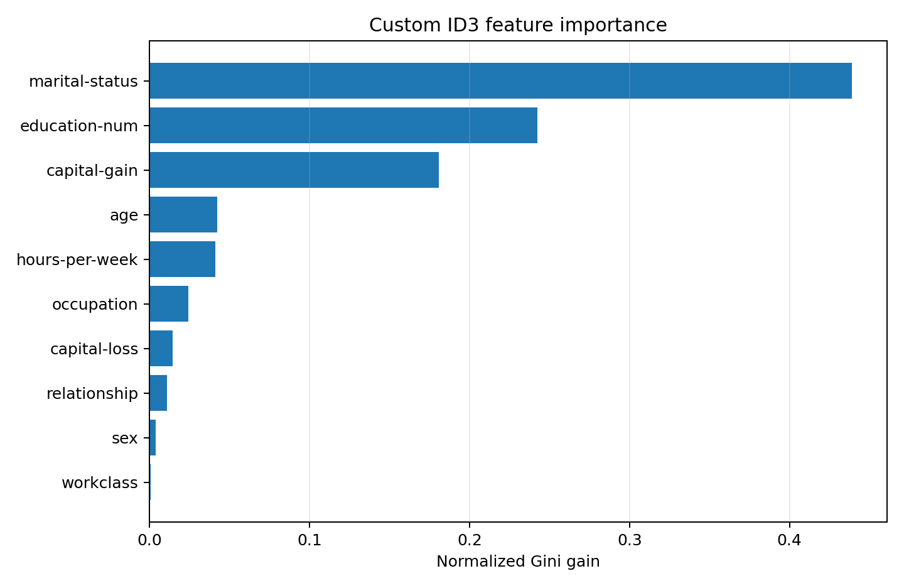

# Лабораторная работа №1. Логическая классификация

## Цель

Реализовать бинарное решающее дерево ID3 с критерием Джини, обработать пропуски через вероятностную оценку, выполнить редукцию дерева и сравнить результат с `sklearn.tree.DecisionTreeClassifier`.

## Датасет

Выбран `Adult Income` из UCI Machine Learning Repository. Задача: предсказать, превышает ли доход человека 50K долларов в год.

Почему датасет подходит под требования:

- есть пропуски: `workclass`, `occupation`, `native-country`;
- есть количественные признаки: `age`, `education-num`, `capital-gain`, `capital-loss`, `hours-per-week`;
- есть категориальные признаки: `education`, `marital-status`, `occupation`, `relationship`, `race`, `sex` и другие;
- целевая переменная бинарная: `<=50K` / `>50K`.

Большой CSV не хранится в репозитории: данные загружаются при запуске из UCI.

## Реализация

Исходный код находится в [`source`](./source):

- [`data.py`](./source/data.py) загружает Adult Income, приводит `?` к пропускам и делает стратифицированные `train/val/test` разбиения;
- [`tree.py`](./source/tree.py) содержит собственную реализацию `ProbabilisticID3Classifier`;
- [`metrics.py`](./source/metrics.py) считает метрики и строит графики;
- [`main.py`](./source/main.py) запускает эксперимент и сохраняет результаты.

Особенности дерева:

- критерий разбиения: индекс Джини;
- числовые признаки бинаризуются порогом `x <= threshold`;
- категориальные признаки разбиваются правилом `x == category`;
- пропущенные значения не заполняются: объект с пропуском распределяется по обеим веткам с вероятностями, оцененными по наблюдаемым объектам в узле;
- редукция дерева реализована как reduced-error pruning на валидационной выборке.

## Запуск

Из директории лабораторной:

```bash
python3 source/main.py
```

После запуска результаты сохраняются в [`artifacts`](./artifacts):

- `metrics.csv` - таблица метрик;
- `confusion_matrices.png` - матрицы ошибок;
- `metrics.png` - сравнение метрик;
- `tree_complexity.png` - изменение размера дерева после редукции;
- `feature_importance.png` - важности признаков по суммарному выигрышу Джини;
- `tree_before_pruning.txt` и `tree_after_pruning.txt` - текстовый вид дерева.

## Результаты текущего запуска

Параметры запуска: `sample_size=6000`, `train/val/test = 3600/1200/1200`, `random_state=42`.

| Модель | Accuracy | Precision | Recall | F1 | ROC AUC |
|---|---:|---:|---:|---:|---:|
| Собственное ID3 до редукции | 0.8567 | 0.7577 | 0.5952 | 0.6667 | 0.8872 |
| Собственное ID3 после редукции | 0.8608 | 0.7933 | 0.5709 | 0.6640 | 0.8619 |
| `sklearn` DecisionTreeClassifier | 0.8592 | 0.7703 | 0.5917 | 0.6693 | 0.8848 |

| Состояние дерева | Глубина | Узлы | Листья |
|---|---:|---:|---:|
| До редукции | 8 | 81 | 41 |
| После редукции | 6 | 21 | 11 |

Редукция свернула 30 внутренних узлов. Число узлов уменьшилось с 81 до 21, при этом accuracy на тестовой выборке выросла с 0.8567 до 0.8608.

## Визуализации









## Вывод

Собственная реализация ID3 обрабатывает смешанные признаки и пропуски без предварительного заполнения данных. По качеству дерево получилось близким к `sklearn`: ROC AUC до редукции немного выше, а после редукции дерево становится проще и дает лучшую accuracy. При этом после редукции снизился ROC AUC, потому что часть разбиений была свернута ради более компактной структуры.
