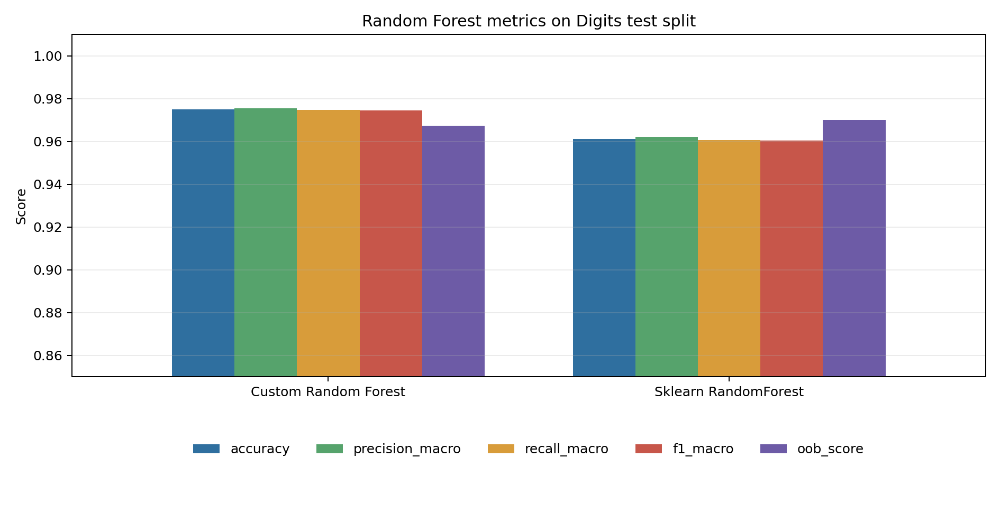
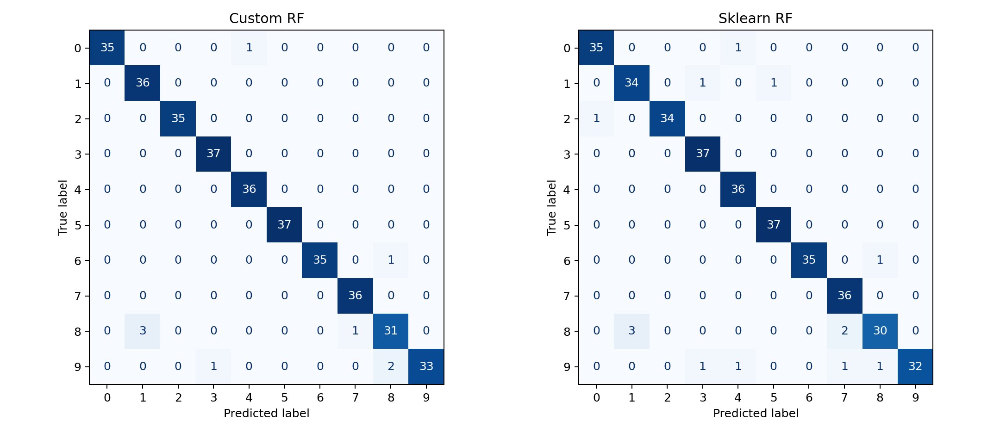
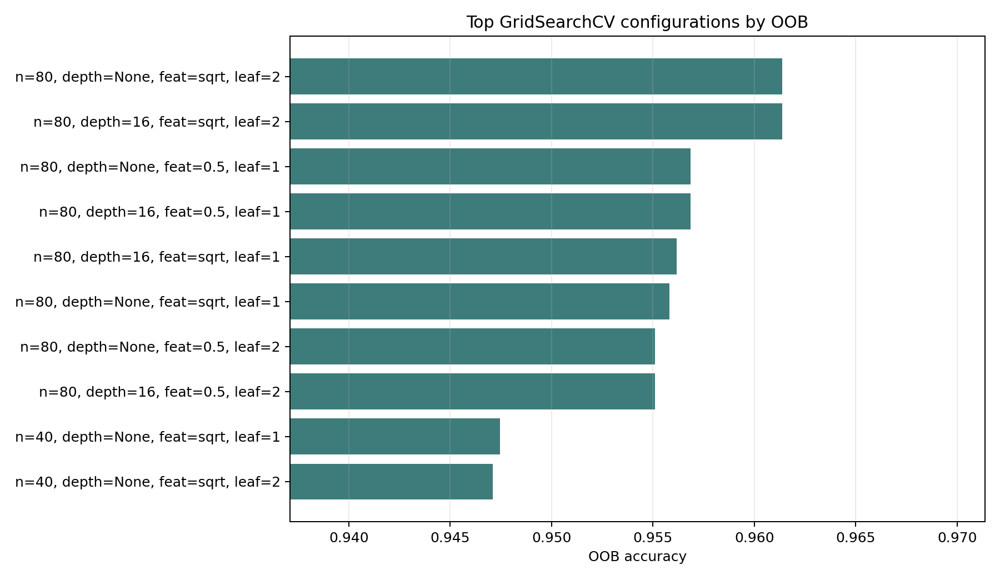
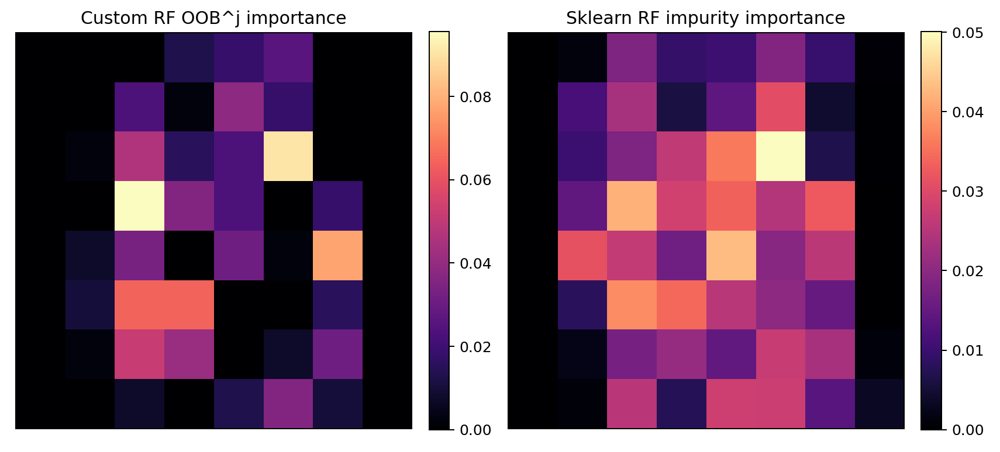
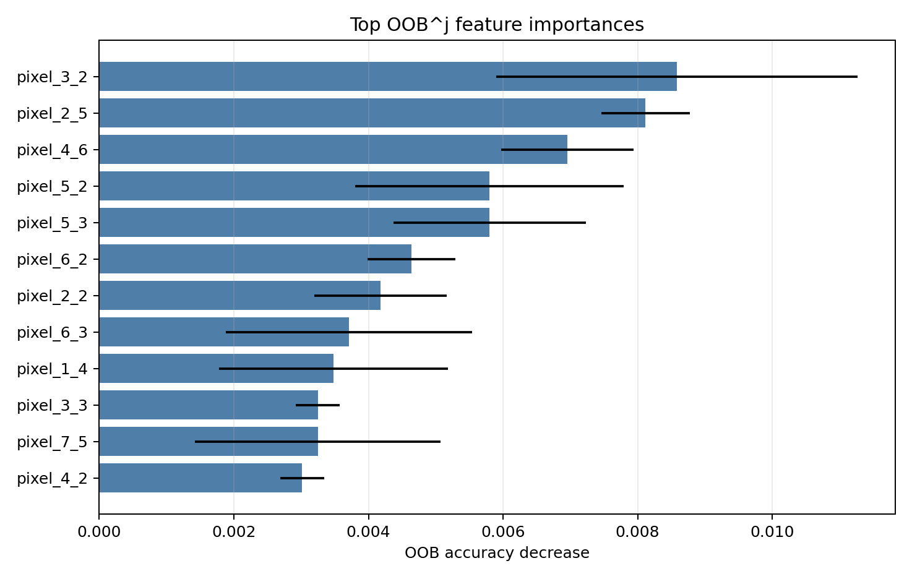
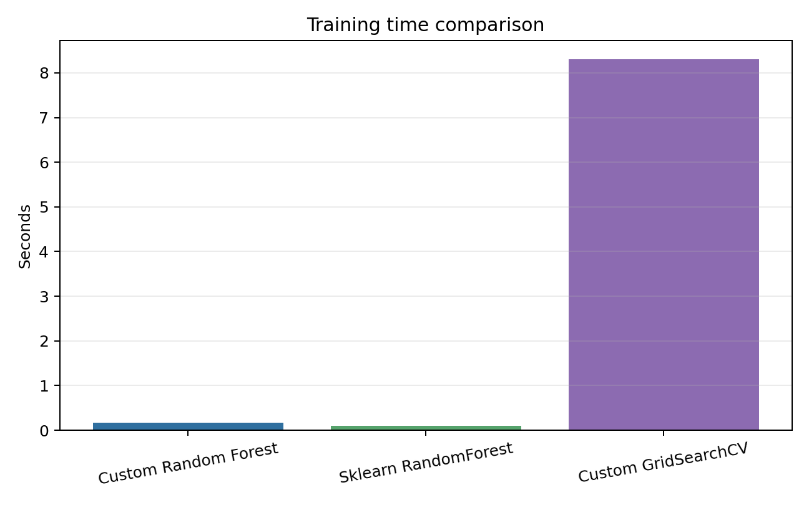

# Лабораторная работа №2. Ансамбли моделей

## Цель

Реализовать Random Forest, подобрать гиперпараметры через `GridSearchCV` по out-of-bag оценке, посчитать важность признаков через `OOB^j` и сравнить результат с эталонным `sklearn.ensemble.RandomForestClassifier`.

## Датасет

Использован встроенный датасет `sklearn.datasets.load_digits`: 1797 изображений рукописных цифр размером 8x8 пикселей, 64 числовых признака и 10 классов.

Датасет выбран потому, что он не требует внешней сети и позволяет наглядно показать важность признаков как тепловую карту пикселей.

## Реализация

Исходный код находится в [`source`](./source):

- [`data.py`](./source/data.py) загружает и делит датасет;
- [`forest.py`](./source/forest.py) содержит собственный `OOBRandomForestClassifier`;
- [`metrics.py`](./source/metrics.py) считает метрики и строит графики;
- [`main.py`](./source/main.py) запускает подбор параметров, обучение, сравнение и генерацию артефактов.

Особенности собственной реализации:

- каждое дерево обучается на bootstrap-выборке;
- базовые алгоритмы - `DecisionTreeClassifier`, что разрешено заданием;
- OOB-объекты каждого дерева используются для оценки `oob_score_`;
- `GridSearchCV` перебирает параметры на стратифицированных folds, а кастомный scorer выбирает модель по OOB accuracy;
- важность `OOB^j` считается как падение OOB accuracy после перестановки j-го признака на OOB-объектах.

## Запуск

Из директории лабораторной:

```bash
python3 source/main.py
```

После запуска результаты сохраняются в [`artifacts`](./artifacts).

## Результаты текущего запуска

Параметры запуска: `test_size=0.2`, `grid_cv_folds=3`, `random_state=42`, 1437 объектов в обучении и 360 объектов в тесте.

Лучшие параметры собственной модели по OOB accuracy:

- `n_estimators=80`;
- `max_features="sqrt"`;
- `max_depth=None`;
- `min_samples_leaf=2`.

Лучшая OOB accuracy на `GridSearchCV`: `0.9614`.

| Модель | Accuracy | Precision macro | Recall macro | F1 macro | OOB score | Время обучения, c |
|---|---:|---:|---:|---:|---:|---:|
| Собственный Random Forest | 0.9750 | 0.9754 | 0.9747 | 0.9746 | 0.9673 | ~0.17 |
| `sklearn` RandomForestClassifier | 0.9611 | 0.9621 | 0.9606 | 0.9605 | 0.9701 | ~0.09 |

`GridSearchCV` для собственной модели занимает около 8 секунд. `sklearn` обучается быстрее за счет оптимизированной реализации и параллельного исполнения, но собственная реализация на выбранном split дала более высокую test accuracy.

Топ признаков по `OOB^j`:

| Признак | Падение OOB accuracy | Std |
|---|---:|---:|
| `pixel_3_2` | 0.00858 | 0.00269 |
| `pixel_2_5` | 0.00812 | 0.00066 |
| `pixel_4_6` | 0.00696 | 0.00098 |
| `pixel_5_2` | 0.00580 | 0.00200 |
| `pixel_5_3` | 0.00580 | 0.00143 |

## Визуализации













## Вывод

Собственная реализация Random Forest использует bootstrap-выборки, OOB-оценку и подбор параметров через `GridSearchCV`. На датасете рукописных цифр качество получилось близким к эталонной реализации `sklearn`: обе модели дают macro F1 около 0.96-0.97. По OOB-важностям сильнее всего выделились пиксели в центральной части изображения, что согласуется с формой цифр в датасете.
