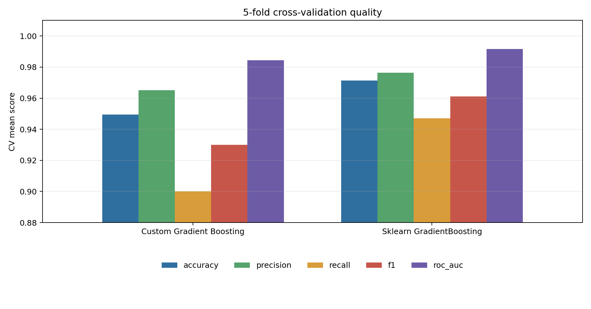
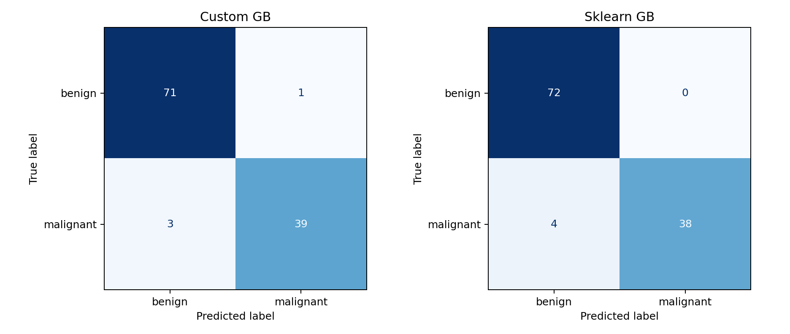
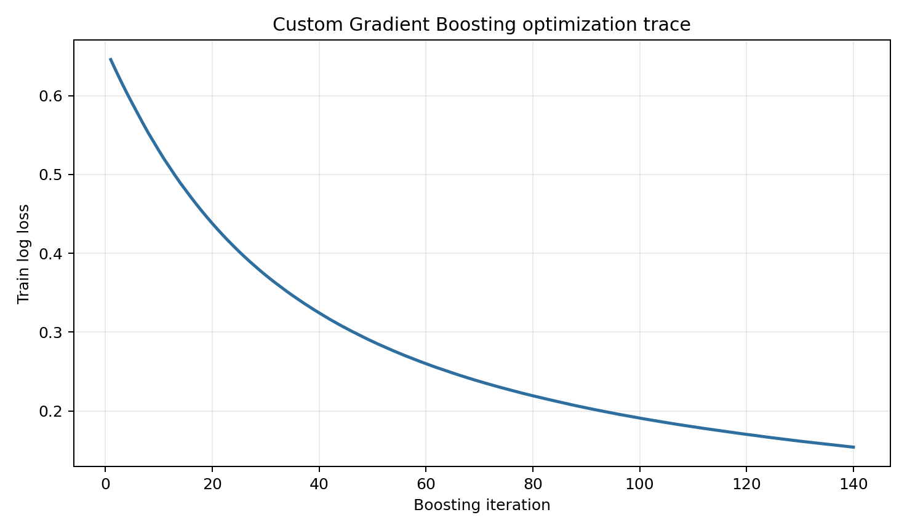
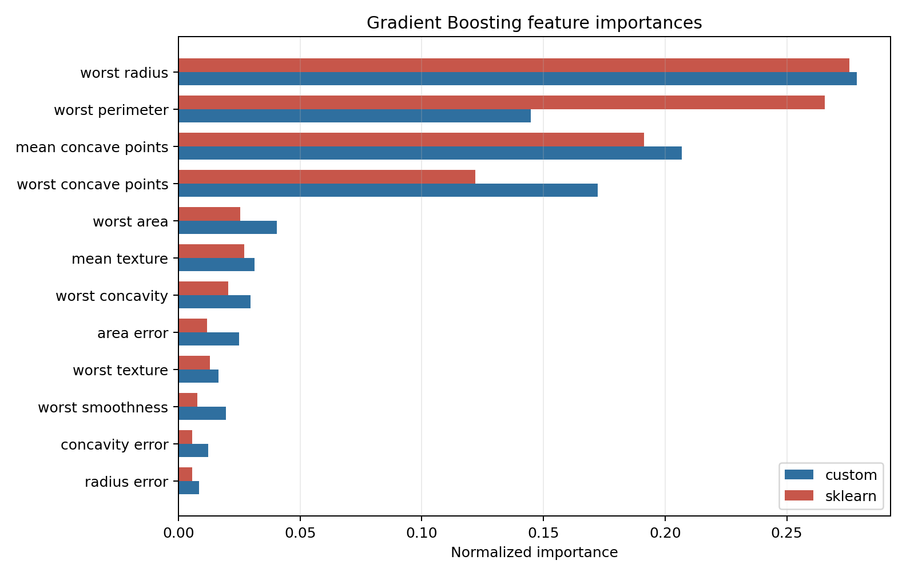
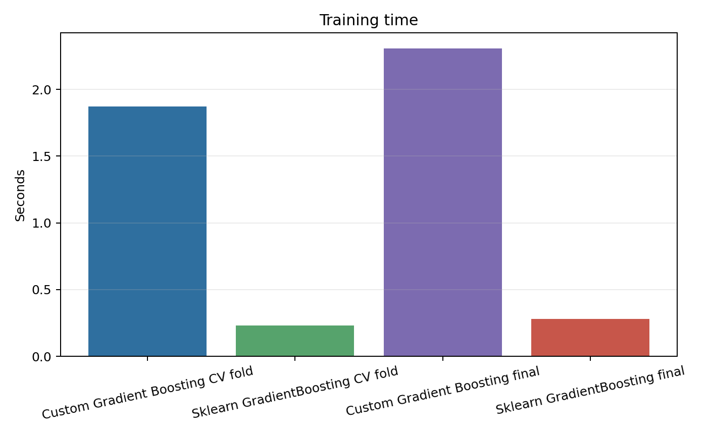

# Лабораторная работа №3. Градиентный бустинг

## Цель

Реализовать алгоритм градиентного бустинга, оценить качество с помощью кросс-валидации, замерить время обучения и сравнить результат с эталонной реализацией `sklearn.ensemble.GradientBoostingClassifier`.

## Датасет

Использован встроенный датасет `sklearn.datasets.load_breast_cancer`: 569 объектов, 30 числовых признаков и бинарная целевая переменная. В отчете положительным классом считается `malignant`.

Датасет выбран потому, что он не требует внешней сети, хорошо подходит для бинарной классификации и позволяет сравнивать качество по `accuracy`, `F1`, `ROC AUC` и `log loss`.

## Реализация

Исходный код находится в [`source`](./source):

- [`data.py`](./source/data.py) загружает Breast Cancer Wisconsin и делает `train/test` разбиение;
- [`tree.py`](./source/tree.py) содержит собственный маленький CART-регрессор для аппроксимации псевдоостатков;
- [`boosting.py`](./source/boosting.py) содержит собственный `LogisticGradientBoostingClassifier`;
- [`metrics.py`](./source/metrics.py) считает метрики и строит графики;
- [`main.py`](./source/main.py) запускает кросс-валидацию, финальное обучение, сравнение и генерацию артефактов.

Алгоритм:

1. Инициализируется константный raw-score через log-odds положительного класса.
2. На каждой итерации считаются вероятности через sigmoid.
3. Псевдоостатки для логистической функции потерь равны `y - p`.
4. На псевдоостатках обучается CART-регрессор.
5. Предсказание ансамбля обновляется с шагом `learning_rate`.

## Запуск

Из директории лабораторной:

```bash
python3 source/main.py
```

После запуска результаты сохраняются в [`artifacts`](./artifacts).

## Результаты текущего запуска

Параметры запуска: `test_size=0.2`, `cv_folds=5`, `random_state=42`.

Параметры моделей: `n_estimators=140`, `learning_rate=0.08`, `max_depth=2`, `subsample=1.0`, `min_samples_leaf=4`.

### Кросс-валидация

| Модель | Accuracy | Precision | Recall | F1 | ROC AUC | Log loss | Время обучения, c |
|---|---:|---:|---:|---:|---:|---:|---:|
| Собственный Gradient Boosting | 0.9495 ± 0.0164 | 0.9651 ± 0.0407 | 0.9000 ± 0.0440 | 0.9299 ± 0.0231 | 0.9843 ± 0.0075 | 0.1959 ± 0.0261 | 1.8737 |
| `sklearn` GradientBoostingClassifier | 0.9714 ± 0.0112 | 0.9764 ± 0.0216 | 0.9471 ± 0.0288 | 0.9611 ± 0.0156 | 0.9916 ± 0.0052 | 0.0923 ± 0.0333 | 0.2269 |

### Hold-out test

| Модель | Accuracy | Precision | Recall | F1 | ROC AUC | Log loss | Время обучения, c |
|---|---:|---:|---:|---:|---:|---:|---:|
| Собственный Gradient Boosting | 0.9649 | 0.9750 | 0.9286 | 0.9512 | 0.9937 | 0.1922 | 2.3188 |
| `sklearn` GradientBoostingClassifier | 0.9649 | 1.0000 | 0.9048 | 0.9500 | 0.9911 | 0.1046 | 0.2835 |

На кросс-валидации эталонная реализация стабильнее и быстрее. На отложенной тестовой выборке обе модели дали одинаковую accuracy `0.9649`, при этом собственная модель получила немного выше recall и ROC AUC, но хуже log loss.

Наиболее важные признаки собственной модели:

| Признак | Важность custom | Важность sklearn |
|---|---:|---:|
| `worst radius` | 0.2787 | 0.2758 |
| `mean concave points` | 0.2068 | 0.1913 |
| `worst concave points` | 0.1723 | 0.1221 |
| `worst perimeter` | 0.1448 | 0.2655 |
| `worst area` | 0.0405 | 0.0255 |

## Визуализации











## Вывод

Собственный градиентный бустинг реализует ключевую идею алгоритма: последовательную аппроксимацию антиградиента функции потерь слабыми деревьями и обновление ансамбля с малым шагом. По качеству на тестовой выборке модель сопоставима со `sklearn`, но проигрывает по времени обучения, потому что CART-регрессор написан на Python и не содержит оптимизаций промышленной реализации. При этом важности признаков согласуются с эталонной моделью: обе версии выделяют признаки размера опухоли и concave points как наиболее информативные.
