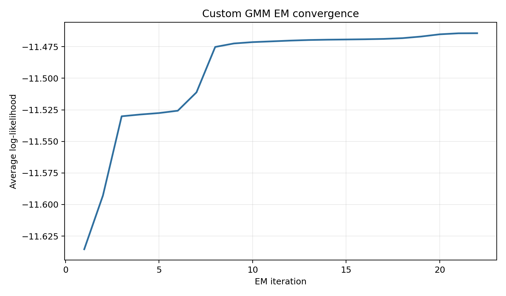
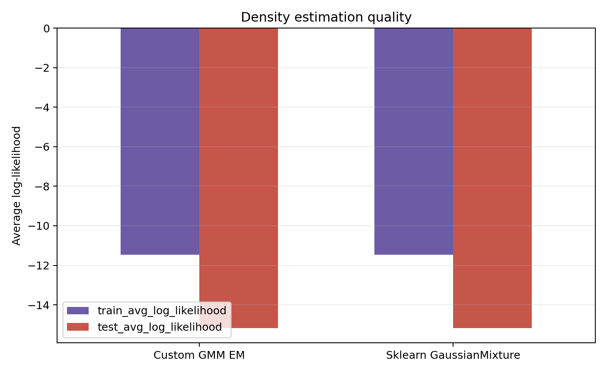
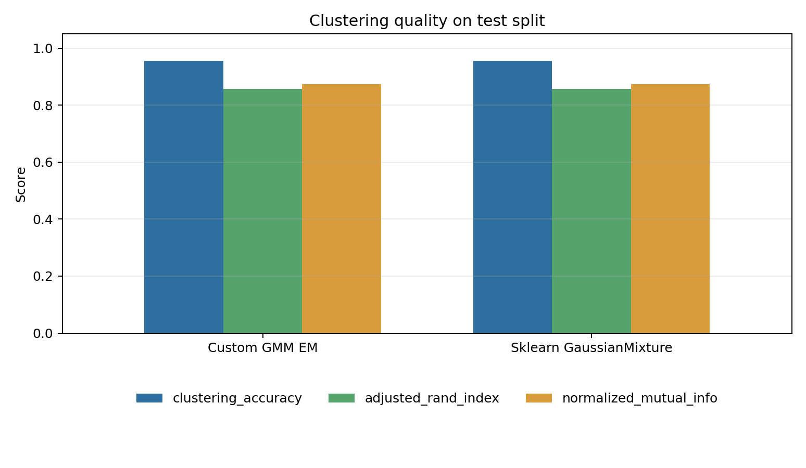
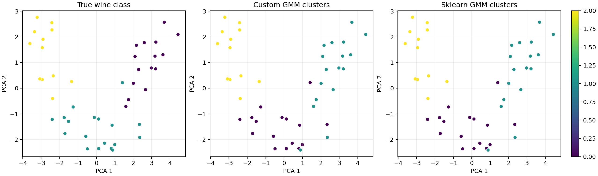
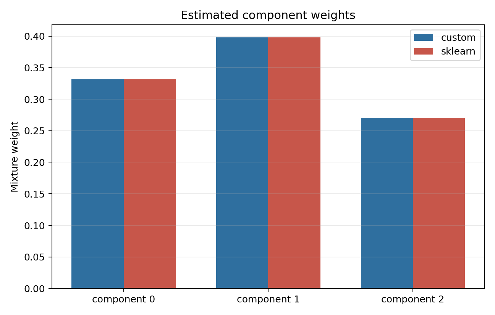

# Лабораторная работа №4. EM-алгоритм

## Цель

Реализовать Gaussian Mixture Model с обучением через EM-алгоритм, оценить качество восстановления плотности через правдоподобие и сравнить результат с `sklearn.mixture.GaussianMixture`.

## Датасет

Использован встроенный датасет `sklearn.datasets.load_wine`: 178 объектов, 13 числовых признаков и 3 сорта вина. Для обучения GMM признаки стандартизируются через `StandardScaler`, обученный только на train-разбиении.

Датасет выбран потому, что он не требует внешней сети, имеет естественную многомодальную структуру и позволяет дополнительно сравнить найденные компоненты смеси с известными классами вина.

## Реализация

Исходный код находится в [`source`](./source):

- [`data.py`](./source/data.py) загружает Wine, стандартизирует признаки и строит PCA-проекцию для графиков;
- [`gmm.py`](./source/gmm.py) содержит собственный `GaussianMixtureEM`;
- [`metrics.py`](./source/metrics.py) считает log-likelihood, BIC/AIC и метрики кластеризации;
- [`main.py`](./source/main.py) запускает обучение, сравнение с `sklearn` и генерацию артефактов.

Особенности собственной реализации:

- полная ковариационная матрица для каждой компоненты;
- E-step через устойчивый `log-sum-exp`;
- M-step с регуляризацией диагонали ковариаций;
- инициализация через простой k-means++;
- несколько стартов `n_init` с выбором лучшего lower bound.

## Запуск

Из директории лабораторной:

```bash
python3 source/main.py
```

После запуска результаты сохраняются в [`artifacts`](./artifacts).

## Результаты текущего запуска

Параметры запуска: `test_size=0.25`, `random_state=42`, `n_components=3`, `covariance_type=full`, `n_init=5`.

| Модель | Train avg LL | Test avg LL | Test total LL | BIC | AIC | Clustering acc | ARI | NMI | Итерации |
|---|---:|---:|---:|---:|---:|---:|---:|---:|---:|
| Собственный GMM EM | -11.4643 | -15.1707 | -682.68 | 2560.66 | 1993.36 | 0.9556 | 0.8575 | 0.8728 | 22 |
| `sklearn` GaussianMixture | -11.4643 | -15.1707 | -682.68 | 2560.66 | 1993.36 | 0.9556 | 0.8575 | 0.8728 | 22 |

Время обучения:

- собственный GMM EM: `0.0109` c;
- `sklearn` GaussianMixture: `0.0457` c.

Обе модели сошлись к одинаковому значению правдоподобия. Это ожидаемый и полезный результат: собственная реализация использует тот же тип модели, полные ковариации и сопоставимую k-means инициализацию, поэтому EM приходит к тому же локальному максимуму.

Оценка ПМП выполнялась через log-likelihood:

- средний log-likelihood на train: `-11.4643`;
- средний log-likelihood на test: `-15.1707`;
- суммарный log-likelihood на test: `-682.68`.

## Визуализации











## Вывод

Реализованный EM-алгоритм для GMM корректно выполняет E-step и M-step, монотонно повышает средний log-likelihood и сходится за 22 итерации. Сравнение с `sklearn.mixture.GaussianMixture` показало совпадение правдоподобия, BIC/AIC и метрик кластеризации. На Wine смесь из трех гауссиан хорошо восстанавливает естественную структуру данных: после оптимального сопоставления компонент с классами accuracy на тестовой выборке равна `0.9556`.
