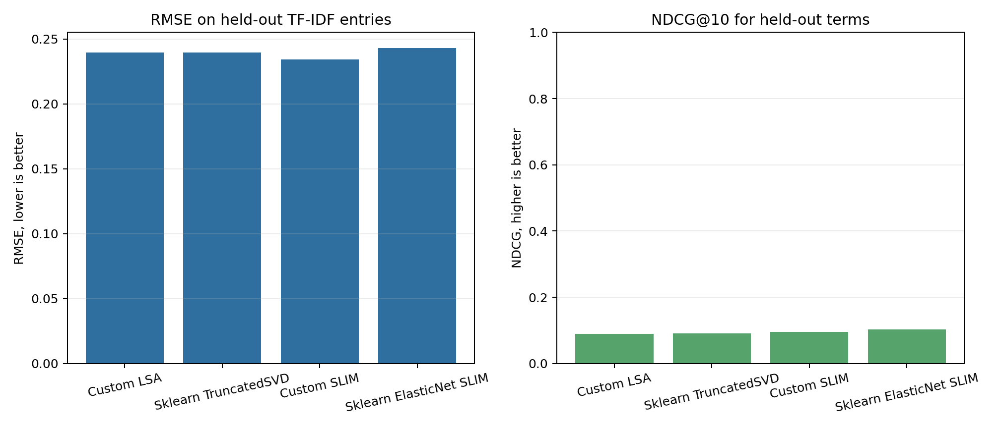
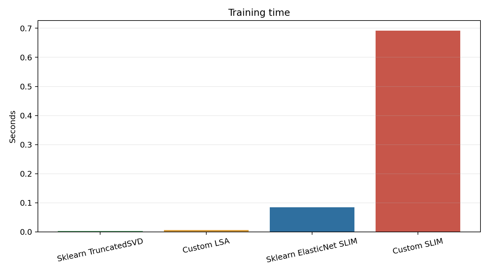
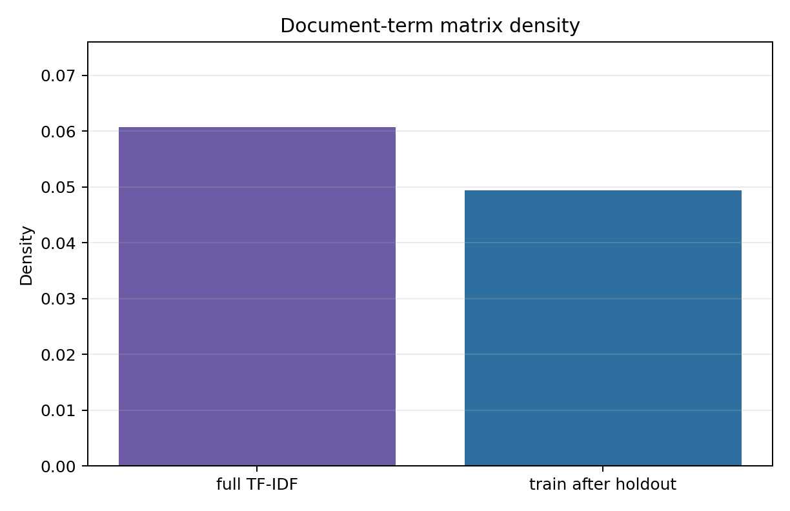
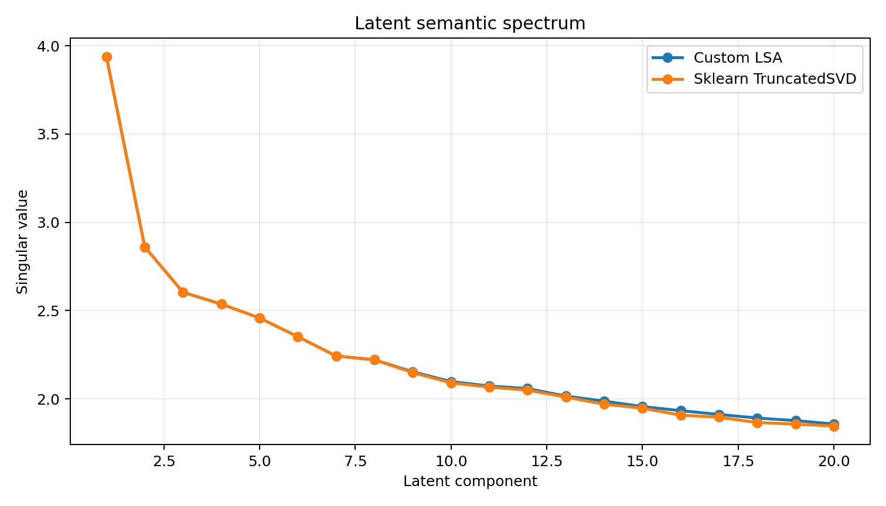

# Лабораторная работа №5. Рекомендательные системы

## Цель

Реализовать SLIM и латентную семантическую модель, оценить качество восстановления разреженной матрицы по RMSE, посчитать NDCG и сравнить результаты с эталонными реализациями на базе `sklearn`.

## Датасет

Используется реальный текстовый датасет `20 Newsgroups`, загружаемый через `sklearn.datasets.fetch_20newsgroups`. В эксперимент взяты 6 категорий:

- `comp.graphics`;
- `rec.autos`;
- `rec.sport.baseball`;
- `sci.med`;
- `sci.space`;
- `talk.politics.misc`.

Из документов строится TF-IDF матрица `документ × термин`. В словарь попадают только буквенные токены, поэтому чисто числовые признаки вроде годов и кодов не используются.

Такая постановка интерпретируется как рекомендательная:

- пользователь - документ;
- объект - термин;
- рейтинг - TF-IDF вес термина в документе;
- задача - восстановить удержанные ненулевые TF-IDF значения и ранжировать скрытые релевантные термины.

Датасет не хранится в репозитории: он скачивается стандартным загрузчиком `sklearn` во время запуска. Для текущего локального окружения в коде предусмотрен повтор загрузки с отключенной SSL-проверкой только если обычная загрузка падает на `CERTIFICATE_VERIFY_FAILED`.

## Реализация

Исходный код находится в [`source`](./source):

- [`data.py`](./source/data.py) загружает `20 Newsgroups`, строит TF-IDF и делает hold-out split ненулевых значений;
- [`models.py`](./source/models.py) содержит собственный SLIM, SLIM через `sklearn.ElasticNet`, собственную LSA и LSA через `sklearn.TruncatedSVD`;
- [`metrics.py`](./source/metrics.py) считает RMSE, NDCG@10 и строит графики;
- [`main.py`](./source/main.py) запускает полный эксперимент.

## Алгоритмы

SLIM строит разреженную item-item матрицу коэффициентов `W`, чтобы восстанавливать матрицу рейтингов как `R @ W`. Для каждого термина решается неотрицательная elastic-net регрессия по всем остальным терминам, диагональ `W` фиксируется нулевой.

Латентная семантическая модель реализована как усеченное SVD-разложение TF-IDF матрицы. Собственная версия использует `numpy.linalg.svd`, эталонная - `sklearn.decomposition.TruncatedSVD`.

## Запуск

Из директории лабораторной:

```bash
python3 source/main.py
```

После запуска результаты сохраняются в [`artifacts`](./artifacts).

## Результаты текущего запуска

Параметры запуска: `docs_per_category=60`, `max_features=180`, `test_fraction=0.2`, `lsa_components=20`, `random_state=42`.

Характеристики матрицы:

- датасет: `20 Newsgroups subset`;
- документов: `360`;
- тем: `6`;
- терминов после TF-IDF: `180`;
- плотность полной матрицы: `0.0607`;
- плотность train-матрицы после hold-out: `0.0494`;
- удержанных ненулевых значений для теста: `733`.

| Модель | Семейство | RMSE | NDCG@10 | Время обучения, c |
|---|---|---:|---:|---:|
| Собственный SLIM | SLIM | 0.23404 | 0.09605 | 0.6915 |
| `sklearn` ElasticNet SLIM | SLIM reference | 0.24290 | 0.10329 | 0.0845 |
| Собственная LSA | Latent semantic | 0.23964 | 0.08869 | 0.0057 |
| `sklearn` TruncatedSVD | Latent semantic reference | 0.23942 | 0.09058 | 0.0033 |

Собственный SLIM лучше восстановил численные TF-IDF значения по RMSE. Эталонный SLIM на `ElasticNet` дал чуть лучший NDCG@10, то есть немного лучше ранжировал скрытые релевантные термины в top-10. Латентные SVD-модели обучаются быстрее, но сильнее сглаживают разреженную матрицу.

Примеры сильных связей терминов, найденных SLIM:

| Source term | Target term | Weight |
|---|---:|---:|
| `centers` | `cancer` | 1.7333 |
| `education` | `university` | 1.2580 |
| `package` | `image` | 1.1202 |
| `volume` | `satellite` | 1.0409 |
| `newsletter` | `space` | 0.8394 |

## Визуализации









## Вывод

Собственная реализация SLIM построила интерпретируемую матрицу item-item связей между терминами и показала лучший RMSE: `0.23404`. По NDCG@10 немного лучше оказался эталонный SLIM на `sklearn.ElasticNet`: `0.10329` против `0.09605`. Латентная семантическая модель на SVD работает быстрее и дает сопоставимое, но более сглаженное восстановление TF-IDF значений. После замены корпуса лабораторная использует выбранный реальный текстовый датасет и соответствует требованию задания.
