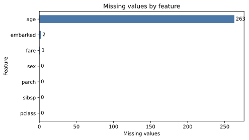
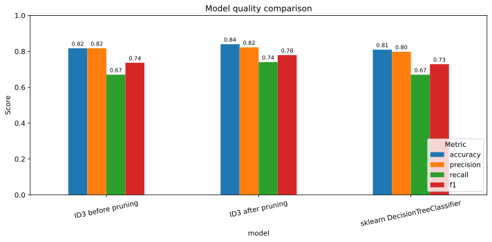
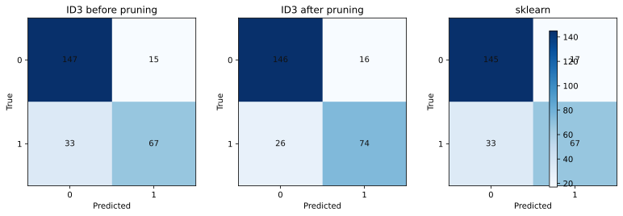
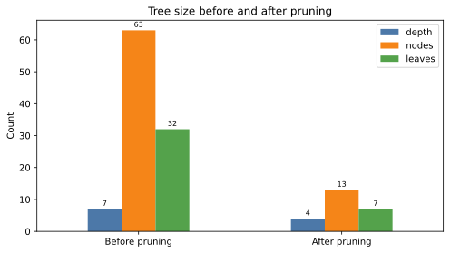

# Лабораторная работа №1. Логическая классификация

## Цель работы

Реализовать бинарное решающее дерево ID3 с критерием Джини, добавить обработку пропущенных значений через вероятностное распределение по ветвям, выполнить редукцию дерева и сравнить результат с `DecisionTreeClassifier` из `sklearn`.

## Датасет

Для эксперимента выбран датасет Titanic:

- целевая переменная: `survived`;
- количественные признаки: `pclass`, `age`, `sibsp`, `parch`, `fare`;
- категориальные признаки: `sex`, `embarked`;
- в данных присутствуют пропуски, в первую очередь в `age`, а также в `fare` и `embarked`.

Эксперимент в `notebook.ipynb` сначала пытается загрузить Titanic из OpenML. Если сеть недоступна, используется детерминированная локальная Titanic-like выборка с теми же признаками, типами данных и пропусками. Это позволяет воспроизвести полный pipeline без ручной подготовки CSV.

## Реализация

Класс `ID3GiniClassifier` находится в `source/tree.py`.

Основные свойства реализации:

- дерево строится бинарными разбиениями;
- для количественных признаков перебираются пороги между соседними уникальными значениями;
- для категориальных признаков проверяются разбиения вида `feature == category`;
- качество разбиения оценивается по уменьшению неопределённости Джини;
- пропущенные значения при обучении распределяются в обе ветви с весами, равными долям известных объектов в этих ветвях;
- при предсказании объект с пропуском получает взвешенную смесь вероятностей левой и правой ветви;
- редукция реализована как Reduced Error Pruning на валидационной выборке.

## Запуск

```bash
cd students/mukhomediarova-ar/lab1
python -m pip install -r requirements.txt
jupyter notebook notebook.ipynb
```

Далее нужно выполнить ячейки ноутбука сверху вниз. После запуска создаются артефакты:

- `artifacts/metrics.csv` - accuracy, precision, recall и F1 для собственной модели до/после редукции и sklearn;
- `artifacts/run_summary.json` - размеры выборок, пропуски, матрицы ошибок и статистика дерева;
- `artifacts/tree_before_pruning.txt` и `artifacts/tree_after_pruning.txt` - текстовое представление дерева;
- `artifacts/metrics_comparison.svg`, `artifacts/confusion_matrices.svg`, `artifacts/missing_values.svg`, `artifacts/tree_reduction.svg` - графики для отчёта.

## Сравнение моделей

В `notebook.ipynb` сравниваются три модели:

| Модель | Описание |
| --- | --- |
| `ID3 before pruning` | Собственная реализация ID3 до редукции |
| `ID3 after pruning` | Та же модель после Reduced Error Pruning |
| `sklearn DecisionTreeClassifier` | Эталонная реализация с критерием Джини |

Для sklearn используется pipeline с импутацией пропусков: медиана для количественных признаков, мода для категориальных, затем one-hot encoding категорий.

### Пропуски в данных



Больше всего пропусков находится в признаке `age`, поэтому вероятностная обработка отсутствующих значений особенно важна для выбранного датасета.

### Метрики качества



После редукции собственное дерево показывает лучшие `accuracy`, `recall` и `f1` среди сравниваемых моделей на тестовой выборке.

### Матрицы ошибок



Редукция уменьшила число ложноотрицательных ответов для класса `1`: модель стала лучше находить выживших пассажиров.

### Размер дерева



После pruning глубина дерева уменьшилась с 7 до 4, число узлов - с 63 до 13, а число листьев - с 32 до 7.

## Вывод

В работе реализован полный цикл построения бинарного решающего дерева: выбор разбиений по Джини, бинаризация количественных и категориальных признаков, вероятностная обработка пропусков, редукция дерева и сравнение с эталонной реализацией sklearn. Метрики, графики и текстовые артефакты формируются автоматически при выполнении `notebook.ipynb`.
