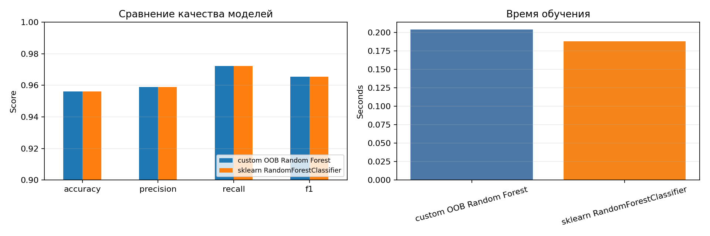
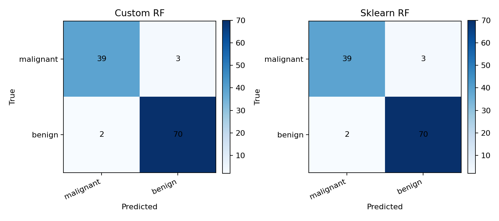
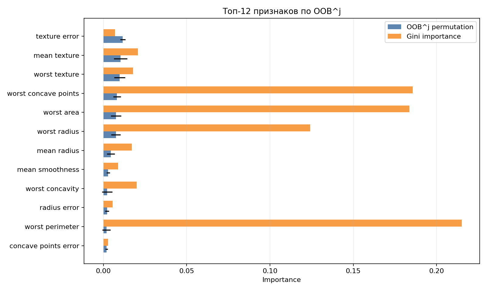

# Лабораторная работа №2. Ансамбли моделей

## Цель работы

Реализовать Random Forest на базе библиотечных решающих деревьев, добавить Out-of-Bag оценку качества, подобрать гиперпараметры по OOB через `GridSearchCV`, вычислить важность признаков OOB^j и сравнить результат с `RandomForestClassifier` из `sklearn`.

## Датасет

Для эксперимента выбран датасет Breast Cancer Wisconsin (Diagnostic) из `sklearn.datasets.load_breast_cancer`.

- объектов: 569;
- признаков: 30 числовых характеристик клеточных ядер;
- классов: 2 (`malignant`, `benign`);
- разбиение: 80% train и 20% test со стратификацией;
- предобработка не требуется, так как все признаки числовые и без пропусков.

## Реализация

Класс `OOBRandomForestClassifier` находится в `source/forest.py`.

Основные свойства реализации:

- каждое дерево обучается на bootstrap-выборке обучающих объектов;
- для каждого дерева независимо выбирается случайное подпространство признаков `max_features`;
- базовый алгоритм - `DecisionTreeClassifier` из `sklearn`;
- итоговое предсказание получается усреднением вероятностей деревьев;
- OOB accuracy считается по объектам, не попавшим в bootstrap-выборку соответствующих деревьев;
- OOB^j важность признака считается как падение OOB accuracy после перестановки значений этого признака в OOB-частях выборки;
- impurity-based важность также сохраняется для сравнения с OOB^j.

Подбор гиперпараметров выполнен через `GridSearchCV` с кастомным scorer `oob_accuracy_scorer`, который оценивает обученную модель по `estimator.oob_score_`. В качестве разбиения для `GridSearchCV` используется один train/test fold по обучающей выборке, так как scorer не использует отложенную валидацию и выбирает параметры именно по OOB.

Сетка параметров:

| Параметр | Значения |
| --- | --- |
| `n_estimators` | `40`, `80`, `120` |
| `max_features` | `sqrt`, `log2`, `0.5` |
| `max_depth` | `None`, `5`, `8` |
| `min_samples_leaf` | `1`, `3` |

## Запуск

```bash
cd students/mukhomediarova-ar/lab2
python -m pip install -r requirements.txt
python source/main.py
```

Также можно открыть и выполнить `notebook.ipynb`.

После запуска создаются артефакты:

- `artifacts/grid_results.csv` - результаты перебора гиперпараметров;
- `artifacts/metrics.csv` - метрики и время обучения собственной и эталонной моделей;
- `artifacts/feature_importance.csv` - OOB^j и Gini importance для всех признаков;
- `artifacts/run_summary.json` - параметры запуска, OOB-score и матрицы ошибок;
- `images/metrics_comparison.png` - сравнение качества и времени обучения;
- `images/confusion_matrices.png` - матрицы ошибок;
- `images/feature_importance.png` - сравнение OOB^j и Gini importance.

## Результаты

Лучшие параметры по OOB:

- `max_depth = None`;
- `max_features = 0.5`;
- `min_samples_leaf = 1`;
- `n_estimators = 80`.

OOB accuracy собственной модели на обучающей выборке: `0.9648`.

Сравнение на тестовой выборке:



| Модель | Accuracy | Precision | Recall | F1 | Время обучения, с |
| --- | ---: | ---: | ---: | ---: | ---: |
| Custom OOB Random Forest | 0.9561 | 0.9589 | 0.9722 | 0.9655 | 0.2018 |
| sklearn RandomForestClassifier | 0.9561 | 0.9589 | 0.9722 | 0.9655 | 0.1866 |

Матрицы ошибок обеих моделей совпали:



```text
[[39, 3],
 [ 2, 70]]
```

Топ признаков по OOB^j важности:



| Признак | OOB^j importance | Gini importance |
| --- | ---: | ---: |
| `texture error` | 0.0116 | 0.0070 |
| `mean texture` | 0.0104 | 0.0206 |
| `worst texture` | 0.0097 | 0.0177 |
| `worst concave points` | 0.0082 | 0.1857 |
| `worst area` | 0.0075 | 0.1836 |
| `worst radius` | 0.0075 | 0.1241 |

## Вывод

В работе реализован Random Forest с bootstrap, случайными подпространствами признаков, OOB-оценкой и OOB^j permutation importance. Подбор параметров по OOB позволил получить качество, совпадающее с эталонным `sklearn RandomForestClassifier` на тестовой выборке. Время обучения собственной реализации немного выше из-за Python-уровня цикла по деревьям и ручного подсчёта OOB-голосов, но порядок времени остался сопоставимым.
