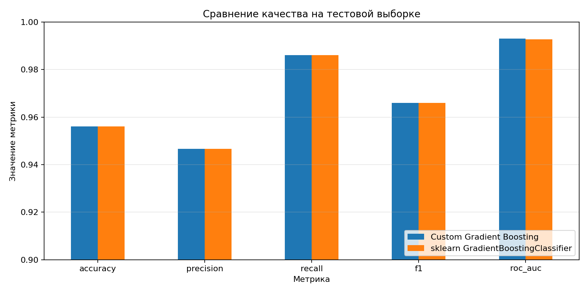
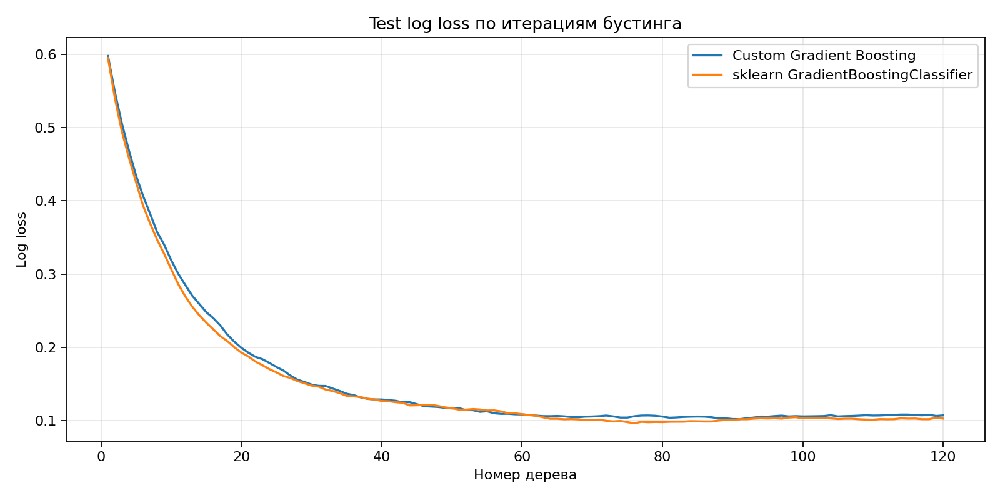
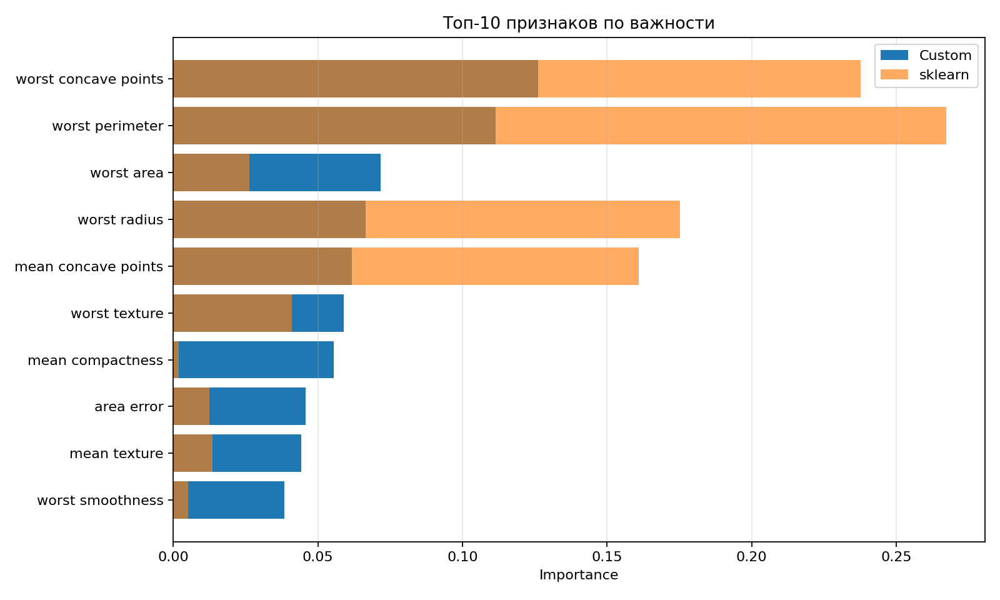
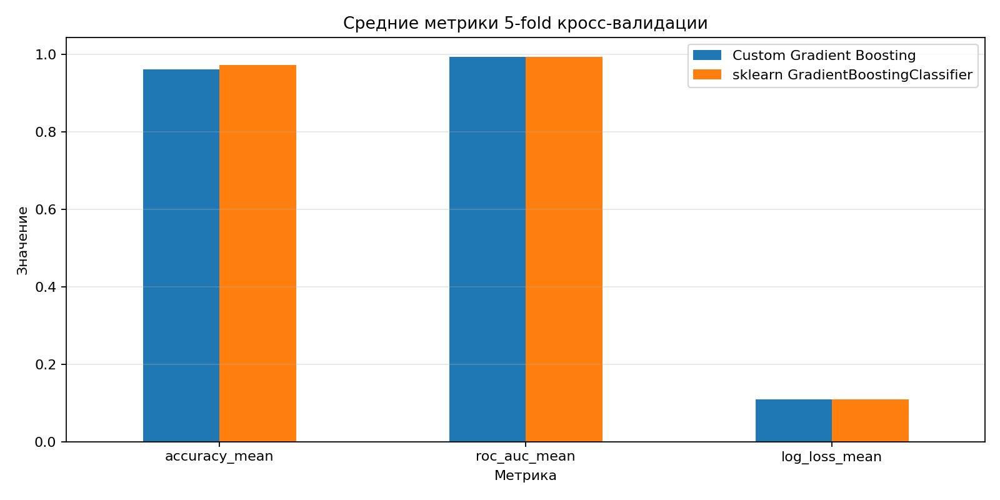

# Лабораторная работа №3. Градиентный бустинг

## Цель работы

Реализовать алгоритм градиентного бустинга для бинарной классификации, оценить качество с помощью кросс-валидации, замерить время обучения и сравнить результат с `GradientBoostingClassifier` из `sklearn`.

## Датасет

Для эксперимента выбран Breast Cancer Wisconsin (Diagnostic) из `sklearn.datasets.load_breast_cancer`.

- объектов: 569;
- признаков: 30 числовых характеристик клеточных ядер;
- классов: `malignant` и `benign`;
- разбиение: 80% train и 20% test со стратификацией;
- предобработка не требуется, так как все признаки числовые и без пропусков.

## Реализация

Класс `BinaryGradientBoostingClassifier` находится в `source/boosting.py`.

Основные свойства реализации:

- решается задача бинарной классификации с логистической функцией потерь;
- начальное предсказание задается log-odds доли положительного класса;
- на каждой итерации считается антиградиент `y - p`;
- базовый алгоритм - `DecisionTreeRegressor`;
- значения в листьях пересчитываются ньютоновским шагом `sum(y - p) / sum(p * (1 - p))`;
- итоговый ансамбль обновляется с темпом обучения `learning_rate`;
- поддерживается стохастический бустинг через параметр `subsample`;
- доступны `predict`, `predict_proba`, `score` и `staged_predict_proba` для анализа кривой log loss.

Параметры эксперимента:

| Параметр | Значение |
| --- | ---: |
| `n_estimators` | 120 |
| `learning_rate` | 0.08 |
| `max_depth` | 3 |
| `min_samples_leaf` | 3 |
| `subsample` | 0.9 |
| `random_state` | 42 |

## Запуск

```bash
cd students/mukhomediarova-ar/lab3
python -m pip install -r requirements.txt
python source/main.py
```

Также можно открыть и выполнить `notebook.ipynb`.

После запуска создаются артефакты:

- `artifacts/metrics.csv` - метрики на тестовой выборке и время обучения;
- `artifacts/cv_results.csv` - результаты 5-fold кросс-валидации по фолдам;
- `artifacts/cv_summary.csv` - средние значения кросс-валидации;
- `artifacts/feature_importance.csv` - важности признаков собственной и эталонной моделей;
- `artifacts/loss_curve.csv` - test log loss по итерациям;
- `artifacts/run_summary.json` - сводка запуска, параметры, матрицы ошибок и топ признаков.
- `images/metrics_comparison.png`, `images/loss_curve.png`, `images/feature_importance.png`, `images/cv_summary.png` - графики для отчёта.

## Результаты

Метрики на тестовой выборке:

| Модель | Accuracy | Precision | Recall | F1 | ROC AUC | Log Loss | Время обучения, с |
| --- | ---: | ---: | ---: | ---: | ---: | ---: | ---: |
| Custom Gradient Boosting | 0.9561 | 0.9467 | 0.9861 | 0.9660 | 0.9931 | 0.1073 | 0.3439 |
| sklearn GradientBoostingClassifier | 0.9561 | 0.9467 | 0.9861 | 0.9660 | 0.9927 | 0.1029 | 0.3134 |

Матрицы ошибок обеих моделей совпали:

```text
[[38, 4],
 [ 1, 71]]
```

5-fold кросс-валидация на обучающей выборке:

| Модель | Accuracy mean | Accuracy std | ROC AUC mean | Log Loss mean | Среднее время fit, с |
| --- | ---: | ---: | ---: | ---: | ---: |
| Custom Gradient Boosting | 0.9604 | 0.0228 | 0.9936 | 0.1081 | 0.2789 |
| sklearn GradientBoostingClassifier | 0.9714 | 0.0200 | 0.9933 | 0.1087 | 0.2572 |

Топ признаков по важности собственной модели:

| Признак | Custom importance | sklearn importance |
| --- | ---: | ---: |
| `worst concave points` | 0.1261 | 0.2376 |
| `worst perimeter` | 0.1114 | 0.2673 |
| `worst area` | 0.0717 | 0.0263 |
| `worst radius` | 0.0666 | 0.1753 |
| `mean concave points` | 0.0618 | 0.1611 |

## Визуализации

### Сравнение метрик на тестовой выборке



По основным классификационным метрикам модели совпадают: обе делают одинаковые ошибки на тестовой выборке. ROC AUC собственной реализации даже немного выше, но различие находится на уровне тысячных.

### Кривая log loss



Log loss быстро падает на первых итерациях и затем выходит на плато. Это показывает, что ансамбль действительно последовательно исправляет ошибки предыдущих деревьев; сильного роста ошибки к концу обучения не наблюдается.

### Важность признаков



Обе модели считают наиболее полезными признаки, связанные с худшими значениями радиуса, периметра, площади и вогнутых точек опухоли. Абсолютные веса различаются из-за отличий в реализации бустинга, но верхняя группа признаков остаётся медицински интерпретируемой и близкой между моделями.

### Кросс-валидация



На кросс-валидации `sklearn` показывает более высокую среднюю accuracy и немного меньшее время обучения. При этом ROC AUC и log loss у собственной реализации остаются сопоставимыми, то есть модель хорошо ранжирует объекты по вероятности положительного класса.

## Вывод

В работе реализован градиентный бустинг для бинарной классификации с логистической функцией потерь, деревьями-регрессорами в качестве базовых моделей и стохастическим subsampling. На тестовой выборке собственная реализация получила такую же accuracy, precision, recall и F1, как `sklearn GradientBoostingClassifier`, а ROC AUC оказался практически идентичным. Эталонная модель обучается немного быстрее и показывает более высокую среднюю accuracy на кросс-валидации, что ожидаемо из-за более оптимизированной промышленной реализации.
