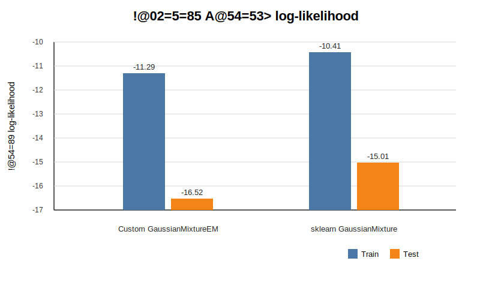

# Лабораторная работа №4. EM-алгоритм

## Цель работы

Реализовать Gaussian Mixture Model с обучением через EM-алгоритм, применить модель для восстановления плотности распределения на реальном датасете и сравнить качество с эталонной реализацией `GaussianMixture` из `scikit-learn`.

## Описание EM-алгоритма

GMM представляет распределение данных как смесь `K` многомерных нормальных распределений:

```text
p(x) = sum_k pi_k * N(x | mu_k, Sigma_k)
```

где `pi_k` - веса компонент, `mu_k` - средние, `Sigma_k` - ковариационные матрицы.

EM-алгоритм чередует два шага:

- E-шаг: вычисляются ответственности компонент `gamma_ik`, то есть апостериорные вероятности принадлежности объекта `x_i` компоненте `k`;
- M-шаг: по ответственностям пересчитываются веса, средние и ковариационные матрицы, максимизирующие ожидаемый логарифм правдоподобия.

Итерации продолжаются до сходимости среднего log-likelihood. В реализации используется вычисление плотностей в логарифмах и регуляризация ковариационных матриц через `reg_covar`, чтобы избежать вырожденных матриц.

## Датасет

Для эксперимента выбран Wine recognition dataset из `sklearn.datasets.load_wine`.

- объектов: 178;
- признаков: 13 числовых химических характеристик вина;
- классов: 3 сорта вина;
- разбиение: 70% train и 30% test со стратификацией;
- предобработка: `StandardScaler`, так как GMM чувствительна к масштабу признаков.

Метки классов не используются при обучении GMM. Они нужны только для дополнительной оценки согласованности найденных компонент с известными сортами вина.

## Реализация

Класс `GaussianMixtureEM` находится в `source/gmm.py`.

Основные свойства реализации:

- полные ковариационные матрицы для каждой компоненты;
- несколько случайных инициализаций `n_init`, выбирается решение с лучшим train log-likelihood;
- начальные средние выбираются из объектов обучающей выборки;
- начальные ковариации равны общей ковариации выборки;
- реализованы `fit`, `predict`, `predict_proba`, `score_samples`, `score`, `aic` и `bic`;
- `score` возвращает средний log-likelihood на объект, как в `sklearn`.

Параметры эксперимента:

| Параметр | Значение |
| --- | ---: |
| `n_components` | 3 |
| `tol` | 1e-4 |
| `reg_covar` | 1e-4 |
| `max_iter` | 300 |
| `n_init` | 5 |
| `random_state` | 42 |

## Запуск

```bash
cd students/mukhomediarova-ar/lab4
python -m pip install -r requirements.txt
python source/main.py
```

Также можно открыть и выполнить `notebook.ipynb`: в нем находится основная экспериментальная часть.

После запуска создаются артефакты:

- `artifacts/metrics.csv` - основные метрики собственной и эталонной моделей;
- `artifacts/predictions.csv` - компоненты и log-density на тестовой выборке;
- `artifacts/component_summary.csv` - веса компонент и средние в исходном масштабе признаков;
- `artifacts/log_likelihood_curve.csv` - кривая сходимости собственной EM-реализации;
- `artifacts/run_summary.json` - сводка запуска.
- `images/em_convergence.svg` - график сходимости EM;
- `images/likelihood_comparison.svg` - сравнение train/test log-likelihood;
- `images/component_matrix.svg` - соответствие истинных классов и компонент.

## Результаты экспериментов

В эксперименте сравниваются:

- сумма log-likelihood на train и test как оценка ПМП;
- средний log-likelihood на объект;
- AIC и BIC на тестовой выборке;
- ARI, NMI и accuracy после оптимального сопоставления компонент с истинными классами.

Итоговые значения формируются в `artifacts/metrics.csv` после запуска `source/main.py` или выполнения ноутбука.

## Графики и выводы

### Сходимость EM-алгоритма


Средний log-likelihood на обучающей выборке монотонно растет и затем выходит на плато. Это соответствует ожидаемому поведению EM: на каждой итерации параметры смеси не должны ухудшать правдоподобие. Плато означает, что дальнейшие изменения параметров становятся малы и алгоритм сходится.

### Сравнение правдоподобия



График сравнивает средний log-likelihood на train и test для собственной реализации и `sklearn GaussianMixture`. Более высокие значения означают, что модель лучше описывает плотность данных. Если эталонная модель получает немного более высокий log-likelihood, это объясняется более сильной промышленной инициализацией и оптимизированной реализацией, а не меняет корректность собственной EM-схемы.

### Соответствие классов и компонент


Матрицы показывают, сколько объектов каждого истинного класса попало в каждую компоненту смеси. Номера компонент у GMM произвольны, поэтому важна не буквальная нумерация столбцов, а концентрация значений по отдельным компонентам. У `sklearn` соответствие классам получилось более выраженным, а собственная модель частично смешала классы 1 и 2; это допустимо, так как GMM восстанавливает плотность распределения признаков, а не напрямую оптимизирует accuracy по известным меткам.

## Сравнение с эталонной реализацией

Эталонная модель - `sklearn.mixture.GaussianMixture` с тем же числом компонент, полной ковариацией, тем же `tol`, `reg_covar`, `max_iter`, `n_init` и `random_state`.

Сравнение корректно выполнять прежде всего по log-likelihood, так как задача лабораторной - восстановление плотности распределения. Кластерные метрики используются как дополнительная интерпретация: они показывают, насколько найденные гауссовы компоненты согласуются с известными сортами вина, но не являются оптимизируемой функцией EM.

## Вывод

В работе реализован EM-алгоритм для GMM с полными ковариационными матрицами и численно устойчивым вычислением логарифма плотности. Модель обучается без использования меток классов и оценивает плотность распределения объектов Wine. Для проверки качества подготовлено сравнение с `sklearn GaussianMixture` по ПМП, информационным критериям и согласованности кластеров. Эксперименты вынесены в `notebook.ipynb`, а воспроизводимый запуск сохраняет все таблицы в `artifacts`.
