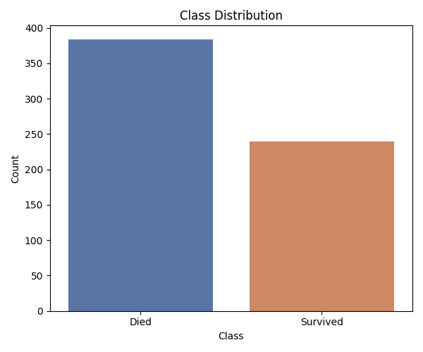
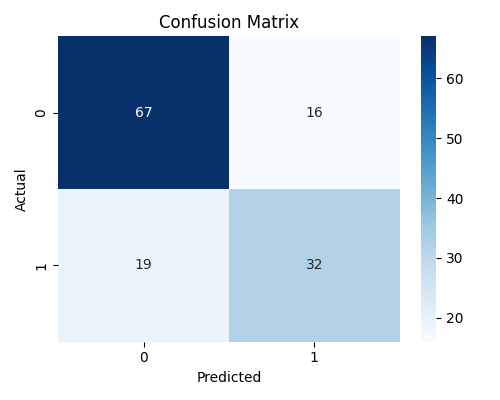
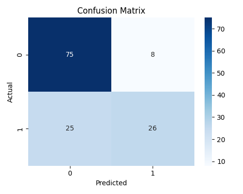
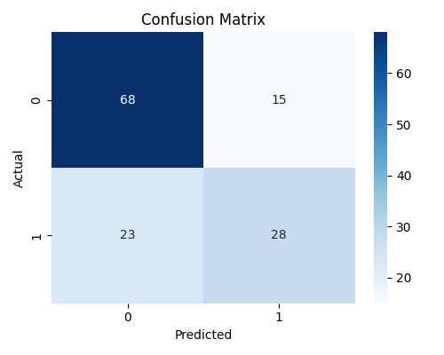
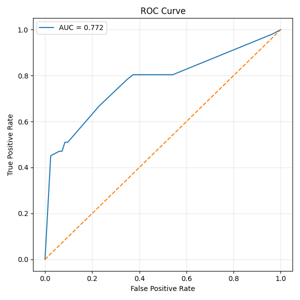
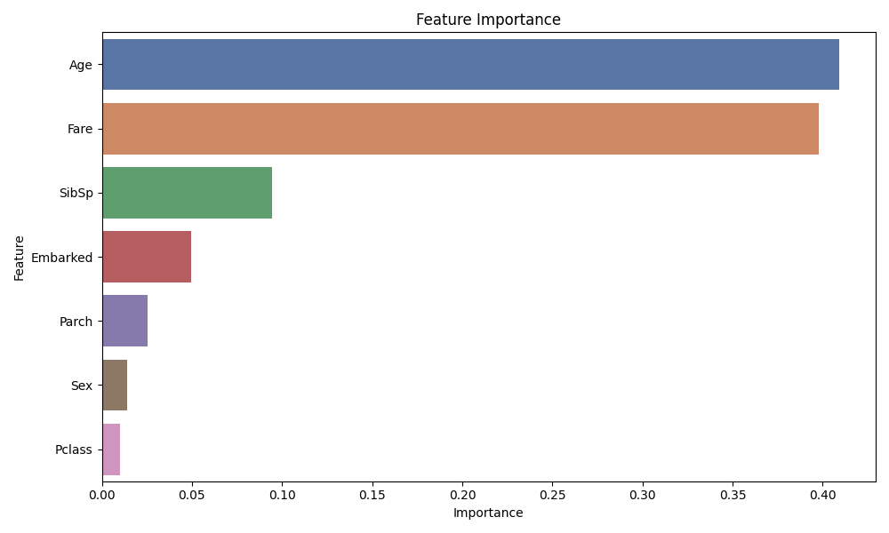
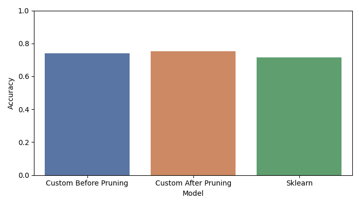
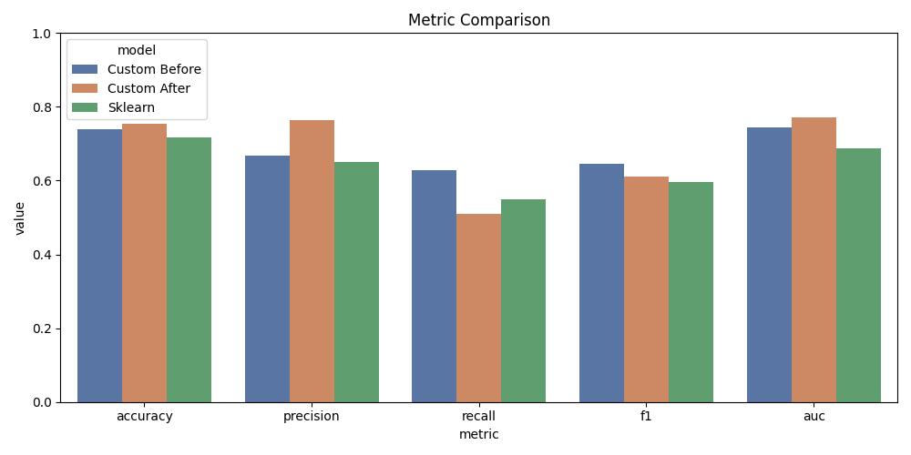
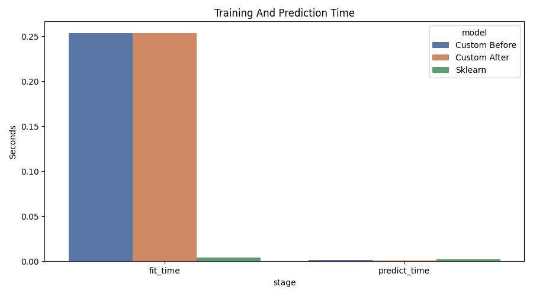
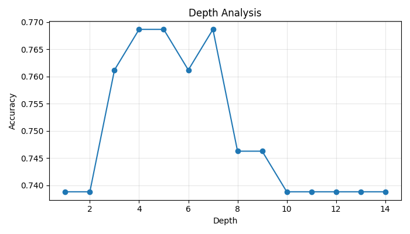

# Лабораторная работа №1 — Логическая классификация

## Цель работы
Цель лабораторной работы — реализовать бинарное решающее дерево для задачи классификации, обработать пропущенные значения через вероятностную оценку и сравнить полученную реализацию с эталонным бинарным деревом из `scikit-learn`.

В рамках работы были выполнены:
- выбор датасета для классификации;
- реализация дерева решений с критерием Джини;
- реализация обработки пропусков через вероятностную маршрутизацию;
- реализация редукции дерева (`reduced error pruning`);
- сравнение качества до и после редукции;
- сравнение с библиотечной реализацией;
- анализ качества классификации и времени работы.

---

## 1. Выбор датасета
Для эксперимента использован датасет **Titanic**:

https://www.kaggle.com/datasets/yasserh/titanic-dataset

Целевая переменная:
- `Survived = 0` — пассажир не выжил;
- `Survived = 1` — пассажир выжил.

Датасет удовлетворяет требованиям лабораторной работы:
- содержит количественные признаки: `Age`, `Fare`, `SibSp`, `Parch`, `Pclass`;
- содержит категориальные признаки: `Sex`, `Embarked`;
- содержит пропущенные значения, в частности в признаках `Age` и `Embarked`.

---

## 2. Предобработка данных
На этапе предобработки были выполнены следующие действия:
- удалены неинформативные признаки `PassengerId`, `Name`, `Ticket`, `Cabin`;
- категориальные признаки `Sex` и `Embarked` преобразованы в числовой вид;
- для пользовательской модели пропущенные значения не заполнялись заранее, чтобы дерево само обрабатывало их через вероятностную оценку;
- данные были разделены на три части: `train`, `validation`, `test`.

Для модели `scikit-learn` пропуски заполнялись медианными значениями обучающей выборки, так как стандартная реализация дерева в данном эксперименте не использовалась с прямой обработкой `NaN`.

---

## 3. Реализация бинарного решающего дерева
Пользовательская модель построена как бинарное дерево решений.

Для выбора наилучшего разбиения используется критерий Джини:

`Gini = 1 - Σ(p_i^2)`

где `p_i` — доля объектов класса `i` в рассматриваемом узле.

Особенности реализации:
- дерево строит только бинарные разбиения;
- для вещественных признаков пороги выбираются как середины между соседними уникальными значениями;
- в каждом узле сохраняются:
  - индекс признака;
  - порог разбиения;
  - вероятность перехода в левое и правое поддерево;
  - класс большинства;
  - вероятность положительного класса.

---

## 4. Обработка пропущенных значений
Одним из основных требований лабораторной работы была реализация обработки пропущенных значений через вероятностную оценку.

В проекте это реализовано следующим образом:
- при выборе лучшего разбиения пропущенные значения учитываются вероятностно;
- при построении дерева объекты с `NaN` не отбрасываются, а распределяются между левым и правым поддеревом в соответствии с вероятностями `left_prob` и `right_prob`;
- при предсказании для объекта с пропущенным значением итоговый прогноз вычисляется как взвешенная комбинация прогнозов левого и правого поддерева;
- тот же подход используется при вычислении вероятности принадлежности к положительному классу и во время pruning.

Таким образом обработка пропусков реализована не только на этапе предсказания, но и при обучении дерева.

---

## 5. Редукция дерева
Для уменьшения переобучения реализован алгоритм **Reduced Error Pruning**.

Алгоритм работает следующим образом:
1. дерево обучается на обучающей выборке;
2. качество каждого поддерева проверяется на `validation`-выборке;
3. если замена поддерева листом не ухудшает качество, поддерево заменяется листом.

В качестве критерия для pruning использовалась `accuracy` на валидационной выборке. После редукции модель повторно оценивалась на тестовой выборке.

---

## 6. Метрики качества
Для оценки моделей были использованы следующие метрики:
- `accuracy`;
- `precision`;
- `recall`;
- `F1-score`;
- `ROC-AUC`;
- время обучения (`fit_time`);
- время предсказания (`predict_time`).

Такой набор позволяет сравнить модели не только по общей точности, но и по качеству обнаружения положительного класса, а также по вычислительной эффективности.

---

## 7. Полученные результаты
### 7.1 Численные результаты
Результаты эксперимента:

| Модель | Accuracy | Precision | Recall | F1 | AUC | Fit time | Predict time |
|---|---:|---:|---:|---:|---:|---:|---:|
| Custom Tree Before Pruning | 0.7388 | 0.6667 | 0.6275 | 0.6465 | 0.7453 | 0.2536 | 0.0016 |
| Custom Tree After Pruning | 0.7537 | 0.7647 | 0.5098 | 0.6118 | 0.7719 | 0.2536 | 0.0006 |
| Sklearn Tree | 0.7164 | 0.6512 | 0.5490 | 0.5957 | 0.6869 | 0.0040 | 0.0023 |

### 7.2 Интерпретация результатов
По полученным результатам можно сделать следующие выводы:
- после pruning пользовательское дерево показало более высокую `accuracy`, чем до pruning: `0.7537` против `0.7388`;
- после pruning также улучшилось значение `ROC-AUC`: `0.7719` против `0.7453`, что говорит о лучшем разделении классов;
- `precision` после pruning выросла до `0.7647`, то есть модель стала точнее в положительных предсказаниях;
- при этом `recall` уменьшилась до `0.5098`, что означает более консервативное поведение модели: она реже относит объект к положительному классу;
- пользовательская реализация после pruning превзошла `sklearn` по `accuracy`, `F1` и `AUC` в данном эксперименте;
- библиотечная реализация значительно быстрее обучается, однако пользовательская модель показала лучшее качество классификации на выбранном датасете.

Иными словами, pruning улучшил обобщающую способность дерева, но сделал модель более осторожной в распознавании положительного класса.

---

## 8. Визуализация результатов
В ходе эксперимента были построены следующие графики:

### Распределение классов

График показывает, что классы в выборке распределены неравномерно: отрицательный класс встречается чаще.

### Confusion matrix до pruning

### Confusion matrix после pruning

### Confusion matrix для sklearn

Матрицы ошибок наглядно показывают изменение баланса между правильными положительными и ложными отрицательными ответами после редукции дерева.

### ROC-кривая

ROC-кривая подтверждает, что пользовательское дерево после pruning сохраняет хорошее качество разделения классов.

### Важность признаков

Наиболее важными признаками оказались признаки, связанные с социальным статусом и условиями посадки на корабль, что соответствует известным особенностям датасета Titanic.

### Сравнение accuracy

### Сравнение метрик

### Сравнение времени работы

### Анализ глубины дерева

Графики сравнения показывают, что пользовательская реализация обеспечивает лучшее качество классификации, тогда как `scikit-learn` заметно быстрее по времени обучения.

---

## 9. Итоговый вывод
В ходе лабораторной работы было реализовано бинарное решающее дерево для задачи классификации с критерием Джини.

Основные результаты работы:
- Реализован механизм вероятностной маршрутизации объектов с пропущенными значениями при предсказании и pruning.;
- реализован алгоритм редукции дерева;
- проведено сравнение качества до и после pruning;
- проведено сравнение с эталонной реализацией `scikit-learn`;
- добавлены расширенные метрики качества и сравнение времени работы.

Итог эксперимента показывает, что пользовательская реализация успешно решает задачу классификации и по качеству на выбранном датасете превосходит библиотечную модель, хотя и уступает ей по скорости обучения. После pruning модель стала лучше обобщать данные, что подтвердилось ростом `accuracy` и `ROC-AUC`.
