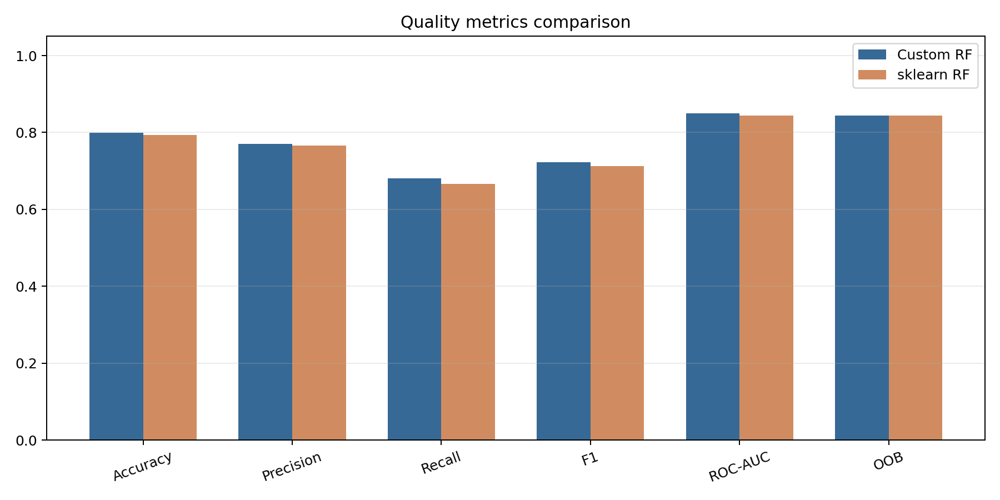
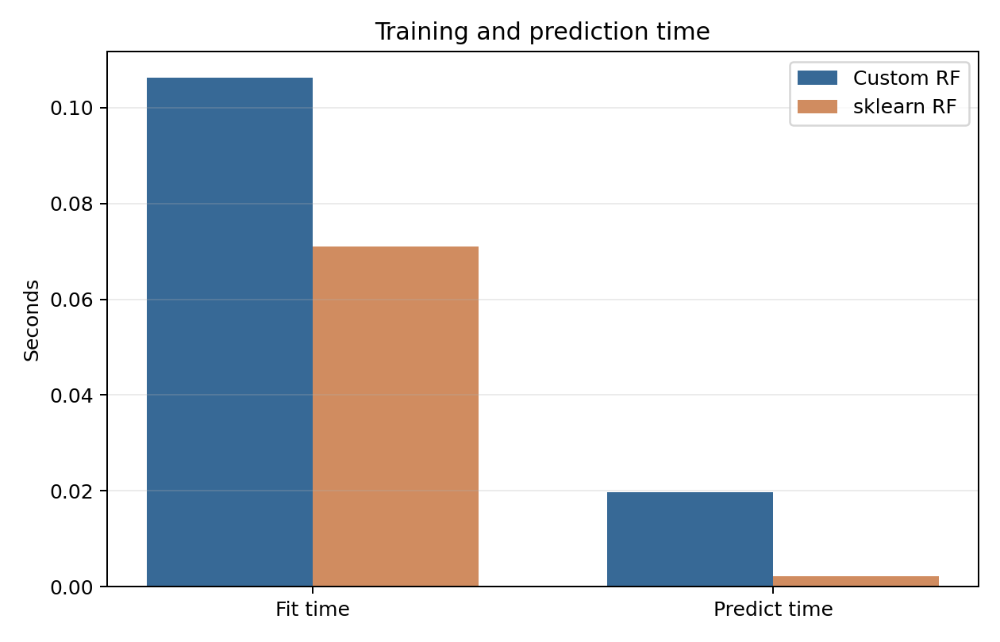
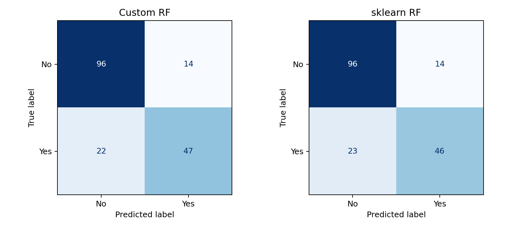
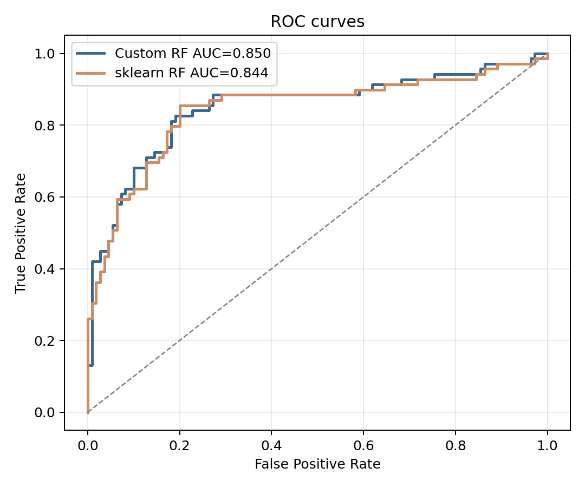
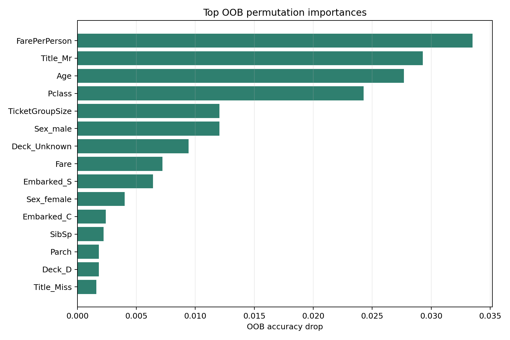
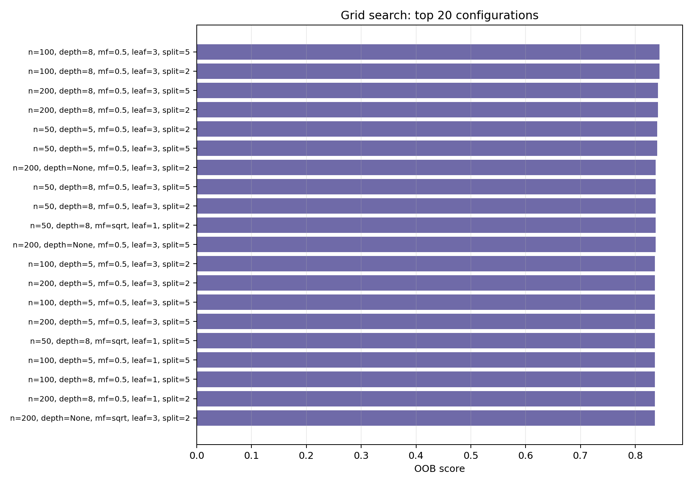

# Лабораторная работа №2. Ансамбли моделей

## Цель работы
Реализовать собственный ансамбль Random Forest на базе библиотечных деревьев решений, подобрать гиперпараметры по OOB-оценке, получить важность признаков через OOB^j и сравнить результат с эталонной реализацией scikit-learn.

## Выбранный датасет
Использован датасет Titanic. Целевая переменная `Survived` задает бинарную классификацию: пассажир выжил или не выжил.

В отличие от минимального набора признаков, в этой работе были добавлены признаки, извлеченные из исходных полей:

- `Title` из имени пассажира;
- `Deck` из номера каюты;
- `FamilySize = SibSp + Parch + 1`;
- `IsAlone` как индикатор одиночной поездки;
- `TicketGroupSize` как число пассажиров с одинаковым билетом;
- `FarePerPerson` как тариф, деленный на размер семьи.

Размер данных: 891 объектов. Обучающая выборка: 712, тестовая выборка: 179. Распределение классов: не выжил = 549, выжил = 342.

Предобработка выполнялась без утечки данных: сначала train/test split, затем `SimpleImputer` и `OneHotEncoder` обучались только на train-части. После one-hot кодирования получилось 29 признаков.

## Описание метода
Реализован класс `OOBRandomForestClassifier`. Он совместим с API sklearn и использует `DecisionTreeClassifier` как базовый алгоритм.

Для каждого дерева выполняется:

1. формирование bootstrap-выборки размера `n` с возвращением;
2. определение OOB-объектов, которые не попали в bootstrap;
3. обучение дерева решений с ограничениями из текущей комбинации гиперпараметров;
4. накопление OOB-предсказаний для вычисления `oob_score_`.

Итоговое предсказание строится soft-voting: вероятности классов усредняются по всем деревьям, затем выбирается класс с максимальной средней вероятностью.

## Подбор гиперпараметров
Для подбора использован `GridSearchCV` из sklearn. Так как качество должно подбираться по OOB, применен специальный scorer, возвращающий `estimator.oob_score_`. В качестве CV передается один технический fold по train-выборке; тестовая выборка в подборе параметров не участвует.

Перебирались параметры:

- `n_estimators`: 50, 100, 200;
- `max_depth`: None, 5, 8;
- `max_features`: `sqrt`, 0.5;
- `min_samples_leaf`: 1, 3;
- `min_samples_split`: 2, 5.

Всего проверено 72 комбинации. Время grid search: 8.17 с.

Лучшие параметры по OOB:

```json
{
  "max_depth": 8,
  "max_features": 0.5,
  "min_samples_leaf": 3,
  "min_samples_split": 2,
  "n_estimators": 100
}
```

## Результаты экспериментов
| Model | OOB | Accuracy | Precision | Recall | F1 | ROC-AUC | Fit time, s | Predict time, s |
|---|---:|---:|---:|---:|---:|---:|---:|---:|
| Custom Random Forest | 0.8441 | 0.7989 | 0.7705 | 0.6812 | 0.7231 | 0.8495 | 0.1063 | 0.0197 |
| sklearn RandomForestClassifier | 0.8441 | 0.7933 | 0.7667 | 0.6667 | 0.7132 | 0.8437 | 0.0710 | 0.0022 |

Обе модели обучались на одинаковых признаках и с одинаковыми лучшими гиперпараметрами. Это делает сравнение более честным: отличается только реализация ансамбля, а не настройка модели.

## Важность признаков через OOB^j
Важность признака оценивалась как падение OOB accuracy после случайной перестановки значений этого признака. Чем больше падение, тем важнее признак.

| Feature | OOB accuracy drop |
|---|---:|
| FarePerPerson | 0.0335 |
| Title_Mr | 0.0293 |
| Age | 0.0277 |
| Pclass | 0.0243 |
| TicketGroupSize | 0.0120 |
| Sex_male | 0.0120 |
| Deck_Unknown | 0.0094 |
| Fare | 0.0072 |
| Embarked_S | 0.0064 |
| Sex_female | 0.0040 |
| Embarked_C | 0.0024 |
| SibSp | 0.0022 |

Наиболее важные признаки связаны с полом пассажира, классом билета, возрастом, семейной структурой и стоимостью поездки. Это согласуется с исторической интерпретацией Titanic: вероятность выживания зависела от пола, социального класса и состава группы пассажира.

## Графики

### Распределение классов


В выборке пассажиров, которые не выжили, больше, чем выживших: 549 против 342. Дисбаланс не является экстремальным, но он заметен, поэтому в отчете дополнительно используются precision, recall и F1, а не только accuracy.

### Сравнение качества моделей



Качество собственной реализации и `RandomForestClassifier` из sklearn практически совпадает. Небольшое преимущество собственной модели на тестовой выборке находится в пределах естественного разброса для небольшого датасета Titanic, но главное здесь в другом: близость метрик подтверждает корректность реализации bootstrap, OOB-голосования и усреднения вероятностей.

### Сравнение времени работы



Эталонная реализация sklearn быстрее, особенно на этапе предсказания. Это ожидаемо, так как `RandomForestClassifier` оптимизирован внутри библиотеки. Собственная реализация написана на Python и предназначена прежде всего для демонстрации механики ансамбля.

### Матрицы ошибок



Матрицы ошибок показывают, что обе модели ведут себя похоже. Основная сложность задачи связана с объектами класса `Survived = 1`: часть выживших пассажиров модель относит к отрицательному классу. Это типично для Titanic, где выживание зависит от нескольких взаимосвязанных факторов, а не от одного признака.

### ROC-кривые



ROC-AUC около 0.85 показывает, что обе модели достаточно хорошо ранжируют пассажиров по вероятности выживания. Кривые почти совпадают, что дополнительно подтверждает сопоставимость собственной и библиотечной реализаций.

### Важность признаков через OOB^j



Наиболее заметное падение OOB-точности происходит при перемешивании `FarePerPerson`, `Title_Mr`, `Age` и `Pclass`. Эти признаки отражают социальный статус, пол/обращение, возраст и стоимость билета, поэтому их высокая важность хорошо согласуется с содержательной интерпретацией датасета.

### Результаты Grid Search



На графике показаны 20 лучших конфигураций по OOB-оценке. Лучшие варианты используют 100 или 200 деревьев и ограничение глубины/листа, что помогает уменьшить переобучение на небольшом датасете.

## Выводы
В работе был реализован Random Forest с bootstrap-обучением, OOB-оценкой и OOB-пермутационной важностью признаков. Подбор гиперпараметров через `GridSearchCV` по OOB позволил выбрать модель без отдельной validation-выборки.

Собственная реализация показала качество, сопоставимое с `RandomForestClassifier` из sklearn. При этом эталонная реализация обычно быстрее за счет оптимизаций, но собственная реализация явно демонстрирует внутреннюю механику ансамбля: bootstrap, OOB-голосование и влияние отдельных признаков на OOB-ошибку.


## Запуск
```bash
python source/experiment.py
```
