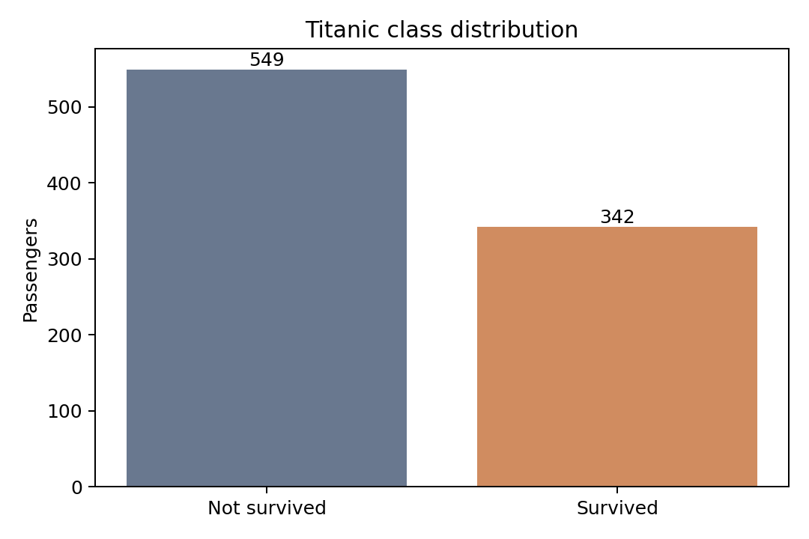
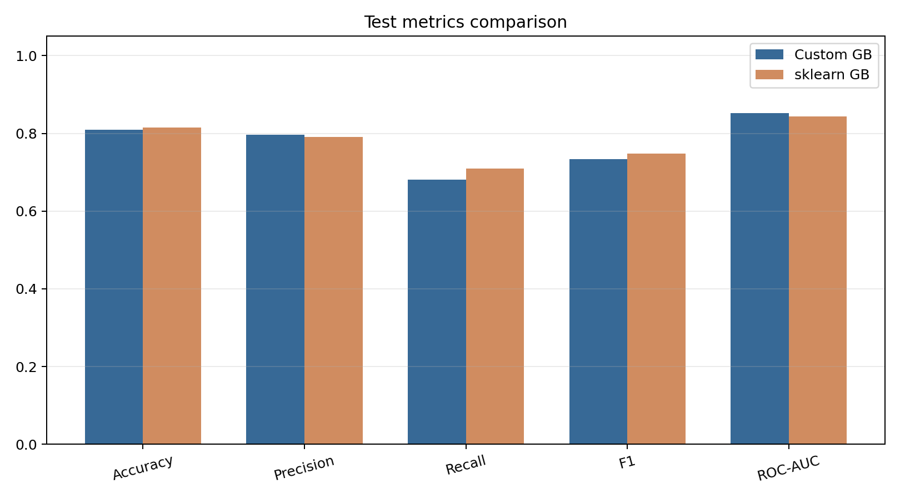
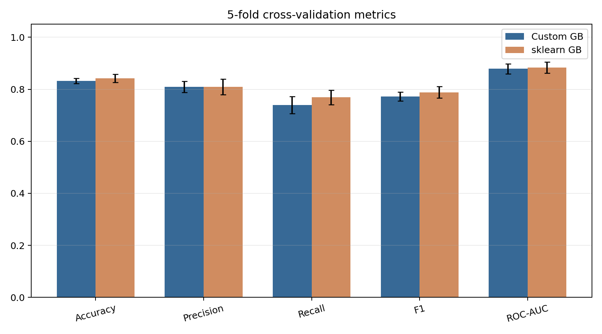
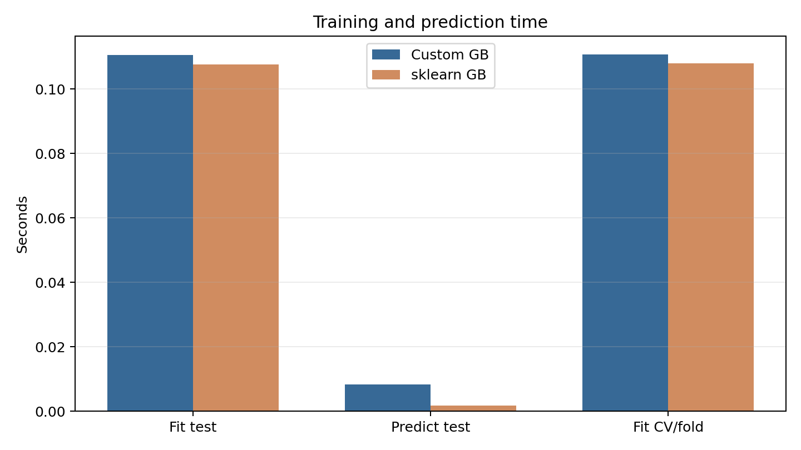
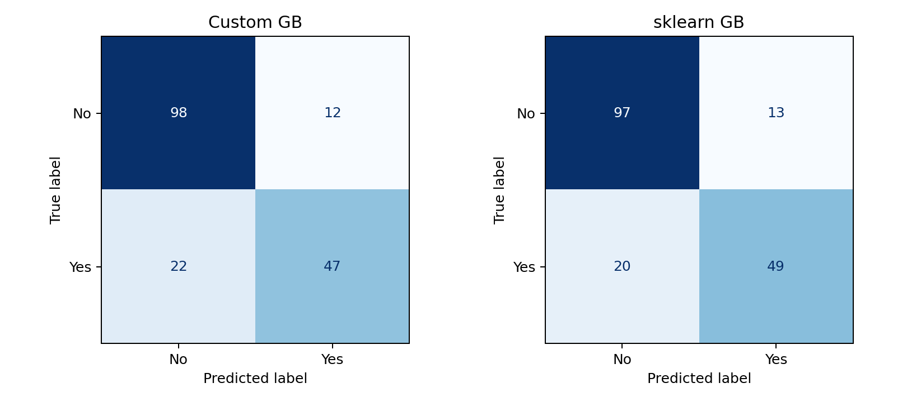
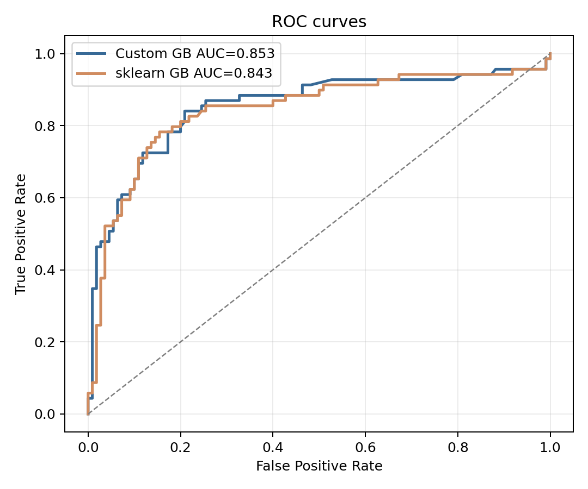
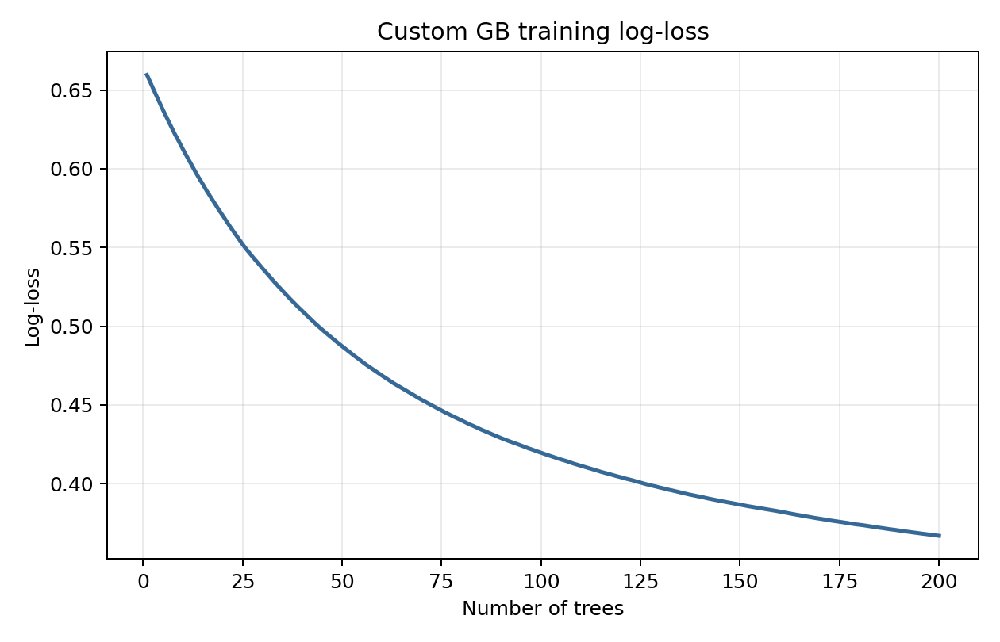
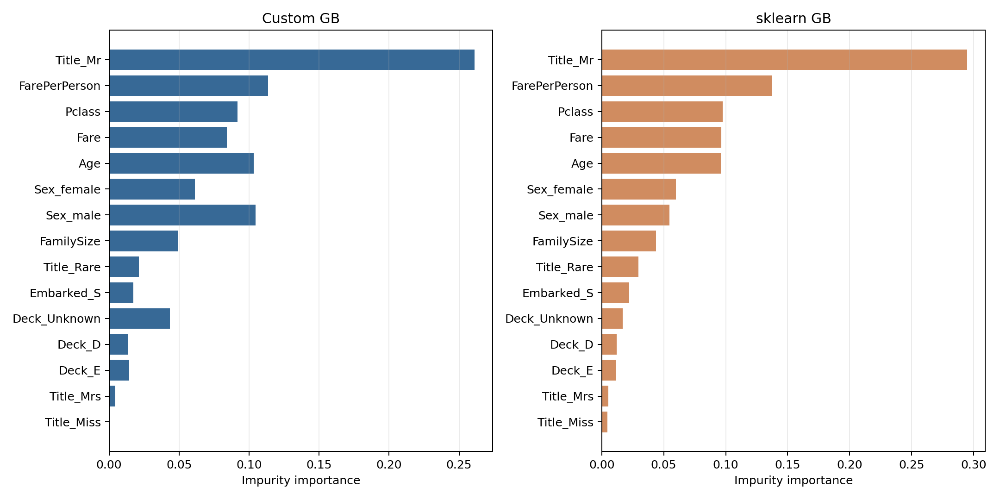

# Лабораторная работа №3. Градиентный бустинг

## Цель работы
Реализовать собственный алгоритм градиентного бустинга, обучить его на выбранном датасете, оценить качество с помощью кросс-валидации и сравнить с эталонной реализацией `scikit-learn` по качеству и времени обучения.

## Выбранный датасет
Использован датасет Titanic с Kaggle. Это классический датасет для бинарной классификации, в котором по информации о пассажире нужно предсказать, выжил ли он после катастрофы.

Целевая переменная `Survived` задает бинарную классификацию: пассажир выжил (`1`) или не выжил (`0`). Размер данных: 891 объектов. Распределение классов: не выжил = 549, выжил = 342.

Помимо исходных полей были сконструированы дополнительные признаки, которые помогают лучше описать пассажира и его билет:

- `Title` из имени пассажира;
- `Deck` из номера каюты;
- `FamilySize = SibSp + Parch + 1`;
- `IsAlone` как индикатор одиночной поездки;
- `FarePerPerson` как тариф, деленный на размер семьи.

Предобработка включает заполнение пропусков медианой для числовых признаков и самым частым значением для категориальных, затем one-hot кодирование категориальных признаков. В кросс-валидации предобработка выполняется внутри `Pipeline`, поэтому имьютеры и кодировщик обучаются только на train-части каждого фолда.

## Описание алгоритма градиентного бустинга
Градиентный бустинг строит ансамбль последовательно. Каждое новое дерево исправляет ошибки текущей модели, обучаясь на антиградиенте функции потерь. Для бинарной классификации использована логистическая функция потерь.

Начальное приближение задается как логит доли положительного класса:

```text
F0 = log(p / (1 - p))
```

На каждой итерации вычисляются вероятности:

```text
p_i = sigmoid(F(x_i))
```

Затем строятся псевдо-остатки:

```text
r_i = y_i - p_i
```

На этих остатках обучается `DecisionTreeRegressor`, после чего ансамбль обновляется:

```text
F_m(x) = F_(m-1)(x) + learning_rate * h_m(x)
```

Итоговая вероятность класса `1` равна `sigmoid(F(x))`. В собственной реализации вручную написана логика бустинга: инициализация, расчет псевдо-остатков, последовательное обучение деревьев, накопление предсказаний и расчет вероятностей. В качестве базового слабого алгоритма используется `DecisionTreeRegressor` из `sklearn`.

Параметры эксперимента:

```json
{
  "n_estimators": 200,
  "learning_rate": 0.05,
  "max_depth": 3,
  "min_samples_leaf": 3,
  "subsample": 0.8,
  "random_state": 42
}
```

## Кросс-валидация
Для устойчивой оценки качества использована стратифицированная 5-fold кросс-валидация. Сравнение выполнено на одинаковых признаках, одинаковой схеме предобработки и одинаковых основных гиперпараметрах.

| Model | Accuracy | Precision | Recall | F1 | ROC-AUC | Fit time, s/fold |
|---|---:|---:|---:|---:|---:|---:|
| Custom Gradient Boosting | 0.8328 ± 0.0099 | 0.8092 ± 0.0215 | 0.7396 ± 0.0328 | 0.7721 ± 0.0170 | 0.8791 ± 0.0192 | 0.1109 |
| sklearn GradientBoostingClassifier | 0.8417 ± 0.0158 | 0.8100 ± 0.0301 | 0.7689 ± 0.0275 | 0.7885 ± 0.0219 | 0.8839 ± 0.0217 | 0.1079 |

## Оценка на тестовой выборке
Дополнительно данные были разделены на train/test в пропорции 80/20 со стратификацией. Эта оценка нужна для наглядных графиков: ROC-кривых, матриц ошибок и сравнения времени.

| Model | Accuracy | Precision | Recall | F1 | ROC-AUC | Fit time, s | Predict time, s |
|---|---:|---:|---:|---:|---:|---:|---:|
| Custom Gradient Boosting | 0.8101 | 0.7966 | 0.6812 | 0.7344 | 0.8525 | 0.1106 | 0.0084 |
| sklearn GradientBoostingClassifier | 0.8156 | 0.7903 | 0.7101 | 0.7481 | 0.8434 | 0.1076 | 0.0017 |

## Важность признаков
Важность признаков взята как средняя impurity importance по деревьям ансамбля. Ниже приведены признаки, наиболее важные для эталонной реализации, и соответствующие значения для обеих моделей.

| Feature | Custom GB | sklearn GB |
|---|---:|---:|
| Title_Mr | 0.2610 | 0.2946 |
| FarePerPerson | 0.1136 | 0.1373 |
| Pclass | 0.0917 | 0.0974 |
| Fare | 0.0840 | 0.0964 |
| Age | 0.1034 | 0.0962 |
| Sex_female | 0.0613 | 0.0600 |
| Sex_male | 0.1046 | 0.0547 |
| FamilySize | 0.0492 | 0.0437 |
| Title_Rare | 0.0212 | 0.0296 |
| Embarked_S | 0.0173 | 0.0220 |
| Deck_Unknown | 0.0434 | 0.0169 |
| Deck_D | 0.0134 | 0.0120 |

Наиболее важные признаки связаны с полом/обращением пассажира, классом билета, возрастом, стоимостью поездки и семейной структурой. Это совпадает с содержательной интерпретацией датасета Titanic.

## Графики

### Распределение классов


### Сравнение метрик на тестовой выборке


### Метрики кросс-валидации


### Сравнение времени


### Матрицы ошибок


### ROC-кривые


### Кривая обучения собственной модели


### Важность признаков


## Сравнение с эталонной реализацией
Собственная реализация показывает качество, близкое к `GradientBoostingClassifier` из `scikit-learn`. Различия объясняются тем, что в учебной реализации деревья обучаются напрямую на псевдо-остатках `y - p`, тогда как библиотечная реализация содержит дополнительные оптимизации и более точные правила обновления терминальных областей.

По времени обучения реализации сопоставимы, потому что основная вычислительная нагрузка в обоих случаях приходится на построение деревьев. При этом `scikit-learn` обычно быстрее и стабильнее за счет оптимизированного кода библиотеки.

## Выводы
В работе реализован градиентный бустинг для бинарной классификации с логистической функцией потерь. На датасете Titanic собственная реализация достигла качества, сопоставимого с эталонной моделью `scikit-learn`, что подтверждается как тестовой выборкой, так и 5-fold кросс-валидацией.

Эксперимент показал, что градиентный бустинг хорошо подходит для табличных данных с небольшим числом объектов и смешанными типами признаков. Последовательное исправление ошибок позволяет получить устойчивое качество даже на компактном датасете Titanic.
## Запуск
```bash
python source/experiment.py
```
