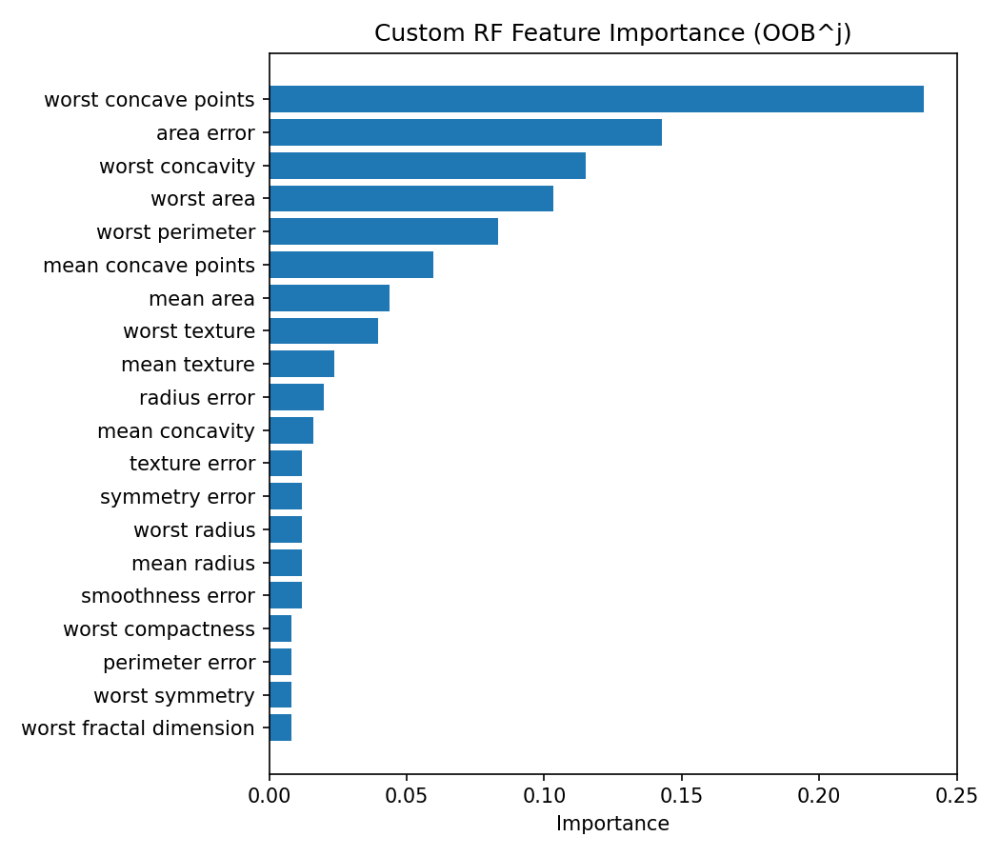
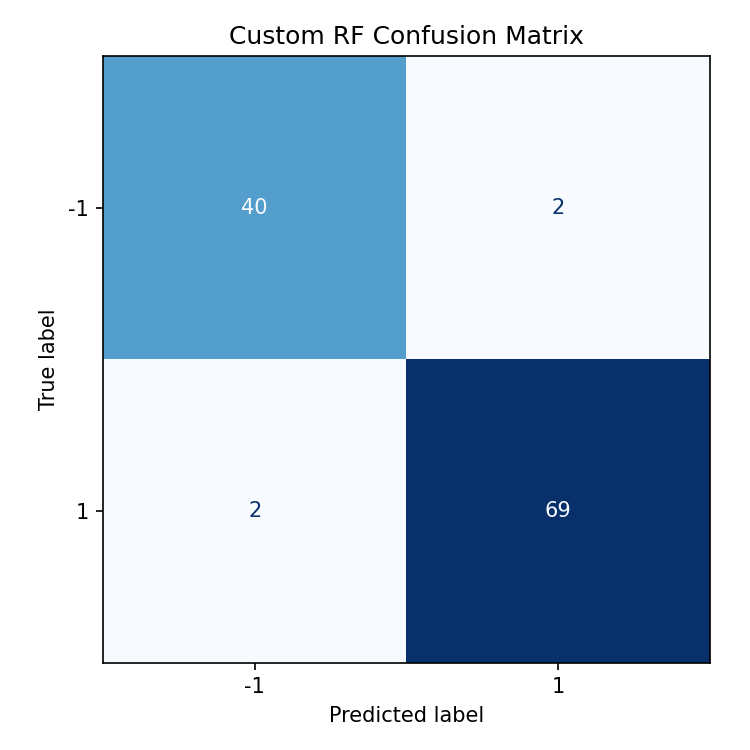
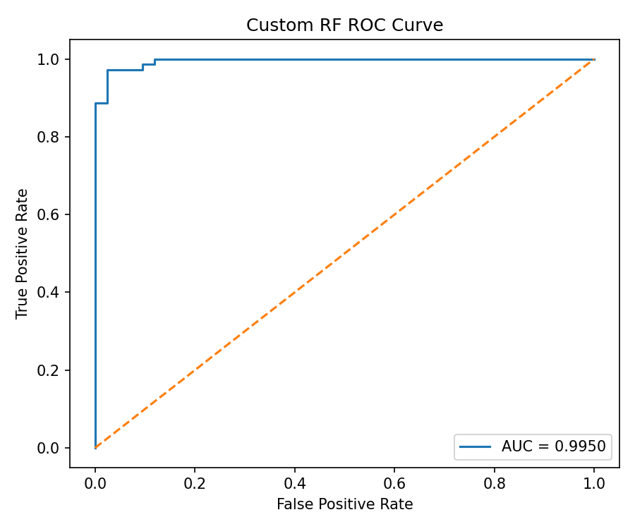
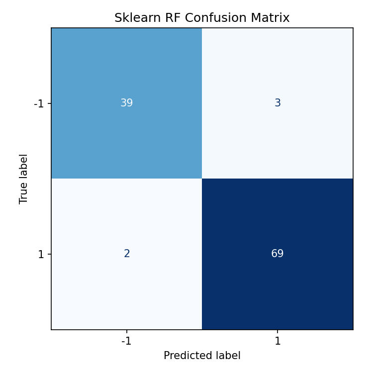

# Лабораторная работа №2 — Ансамбли моделей (Random Forest)

## Описание выбранного метода (коротко и по делу)

**Random Forest** — это много деревьев решений, каждое обучается на своей bootstrap-выборке и на случайном подмножестве признаков. Итоговый ответ — голосование по деревьям. За счёт рандомизации деревья меньше переобучаются одинаково, и ансамбль обычно получается стабильнее одного дерева.

**OOB (out-of-bag)**: для каждого дерева остаются объекты, которые не попали в его bootstrap-выборку. На них можно оценивать качество без отдельной валидации. В этой работе подбор гиперпараметров делается по OOB score.

**Важность признаков по OOB^j**: берём OOB-качество, затем для каждого признака j перемешиваем его значения и снова считаем OOB-качество. Чем сильнее качество упало — тем важнее признак.

## Описание датасета

Выбран датасет **Breast Cancer** из `sklearn.datasets`.

- **Задача**: бинарная классификация опухоли (**malignant** / **benign**).
- **Размерность**: 569 объектов, **30 числовых признаков**.
- **Целевая переменная**: в проекте хранится как -1/1 (benign/malignant).

## Результаты экспериментов

### Графики








### Лог запуска

```text
Dataset: breast_cancer
Train shape: (314, 30)
Val shape: (142, 30)
Test shape: (113, 30)

Performing Grid Search with OOB scoring...
Best parameters: {'n_estimators': 50, 'max_features': 0.5, 'max_depth': 10, 'min_samples_split': 2, 'min_samples_leaf': 2}
Best OOB score: 0.9586
GridSearch time: 38.64s
Best model fit time: 0.06s

Computing feature importance via OOB^j...
Top 5 features: [27 13 26 23 22]

Test accuracy (custom): 0.9646

Comparing with sklearn RandomForest...
Sklearn OOB score: 0.9490
Sklearn test accuracy: 0.9558
Sklearn training time: 0.10s

==================================================
COMPARISON SUMMARY
==================================================
Metric                         Custom          Sklearn        
--------------------------------------------------
OOB Score                      0.9395          0.9490         
Test Accuracy                  0.9646          0.9558         
Best Fit Time (s)              0.06            0.10           
GridSearch Time (s)            38.64           -              
==================================================
```

## Сравнение с scikit-learn (кратко)

- **Качество**: на этом запуске кастомный ансамбль показал выше **test accuracy** 0.9646 vs 0.9558, но ниже **OOB score** 0.9395 vs 0.9490.
- **Скорость обучения**: сравнение корректное — `best_custom` против `sklearn`. В данном запуске кастомная модель обучалась быстрее 0.06s vs 0.10s.

## Вывод

1. Реализован Random Forest с OOB-оценкой и пермутационной важностью признаков по \(OOB^j\).
2. Подбор гиперпараметров по OOB позволяет обойтись без отдельной валидации и даёт адекватный критерий выбора.
3. По итогам эксперимента кастомная реализация сопоставима со `sklearn` по качеству, а по времени `fit` на этом датасете оказалась быстрее.

