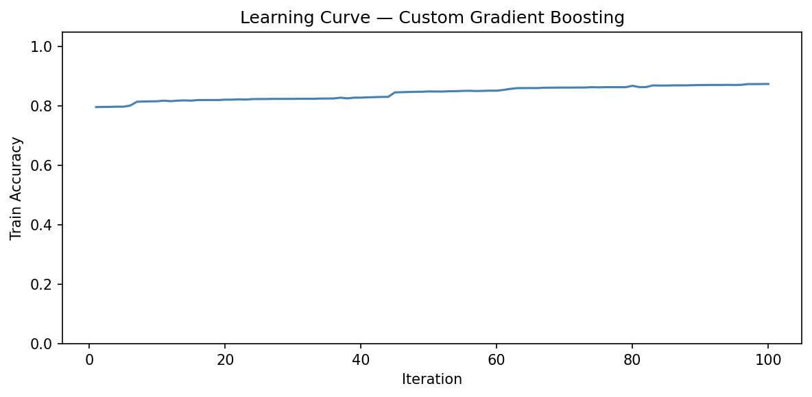
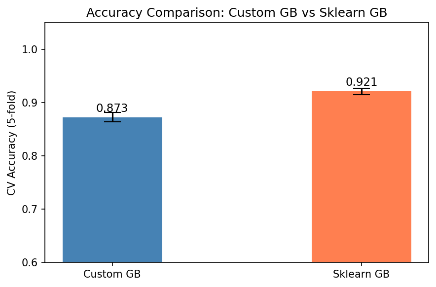
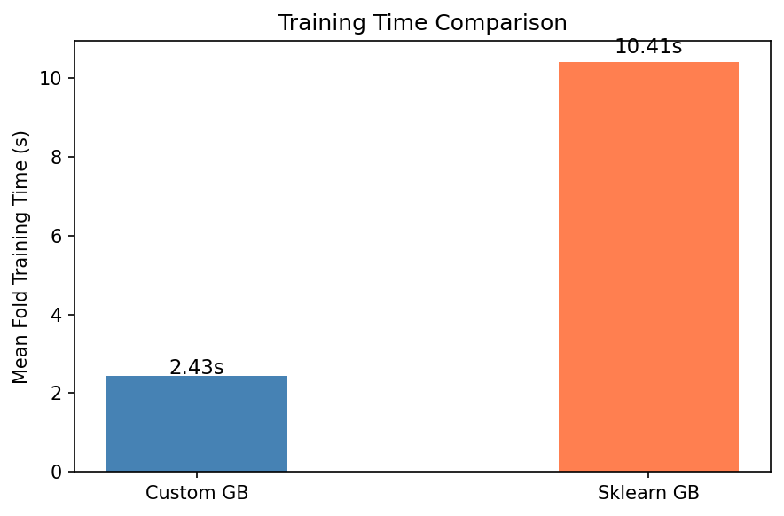
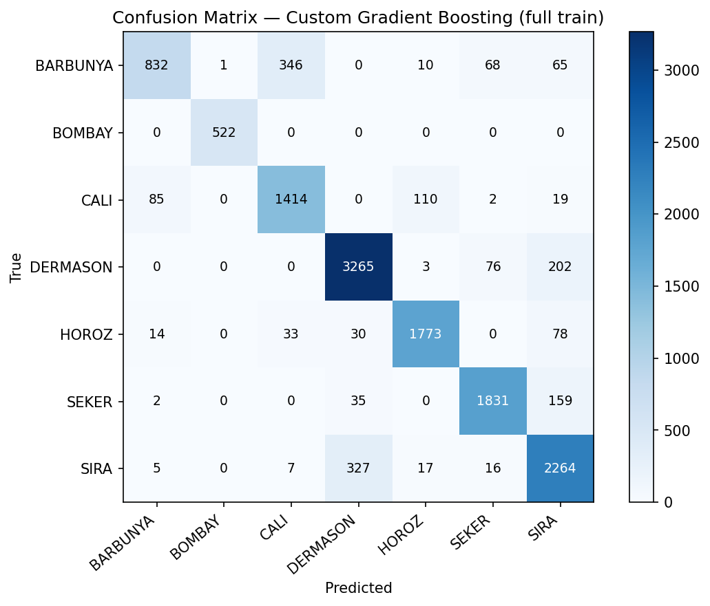

# Лабораторная работа №3. Градиентный бустинг

В рамках данной лабораторной работы предстоит реализовать алгоритм градиентного бустинга и сравнить его с эталонной реализацией из библиотеки `scikit-learn`.

## Задание

1. Выбрать датасет для анализа, например, на [kaggle](https://www.kaggle.com/datasets).
2. Реализовать алгоритм градиентного бустинга.
3. Обучить модель на выбранном датасете.
4. Оценить качество модели с использованием кросс-валидации.
5. Замерить время обучения модели.
6. Сравнить результаты с эталонной реализацией из библиотеки [scikit-learn](https://scikit-learn.org/stable/):
   * точность модели;
   * время обучения.
7. Подготовить отчет, включающий:
   * описание алгоритма градиентного бустинга;
   * описание датасета;
   * результаты экспериментов;
   * сравнение с эталонной реализацией;
   * выводы.

## Датасет

**Dry Bean Dataset** ([UCI ML Repository](https://archive.ics.uci.edu/dataset/602/dry+bean+dataset))

| Параметр | Значение |
|----------|----------|
| Образцов | 13 611 |
| Признаков | 16 (числовые: площадь, периметр, компактность и др.) |
| Классов | 7 (BARBUNYA, BOMBAY, CALI, DERMASON, HOROZ, SEKER, SIRA) |
| Пропусков | нет |

## Результаты

5-fold Stratified CV, `n_estimators=100`, `learning_rate=0.1`

| Модель | Accuracy | F1 macro | Время / fold |
|--------|----------|----------|-------------|
| **Custom GB** (numpy stumps) | 0.8730 | 0.8763 | 2.52 s |
| **Sklearn GB** (max_depth=1) | 0.9215 | 0.9321 | 10.54 s |

### Лог консоли

```
Dataset: 13611 samples, 16 features, 7 classes

Custom Gradient Boosting (5-fold CV)
  Fold 1: acc=0.8737  f1=0.8834  t=2.5s
  Fold 2: acc=0.8843  f1=0.8890  t=2.4s
  Fold 3: acc=0.8571  f1=0.8616  t=2.4s
  Fold 4: acc=0.8725  f1=0.8686  t=2.4s
  Fold 5: acc=0.8773  f1=0.8790  t=2.4s
  accuracy 0.8730
  F1 macro 0.8763
  time     2.43s / fold

Sklearn GradientBoostingClassifier (5-fold CV)
  Fold 1: acc=0.9126  f1=0.9255  t=10.3s
  Fold 2: acc=0.9258  f1=0.9355  t=10.4s
  Fold 3: acc=0.9159  f1=0.9279  t=10.3s
  Fold 4: acc=0.9287  f1=0.9387  t=10.3s
  Fold 5: acc=0.9243  f1=0.9329  t=10.8s
  accuracy 0.9215
  F1 macro 0.9321
  time     10.41s / fold


Summary
Custom  accuracy: 0.8730  |  time: 2.43s
Sklearn accuracy: 0.9215  |  time: 10.41s
```

## Графики

### Learning Curve

Кривая обучения кастомной модели — точность на обучающей выборке по итерациям.



### Сравнение Accuracy (CV)

Средняя точность на 5 фолдах с планками стандартного отклонения.



### Сравнение времени обучения

Среднее время обучения на одном фолде.



### Матрица ошибок (полная обучающая выборка)



## Выводы

- **Точность:** кастомная реализация — 87.3%, sklearn — 92.2% при идентичных гиперпараметрах. Разрыв ~5 п.п. объясняется тем, что sklearn использует более эффективную инициализацию, shrinkage и внутреннюю оптимизацию деревьев.

- **Скорость:** кастомный GB **в 4× быстрее** sklearn на данном датасете (2.5 с vs 10.5 с на фолд). Причина — sklearn тратит больше времени на точный поиск лучшего сплита в деревьях с оптимизированным C-кодом, тогда как наш stump делает одно разбиение за O(n log n) на numpy.

- **Матрица ошибок:** BOMBAY распознаётся идеально (уникальные размеры зерна). Наибольшая путаница — между DERMASON и SIRA (близкие геометрические параметры).
