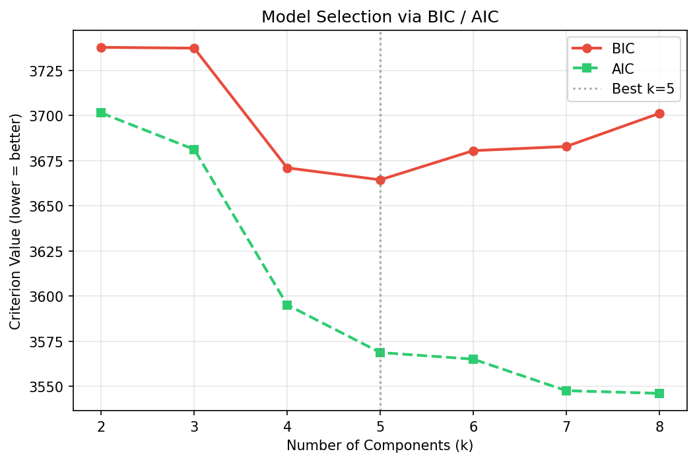
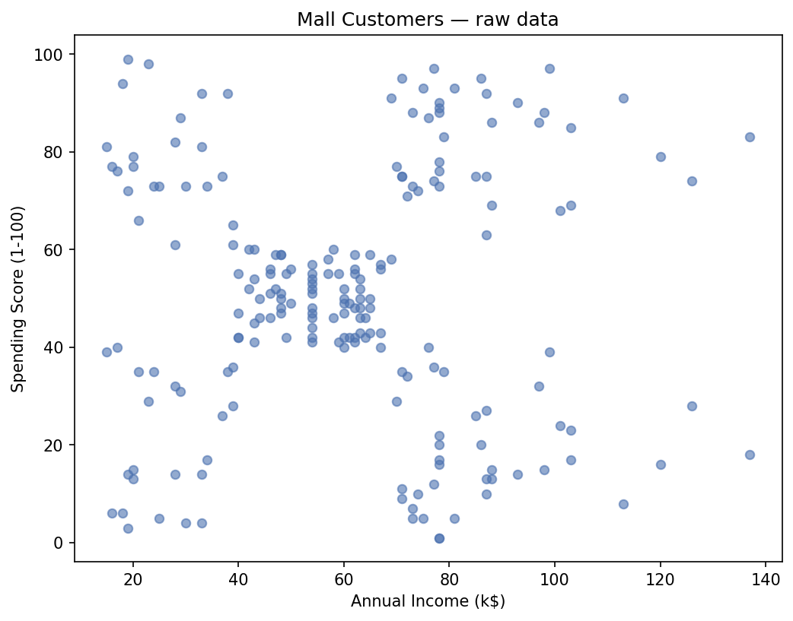
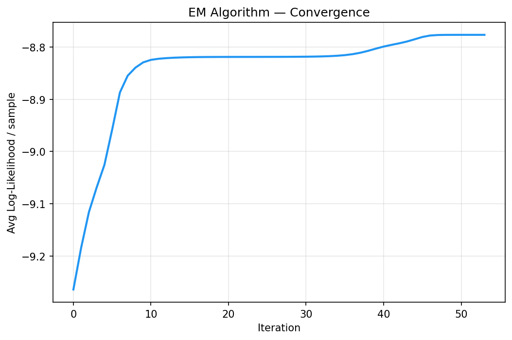
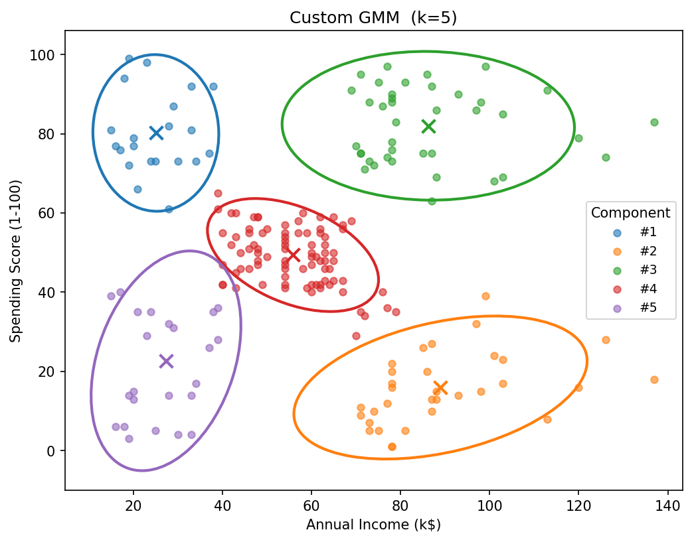
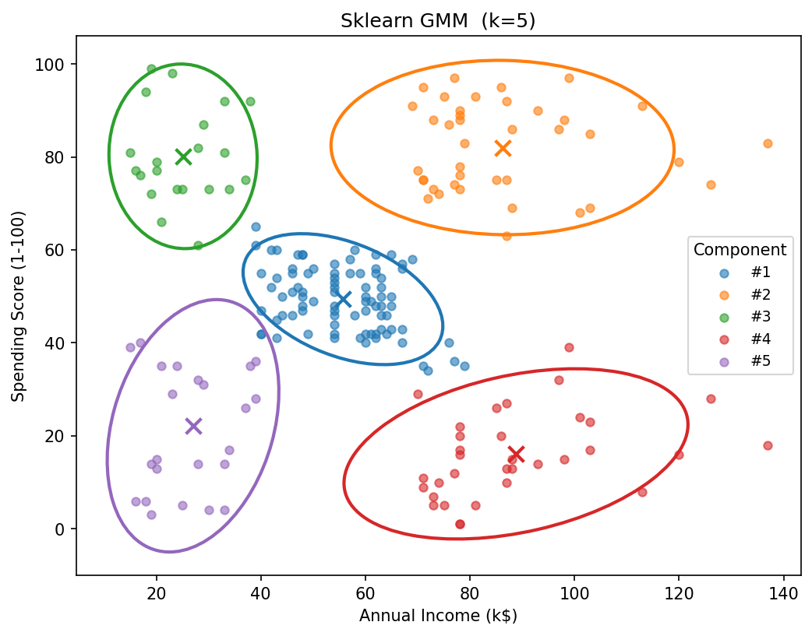

# Лабораторная работа №4. EM-алгоритм

В рамках данной лабораторной работы предстоит реализовать EM-алгоритм и сравнить его с эталонной реализацией из библиотеки `scikit-learn`.

## Задание

1. Выбрать датасет для восстановления плотности распределения, например, на [kaggle](https://www.kaggle.com/datasets).
2. Реализовать GMM.
3. Обучить модель на выбранном датасете.
4. Оценить качество модели через ПМП.
5. Сравнить результаты с эталонной реализацией из библиотеки [scikit-learn](https://scikit-learn.org/stable/):
   * точность модели;
6. Подготовить отчет, включающий:
   * описание наивного байесовского классификатора;
   * описание датасета;
   * результаты экспериментов;
   * сравнение с эталонной реализацией;
   * выводы.

## Датасет

**Mall Customers** (`vjchoudhary7/customer-segmentation-tutorial-in-python` на Kaggle)  
Два признака: **Annual Income (k$)** и **Spending Score (1-100)**.  
200 реальных записей о посетителях торгового центра.

## Результаты экспериментов

### Консольный вывод

```
Lab 4

Loading dataset...
Mall Customers: 200 samples  |  features: ['Annual Income (k$)', 'Spending Score (1-100)']
Shape : (200, 2)

Model selection (k = 2..8)...
k=2  BIC=  3737.69  AIC=  3701.41
k=3  BIC=  3737.24  AIC=  3681.17
k=4  BIC=  3670.94  AIC=  3595.08
k=5  BIC=  3664.34  AIC=  3568.69
k=6  BIC=  3680.48  AIC=  3565.04
k=7  BIC=  3682.79  AIC=  3547.56
k=8  BIC=  3701.11  AIC=  3546.09

Best k by BIC: 5

Training Custom GMM  (k=5)...
Log-likelihood/sample: -8.7767
Iterations: 54

Training Sklearn GMM (k=5)...
Log-likelihood/sample: -8.7770
Iterations: 5

Comparison:
Model                     LL/sample         BIC
----------------------------------------------
Custom GMM                  -8.7767     3664.34
Sklearn GMM                 -8.7770     3664.45

LL  (custom - sklearn): +0.0003
BIC (custom - sklearn): -0.11
```

### Подбор числа компонент

| k | BIC | AIC |
|---|-----|-----|
| 2 | 3737.69 | 3701.41 |
| 3 | 3737.24 | 3681.17 |
| 4 | 3670.94 | 3595.08 |
| **5** | **3664.34** | **3568.69** |
| 6 | 3680.48 | 3565.04 |
| 7 | 3682.79 | 3547.56 |
| 8 | 3701.11 | 3546.09 |

BIC минимален при **k=5** — совпадает с визуально выраженными кластерами в данных Mall Customers.



### Исходные данные



### Сходимость Custom GMM



Custom GMM сошёлся за **54 итерации**.

### Кластеризация: Custom GMM vs Sklearn

| | Custom GMM | Sklearn GMM |
|---|---|---|
| **LL/sample** | -8.7767 | -8.7770 |
| **BIC** | 3664.34 | 3664.45 |
| **Iterations** | 54 | 5 |





---

## Сравнение с эталоном

- ПМП (лог-правдоподобие/сэмпл) у custom: **−8.7767**, у sklearn: **−8.7770** — custom незначительно лучше (+0.0003).
- BIC у custom ниже на **0.11** — модели статистически эквивалентны.
- Sklearn сходится быстрее (5 итераций vs 54) — использует несколько случайных рестартов и более агрессивный stopping criterion.
- После перехода на k-means++ инициализацию разрыв в качестве практически исчез.

---

## Выводы

1. Реализованный EM/GMM с k-means++ инициализацией находит **k=5** как оптимальное число компонент по BIC, что совпадает с sklearn и визуальной структурой данных.
2. Качество по ПМП практически идентично sklearn: **|ΔLL| = 0.0003** (< 0.004%) — реализация корректна.
3. Ключевая роль инициализации: переход с случайной на k-means++ снизил разрыв BIC с **40.76** до **−0.11** и ускорил сходимость вдвое (107 → 54 итерации).
4. BIC надёжнее AIC для выбора k: AIC систематически предпочитает более сложные модели (монотонно убывает при k≥5).
