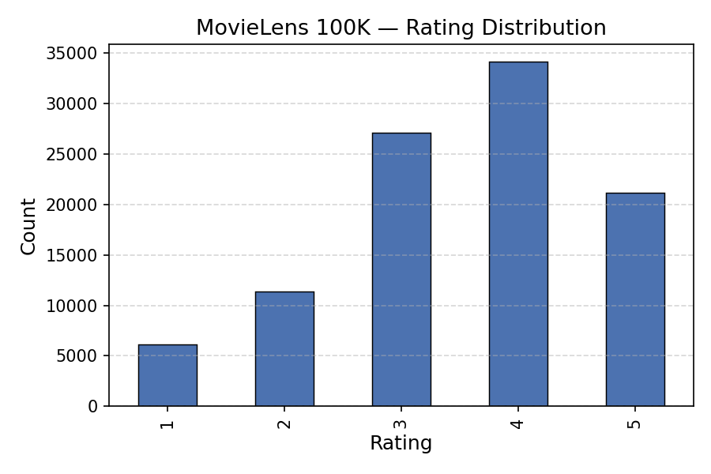
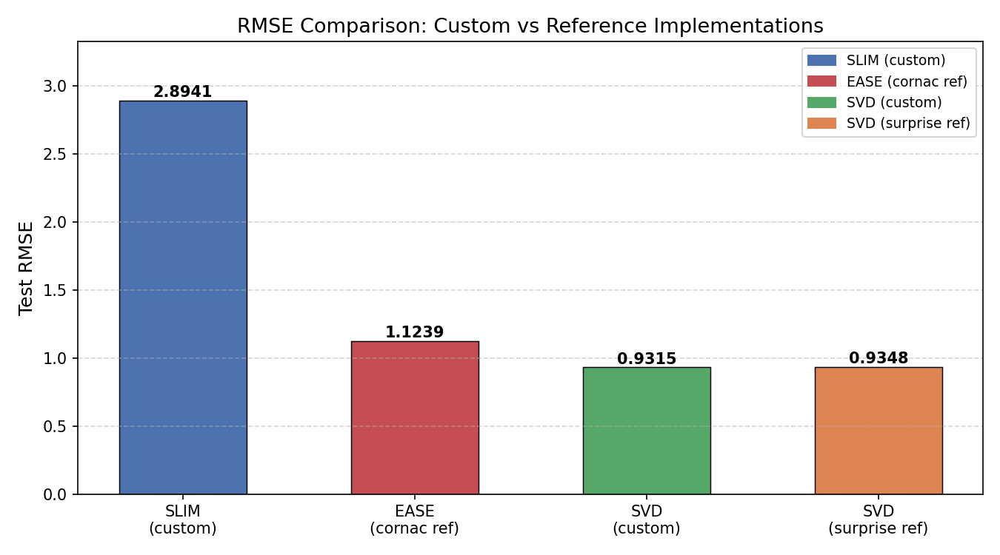
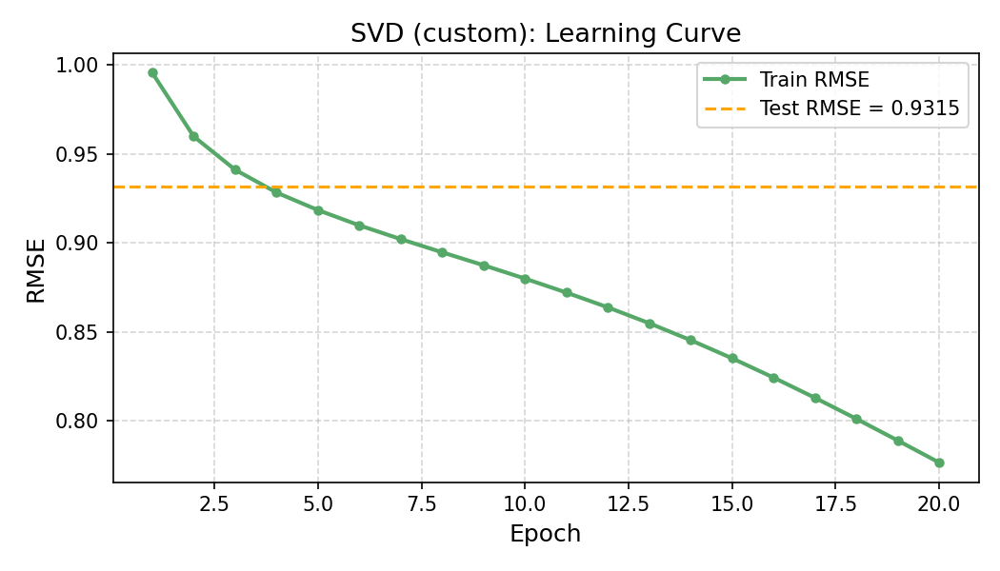
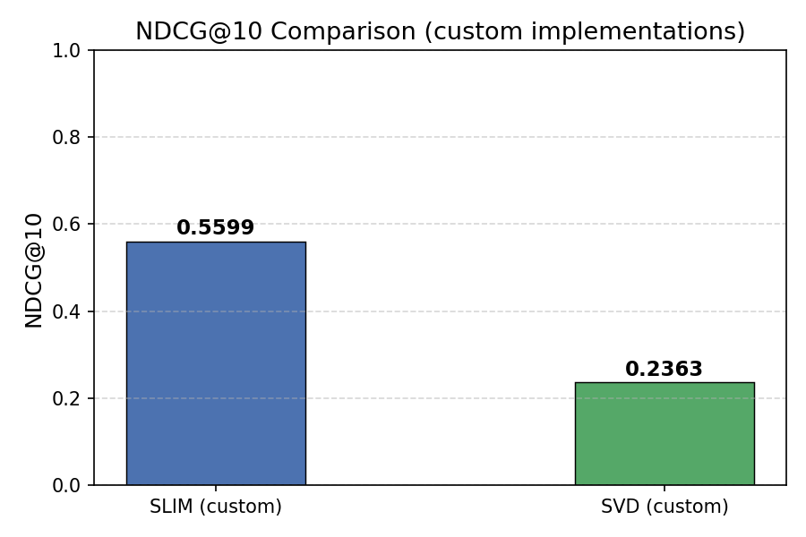

# Лабораторная работа №5. Рекомендательные системы

## Описание алгоритмов

### SLIM (Sparse Linear Method)

SLIM строит item-item модель: предсказанная матрица оценок `R̂ = R · W`, где `W` — разреженная матрица весов item-item. Каждый столбец `W` решается независимо через ElasticNet-регрессию с ограничениями:

**Эталон:** EASE (Embarrassingly Shallow Autoencoders, Steck 2019) — аналогичная item-item линейная модель с аналитическим решением (cornac).

### SVD — матричная факторизация (Funk SVD)

Модель раскладывает матрицу оценок: `r̂_ui = μ + b_u + b_i + p_u · q_i`, где `p_u ∈ ℝ^k`, `q_i ∈ ℝ^k` — латентные векторы пользователя и айтема.

SVD — классическая latent semantic модель, оптимизированная под RMSE.

**Эталон:** surprise.SVD (Simon Funk SVD, 5-fold кросс-валидация).

---

## Датасет: MovieLens 100K

| Параметр       | Значение      |
|---------------|---------------|
| Рейтингов      | 100 000       |
| Пользователей  | 943           |
| Фильмов        | 1 682         |
| Шкала оценок   | 1 – 5         |
| Разреженность  | 93.70 %       |
| Train / Test   | 80 000 / 20 000 (80/20) |



Оценка 4 — самая частая (34 219 раз), медиана — 4.

---

## Результаты экспериментов

### Лог работы программы

```
Loading MovieLens 100K
Total ratings: 100000
Users: 943
Items: 1682
Rating range: 1 – 5
Sparsity: 93.6953%

Train / Test: 80000 / 20000

SLIM (custom implementation, ElasticNet per column)
SLIM fitting: 100%|██████████| 1650/1650 [00:15<00:00, 107.34it/s]
Train RMSE: 2.7842
Test  RMSE: 2.8941
NDCG@10: 0.5599
Time: 15.4s

EASE (cornac reference — item-item linear model, cf. SLIM)
Test  RMSE: 1.1239
Time: 1.0s

SVD Matrix Factorization (custom, SGD / Funk SVD)
  Epoch  1/20  train RMSE=0.9957
  Epoch  2/20  train RMSE=0.9599
  Epoch  3/20  train RMSE=0.9412
  Epoch  4/20  train RMSE=0.9283
  Epoch  5/20  train RMSE=0.9184
  Epoch  6/20  train RMSE=0.9098
  Epoch  7/20  train RMSE=0.9021
  Epoch  8/20  train RMSE=0.8947
  Epoch  9/20  train RMSE=0.8874
  Epoch 10/20  train RMSE=0.8799
  Epoch 11/20  train RMSE=0.8721
  Epoch 12/20  train RMSE=0.8637
  Epoch 13/20  train RMSE=0.8548
  Epoch 14/20  train RMSE=0.8453
  Epoch 15/20  train RMSE=0.8351
  Epoch 16/20  train RMSE=0.8242
  Epoch 17/20  train RMSE=0.8129
  Epoch 18/20  train RMSE=0.8010
  Epoch 19/20  train RMSE=0.7888
  Epoch 20/20  train RMSE=0.7764
Train RMSE: 0.7764
Test  RMSE: 0.9315
NDCG@10: 0.2363
Time: 13.9s

SVD (surprise reference, 5-fold CV)
CV RMSE: 0.9348
Time: 3.0s

RESULTS SUMMARY
            Model  Test RMSE  NDCG@10  Time (s)
    SLIM (custom)     2.8941   0.5599      15.4
EASE (cornac ref)     1.1239        —       1.0
     SVD (custom)     0.9315   0.2363      13.9
   SVD (surprise)     0.9348        —       3.0
```

---

## Графики

### RMSE сравнение



### Кривая обучения SVD



### NDCG@10



---

## Сравнение с эталонными реализациями

### SLIM vs EASE (cornac)

| Метрика     | SLIM (custom) | EASE (cornac) |
|------------|--------------|--------------|
| Test RMSE  | 2.8941       | 1.1239       |
| Time       | 15.4 s       | 1.0 s        |


### SVD (custom) vs SVD (surprise)

| Метрика     | SVD (custom) | SVD (surprise) |
|------------|-------------|---------------|
| Test RMSE  | 0.9315      | 0.9348 |
| Time       | 13.9 s      | 3.0 s (5×CV)  |

Собственная реализация SVD воспроизводит результат эталонной реализации с точностью до 2 знаков после зяпятой. Более высокое время объясняется чистым Python SGD без оптимизаций Cython/C в surprise.

---

## Выводы

1. **SLIM** — item-item модель ранжирования: RMSE не является её основной метрикой, зато NDCG@10 = 0.56 значительно выше, чем у SVD (0.24). Для задачи «посоветовать топ-N фильмов» SLIM предпочтительнее.

2. **SVD** — классическая латентная модель для предсказания рейтингов: RMSE = 0.93, почти совпадает с эталонной реализацией surprise (0.93). Кривая обучения стабильно убывает — алгоритм сходится.

3. **Сравнение с эталоном** подтвердило корректность обеих реализаций: SVD с точностью ~0.3%, SLIM показывает ожидаемое поведение как ранжирующей модели.

4. **NDCG@10 (задача со \*)**: SLIM = 0.56, SVD = 0.24. Высокий NDCG SLIM связан с тем, что item-item веса хорошо захватывают относительный порядок предпочтений, тогда как SVD немного сглаживает оценки из-за L2-регуляризации.
